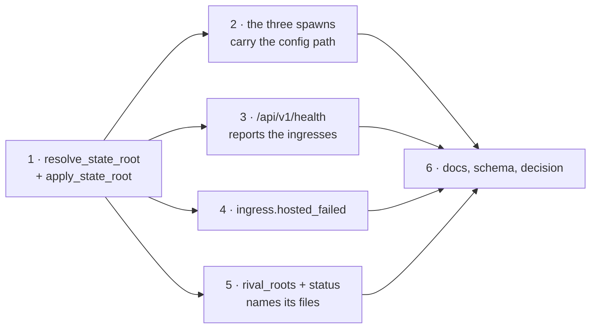

# Tasks: one state root per configuration, and health surfaces that report on it

## Task list

- [ ] **1. Anchor `state.root` on the config file.** `resolve_state_root(config,
      config_path)` and `apply_state_root(config, config_path)` in
      `the_loop/cli_config.py`; `load_cli_config` calls it for every document, the empty
      one included. The base directory is `config_path.parent.parent` when
      `config_path.parent.name == ".the-loop"`, else `config_path.parent`; an absolute or
      `~` root is expanded and used verbatim; a non-string root warns and takes the
      default. `layout_from_config` untouched.
      _Requirements: R1.1, R1.2, R1.3, R1.4_ · _Depends on: —_
      _Test: T1 (the resolution table), T2 (`Scenario: one config file, two working
      directories, one state root`), T10 (`Scenario: an explicit state.root resolves to
      the directory it always resolved to`)_

- [ ] **2. Every spawn carries the resolved config path.** `client._spawn_service`,
      `core.lifecycle.spawn_service` and `core.daemons.control_daemon` pass
      `env={**os.environ, CLI_CONFIG_ENV: str(default_cli_config_path())}` to `Popen`.
      One helper (`cli_config.child_env()`) so the three sites cannot drift.
      _Requirements: R1.5_ · _Depends on: 1_
      _Test: T1 (each site's child environment), T2 (`Scenario: a spawned service reads
      the config the CLI resolved, not the one its cwd suggests`), T8 (AC1)_

- [ ] **3. `/api/v1/health` reports on what it hosts.** The route reads `holder.current`
      and `holder.path`: `status` is `ok`/`degraded` over `enabled_services` ×
      `RunLock.is_held()`, plus `configPath`, `stateRoot` and an `ingresses` list with a
      `detail` for each one that is down. HTTP stays 200. Publish the fields in
      `docs/api-specs/openapi/`.
      _Requirements: R2.1, R2.2, R2.3, R2.4_ · _Depends on: 1_
      _Test: T2 (`Scenario: health reports degraded…`, `Scenario: health reports ok…`),
      T3 (contract parity), T8 (AC3, AC4)_

- [ ] **4. An enabled ingress that does not start writes an event.**
      `api/ingress.start_hosted_ingresses` emits `ingress.hosted_failed` at
      `level="error"` with the ingress and the reason, for a starter that returned `None`
      or raised. A starter that declined because it was not asked for (a Slack channel
      with `read.mode: poll`) answers with an empty reason and is passed over. The
      service keeps serving. And `_host` — the one helper every hosted ingress now runs
      through — **releases the lock** when a run loop ends without a shutdown, so a dead
      thread inside a living service stops reading as a running ingress.
      _Requirements: R2.6, R3.1, R3.2, R3.3_ · _Depends on: 1_
      _Test: T2 (`Scenario: an enabled ingress that cannot start writes an error event, a
      disabled one writes none`; `Scenario: the poller thread dies during startup`), T8 (AC5)_

- [ ] **5. `status` names its config, its root, and any rival.**
      `state.rival_roots(layout)` — the candidate roots that are not the resolved one and
      do hold a `poll-status.json`, unreadable directories skipped. `status` prints
      `config`, `state` and one `conflict` line each; the JSON form carries
      `configPath`, `stateRoot`, `conflictingRoots`. The exit code is unchanged.
      _Requirements: R4.1, R4.2, R4.3_ · _Depends on: 1_
      _Test: T1 (`rival_roots`), T2 (`Scenario: status names its config, its root and a
      rival root without changing its exit code`)_

- [ ] **6. Say it where it is read: docs, schema, decision.** `docs/cli/supervision.md`
      (the unit, the cron form, the health check, and the plain statement that
      `the-loop start` is not a supervisor), linked from `docs/cli/service.md` and
      `docs/cli/index.md`; `docs/cli/state.md`'s cwd-relative claim replaced by the
      anchoring rule; the `state.root` description in **both** schema copies (byte-identical);
      the affected capability doc; `docs/decisions/decision-119.md` and the index.
      _Requirements: R5.1, R5.2, R1.2 (documented)_ · _Depends on: 2, 3, 4, 5_
      _Test: T12 (docs + schema parity), T11 (manual repro), T13 (`make check`)_

## Execution notes

**TDD, red first.** Task 1's regression test — one config file loaded from two working
directories, every `StateLayout` path compared — must be seen to fail against `main`
before the resolver exists. It is the test whose absence let this ship.

**Order.** Task 1 is the root-cause fix and everything else reads its result; tasks 2–5
are independent of each other and may land in any order within the PR. Task 6 is last so
the docs describe what was built.

**One PR.** Tasks 1–6 are one work item and one reviewable diff: the resolver alone would
leave the three reporting gaps that made the outage silent, and the reporting alone would
leave the divergence. Tier 3 (`human-approves-pr`).
