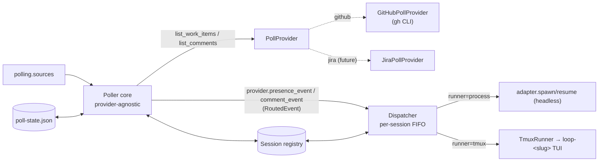

# Design: poll ticketing/PR systems for labelled work and spawn/route sessions

> Phase 2 of 3, derived from [`requirements.md`](requirements.md). Records the reuse +
> provider-seam decision in [decision-022](../../decisions/decision-022.md). No UI
> artifacts: this is CLI/infra work.

## Overview

`the-loop poll` is a **pull ingress** that reuses the entire webhook routing/dispatch
stack and is **agnostic of any specific provider**. Each cycle it asks every configured
provider for its labelled work items, and the provider synthesises the same
`RoutedEvent` shape the webhook receiver produces and hands it to the existing
`Dispatcher`. Everything after ingress — session registry (one session per work item),
per-session FIFO dispatch, tmux runner, harness adapters, prompt templates — is unchanged.

GitHub is reached **only** through a configured `polling.sources` entry; the core, CLI,
registry, dedup state and run loop carry no GitHub vocabulary.

## Provider seam (`poller/base.py`)

The core speaks one contract:

- `WorkItem` / `Comment` — provider-agnostic value objects. `WorkItem`'s
  `provider/owner/repo/number` map onto the existing `WorkItemRef`
  (`<provider>:<owner>/<repo>#<n>`), so the registry stays the neutral identity store;
  `raw` carries provider extras (e.g. a PR head branch) without leaking into the core.
- `PollProvider` — `from_source` (build bound to one config entry), `check_dependencies`,
  `list_work_items`, `list_comments`, `refs` (registry refs incl. linked items), and
  `presence_event` / `comment_event` (build the shared `RoutedEvent`).
- A tiny registry (`register_provider`, `build_provider`) resolves a source's `provider`
  name to a class. A new provider drops in with **zero** core changes.

`GitHubPollProvider` (`poller/github.py`) is the only GitHub-aware code: it wraps `gh`
(`GhClient`, injectable runner for tests), maps `gh` shapes to `WorkItem`/`Comment`, and
builds GitHub-shaped `RoutedEvent`s via the real `router.extract_work_items` /
`event_carries_label` (so a PR yields its number *and* its linked issue).

## Per-item cycle logic (`Poller._process_item`, provider-agnostic)

For each work item (`ref = item.ref`):

1. `refs = provider.refs(item)` (item + any linked items).
2. `comments = provider.list_comments(item)`; `new_comments` = ids not in `PollState`.
3. `has_session = any(registry.find_by_work_item(r) for r in refs)`.
4. **Spawn** `provider.presence_event(item, refs)` iff `not has_session and (first_sight
   or new_comments)`. The registry is the dedup authority: a live session is never
   doubled; a failed spawn retries next cycle. (GitHub's presence delivery id is a fresh
   UUID each emission — only emitted while no session exists, so it never spams.)
5. **Forward** each `new_comment` via `provider.comment_event(...)` (routes to the
   session, never spawns). Skipped on `first_sight` so the pre-existing thread is a
   baseline, not a replay.
6. Record the item's current comment ids in `PollState` and `save()`.

### Two event kinds (built by the provider)

| Concern | Presence event | Comment event |
|---|---|---|
| `labeled` | `True` (drives `spawnOnUnmatched`) | `False` (never spawns) |
| Emitted when | no session yet + first sight or new activity | per new comment |

Splitting them keeps spawning registry-idempotent and comment forwarding exactly-once,
without either concern leaking into the other.

## Hot reload (`Reloader`)

The `polling` config hot-reloads at **one-poll-cycle granularity** — no watcher thread,
stdlib only, matching the loop the poller already runs. `Reloader` holds a content hash of
`.the-loop/config.yaml` and a `build_plan` callback (the same closure that builds the
initial plan, so cold start and reload share one code path). Before each cycle,
`Poller._maybe_reload` asks the reloader for changes:

- unchanged hash → `None` (no rebuild);
- changed hash → rebuild a `PollPlan` (providers + interval) and swap it in live;
- rebuild raises (invalid config, unknown provider) → log and **keep the previous plan**,
  so a bad edit never takes the poller down; no file → nothing to reload.

`--interval` acts as a start-time override that holds until the config file is edited
(after which the file's `intervalSeconds` wins). Only the `polling` block reloads; the
dispatcher/routing (worker threads, in-memory dedup) is established once at start.

### The webhook receiver hot-reloads too

`Reloader` is a shared primitive (`the_loop/reload.py`, generic over the built value), so
the `gh-webhook` receiver reuses it (PR #45 review). The receiver is event-driven, not a
loop, so it checks for changes at the natural point — **on each received event** — under a
non-blocking lock (the `ThreadingHTTPServer` handles events concurrently; one thread
reloads, others skip and pick it up next event). On change it hot-swaps the **soft**
routing policy via `Dispatcher.reload(new_config)` — `self.config`, adapters (rebuilt from
`harnessArgs`) and prompt templates — plus the router's `events`/`autoExecuteLabel`. The
dispatcher's worker queues, concurrency semaphore, dedup cache and session registry are
**not** rebuilt (rebuilding would replay events or drop in-flight work); the listener
bind, `secretEnv` and the web terminal are start-time only. The reload build uses a
*strict* config read (raises on a broken/missing file) so a transient bad save keeps the
previous config instead of resetting to defaults.

## Authorization guard (prompt-injection remediation)

the-loop reacts to labelled work items, but the content it then ingests (issue/PR bodies,
comments, reviews) is authored by anyone on GitHub — treating it as instructions is a
prompt-injection vector. The guard (`the_loop/authz.py`) enforces: **only actions by
authorized users are an input the-loop acts on**, at *both* trigger paths.

- `is_authorized(actor, allowlist)`: an actor-less action (CI status — no human free-text)
  is allowed; a named actor is allowed only if listed; an empty allowlist fails closed for
  human-authored actions.
- **Webhook** (`Router`): `event_actor(event, payload)` resolves the responsible human
  (comment/review author; the `sender` who labelled/opened an issue/PR). Unauthorized →
  the event is dropped before dispatch. A `pull_request` `closed` event bypasses the guard
  (lifecycle only — it auto-closes the-loop's own session, injects nothing).
- **Poller**: `WorkItem.author` (issue/PR opener, added to the `gh` listing) gates spawning;
  `Comment.author` gates comment forwarding. A dropped comment is still baselined so it is
  never re-evaluated. (The labeller isn't visible via `gh ... list`, so the item author is
  the poller's authorizing identity — matching "each operator works their own items".)
- **Config**: `webhooks.ghWebhook.routing.authorizedUsers` (governs both ingresses).
  `resolve_authorized_users` falls back to `ticketing.github.owner` when unset, so the
  common single-operator setup needs no extra config; empty-and-no-owner warns and fails
  closed. The receiver re-resolves the allowlist on hot-reload.

## Dedup, two layers

- **`PollState`** (durable, per item, this feature): the primary guarantee — a comment
  id is forwarded once across cycles and restarts. There is no webhook redelivery to lean
  on, so the poller owns reliability. Missing/corrupt state ⇒ safe re-baseline.
- **Dispatcher `Deduper` + registry `recentDeliveries`** (reused): a second, in-process
  safety net on the same delivery ids.

## Configuration

`polling` (new) is provider-agnostic: `intervalSeconds`, `stateFile`, and a `sources`
list. Each source names a `provider` plus that provider's own keys (a GitHub source:
`repos`, `monitor`, `label`, `ghBinary`). **Dispatch behaviour is reused from
`webhooks.ghWebhook.routing`** (harness, runner, spawn policy, templates, `registryDir`).
A source's `label` defaults to the routing `autoExecuteLabel`; a GitHub source's `repos`
falls back to `ticketing.github`. Runtime state (`poll-state.json`, `poll.pid`) is
git-ignored. The CLI (`the-loop poll start|stop`) exposes only run-loop flags
(`--interval`, `--once`, `--state-file`, `--pidfile`) — no provider knobs.

## Reuse map (nothing re-implemented downstream)

| Concern | Reused from |
|---|---|
| work-item extraction, label read (in GitHub provider) | `webhook/router.py` |
| spawn/resume, one-session-per-item, FIFO, dedup | `webhook/dispatcher.py`, `sessions/registry.py` |
| tmux hosting + attach | `runner.py`, `commands/sessions_cmd.py` |
| harness invocation | `harness/*` |
| prompt rendering (untrusted excerpt) | webhook prompt templates |

## Testing

- `tests/test_poller.py` (unit): `gh` JSON parsing/argv; the GitHub provider
  (from_source, work-item mapping, PR→issue linking, presence/comment events); the
  provider registry (`build_provider` rejects missing/unknown); `PollConfig`; `PollState`
  round-trip + corrupt-file tolerance; the **provider-agnostic** cycle decision matrix via
  a fake provider + recording dispatcher (deterministic, no threads); and hot reload
  (`Reloader` change-detection, invalid-config tolerance, live provider/interval swap).
- `tests/test_poller_integration.py` (Gherkin, `Requirement:` → this spec): real
  `GitHubPollProvider` + real `Dispatcher` — a cycle actually spawns+registers a session,
  a later cycle resumes it, no duplicate spawn, a comment delivered at most once,
  `--once` stops.
