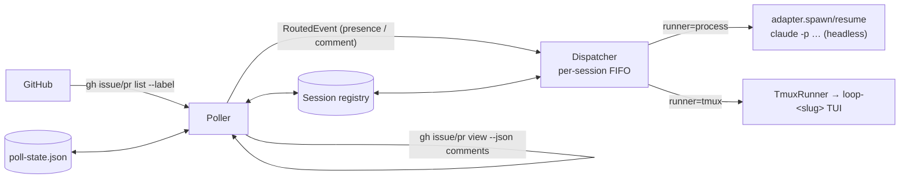

# Design: poll GitHub for labelled work and spawn/route harness sessions

> Phase 2 of 3, derived from [`requirements.md`](requirements.md). Records the reuse
> decision in [decision-022](../../decisions/decision-022.md). No UI artifacts: this is
> CLI/infra work.

## Overview

`the-loop gh-poll` is a **pull ingress** that reuses the entire webhook routing/dispatch
stack. Each cycle it asks `gh` for labelled issues/PRs, synthesises the same
`RoutedEvent` shape the webhook receiver produces, and hands it to the existing
`Dispatcher`. Everything after ingress — session registry (one session per work item),
per-session FIFO dispatch, tmux runner, harness adapters, prompt templates — is unchanged.

## Components

New package `cli/the_loop/poller/`:

- **`github.py`** — `GhClient`, a read-only `gh` wrapper (`subprocess.run` injectable for
  tests). `list_labeled_issues` / `list_labeled_prs` (`gh issue|pr list --label … --json
  …`) and `list_comments` (`gh issue|pr view N --json comments` — `gh` paginates and the
  sub-command is kind-specific because `gh issue view` rejects PR numbers). `RepoSpec`
  parses `owner/repo`. `check_gh_dependency` mirrors the tmux/ttyd preflight.
- **`poller.py`** — `PollConfig` (ingress knobs), `PollState` (durable comment dedup,
  atomic write like the session registry), and `Poller` (the cycle + run loop).

New command `commands/gh_poll.py` — `the-loop gh-poll start|stop`, mirroring `gh-webhook`
(pidfile, signal-driven shutdown, config-file defaults + flag overrides). It builds the
dispatcher from `webhooks.ghWebhook.routing` (`_build_dispatcher`) so poll and webhook
dispatch are literally the same objects.

## Per-item cycle logic (`Poller._process_item`)

For each labelled item (`ref = github:owner/repo#n`):

1. Synthesise a webhook-shaped payload and extract work items with the **real**
   `router.extract_work_items` (so a PR yields its number *and* its linked issue).
2. Fetch comments; compute `new_comments` = those whose id is not in `PollState`.
3. `has_session = any(registry.find_by_work_item(wi))` over the extracted work items.
4. **Spawn** (presence event, `labeled=True`) iff `not has_session and (first_sight or
   new_comments)`. The registry is the dedup authority: a live session is never doubled;
   a failed spawn simply retries next cycle. The presence delivery id is a fresh UUID
   each emission (it is only emitted while no session exists, so it never spams).
5. **Forward** each `new_comment` (`issue_comment`, `labeled=False` → routes to the
   session, never spawns). Skipped on `first_sight` so the pre-existing thread is a
   baseline, not a replay.
6. Record the item's current comment ids in `PollState` and `save()`.

### Why two event kinds

| Concern | Presence event | Comment event |
|---|---|---|
| `event` | `issues` / `pull_request` | `issue_comment` |
| `labeled` | `True` (drives `spawnOnUnmatched`) | `False` (never spawns) |
| Emitted when | no session yet + first sight or new activity | per new comment |
| Delivery id | `poll-presence-<ref>-<uuid>` | `poll-comment-<comment-id>` |

Splitting them keeps spawning idempotent (registry-gated) and comment forwarding
exactly-once (state-gated), without either concern leaking into the other.

## Dedup, two layers

- **`PollState`** (durable, per item, this feature): the primary guarantee — a comment
  id is forwarded once across cycles and restarts. There is no GitHub redelivery to lean
  on, so the poller owns reliability. Missing/corrupt state ⇒ safe re-baseline.
- **Dispatcher `Deduper` + registry `recentDeliveries`** (reused): a second, in-process
  safety net on the same delivery ids.

## Configuration

`polling.ghPoll` (new) holds ingress-only knobs; **dispatch behaviour is reused from
`webhooks.ghWebhook.routing`** — one place configures harness, runner (`process`/`tmux`),
`spawnOnUnmatched`, templates, `registryDir`. `polling.ghPoll.label` defaults to the
routing `autoExecuteLabel`, and `repos` falls back to `ticketing.github`. Runtime state
(`poll-state.json`, `gh-poll.pid`) is git-ignored.

## Reuse map (nothing re-implemented downstream)

| Concern | Reused from |
|---|---|
| work-item extraction, label read | `webhook/router.py` |
| spawn/resume, one-session-per-item, FIFO, dedup | `webhook/dispatcher.py`, `sessions/registry.py` |
| tmux hosting + attach | `runner.py`, `commands/sessions_cmd.py` |
| harness invocation | `harness/*` |
| prompt rendering (untrusted excerpt) | webhook prompt templates |

## Testing

- `tests/test_poller.py` (unit): `gh` JSON parsing/argv, `PollConfig`, `PollState`
  round-trip + corrupt-file tolerance, and the cycle decision matrix via a recording
  dispatcher double (deterministic, no threads).
- `tests/test_poller_integration.py` (Gherkin, `Requirement:` → this spec): real
  `Dispatcher` + fake adapter — a cycle actually spawns+registers a session, a later
  cycle resumes it, no duplicate spawn, a comment delivered at most once, `--once` stops.
