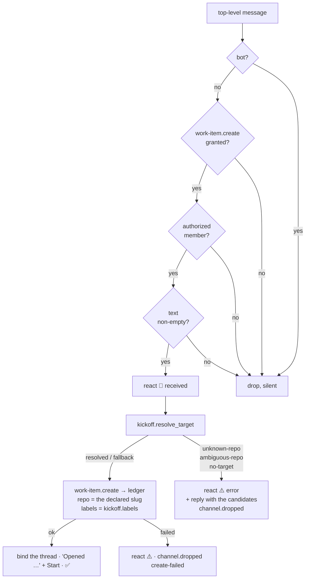

# Design: the kickoff prefix is a selector into the operator's declared repository set

> Phase 2 of 3. Derived from `requirements.md`. Reviewed and locked together with
> `testing-plan.md` at the `design-approval` gate.

## Overview

Three moves, in the order the pipeline runs them:

1. **One declared set, read from one place.** `channels/commands.py` already builds
   "every repository this instance is configured for" — `kickoff.repo` plus every
   `github` poll source's `repos` — to bound a slash command's target (decision-116 D4).
   That builder moves into a new `channels/repos.py` and gains what kickoff needs: the
   entry **as the operator wrote it**, not only its normalized key, because the string
   handed to `gh --repo` must stay the operator's own grammar.
2. **A prefix parser that refuses to guess.** A new `channels/kickoff.py` reads the
   first line, matches the prefix grammar, resolves it against that set, and returns one
   of five outcomes — `resolved`, `fallback`, `unknown-repo`, `ambiguous-repo`,
   `no-target` — with the text to open the issue with and the candidates to name in a
   refusal. It touches no I/O and no state: text and config in, a frozen dataclass out.
3. **A refusal that answers.** `process_kickoff` calls it after the allow-list, and on
   the three refusing outcomes reacts `error` and replies in the member's own thread.
   `kickoff_enabled` stops requiring `kickoff.repo`, so the grant alone opens the read.



The silent drops stay silent, and every refusal that *answers* sits strictly below the
allow-list — R2.6, and the reason the resolve step is placed where it is rather than
earlier where `kickoff.repo` is checked today.

## 1. The declared set — `channels/repos.py` (new)

```python
@dataclass(frozen=True)
class DeclaredRepo:
    """A repository the operator declared, with the slug they wrote it as."""
    declared: str          # 'expertise-help/slim-gym' — handed to gh unchanged
    host: str              # resolved: the entry's own, or this instance's
    owner: str
    repo: str
    source: str            # 'kickoff' | 'polling' — for the refusal's wording

    @property
    def key(self) -> str:
        return f"{self.host}/{self.owner}/{self.repo}".lower()


def parse_repo_path(path: str, cli_config) -> DeclaredRepo: ...
def declared_repositories(cli_config) -> Tuple[DeclaredRepo, ...]: ...
def repository_keys(cli_config) -> Set[str]: ...
```

`parse_repo_path` is `commands._ref_from_path`'s validation, without the issue number:
two or three `/`-separated segments, the host defaulted from `ghhost.github_host`, each
segment through `is_github_host` / `is_github_name` — so a path that could not name a
repository raises `ValueError` here, before it can be a candidate.

`declared_repositories` reads `kickoff.repo` first, then each `github` source's `repos`,
**deduplicated by `key`, first writing wins**, order preserved. Every read is
best-effort: a malformed entry is logged at `debug` and contributes nothing (R2.1, A6).

`commands.py` keeps `_ref` / `_ref_from_path` (they mint `WorkItemRef`s with a number)
but delegates their parse to `parse_repo_path`, and `may_target` calls
`repository_keys` — `_configured_repositories` is deleted, not duplicated. One set,
one builder, two callers.

## 2. The prefix — `channels/kickoff.py` (new)

### 2.1 The grammar

```python
_SEGMENT = r"[A-Za-z0-9][A-Za-z0-9._-]*"
PREFIX_RE = re.compile(
    rf"^[ \t]*(?P<prefix>{_SEGMENT}(?:/{_SEGMENT}){{0,2}})[ \t]*:[ \t]*(?P<rest>.*)$"
)
```

First line only, applied with `match`. One to three segments, each starting
alphanumeric — so `../x`, `$(id)`, `a;b`, a URL scheme's `//` tail and a four-segment
path all fail to match and the message is prefix-less (A3). The separator is a literal
`:`; the remainder of the line, whatever it is, becomes the line.

### 2.2 The resolution

```python
@dataclass(frozen=True)
class KickoffTarget:
    outcome: str                    # resolved | fallback | unknown-repo
                                    # | ambiguous-repo | no-target | empty-message
    repo: str = ""                  # the declared slug to create in
    text: str = ""                  # the message the issue is composed from
    prefix: str = ""                # what was read, for the refusal's wording
    candidates: Tuple[str, ...] = ()

    @property
    def ok(self) -> bool:
        return self.outcome in ("resolved", "fallback")


def resolve_target(text, config, cli_config) -> KickoffTarget: ...
```

| The first line | What happens | Outcome |
|----------------|--------------|---------|
| no prefix match | `kickoff.repo` if set, else refuse | `fallback` / `no-target` |
| prefix **with** `/`, one declared key matches | that entry, prefix stripped | `resolved` |
| prefix **with** `/`, no key matches | refuse, naming candidates | `unknown-repo` |
| **bare** prefix, exactly one declared `repo` component matches | that entry, prefix stripped | `resolved` |
| **bare** prefix, two or more match | refuse, naming the matches | `ambiguous-repo` |
| **bare** prefix, none match | *not a prefix* — fall through to row 1 | `fallback` / `no-target` |
| any prefix resolves, nothing left after it | refuse, ask for a title | `empty-message` |

Matching is case-insensitive on both sides. A qualified prefix is resolved by building
its key the same way a declared entry's is built (`parse_repo_path`, this instance's
host when the prefix names none), so `evil.example/o/r` simply matches no key (A4). A
prefix that fails `parse_repo_path` — a segment that is not a GitHub name — is
`unknown-repo` when qualified, and falls through when bare.

Stripping (R1.3) replaces the first line with `rest` and keeps every following line, so
`slim-gym:\n\nflaky teardown` leaves a blank first line and `issue_title` — which reads
the first **non-empty** line — titles it *flaky teardown*. When nothing at all is left
the outcome is `empty-message`, refused with the others: the member named a repository,
so they are told what is missing rather than left with a 👀 and silence.

### 2.3 The refusal's words

```python
def refusal_text(target: KickoffTarget) -> str: ...
```

Fixed sentences, the prefix quoted back, the candidate list capped at
`CANDIDATE_LIMIT = 12` with `…and N more`:

| Outcome | The reply |
|---------|-----------|
| `unknown-repo` | ``I don't know a repository called `evil/repo`. Start your message with one of these, or drop the prefix: `a/b`, `c/d` …`` |
| `ambiguous-repo` | ``` `slim-gym` matches two repositories I know — name the owner: `expertise-help/slim-gym`, `other-org/slim-gym`. ``` |
| `no-target` | ``This channel has no default repository, so a kickoff has to name one: start your message with `<repo>:`. I know: `a/b`, `c/d` …`` |
| `empty-message` | ``` `devbox` is a repository I know, but the message said nothing else — put the title after the prefix and I'll open it. ``` |
| any, with an empty declared set | ``…I know no repositories — set `channels.slack.kickoff.repo` or a `polling.sources` entry.`` |

Nothing from the message but the prefix, no token, no other config value (A5).

## 3. The pipeline — `channels/inbound.py`

`process_kickoff`, in order:

```python
if reply.is_bot: drop "self-authored"
if "work-item.create" not in config.publish: drop "unpublishable-event"
if not authorized: drop "unauthorized-actor"           # ← the repo check WAS above here
if not reply.text.strip(): drop "unmapped"
bot.react(reply, "received")
target = kickoff.resolve_target(reply.text, config, cli_config)
if not target.ok:
    bot.react(reply, "error")
    bot.say(reply.thread, kickoff.refusal_text(target), reply.channel_id)
    return _drop(reply, f"kickoff-{target.outcome}", level="warning",
                 actor=reply.author, kind=target.prefix or None)
... Event(detail={"repo": target.repo, ...}, text=target.text)
```

The `Event`'s `text` becomes both the title (`issue_title`: the first non-empty line)
and the body (`issue_body`), so passing `target.text` is the whole of R1.3. Everything
downstream — the ledger, the bind, the "Opened …" reply with its Start button, the
reactions — is untouched.

`bot.say` on a refusal posts into `reply.thread`, which for a top-level message is its
own `ts`: the refusal hangs under the member's message, where the ❌ is.

## 4. The precondition — `channels/slack.py`

```python
@property
def kickoff_enabled(self) -> bool:
    # The grant and a channel to read. The TARGET is the message's to name
    # (issue-341): `kickoff.repo` is the fallback, not the precondition.
    return bool(self.enabled and self.channel and "work-item.create" in self.publish)
```

Both readers of the property — `fetch_kickoffs` (the poll and the catch-up) and
`handle_socket_event` — thereby read top-level messages under the grant alone (R3.3).
The first-sight baseline is unchanged, so turning the grant on still never converts a
backlog into issues.

## 5. `channels status` — `commands/channels_cmd.py`

The `kickoff:` line becomes two facts instead of one: the fallback repository (or
*(no fallback — every message must name one)*) with its labels, and how many declared
repositories a `<repo>:` prefix may pick from. `off` now means only one thing — the
grant is absent — because that is now the only thing that disables the path.

## Data models

No new persisted state, no new config key, no new event type. `DeclaredRepo` and
`KickoffTarget` are in-process values, frozen, built per message.

## Error handling

| Failure | Behaviour |
|---------|-----------|
| `polling.sources` absent / not a list / an entry not a mapping | contributes nothing; `debug` log (A6) |
| a declared entry that is not `[host/]owner/repo` | skipped, `debug` log — never a candidate |
| both the declared set and `kickoff.repo` empty | every kickoff refused with the "I know no repositories" wording (R3.2) |
| `bot.say` on a refusal fails | best-effort as every channel write is: the drop is already recorded, the ⚠️ already on the message |
| the prefix resolves but the ledger refuses the create | unchanged: `error` reaction, `create-failed` drop |

## Security design

- **The allow-list stays the first gate that can produce an answer.** Moving the target
  check below it (§3) is what keeps the declared repository list from reaching an
  unlisted member (R2.6, A1).
- **The prefix is a selector, never a value.** What reaches `comments.create_issue` is
  `DeclaredRepo.declared` — a string from the operator's config — never the member's
  text. The grammar (§2.1) additionally cannot express a metacharacter (A3).
- **The set never widens.** `declared_repositories` reads two config locations and
  validates every entry; a fault yields fewer candidates, never more (A6). A qualified
  prefix is matched by key, so it can only name a repository already in the set (A2,
  A4).
- **No new grant, scope or state.** `work-item.create` is the gate it always was (A7);
  the widening is that it no longer needs `kickoff.repo` beside it, which grants no
  target that was not already declared.

## Testing strategy

Unit tests own the grammar, the set builder and the five outcomes (every row of §2.2,
plus the abuse cases); integration scenarios own the two ends — a prefixed kickoff
opening an issue in a *polled* repository, and an ambiguous one refused in the thread
with nothing created. Migration is pinned by a 13.11.1-shaped config (a `kickoff.repo`,
no prefix) producing byte-identical behaviour. Detail in `testing-plan.md`.

## Trade-offs & decisions

Recorded as [decision-120](../../decisions/decision-120.md): the declared set as the
only universe; refuse-don't-guess for a qualified or ambiguous prefix; **fall through**
for an unmatched bare one; `kickoff.repo` demoted to fallback and no longer a
precondition for reading.

## Review comments

> Appended by the-loop's `record-feedback` hook when a human gate approves with
> comments (issue-109).
