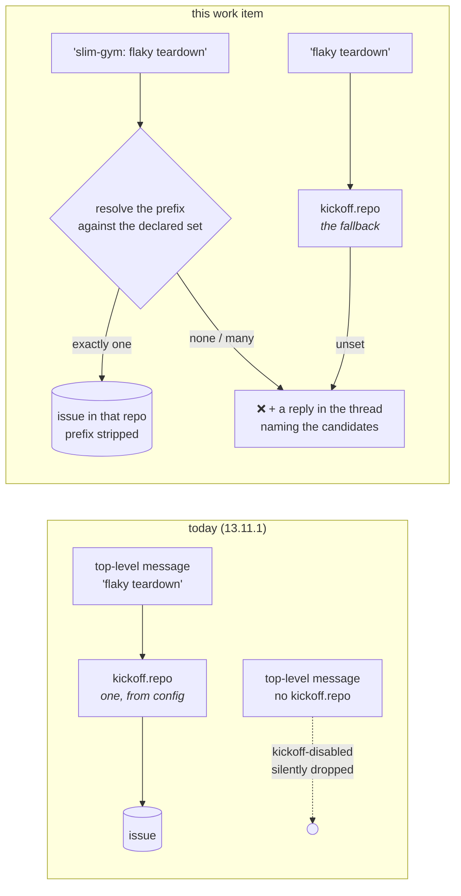

# Requirements: a Slack kickoff names its own repository, resolved against the repositories the-loop already polls

> Phase 1 of 3 (requirements → design → tasks). Tier 3 (`human-approves-pr`; below
> `security.review.humanSignOffMinTier: 4`): a first-line `<repo>:` prefix on a kickoff
> message, resolved against a **closed, operator-declared set** — `kickoff.repo` plus
> every `polling.sources[].repos` entry — with an unresolvable or ambiguous prefix
> **refused in the thread**, never guessed. No new schema key, no new grant, no new
> scope, no new state. The one behavioural widening is that the `work-item.create` grant
> stops requiring `kickoff.repo`.

## Introduction

[Issue #341](https://github.com/MadaraUchiha-314/the-loop/issues/341), opened by
@jc1993 against 13.11.1, says that kickoff takes exactly one repository, from
`channels.slack.kickoff.repo`, and that driving twelve repositories from a phone means
most kicked-off issues land in the wrong one and are moved by hand — "worse than not
having kickoff". The ask is a one-word prefix:

```
slim-gym: flaky teardown in the batch runner
```

The code comment this revisits is at `channels/inbound.py:439`:

```python
if not config.kickoff_repo:
    # Both the grant and a target (A6): there is no sensible inferred answer
    # to "which repository does this DM become an issue in".
    return _drop(reply, "kickoff-disabled", level="warning")
```

The reasoning still holds for the question it was answering — *infer* a repository from
prose. It does not hold for the question this work item answers: **choose** one from a
list the operator already wrote down. `polling.sources[].repos` is that list, read every
cycle by the poller, and `channels/commands.py` already resolves a slash command's
target against exactly it (`_configured_repositories`, decision-116 D4) — the same
closed set, for the same reason. Kickoff is the one inbound shape that does not use it.



## Requirements

### Requirement 1 — the message names its repository

**User story:** As an authorized member driving several repositories from Slack, I want
the first line of a kickoff message to name its repository, so that one word puts the
issue where it belongs instead of my moving it by hand afterwards.

#### Acceptance criteria (EARS)

1.1 WHEN a kickoff message's first line begins with `<prefix>:` AND `<prefix>` resolves
to exactly one declared repository (R2) THEN the issue SHALL be created in that
repository, whatever `kickoff.repo` says.

1.2 The prefix SHALL be accepted in three shapes — a bare repository name
(`slim-gym`), an `owner/repo`, and the `host/owner/repo` the writer already parses
(issue-311) — and matched **case-insensitively**.

1.3 WHEN a prefix resolves THEN it SHALL be stripped from the message before the issue
is composed, so neither the title (the first non-empty line) nor the body carries it.
WHEN stripping it would leave nothing at all THEN the kickoff SHALL be refused like any
other unsettled target (R2.5) — a prefix and no message is not a work item, and having
named a repository the member is told so rather than left with a reaction and silence.

1.4 The prefix SHALL be read from the **first line only**, and a message whose first
line does not match the prefix grammar SHALL be treated as having no prefix (R3). The
grammar is one to three `/`-separated segments of `[A-Za-z0-9][A-Za-z0-9._-]*`
immediately followed by `:`.

1.5 `kickoff.labels` SHALL be applied unchanged whichever repository is chosen — they
are what makes the new issue visible to the poller.

### Requirement 2 — resolved against the operator's own list, never guessed

**User story:** As the operator, I want a kickoff to reach only a repository I have
already declared, and an unclear name to be refused rather than resolved by guesswork,
so that a typo on a phone can never open an issue on a repository I never configured.

#### Acceptance criteria (EARS)

2.1 The declared set SHALL be `channels.slack.kickoff.repo` together with every
`repos` entry of every `github` source in `polling.sources` — the same set
`may_target` (decision-116 D4) bounds a slash command to — resolved to
`host/owner/repo` keys against this instance's GitHub host, and **nothing else**. An
unreadable or malformed entry SHALL contribute nothing (it widens nothing).

2.2 WHEN a **qualified** prefix (one containing `/`) matches no declared repository
THEN the message SHALL be refused (R2.5) — `kickoff.repo` SHALL NOT absorb it, because
`owner/repo:` has no reading as prose.

2.3 WHEN a **bare** prefix matches more than one declared repository — two owners
carrying the same repository name — THEN the message SHALL be refused (R2.5), naming
every candidate. Nothing SHALL be chosen for the member.

2.4 WHEN a **bare** prefix matches no declared repository THEN it SHALL be judged not to
be a repository prefix at all: the message SHALL be handled as prefix-less (R3), with
the text left intact. *(An English sentence may open `fix:`; a repository the operator
never declared may not be opened either way, so the only question is which of two
refusals a `fix:` message earns — and the one that preserves 13.11.1's behaviour for
every configured install is the fallback. See [decision-120](../../decisions/decision-120.md).)*

2.5 WHEN a message is refused for its prefix THEN the channel SHALL react with the
configured `error` emoji on the member's own message and reply **in that message's
thread** stating what was not resolved and which repositories were candidates; nothing
SHALL be created, recorded or bound. The candidate list SHALL be the declared set,
capped at twelve names with an "…and N more" tail.

2.6 The refusal reply SHALL be sent only to a member who has already passed the
allow-list: an unlisted member's kickoff SHALL stay a silent drop (`unauthorized-actor`),
so the declared repository list is never disclosed to someone the operator did not
authorize.

### Requirement 3 — `kickoff.repo` becomes the fallback, not the requirement

**User story:** As an operator upgrading, I want my existing single-repository kickoff to
keep working exactly as it does, so that this change costs me nothing.

#### Acceptance criteria (EARS)

3.1 WHEN a message carries no prefix (R1.4, R2.4) AND `kickoff.repo` is set THEN the
issue SHALL be created there, with the text unchanged — 13.11.1's behaviour, byte for
byte.

3.2 WHEN a message carries no prefix AND `kickoff.repo` is empty THEN the message SHALL
be refused with a reply asking for a `<repo>:` prefix and naming the candidates (R2.5),
rather than the silent `kickoff-disabled` drop of 13.11.1.

3.3 A configuration with the `work-item.create` grant and no `kickoff.repo` SHALL be a
**valid** configuration — prefix-only kickoff — so the channel SHALL read top-level
messages under the grant alone (`kickoff_enabled` SHALL no longer require
`kickoff.repo`). Every other precondition SHALL be unchanged: the channel enabled, a
configured channel id, the grant, the first-sight baseline, the allow-list.

3.4 No schema key SHALL be added, removed or renamed. A 13.11.1 configuration SHALL
parse and behave identically.

### Requirement 4 — the outcome says where the issue went

4.1 The "Opened …" reply SHALL name the created work item as it does today (ref, link,
the Start button of issue-337). The ref already carries `owner/repo`, so a member who
mistyped a bare name and landed in the fallback repository sees it in the answer.

4.2 A refusal and a resolution SHALL each be visible in the event log: the existing
`channel.dropped` with a reason naming the case (`kickoff-unknown-repo`,
`kickoff-ambiguous-repo`, `kickoff-no-target`) and the existing `channel.created`.
No new event type SHALL be introduced.

### Requirement 5 — the documentation follows the change

5.1 `the-loop channels status` SHALL name the fallback repository (or its absence) and
how many declared repositories a prefix may pick from. `docs/guide/slack.md` SHALL show the prefix in the modes-of-interaction table and a
worked example; `docs/config/cli/channels-options.md` SHALL rewrite
`slack.kickoff.repo` as the fallback and state the resolution rule;
`docs/capabilities/channels.md` SHALL carry the behaviour and a history row; the
`work-item.create` row of the grants table SHALL stop saying "needs both the grant and
the repo".

## Security considerations

- **Actors & trust:** authorized members (the `slack` ids of `routing.authorizedUsers`,
  judged before anything is resolved, recorded or answered); unlisted members and bots
  (dropped, unanswered — and now also *untold* which repositories exist); the operator
  (whose `kickoff.repo` and `polling.sources` are the entire universe of targets);
  Slack (the message text is untrusted input, and the prefix is a **selector into a
  closed set**, never a value that reaches an argv).
- **Trust boundaries & data:** no new boundary. The one that moves is *which* repository
  a kickoff may write to: from one config value to a set of config values. The set is
  the operator's own, and the writer (`comments.create_issue`) validates coordinates
  before they reach an argv, as it does today. A new disclosure exists — the candidate
  list in a refusal — and is bounded by the allow-list (R2.6).
- **Abuse cases (EARS):**
  1. WHEN an unlisted member posts `owner/repo: …` THEN nothing SHALL be created and no
     reply SHALL be posted — the refusal path SHALL run only after authorization.
  2. WHEN an authorized member names a repository that is not declared THEN no issue
     SHALL be created there, and the refusal SHALL NOT be silently downgraded to the
     fallback repository (R2.2).
  3. WHEN a prefix carries shell, path or argv metacharacters (`../`, `;`, `$(…)`, a
     newline) THEN it SHALL fail the prefix grammar or match nothing, and SHALL never be
     interpolated into a command — only a **declared string** is handed to the writer,
     never the member's text.
  4. WHEN a prefix names a host the instance does not use (`evil.example/o/r`) THEN it
     SHALL match no declared key and be refused (R2.2), because keys are built from the
     declared entries and this instance's own host.
  5. WHEN the refusal reply is composed THEN it SHALL carry no token, no config value
     other than the declared repository names, and no part of the member's text beyond
     the prefix it quotes.
  6. WHEN `polling.sources` is absent, malformed or unreadable THEN the declared set
     SHALL be whatever could be read (possibly empty) — a fault SHALL widen nothing, and
     an empty set with no `kickoff.repo` SHALL refuse every kickoff (R3.2).
  7. WHEN the grant `work-item.create` is absent THEN no top-level message SHALL be read
     or answered, whatever prefix it carries — the grant is unchanged as the gate.
- **Fail closed:** no `channels` section, `enabled: false`, no `work-item.create` grant,
  an empty allow-list, a declared set of zero with no fallback — each means no issue is
  created. The change never adds a target; it only lets a message pick among targets the
  operator declared.

## Out of scope

- A new config key for kickoff-eligible repositories. The ticket names
  `polling.sources[].repos` precisely because it is already there, and a second list
  would be a second thing to keep in sync.
- Inferring a repository from the message's prose (a keyword, a project name, a past
  issue). The ticket asks for a **choice among a declared set**, and the refusal path is
  what keeps it a choice.
- A prefix on a thread **reply**: a reply's work item is its thread's binding, which
  already names the repository.
- Per-repository labels. `kickoff.labels` stays one list (R1.5); a repository-specific
  label set is a separate ask.
- Changing what the slash command (`/the-loop <keyword> <work-item>`) accepts. It
  already resolves against the same declared set.

## Open questions

None. The one judgement call — what an unmatched **bare** prefix means when a fallback
exists — is answered by R2.4 and recorded as
[decision-120](../../decisions/decision-120.md).

## Review comments

> Appended by the-loop's `record-feedback` hook when a human gate approves with
> comments (issue-109). Append-only and attributed: an approval never silently
> discards a reviewer's suggestions, and the feedback travels with the document
> it concerns rather than living in a side-channel tracker.
