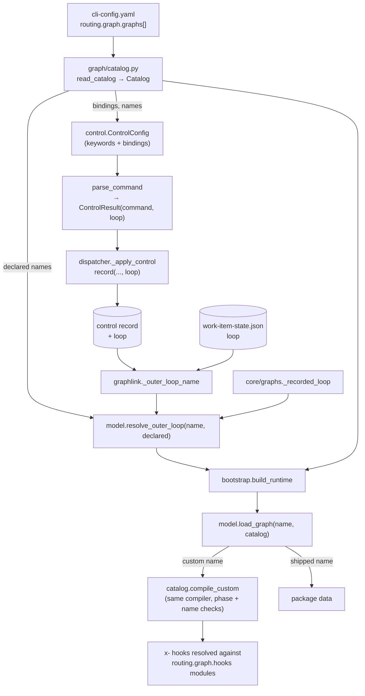

<!-- Authored per the the-loop:writing skill. -->

# Design: an operator can bring their own graphs and bind commands to them

> Phase 2 of 4 (requirements → design → testing plan → tasks). Derives from
> `requirements.md`. MUST be reviewed and approved before moving to test planning.

## Overview

**One new module (`graph/catalog.py`) parses `routing.graph.graphs`; the compiler, the
loader and the one fail-closed resolver learn a second source of names; the control parser
learns the declared words and records the loop each one selects.** A new command is
`start` with a loop attached — so every seam that already handles `start` (authorization,
spawn policy, arming, disarming) handles it unchanged.



## §1 The declaration — `routing.graph.graphs`

```yaml
routing:
  graph:
    graphs:
      - name: acme-triage-loop               # ^[a-z][a-z0-9-]*$, not pdlc-*, not shipped
        path: graphs/acme-triage-loop.yaml   # absolute, ~/…, or relative to this file's dir
        commands: [triage]                   # a NEW command → `the-loop triage`
      - name: acme-quick-loop
        path: ~/.the-loop/graphs/quick.yaml
        commands: [do]                       # OVERRIDES the shipped `do`
      - name: acme-guest-review
        path: /etc/the-loop/review.yaml
        commands: [review]
        guest: true                          # keeps the guest posture (R5)
```

`graph/catalog.py` owns it:

| Name | Shape | Notes |
|---|---|---|
| `CATALOG_KEY` | `"routing.graph.graphs"` | For messages |
| `RESERVED_PREFIX` | `"pdlc-"` | R1.2 |
| `CustomGraph` | frozen: `name`, `path` (raw), `commands: Tuple[str,…]`, `guest: bool` | `resolved_path(base)` expands `~`, keeps absolute, joins relative onto `base` |
| `Catalog` | frozen: `entries: Tuple[CustomGraph,…]` | `names`, `get(name)`, `bindings` (`{word: loop}`), `is_guest(name)`, `empty`, `digest()` |
| `read_catalog(cli_config)` | → `Catalog` | Validates R1.1–R1.5 and R3.1–R3.3; raises `GraphConfigError`; absent block → empty catalog |
| `config_base()` | → `Path` | `cli_config.default_cli_config_path().parent` — the directory of the file in effect (`--config`, `$THE_LOOP_CLI_CONFIG`, `./.the-loop/`, `~/.the-loop/`) |
| `compile_custom(entry, base)` | → `Graph` | Reads, compiles, checks R2.2/R2.3; `x-` hooks deferred (§3) |

Command-word validation needs the control vocabulary. `catalog` imports it from
`the_loop.control` **inside** `read_catalog`, and `control` imports `read_catalog` inside
`ControlConfig.from_mapping`: two function-level imports, no module-level cycle, and
`control` keeps its "no graph imports at module level" property.

Rules, all at parse time:

- `name` grammar, not shipped, not `pdlc-*`, unique.
- `path` a non-empty string.
- `commands` a list; each word matches `^[a-z][a-z0-9-]*$`; each is either in
  `SPAWN_COMMANDS` (`start`, `contribute`, `do`, `review`) or not in `COMMANDS` at all;
  each is bound once across the whole list.
- `guest` a boolean when present; any other key is refused (the schema's
  `additionalProperties: false`, enforced in code too so a config that skips schema
  validation still fails closed).

## §2 The compiler and the loader (`graph/model.py`)

- **`PHASE_VOCABULARY`** — the eleven phases the shipped loops declare, in order
  (`phase-selection` … `cleanup`). A test pins it equal to the union of the shipped
  loops' phases, so a new shipped phase must be added here in the same change.
- **`Node.command` grammar** — `^[a-z0-9][a-z0-9-]*(:[a-z0-9][a-z0-9-]*)?$` or empty,
  enforced in `_build_node` for every graph (every shipped command already fits).
- **`slash_command(command)`** — `"/the-loop:<c>"` for a bare name, `"/<c>"` for a
  namespaced one. The two renderers (`graphlink.render_graph_context`,
  `hooks/assignment.py`) call it instead of formatting `/the-loop:` themselves.
- **`compile_graph(data, known=None)`** — `known` is threaded to `_build_node` →
  `_validate_chain`, the predicate `extensions.apply` already passes for attachments.
- **`resolve_outer_loop(name, declared=())`** — returns `name` when it is a non-default
  shipped outer-path loop **or** a member of `declared`; `""` otherwise. Still the one
  decision; every reader passes the catalog's names.
- **`load_graph(path=None, repo=None, name=…, declaration=None, catalog=None)`**:
  - A shipped `name` → exactly today's path.
  - A name the catalog declares → `catalog.compile_custom(entry, config_base())`, then
    §3's extension resolution, then `extensions.apply` as for a shipped loop. The cache
    key is `(resolved path, repo, declaration digest)`, as today.
  - Anything else → `GraphConfigError("… is neither a shipped loop nor declared in
    routing.graph.graphs")` — instead of today's misleading "packaging fault".
  - `_warn_on_repo_graph(repo, extra=catalog.names)` warns for the shipped filenames and
    the declared names, and the message names `routing.graph.graphs` (R8).

`compile_custom` in order: resolve the path; read (an `OSError` names the graph and the
file); `yaml.safe_load`; require a mapping; if `name` is present require it equal the
declared name, else set it; `compile_graph(data, known=is_extension_name)`; every node's
`phase` in `PHASE_VOCABULARY`.

## §3 `x-` hooks inside a custom graph

A shipped graph may not name an `x-` hook (the registry refuses the prefix). A custom one
may (R2.4), because the operator authored both. The compile defers them — `known` accepts
any `x-` name — and `load_graph` then resolves them:

1. collect the `x-` names the compiled chains reference;
2. none → done;
3. some, but no `repo` or no declared modules → `GraphConfigError` naming the hooks;
4. `extensions.load_modules(repo, declaration)`; any referenced name missing from the
   table → `GraphConfigError`; else `replace(graph, extension_hooks=table)`.

`Graph.hook_for` already consults `extension_hooks` first, so the chain runner needs no
change. `the-loop graph loops` stops after step 1 and lists the names — it never imports
a module (R7.2).

## §4 Attachment scoping (`graph/extensions.py`)

`Attachment` gains `loops: Tuple[str, …] = ()`. `read_declaration` reads an optional
`loops` list, validating each name against the shipped loops plus the catalog's names
(R6.2). `apply` skips an attachment whose `loops` is non-empty and does not contain
`graph.name`; an empty `loops` keeps today's behaviour exactly, including failing on a
missing node (R6.1). `Declaration.digest()` includes `loops`.

## §5 Commands (`control.py`)

- `ControlConfig` gains `bindings: Dict[str, str]` (word → custom loop, overrides and new
  words alike) and `loops: Tuple[str, …]` (every declared custom name).
  `from_mapping(data, graph=None)` fills both from `read_catalog({"routing": {"graph":
  graph}})` and adds `keywords[word] = "the-loop <word>"` for every **new** word.
- `ControlResult` gains `loop: str = ""`.
- `parse_command` scans `COMMANDS` then the new words, with the same boundary patterns.
  `found` holds the *words*, so `the-loop start` + `the-loop triage` is ambiguous (R3.4).
  A lone new word returns `command=START, loop=<bound loop>, matched=[word]`; a lone
  spawn command with an override returns that command with `loop=<bound loop>`.
- `ControlRecord` gains `loop: str = ""` (serialized as `"loop"`; absent in older
  records reads as `""`). `ControlStore.record(..., loop="")` writes it.
- Every other constant (`COMMANDS`, `SPAWN_COMMANDS`, `_ARMING_COMMANDS`) is unchanged.

## §6 The dispatcher and the graph coupling

- `dispatcher.py`: `ControlConfig.from_mapping(data.get("control"), graph=data.get("graph"))`;
  `_apply_control(control.command, routed, loop=control.loop)`; its `record()` passes
  `loop`; the `control.command` event carries `loop` when set (R3.8). `review`'s PR
  binding keys on the command, so an overridden `review` still binds to the PR (R3.7).
- The other `ControlConfig.from_mapping` builders (`channels/inbound.py`,
  `channels/commands.py`, `channels/slack.py`, `core/sessions.py`) pass the routing
  block's `graph` too, so every surface recognises the same vocabulary.
- `graphlink._outer_loop_name`: state first → `resolve_outer_loop(recorded,
  self.control.loops)`; then the control record → `resolve_outer_loop(record.loop,
  self.control.loops)` when `record.loop` is set, else the shipped
  `LOOP_FOR_CONTROL_COMMAND` (unchanged for every existing record). The control-record
  branch now goes through the resolver too, closing the gap the survey noted.

## §7 The runtime builder and the CLI

- `bootstrap.build_runtime`: `catalog = read_catalog(cli_cfg)`; `chosen` is kept when it
  is in `OUTER_PATH_LOOPS` **or** `catalog.names`, else the default with a warning;
  `guestLoop = chosen in GUEST_LOOPS or catalog.is_guest(chosen)`; `load_graph(...,
  catalog=catalog)`. A catalog that fails to parse raises — the same posture
  `read_declaration` has.
- `core/graphs._recorded_loop`: resolves against the best-effort CLI config's catalog.
- `the-loop graph loops [--format text|json]` (`commands/graph_cmd.py`): one row per
  shipped loop (commands from `LOOP_FOR_CONTROL_COMMAND`, `start` for the default,
  minus any overridden) and per declared graph (commands, guest, resolved path, status
  `ok` / the compile error, referenced `x-` hooks). Exit 1 when any declared graph fails
  to compile or the catalog itself fails to parse. Local only, like `graph hooks` — it
  reads the operator's config, which the service API does not expose.

## Data models

- **CLI config schema** (`.the-loop/cli-config.schema.json` and the packaged copy):
  `routing.graph.graphs` (array of `{name, path, commands?, guest?}`,
  `additionalProperties: false`, patterns as §1) and
  `routing.graph.hooks.attach[].loops` (array of strings).
- **Control record** (`portable/<slug>.json`, `control` section): `loop` (string,
  optional). Additive; readers of older records see `""`.
- **`work-item-state.json`**: unchanged shape — `loop` may now hold a declared custom
  name.

## Error handling

| Failure | Where | Surfaced as |
|---|---|---|
| Malformed `routing.graph.graphs` | `read_catalog` (daemon start, `build_runtime`, `graph loops`) | `GraphConfigError` naming the entry; the daemon refuses to start |
| Custom YAML missing / invalid / wrong name / unknown phase / unknown hook | `compile_custom` / `load_graph` | `GraphConfigError` naming the graph and the file; on the daemon path, logged as `graph.link_failed` (the coupling's existing best-effort envelope) |
| Recorded loop not declared | `resolve_outer_loop` | `""` → default loop; `build_runtime` logs the ignored name at `warning` |
| `x-` hook referenced without modules | `load_graph` | `GraphConfigError` naming the hooks |
| Attachment `loops` names an unknown loop | `read_declaration` | `GraphConfigError` |

## Security design

- **AuthN/AuthZ:** unchanged. A new command is parsed only after the self-marker and
  `authorizedUsers` guards, then re-checked for a named actor on the control path — it
  reaches `_apply_control` as `START`, so no new branch can skip the check.
- **Input validation & injection surfaces:**
  - *Comment body*: the parser returns only declared words (fixed at config load); the
    `loop` in a `ControlResult` is looked up from the operator's bindings by word, never
    copied from the body. A word shaped like a command but not declared matches nothing.
  - *State file / control record `loop`*: passed through `resolve_outer_loop(name,
    declared)`; only an exact member of the shipped outer-path set or the declared names
    survives. The value is never used as a path — `load_graph` looks the name up in the
    catalog and uses the catalog's path.
  - *Path*: only from the operator's config; no containment rule is imposed, because the
    operator's filesystem is the operator's (the same stance as `critics[].command`).
- **Secrets handling:** none involved.
- **Least privilege:** no new permission; a custom graph can only name hooks that are
  already registered (shipped) or already declared by the operator (`x-`).
- **Fail-closed behaviour:** every parse and compile fault raises; an unresolvable
  recorded loop reads as the default (the pre-existing rule); a declared graph that fails
  to load never falls back to the default (R4.4) — `build_runtime` raises and the coupling
  records `graph.link_failed`.
- **Abuse-case coverage:**

| Abuse case (requirements) | Mechanism | Negative test |
|---|---|---|
| 1. forged `loop` in state | `resolve_outer_loop(name, declared)` | `test_graph_catalog.py::test_forged_state_loop_reads_as_default` |
| 2. undeclared keyword | parser scans declared words only | `test_control_custom_commands.py::test_undeclared_word_is_no_command` |
| 3. unauthorized new command | existing `unauthorized-actor` path (command is `START`) | `test_control_custom_commands.py::test_unauthorized_custom_command_is_refused` |
| 4. new + built-in command | `found` holds words → ambiguous | `test_control_custom_commands.py::test_custom_and_builtin_command_is_ambiguous` |
| 5. repo file shadowing a declared name | loader never reads the repo; warning | `test_graph_catalog.py::test_repo_file_for_declared_name_is_ignored` |
| 6. rebinding `stop` etc., `pdlc-*` names | `read_catalog` refuses | `test_graph_catalog.py::test_catalog_refuses_*` |

## Testing strategy

Unit tests pin each parser and resolver rule (`test_graph_catalog.py`,
`test_control_custom_commands.py`, additions to `test_graph_extensions.py`); an
integration test drives the dispatcher end to end — an authorized `the-loop triage` on a
ticket arms, spawns, and the spawned work item's state records the custom loop — with a
Gherkin docstring (`test_custom_graph_integration.py`, `Scenario: a new command arms a
work item onto the operator's graph`). The CLI verb is tested through its command class.
The executable detail is `testing-plan.md`.

## Trade-offs & decisions

| Choice | Alternatives | Why |
|---|---|---|
| Declared in the **CLI config** | A repository's `.the-loop/graphs/` | decision-123: what runs in the-loop's process is the operator's. A graph in the checkout would also be **agent-writable** — the session could rewrite its own gates |
| A new command **is `start` + a loop** | New entries in `COMMANDS` / `SPAWN_COMMANDS` | Every seam branching on the arming constants keeps working with no edits, and `ControlStore` needs no config to answer `start_requested` |
| The loop is **recorded** on the control record | Re-derived from the command at spawn time | A new word has no constant to derive from; recording also freezes an override against a config edit between arming and spawn |
| Phases **restricted** to the shipped vocabulary | Free phases | decision-123 D3 — one label vocabulary for every repository; `/the-loop:init` creates exactly those labels |
| Keyword **derived** (`the-loop <word>`) | A per-command keyword key | Smallest surface; per-command text can follow if asked (out of scope) |
| `pdlc-` **reserved** | `x-` prefix required | Graph names are user-facing (they appear in the state file and `graph loops`); reserving the shipped family keeps them readable |
| `attach[].loops` **opt-in** | Silently skip attachments whose node is absent | Silently skipping would turn a typo'd node into a check that never runs — the failure issue-248 exists to prevent |

Recorded as [decision-136](../../decisions/decision-136.md).

## Open questions

None.

## Review comments

> Appended by the-loop's `record-feedback` hook when a human gate approves with
> comments (issue-109).
