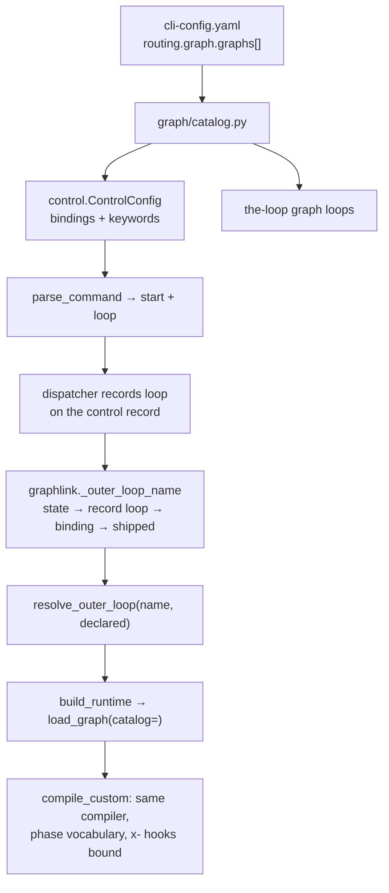

# Operator-declared graphs and command bindings (issue-343): reviewer briefing

## TL;DR

An operator can now declare **graphs of their own** in their CLI config
(`routing.graph.graphs`): a YAML file plus the arming commands that select it. A command
can **override** a built-in one (`start`/`contribute`/`do`/`review`), or be a **new word**
(`the-loop triage`) that arms a work item exactly like `start`, but onto the operator's
graph. A custom graph goes through the same compiler, hook registry and phase vocabulary
as the built-in loops. A graph is chosen only by a name the operator's config declares
right now. Risk tier **4**: this needs a **named human security sign-off**.

## Where to focus (in this order)

1. **The fail-closed selection seam.** `cli/the_loop/graph/model.py` `resolve_outer_loop`,
   `cli/the_loop/graphlink.py` `_outer_loop_name`, `cli/the_loop/graph/bootstrap.py`
   `build_runtime`. `work-item-state.json` is agent-writable. Check that only a
   *currently declared* name can select a custom graph, and that a name is never used as
   a path (`load_graph` looks the name up in the catalog and uses the catalog's path).
2. **The control parser.** `cli/the_loop/control.py` `ControlConfig.from_mapping`,
   `parse_command`, `ControlRecord.loop`. A new word is reported as `start` with a loop,
   so every existing `start` path handles it (authorization, spawn policy, arming). Check
   that `ControlResult.loop` comes only from the operator's bindings, never from the
   comment text.
3. **The catalog.** `cli/the_loop/graph/catalog.py`. It parses and validates the
   declaration: the reserved `pdlc-` prefix, which commands may be bound, the
   the-loop CLI verbs a new word may not reuse. It also compiles a custom graph against
   the phase vocabulary. `x-` hooks are bound in `model._resolve_extensions`.
4. **Behaviour change for everyone: the `command:` grammar.** `model._build_node` now
   checks every graph's node `command:`. All shipped commands already fit.
5. **Skim:** `the-loop graph loops` (`commands/graph_cmd.py`), `attach[].loops`
   (`graph/extensions.py`), the schema, docs, and evidence.

## What changed (map)

Commits: `c100907` spec chain · `4cca7fa` implementation, tests, docs ·
`7b95008` fixes from the independent review, plus evidence.

## Key decisions & why

- **Declared by the operator, never by a repository.** A graph file inside the checkout
  would be one the session could edit. The declaration sits beside `critics[]` and
  `routing.graph.hooks` ([decision-123](../../../decisions/decision-123.md)). Recorded as
  [decision-136](../../../decisions/decision-136.md).
- **A new command is `start` with a loop recorded.** New entries in `COMMANDS` would have
  forced every constant set and `ControlStore` to know the operator's config.
- **Phases stay in the shipped vocabulary.** The `loop:<phase>` labels are one vocabulary
  for every repository.
- **`guest: true` covers the posture only** (spec tree kept out of git, plan posted on the
  thread). It does not add the prompt lines the built-in contribution and review loops
  get. Tying those lines to `guest` would impose one loop's rule on the other's
  replacement.
- **`attach[].loops` is opt-in.** Without a scope, an attachment still applies to every
  loop and still fails a graph that lacks its node. Skipping silently would turn a typo
  into a check that never runs.

## Evidence

- [verification.md](verification.md) is the full record:
  - 4634 passed, 1 skipped (baseline before the change: 4528).
  - Ruff, format and pyright are clean; markdownlint is clean on every changed page.
  - Red first: 21 of the new tests failed on the tree before the change.
- The end-to-end scenarios (`tests/test_custom_graph_integration.py`) run a real
  dispatcher over a real `git` checkout:
  - `the-loop triage` arms the work item, and its state then walks the custom graph.
  - An overridden `do` does the same.
  - An unauthorized user's `the-loop triage` is refused.
- [self-review.md](self-review.md):
  - Three rounds. The second was an independent fresh-context review: 10 findings,
    including one blocker (`graph loops` in a fresh process). All are addressed.
  - No critic is configured on this machine.
- [security-review.md](security-review.md): six abuse cases, each tied to a mechanism and
  a named negative test. **A tier-4 human sign-off is requested.**

## Open questions for the reviewer

1. **Security sign-off (tier 4).** Do you accept the stated risk? A custom graph can omit
   gates, and that is the operator's choice on their own machine.
2. **Keyword for new commands.** New commands get the derived keyword `the-loop <word>`.
   Do you want per-command keyword text, as the built-in commands have
   (`routing.control.keywords`)? It is out of scope here.
3. **Removing a graph that work items are still on.** An item keeps working only by
   falling back (to the command's built-in loop, else the default). Is documenting "remove
   a graph only when nothing walks it" enough, or do you want a migration verb?
