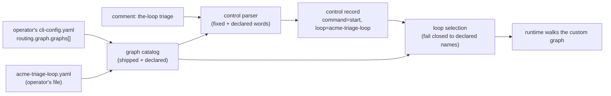

<!-- Authored per the the-loop:writing skill. -->

# Requirements: an operator can bring their own graphs and bind commands to them

> Phase 1 of 4 (requirements → design → testing plan → tasks). Following the Kiro spec
> approach (<https://kiro.dev/docs/specs/>). This phase MUST be reviewed and approved by
> the required collaborators before moving to design.

## Introduction

[Issue-343](https://github.com/MadaraUchiha-314/the-loop/issues/343): *"Users of the-loop
should be able to provide their own graphs (yamls) and override existing commands to use
that graph or provide new commands that use that graph."*

The graph has been declarative since issue-109 precisely so this could arrive later
("user-defined graphs … a future feature; the declarative form and the registry exist so
it can arrive safely"). issue-248 delivered the *hooks* half of that deferral; this work
item delivers the *graphs* half. Today the-loop can walk exactly five loops, all shipped
inside the CLI, and a `.the-loop/<loop>.yaml` in a repository is ignored with a warning.
Which loop a work item walks is chosen by four fixed arming keywords:

| Keyword (default) | Loop it selects today | Can an operator change it? |
|---|---|---|
| `the-loop start` | `pdlc-work-item-loop` | No |
| `the-loop contribute` | `pdlc-contribution-loop` | No |
| `the-loop do` | `pdlc-adhoc-loop` | No |
| `the-loop review` | `pdlc-review-loop` | No |
| *anything else* | — | No new arming word can be added |

**The unit of the change is one list in the operator's CLI config
(`routing.graph.graphs`): each entry names a graph YAML the operator wrote, and the arming
commands that select it** — an existing one (overriding the loop it selects) or a new word
(a new command). Everything a shipped loop is held to, a custom one is held to: the same
compiler, the same hook registry, the same phase vocabulary, the same fail-closed
selection.

## Requirements

### R1 — an operator declares a graph of their own

**User story:** As an operator, I want to point the-loop at a graph YAML I wrote, so that
my team's process is something the-loop executes rather than something I describe in a
prompt.

#### Acceptance criteria (EARS)

1. The CLI config SHALL accept `routing.graph.graphs`, a list of entries each carrying a
   `name`, a `path`, and optionally `commands` (a list of command words) and `guest`
   (a boolean, default `false`). An absent or empty list SHALL change nothing.
2. A graph `name` SHALL match `^[a-z][a-z0-9-]*$`, SHALL NOT be a shipped loop's name and
   SHALL NOT begin with `pdlc-` — the prefix is reserved for loops the-loop ships, so a
   future shipped loop can never collide with an operator's.
3. WHEN two entries declare the same `name` THEN loading the declaration SHALL fail and
   name the duplicate.
4. A `path` SHALL be absolute, `~`-relative, or relative to the directory of the CLI
   config file in effect (`--config` / `$THE_LOOP_CLI_CONFIG` / the default search) — the
   operator's file, resolved on the operator's machine, never against a work item's
   checkout.
5. WHEN any entry is malformed (missing `name` or `path`, a non-list `commands`, a
   non-boolean `guest`, an unknown key) THEN loading the declaration SHALL fail with an
   error naming the entry — never degrade to "no custom graphs".

### R2 — a custom graph is compiled by the rules a shipped one is

**User story:** As an operator, I want a mistake in my graph to fail when it loads, so that
it never surfaces three nodes into a work item at 2am.

#### Acceptance criteria (EARS)

1. A custom graph SHALL be compiled by the same compiler as the shipped loops: every
   structural rule that holds for a shipped loop (known hooks, declared edge ends, a
   declared start node, `skippable` nodes with an `on: skipped` edge, well-formed skip
   sets and `produces` entries) SHALL hold for it, with the same error.
2. IF the YAML carries a top-level `name` THEN it SHALL equal the declared `name`;
   absent, the declared name SHALL be the compiled graph's name.
3. Every `phase` a custom node declares SHALL be one of the phases the shipped loops
   declare — the `loop:<phase>` label vocabulary is fixed (decision-123 D3), and a
   dashboard built on it must work for every graph.
4. A custom graph MAY name any shipped hook, and MAY name an `x-` hook registered by a
   module in `routing.graph.hooks.modules`. WHEN it names an `x-` hook no declared module
   registers THEN the load SHALL fail naming the hook.
5. A node's `command:` MAY name a slash command outside the-loop's plugin by carrying a
   namespace (`acme:triage`), rendered as `/acme:triage`; a bare name keeps rendering as
   `/the-loop:<name>`. A `command:` containing anything but lowercase letters, digits,
   `-` and at most one `:` SHALL fail the load.
6. WHEN the file is missing, unreadable, not YAML or not a mapping THEN the load SHALL
   fail naming the file and the declared graph.

### R3 — a command selects a custom graph

**User story:** As an operator, I want `the-loop do` to run my team's quick loop, or a new
`the-loop triage` to run our triage loop, so that the people on my tickets arm the process
I chose with a word they type.

#### Acceptance criteria (EARS)

1. A `commands` entry SHALL be either one of the four arming commands that may spawn a
   session (`start`, `contribute`, `do`, `review`) — **overriding** the loop that command
   selects — or a **new** word matching `^[a-z][a-z0-9-]*$` that is not any other
   built-in control command and not one of the-loop's own CLI or Slack verbs (so a
   comment quoting `the-loop graph complete …` never arms a work item).
2. WHEN a command word is bound by two entries THEN loading the declaration SHALL fail.
3. WHEN a command word names a built-in command that is not an arming spawn command
   (`stop`, `pause`, `resume`, `execute`, `cleanup`, the collaborator and channel
   commands) THEN loading the declaration SHALL fail — those commands do not select a
   loop, and rebinding them would change what they mean.
4. A new command's keyword SHALL be `the-loop <word>`, matched by the same whole-token,
   case-insensitive rule as every other keyword, and SHALL take part in the
   two-different-commands ambiguity refusal.
5. WHEN an authorized user's comment carries a new command THEN the system SHALL treat it
   exactly as `start` in every respect but the loop (same authorization, same spawn
   policy, same arming semantics, same durable record) and SHALL record the selected loop
   in the work item's control record.
6. WHEN an authorized user's comment carries an overridden arming command THEN the system
   SHALL behave exactly as that command does today and SHALL record the custom loop.
7. `review`'s binding to the pull request it was typed on (issue-279) SHALL follow the
   command, not the loop: an overridden `review` still binds to the PR.
8. The `control.command` event SHALL carry the selected `loop` whenever one was recorded.

### R4 — the choice is frozen, and only a declared graph can be chosen

**User story:** As an operator, I want a work item to keep walking the graph it was armed
with, and nothing but my declaration to be able to choose a custom graph.

#### Acceptance criteria (EARS)

1. Loop selection SHALL stay state-first: once `work-item-state.json` records a loop, a
   later control command SHALL NOT change it. Before the first start, the control record's
   recorded `loop` SHALL select; a record with none SHALL select by its command, as today.
2. A recorded loop name — in the state file or the control record — SHALL select a custom
   graph only WHEN the operator's configuration currently declares that name. An
   undeclared name in the state file SHALL read as the default loop, as an invented name
   does today; an undeclared name on the control record SHALL be ignored, and the
   recording command's current binding, else its shipped loop, SHALL apply.
3. The same resolution SHALL apply on every path that selects a loop: the daemon's graph
   coupling, `the-loop check`, `the-loop graph …`, and the runtime builder.
4. WHEN a declared graph fails to load at the moment a work item needs it THEN the
   operation SHALL fail loudly (as a shipped-graph fault does) — it SHALL NOT silently
   walk the default loop instead.
5. WHEN a work item is armed without a recorded loop (a CLI `sessions start`, a spawn when
   no start command is required) THEN the binding of `start` SHALL apply, so an overridden
   `start` holds however the item was armed.

### R5 — a custom graph can be a guest

**User story:** As an operator replacing `contribute` or `review`, I want my loop to keep
the guest posture, so that my graph does not start committing its spec tree into somebody
else's repository.

#### Acceptance criteria (EARS)

1. WHEN a custom graph is declared `guest: true` THEN runtimes built for it SHALL carry
   `guestLoop: true` (spec tree git-excluded, `publish-artifact` posting to the thread).
   The session-prompt lines tied to the shipped contribution and review loops are not
   part of the posture and SHALL NOT be claimed for a custom graph.
2. A custom graph without `guest` SHALL NOT be a guest.

### R6 — attached hooks can be scoped to loops

**User story:** As an operator with hooks attached to outer-loop nodes, I want a custom
graph without those nodes to still load, so that adopting one does not force me to delete
my hooks.

#### Acceptance criteria (EARS)

1. A `routing.graph.hooks.attach[]` entry SHALL accept an optional `loops` list of loop
   names (shipped or declared). WHEN present THEN the attachment SHALL apply only to those
   loops; WHEN absent THEN it SHALL apply to every loop, exactly as today (including
   failing a load whose graph lacks the node). An empty `loops` SHALL be refused.
2. WHEN `loops` names a loop that is neither shipped nor declared THEN loading the
   declaration SHALL fail naming it.

### R7 — an operator can see and check what is declared

**User story:** As an operator, I want one command that lists every loop this machine can
walk and proves each one compiles, so that I find my mistake before a ticket does.

#### Acceptance criteria (EARS)

1. `the-loop graph loops` SHALL list every shipped loop and every declared custom loop
   with the commands that select it, whether it is a guest, and (for a custom loop) its
   resolved path.
2. It SHALL read the CLI config strictly, compile each custom graph and check the
   attachments that apply to it (without executing any hook module), and report `ok` or
   the error per graph, exiting non-zero when any fails.
3. `--format json` SHALL emit the same facts as a JSON document.

### R8 — a repository still cannot supply a graph

1. A graph YAML inside a repository (`.the-loop/<name>.yaml`, `graph.yaml`, `pdlc.yaml`)
   SHALL still be ignored with a warning; the warning SHALL name `routing.graph.graphs` as
   the supported way to declare one.

## Non-functional requirements

- **No behaviour change for an operator who declares nothing.** Every existing test
  passes unmodified in intent; an absent `routing.graph.graphs` is exactly today's
  behaviour, including the four shipped keyword→loop bindings.
- **Compiled once.** A custom graph is compiled once per process per declaration, like a
  shipped one (the existing cache, keyed by file path, repository and declaration).
- **Observability.** A refused or unknown recorded loop logs a warning naming the value;
  a custom graph load logs its name and resolved path at `info`.
- **Schema.** The CLI config schema (both copies) describes every new key, and the parity
  test keeps them identical.

## Security considerations

- **Actors & trust:**
  - The **operator** — trusted. They own the CLI config and the graph files it names, as
    they own `critics[]` and `routing.graph.hooks` (decision-043, decision-123 D7/D8).
  - An **authorized user** on a ticket — trusted to arm, via the existing named-actor
    check; a new command is exactly as authorized as `start`.
  - An **unauthorized commenter**, the **agent** (prompt-injectable), and **repository
    content** — untrusted. The agent can write `work-item-state.json`; repository content
    can include a `.the-loop/*.yaml`.
- **Trust boundaries & data:**
  - *Comment text → daemon action.* New keywords widen the vocabulary a comment can match.
    The parser still returns only declared words; the loop reaches the control record from
    the operator's declaration, never from body text.
  - *Agent-writable state → graph selection.* The state file's `loop` may now name a
    custom graph; the reader accepts only names the operator declares.
  - *Filesystem.* A graph path is read from the operator's configuration only; no work
    item, comment or state file can name a path.
  - No secret, token or personal data is stored or moved by this change.
- **Abuse cases (EARS):**
  1. WHEN an agent writes a `loop` value naming an undeclared graph, a path, or a
     `../`-style string into `work-item-state.json` THEN the system SHALL walk the
     default loop and log a warning — never open a file named by that value.
  2. WHEN a comment carries text resembling a keyword for a command the operator has
     not declared (`the-loop triage` with no `triage` binding) THEN the system SHALL
     treat it as no command.
  3. WHEN an unauthorized user types a declared new command THEN the system SHALL refuse
     it as it refuses an unauthorized `start` (`unauthorized-actor`).
  4. WHEN a comment carries a new command and a different built-in command THEN the
     system SHALL refuse it as ambiguous, executing and forwarding nothing.
  5. WHEN a repository carries `.the-loop/<name>.yaml` for a declared custom graph's
     name THEN the system SHALL ignore the repository's file and load the operator's.
  6. WHEN a declaration tries to bind `stop`, `pause`, `resume`, `execute`, `cleanup` or
     an argument command to a graph, or to name a graph `pdlc-*` THEN loading SHALL fail.
- **Accepted, stated risk.** A custom graph may omit gates the shipped loops have
  (`phase-selection`, approvals, reviews). That is the feature: the operator owns the
  process on their machine, as they already own which critics and hooks run. It is not a
  new capability for anyone else — an agent could already select the shipped ad-hoc loop
  by editing the state file's `loop` (a pre-existing gap this work item does not widen:
  the set of selectable loops grows only by what the operator declares). If the operator
  keeps their CLI config in a repository (`./.the-loop/cli-config.yaml`), a graph path
  relative to it is inside that repository and reviewable there — and editable by
  whoever can edit the config itself, which is no wider than today.
- **Fail closed:** a malformed declaration, an unknown or duplicate name, a reserved
  name, a bad command binding, an unloadable file, an unknown phase or hook — each stops
  the load and reports. A recorded loop the operator does not declare reads as the
  default.

## Out of scope

- **Repository-supplied graphs.** A repository still cannot declare a loop (R8); the
  declaration is the operator's, as hooks are since issue-352.
- **Custom inner (pull-request) loops.** `pdlc-pr-loop` is addressed by PR number and
  keeps its own state layout; replacing it is a different change.
- **Custom keywords for new commands.** A new command's keyword is `the-loop <word>`;
  per-command keyword text stays a shipped-command feature of `routing.control.keywords`.
- **Hot reload.** A changed graph file takes effect on the next process start, as a
  changed hook module does.
- **Migrating a work item between graphs** when an operator removes or renames a
  declared graph mid-walk; the item then reads as the default loop (R4.2) — the operator
  is told to remove a graph only when nothing walks it.
- **Arming with a custom command from the CLI** (`the-loop sessions start` records only
  `start` today, for every loop but the default).

## Open questions

None outstanding. The judgement calls — where the declaration lives (the operator's CLI
config, by decision-123), how a new command is represented (as `start` plus a recorded
loop), and whether custom phases are allowed (no: the label vocabulary is fixed) — are
answered in `design.md` § Trade-offs and in [decision-136](../../decisions/decision-136.md).

## Review comments

> Appended by the-loop's `record-feedback` hook when a human gate approves with comments.
