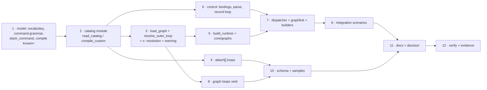

<!-- Authored per the the-loop:writing skill. -->

# Tasks: an operator can bring their own graphs and bind commands to them

> The last spec artifact. Derived from [design.md](design.md) and
> [testing-plan.md](testing-plan.md). Gate-less (issue-281): it advances on shape.

## Execution DAG

## Tasks

- [x] **1 · The compiler's new rules.** `PHASE_VOCABULARY`, the `Node.command` grammar,
      `slash_command`, `compile_graph(data, known=None)` in `graph/model.py`; switch the
      two `/the-loop:` renderers to `slash_command`.
      _Requirements:_ R2.1, R2.3, R2.5.
      _Test:_ testing-plan T2.

- [x] **2 · The catalog.** `cli/the_loop/graph/catalog.py` — `CustomGraph`, `Catalog`,
      `read_catalog`, `config_base`, `compile_custom`. Tests first in
      `cli/tests/test_graph_catalog.py`.
      _Requirements:_ R1.1–R1.5, R2.2, R2.3, R2.6, R3.1–R3.3.
      _Test:_ testing-plan T1, T2.

- [x] **3 · Loading and resolving.** `load_graph(..., catalog=)`, the `x-` resolution,
      the unknown-name error, `resolve_outer_loop(name, declared)`, the repository-file
      warning naming `routing.graph.graphs`.
      _Requirements:_ R2.4, R4.2, R4.4, R8.
      _Test:_ testing-plan T2, T3, T8.

- [x] **4 · Scoped attachments.** `Attachment.loops`, its parse and validation, `apply`'s
      skip, the digest.
      _Requirements:_ R6.1, R6.2.
      _Test:_ testing-plan T6.

- [x] **5 · The runtime builder.** `build_runtime` honours declared names and `guest`;
      `core/graphs._recorded_loop` resolves against the catalog.
      _Requirements:_ R4.2, R4.3, R5.1, R5.2.
      _Test:_ testing-plan T3.

- [x] **6 · The control vocabulary.** `ControlConfig.bindings/loops`, `from_mapping(…,
      graph=)`, `parse_command` for new and overridden words, `ControlResult.loop`,
      `ControlRecord.loop`, `ControlStore.record(loop=)`. Tests first in
      `cli/tests/test_control_custom_commands.py`.
      _Requirements:_ R3.4–R3.6.
      _Test:_ testing-plan T4, T8.

- [x] **7 · The daemon path.** The dispatcher records the loop and logs it; every
      `ControlConfig` builder passes the graph block; `graphlink._outer_loop_name` reads
      the record's loop through the resolver.
      _Requirements:_ R3.5–R3.8, R4.1, R4.2.
      _Test:_ testing-plan T5.

- [x] **8 · `the-loop graph loops`.** Text and JSON; compile without importing modules;
      exit 1 on a failure.
      _Requirements:_ R7.1–R7.3.
      _Test:_ testing-plan T7.

- [x] **9 · Integration scenarios.** `cli/tests/test_custom_graph_integration.py` with
      Gherkin docstrings.
      _Requirements:_ R3.5, R3.6, R4.1; abuse case 3.
      _Test:_ testing-plan T5, T8.

- [x] **10 · Schema and samples.** Both `cli-config.schema.json` copies; the commented
      samples in `.the-loop/cli-config.yaml` and `skills/the-loop/templates/cli-config.yaml`.
      _Requirements:_ R1.1, R6.1.
      _Test:_ testing-plan T9.

- [x] **11 · Docs and decision.** `docs/capabilities/process-graph.md` (+ `cli.md` for the
      verb), the config reference, `SKILL.md` and `reference/workflow.md` where they say a
      graph cannot be user-defined; `docs/decisions/decision-136.md` and its index row.
      _Requirements:_ all (documentation parity).
      _Test:_ testing-plan T12.

- [x] **12 · Verify and record.** Run the plan, write `evidence/`, tick this list.
      _Test:_ testing-plan T10, all rows.
