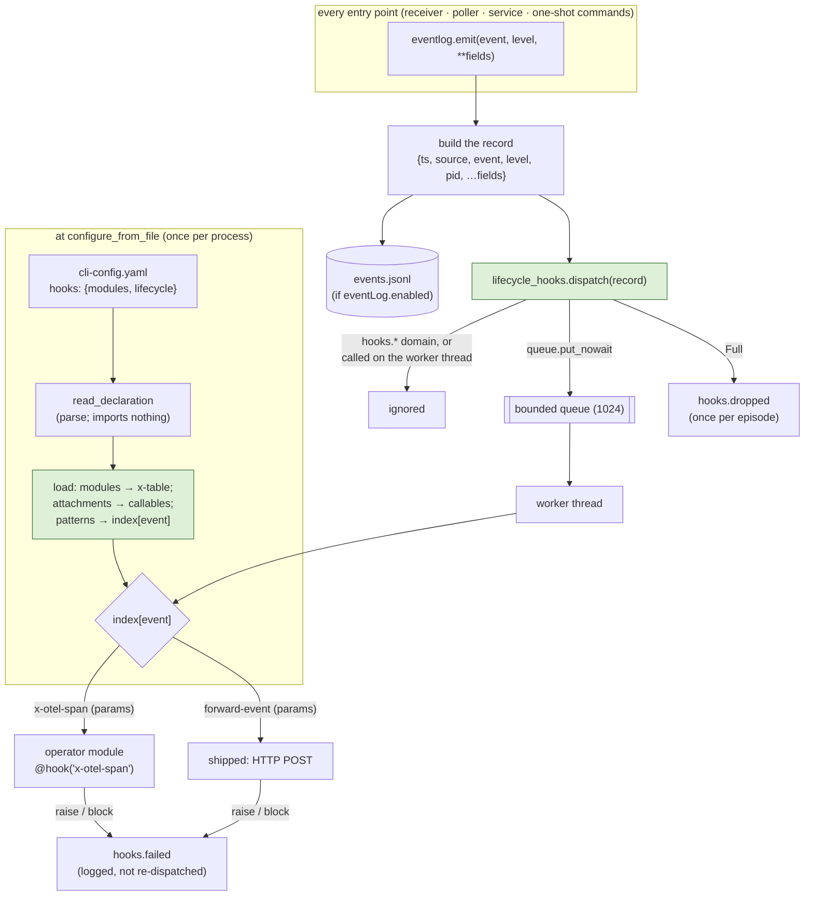

# Design: lifecycle hooks — every recorded event is an attach point

> Derived from [`requirements.md`](requirements.md). Decisions recorded as
> [decision-124](../../decisions/decision-124.md).

## Overview

One sentence: **the event log grows a second consumer.** Today `eventlog.emit(...)`
builds a record and appends it to `events.jsonl`. After this change it also hands the
same record to a **lifecycle-hook runtime** — a bounded queue and one worker thread —
which looks the event name up in an index built at load from the operator's
`hooks.lifecycle[]` declaration and calls each attached hook with a `LifecycleEvent`.
The declaration, the module loading, the `x-` namespace and the load-or-fail rules are
the graph hooks' (`graph/extensions.py`), reused rather than copied; what is new is the
attach point (an event name or pattern, not a node boundary), the context type (an
observed record, not a `HookContext`), the resolution root (the CLI config's directory,
not a checkout), and the fact that a lifecycle hook can never move the graph.



## Architecture

Three existing seams carry the change; one new module holds it.

| Part | Where | What changes |
|---|---|---|
| Event log | `cli/the_loop/eventlog.py` | `EventLog.emit` splits into `build` (the record) and `write` (the file). Module-level `emit` builds, writes if a log is configured, then hands the record to every registered **sink**. `configure_from_file` installs the lifecycle runtime from the same config file it read `eventLog` from. `reset()` clears sinks too. Three catalog entries: `hooks.loaded`, `hooks.failed`, `hooks.dropped`. |
| Extension loader | `cli/the_loop/graph/extensions.py` | The per-module loader and the path-containment check take a **root** and a **config key** instead of assuming a checkout and `routing.graph.hooks`; `read_modules` is exported for a second declaration to parse the same `modules[]` shape. Behaviour for the graph hooks is unchanged (same messages, same cache, same tests). |
| Hook registry | `cli/the_loop/graph/registry.py` | Unchanged. `@hook` inside `collecting()` is how an operator module registers, for both surfaces. |
| **Lifecycle runtime** | **`cli/the_loop/lifecycle_hooks.py`** (new) | The declaration (`read_declaration`), the catalog view (`attach_points`, `expand`), the shipped table (`forward-event`), the runtime (`LifecycleHooks`: load, index, queue, worker, drain), and the module-level install/dispatch/reset the event log calls. |
| CLI | `cli/the_loop/commands/hooks_cmd.py` (new) | `the-loop hooks [--format text\|json]` — parse and report, import nothing. |
| Schema + config | `.the-loop/cli-config.schema.json` (+ packaged copy), `.the-loop/cli-config.yaml`, `skills/the-loop/templates/cli-config.yaml` | The top-level `hooks` block, and a commented example in both configs. |

**Direction of dependency.** `eventlog` does not import `lifecycle_hooks` at module level
(`lifecycle_hooks` needs `eventlog.emit` to record its own failures, and a cycle at import
time is how a "no-op until configured" module stops being one). The runtime **registers a
sink** on the event log when it is installed; `configure_from_file` imports the runtime
lazily to install it. `emit` knows sinks, not hooks.

## Components & interfaces

### The declaration (`hooks` block)

```yaml
hooks:
  modules:                                  # same shape as routing.graph.hooks.modules
    - path: hooks/telemetry.py              # relative to THIS FILE's directory, contained in it
    - module: acme_loop_hooks.telemetry     # or an installed dotted name
  lifecycle:
    - hook: x-otel-span                     # registered by a module above
      on: [session.spawned, session.closed, graph.*]
      with: {service: the-loop}
    - hook: forward-event                   # shipped — no Python needed
      on: "work_item.*"
      with:
        url: https://telemetry.acme.example/the-loop
        tokenEnv: ACME_TELEMETRY_TOKEN      # a variable NAME; read when the hook runs
        headers: {X-Source: the-loop}
        timeoutSeconds: 5
```

`read_declaration(cli_config) -> Declaration` parses and validates **without importing**:

- `modules[]` through the shared `read_modules(value, config_key="hooks")` — exactly one
  of `path`/`module`, dotted names syntactically checked.
- `lifecycle[]` — `hook` required; `on` required, a string or a list of strings, each
  non-empty; `with` an optional mapping. The name must be `x-…` **or** a key of the
  shipped table; anything else is refused here, naming the shipped names. A shipped
  hook's `validate(params)` runs here too, so `the-loop hooks` reports a bad `url` before
  any process imports anything.
- Each attachment's patterns are expanded against `attach_points()` (the catalog minus
  `hooks.*`) with `fnmatch`; an attachment whose patterns match nothing fails, naming the
  pattern (AC1.3). The expansion is stored on the attachment (`events`) so the report and
  the runtime index agree by construction.

An absent or empty block returns `Declaration()` (`.empty` is true): nothing loads, no
sink is registered, `emit` behaves as today (AC2.5).

### The context and the contract

```python
@dataclass(frozen=True)
class LifecycleEvent:
    event: str            # "session.spawned"
    level: str            # info | warning | error | debug
    ts: str               # the record's ISO-8601 UTC timestamp
    source: str           # gh-webhook | poll | service | cli | …
    pid: int
    fields: Mapping[str, Any]   # the per-event fields, e.g. {"work_item": …, "session": …}
    params: Mapping[str, Any]   # the attachment's `with`
    instance: str               # instance.name from the CLI config, "" when unnamed

    @property
    def work_item(self) -> str: ...          # fields["work_item"] or "" — the common case
    def record(self) -> Dict[str, Any]: ...  # envelope + fields, what the log holds
```

A hook is `(LifecycleEvent) -> HookResult | None`, registered with the existing
`@hook("x-…")` from `the_loop.graph`. `None` and any `HookResult` whose status is not
`block` are success; a raise or a `block` is one `hooks.failed`. `messages` on a result are
logged at debug and never become events (AC3.5). There is no chain, no short-circuit and
no outcome: each attached hook runs independently of the others' results (AC3.4).

### The shipped table

```python
@dataclass(frozen=True)
class ShippedHook:
    fn: Callable[[LifecycleEvent], Optional[HookResult]]
    validate: Callable[[Mapping[str, Any]], None]   # raises HooksConfigError

SHIPPED: Dict[str, ShippedHook] = {"forward-event": ShippedHook(forward_event, validate_forward)}
```

Shipped lifecycle hooks are **not** in the graph's `@hook` registry: they take a
`LifecycleEvent`, not a `HookContext`, and listing them under `the-loop graph hooks` as
"shipped hooks" would invite attaching one to a node. Unprefixed names, resolved after
the operator's `x-` table — the prefix rule keeps the two sets disjoint, so nothing can
shadow anything.

`forward-event` (R5): `json.dumps(event.record())` POSTed with `urllib.request` to
`params["url"]`, `Content-Type: application/json`, `params["headers"]` added verbatim,
`Authorization: Bearer <os.environ[params["tokenEnv"]]>` when `tokenEnv` is set — read at
**call** time, and an unset variable returns `HookResult.blocked` before any connection
is opened (AC5.4). `timeoutSeconds` defaults to 5. Any `URLError`/`HTTPError`/timeout is
`blocked` for that event; no retry (AC5.5). `validate_forward` refuses a missing `url`, a
scheme outside `http`/`https`, a non-string `tokenEnv`, a non-mapping or non-string
`headers`, and a non-positive `timeoutSeconds` (AC5.3).

### The runtime

```python
class LifecycleHooks:
    def __init__(self, declaration, root: Path, instance: str = "", capacity: int = 1024): ...
    def load(self) -> None            # modules → table; attachments → Bound(name, fn, params, events); index[event] → [Bound]
    def dispatch(self, record) -> None  # non-blocking; the seam eventlog calls
    def drain(self, timeout: float) -> bool  # wait until the queue is empty or timeout
    def close(self) -> None
```

- **Load** (once, at install): `extensions.load_module(root, ref, config_key="hooks")`
  per module into one table (a duplicate name across modules is refused, as the graph
  loader does); each attachment resolves to the table's `x-` function or the shipped
  `fn`; the index maps every matched event name to its ordered `Bound` list. Then one
  `hooks.loaded` (modules, attachments, events counts).
- **Dispatch** (every emit): return at once if the event starts with `hooks.`, if the
  index has no entry for it, or if the calling thread *is* the worker (AC1.5, AC4.5 — the
  re-entrancy guard is a thread-identity check, so a hook that emits through the-loop's
  own functions is covered, not only a hook that calls `emit`). Otherwise `put_nowait` a
  copy of the record. `Full` → increment the drop count; if this is the first drop since
  the queue last accepted, emit `hooks.dropped` (its own domain, so it is logged and never
  queued). The worker thread is started lazily on the first queued record, `daemon=True`.
- **Worker**: `get` → for each `Bound` in `index[event]`: build the `LifecycleEvent`, call,
  classify the result; a raise or a `block` emits `hooks.failed` with `hook`, `event`,
  `error` (class and message — the hook author's text, never a record field). Every path
  ends in `task_done`, and a `Condition` tracks the outstanding count so `drain` can wait
  with a timeout (`queue.join` has none).
- **Drain at exit**: `install` registers `drain(EXIT_DRAIN_SECONDS=5.0)` with `atexit`
  once per process, so a one-shot command's last events reach a hook that is mid-POST
  (AC4.4). A daemon's `stop` goes through the same `atexit`.

Module level: `install(cli_config, config_path) -> Optional[LifecycleHooks]` (parses,
loads, registers the sink; returns `None` on an empty declaration), `active()`,
`drain(timeout)`, `reset()` for tests. `install` is idempotent per process for the same
declaration digest and replaces the runtime for a different one (a `restart` re-reads the
config in a new process anyway).

### The event log seam

```python
_sinks: List[Callable[[Dict[str, Any]], None]] = []

def add_sink(fn) / remove_sink(fn)

def emit(event, level="info", **fields):
    if _log is None: return
    record = _log.build(event, level, fields)
    _log.write(record)                    # honours enabled; write failures warned once
    for sink in tuple(_sinks): sink(record)   # a sink never raises out of emit
```

`configure_from_file(source)` becomes: load the config data and its path; configure the
log as today; `lifecycle_hooks.install(data, path)`. A `HooksConfigError` propagates: the
daemon fails to start and a one-shot command exits with the message (AC6.2, decision-124
D3). `reset()` deconfigures the log **and** clears the sinks and the runtime, so a test
that configured one leaves nothing behind.

### `the-loop hooks`

Registered like every command (`commands/hooks_cmd.py`, imported from `commands/__init__`).
Reads the CLI config through `cli_config.load_cli_config(default_cli_config_path())`,
calls `read_declaration`, prints:

```text
attach points: 147 event types (`the-loop events --types`; hooks.* excluded)
shipped lifecycle hooks (1): forward-event

the CLI config declares 1 module(s) and 2 attachment(s) — nothing here has been imported:
  module  hooks/telemetry.py  (resolved against /home/op/.the-loop)
  attach  x-otel-span → 27 event(s) [session.spawned, session.closed, graph.*]  with: {'service': 'the-loop'}
  attach  forward-event → 2 event(s) [work_item.*]  with: {'url': …, 'tokenEnv': 'ACME_TELEMETRY_TOKEN', …}

a declaration that cannot load fails the entry point that loads it (`the-loop start`, the
receiver, the poller, and any command that records events) rather than being skipped.
```

`--format json` prints `{attachPoints, shipped, modules, attach: [{hook, on, events, with}]}`.
A `HooksConfigError` prints to stderr and exits 2 — the same exit the critic command uses
for a misconfiguration. Runs locally (it reads a file; there is no state the service owns),
like `graph hooks`.

## UI/UX design

N/A — a CLI and a configuration block; no user-facing surface.

## Data models

- **`Declaration`** — `modules: Tuple[ModuleRef, …]` (the graph loader's type),
  `attachments: Tuple[Attachment, …]`, `.empty`, `.digest()` (for idempotent install).
- **`Attachment`** — `hook: str`, `patterns: Tuple[str, …]`, `params: Mapping`,
  `events: Tuple[str, …]` (the expansion, computed at parse).
- **`Bound`** — `name`, `fn`, `params`: one resolved attachment, listed under each event
  it matches.
- **The record** — unchanged: `{ts, source, event, level, pid, …fields}`; a hook gets a
  shallow copy, so a hook that mutates its argument corrupts nothing.
- **New catalog entries** — `hooks.loaded` (info: `modules`, `attachments`, `events`),
  `hooks.failed` (warning: `hook`, `event`, `error`), `hooks.dropped` (warning: `event`,
  `capacity`).

## Error handling

| Fault | Where caught | Outcome |
|---|---|---|
| Malformed `hooks` block, bad `on`, unknown hook name, empty expansion, bad shipped params | `read_declaration` | `HooksConfigError` naming the entry; the entry point refuses to start; `the-loop hooks` exits 2 |
| Module missing / escaping / raising / registering nothing or a non-`x-` name; duplicate name across modules | `LifecycleHooks.load` via the shared loader | `HooksConfigError` (wrapping the loader's error) naming the module |
| Hook raises, or returns `block` | worker | `hooks.failed`; next hook, next event |
| Hook hangs | — | only the worker stalls; the emitter never waits; the queue fills, drops are recorded; `drain` at exit gives up after 5 s |
| Queue full | `dispatch` | the record is dropped for hooks only; one `hooks.dropped` per episode |
| `forward-event`: unset `tokenEnv`, non-2xx, timeout, connection error | the hook | `blocked` → `hooks.failed`; nothing retried |
| Sink raises (a bug in the runtime itself) | `emit` | swallowed and logged once, so o11y can never break ingress — the invariant the event log already keeps |

## Security design

Enforces the boundaries `requirements.md` § Security considerations raised; each abuse
case names its control and its negative test.

- **Only the CLI config declares.** `read_declaration` reads `cli_config["hooks"]` and
  nothing else; no code path reads a harness config or scans a checkout for hook modules.
  *A1* — `test_a_checkout_module_nobody_declared_never_runs`.
- **Resolution root is the config file's directory, and containment is enforced.**
  `extensions.load_module(root=config_path.parent, …)` reuses the graph loader's
  containment (absolute refused, `..` refused, symlink-out refused, non-`.py` refused,
  missing refused) with the root swapped. *A2* —
  `test_a_path_escaping_the_config_directory_is_refused` (three shapes).
- **A hook cannot stop the-loop.** The worker catches `BaseException` around each call
  (a `SystemExit` from a hook is a bug report, not an exit), records `hooks.failed`, and
  continues. The emitter's only work is a `put_nowait`. *A3* —
  `test_a_raising_hook_is_recorded_and_the_next_one_runs`,
  `test_a_blocking_result_is_a_failure_not_a_veto`, `test_a_hung_hook_stalls_only_the_worker`.
- **A hook cannot feed the system.** Two guards, both in `dispatch`: the `hooks.` domain
  is never queued, and a record arriving on the worker thread is never queued. *A4* —
  `test_hooks_events_are_never_attach_points`, `test_a_hook_that_emits_does_not_recurse`.
- **A hook cannot move the graph.** It has no `HookContext`, is never in a chain, and the
  runtime reads only `status` off a result. *A5* —
  `test_an_outcome_a_lifecycle_hook_declares_is_ignored`.
- **Secrets by name.** `forward-event` reads `os.environ[tokenEnv]` when it runs; the
  config carries the name, the record carries no token, the failure event carries the
  variable *name* in its message and never a value. *A6* —
  `test_forward_event_reads_the_token_at_call_time_and_sends_nothing_when_unset`,
  `test_the_failure_event_names_the_variable_not_the_value`.
- **Only HTTP(S) leaves the process.** `validate_forward` checks `urlsplit(url).scheme in
  {"http", "https"}` at parse; `urllib` therefore never sees a `file:` URL. *A7* —
  `test_forward_event_refuses_a_non_http_url_at_load`.
- **Nothing degrades to "no hooks".** Every parse/load fault raises; `configure_from_file`
  lets it propagate. *A8* — `test_a_broken_declaration_fails_configure_from_file`,
  `test_a_pattern_matching_nothing_fails_the_load`.
- **Bounded.** `queue.Queue(maxsize=1024)`; `put_nowait`; drops counted and announced
  once per episode. *A9* — `test_overflow_drops_for_hooks_only_and_says_so_once`.

Trust boundary the design does **not** cross: the hooks run with the operator's
environment, as the graph hooks and the critics already do (decision-043,
decision-096). The design adds no way for a repository, a comment author or a Slack member
to declare, attach or parametrise a hook.

## Testing strategy

Unit tests for the parser, the catalog view, the loader path, the runtime (with
`drain()` as the deterministic wait — decision-091: an asynchronous test waits on the
outcome, never on a sleep), `forward-event` against a local `http.server`, the event-log
seam, and the command. Integration tests with a real config file, a real module file and
`configure_from_file` → `emit` through `the_loop.eventlog`, Gherkin-docstringed. The
parity suites (schema copies, docs P1–P5, event catalog) and `scripts/validate_config.py`
cover the schema, the docs and the two configs. See [`testing-plan.md`](testing-plan.md).

## Trade-offs & decisions

- **Attach points = the event catalog, not a curated list** (decision-124 D1). A curated
  list of "lifecycle points" would be a second catalog to keep in sync with the first,
  and would be exactly as complete as someone remembered to make it. The event catalog is
  already the enforced single source of truth for "things that happen", already
  documented per type, already printed by a command. The cost is that the fields a hook
  sees are the record's, documented per type in prose rather than typed per event; a hook
  that needs a field the record lacks is a request to add the field, which is a one-line
  change to the emitter and a catalog description.
- **Asynchronous, on one thread, bounded** (D2). Synchronous hooks would put an HTTP
  round-trip inside every `api.request` and every poll cycle. One thread keeps emission
  order; a bounded queue keeps memory bounded when a hook is slow; dropping *for hooks*
  and saying so is the honest failure. **1024** is the one number a reviewer may want
  different — it is a class constant. **5 s** exit drain is the other.
- **The entry point fails on a bad declaration** (D3). The alternative — log an error and
  run without hooks — is the silent-disarm the graph hooks were built against, and a
  telemetry hook that silently stops is worse than a daemon that refuses to start with a
  message naming the line. One-shot commands pay the same price, deliberately: they run
  the same config.
- **Modules resolve against the config file, not a checkout** (D4). A lifecycle hook is
  the instance's (it fires for `server.started`, which has no checkout); the graph hook
  is the repository's (it reads `src/`). Two roots for two surfaces is a difference to
  document, not to paper over; `module:` covers a package installed once for both.
- **Shipped lifecycle hooks are attachable by the operator; shipped graph hooks are
  not** (D5). The graph rule exists because attaching `classify-feedback` elsewhere would
  edit the process. A lifecycle observer edits nothing; letting an operator attach
  `forward-event` is the whole point of shipping it.
- **A separate context type** (D6). `HookContext` is *for a node*: `node`, `boundary`,
  `artifacts`, `graph`, `decisions`. Filling it with placeholders to keep "one type" would
  make every field a lie for half its users. One decorator, one result type, one loader,
  one namespace rule — and two contexts, one per attach-point kind.
- **Refactoring internal features is out of scope, and the seam is proved by
  `forward-event`** (D7). The candidates and what each needs, for the follow-up:
  `announce` on `session.spawned` (the record must carry the tmux session name; the
  `_NoopAnnouncer` test double becomes `announce.enabled: false`); `reactions` on
  `dispatch.queued|succeeded|failed` (the record must carry the reactable target);
  comment mirroring on `comment.*` (already bus events — the channel is the natural
  first subscriber). Each is its own work item because each moves a test double.

## Open questions

None.

## Review comments

None yet.
