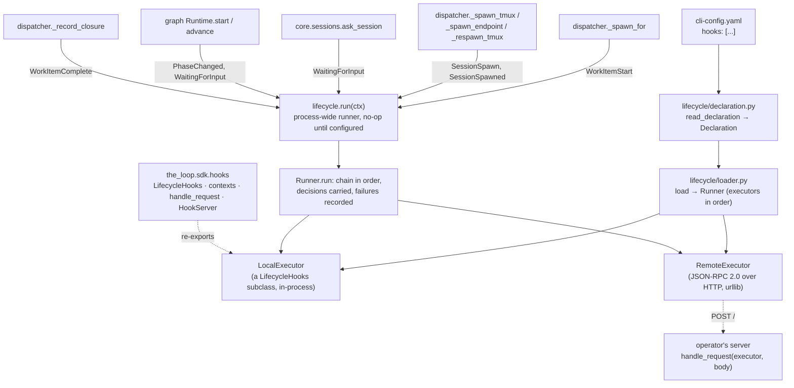

<!-- Authored per the the-loop:writing skill. -->

# Design: programmatic hooks around the lifecycle of a work item's delivery

> Phase 2 of 4 (requirements → design → testing plan → tasks). Derives from
> `requirements.md`. MUST be reviewed and approved before moving to test planning.

## Overview

**One new package, `the_loop.lifecycle`, holds the catalog of six points with their typed
contexts, the `LifecycleHooks` base class, the declaration parser for the top-level
`hooks`, the loader, the chain runner and the JSON-RPC remote executor; six call sites in
the dispatcher, the graph runtime and `ask_session` build a context, hand it to
`lifecycle.run`, and apply the decisions that come back.** No event, no queue, no thread:
a hook runs where the thing it decides is about to happen, and the thing waits for it.


```mermaid
flowchart TD
  CFG["cli-config.yaml<br/>hooks: [...]"] --> DECL["lifecycle/declaration.py<br/>read_declaration → Declaration"]
  DECL --> LOAD["lifecycle/loader.py<br/>load → Runner (executors in order)"]
  LOAD --> LX["LocalExecutor<br/>(a LifecycleHooks subclass, in-process)"]
  LOAD --> RX["RemoteExecutor<br/>(JSON-RPC 2.0 over HTTP, urllib)"]
  RUN["lifecycle.run(ctx)<br/>process-wide runner, no-op until configured"] --> CH["Runner.run: chain in order,<br/>decisions carried, failures recorded"]
  CH --> LX & RX
  D1["dispatcher._spawn_for"] -->|WorkItemStart| RUN
  D2["dispatcher._spawn_tmux /<br/>_spawn_endpoint / _respawn_tmux"] -->|SessionSpawn, SessionSpawned| RUN
  D3["core.sessions.ask_session"] -->|WaitingForInput| RUN
  D4["graph Runtime.start / advance"] -->|PhaseChanged, WaitingForInput| RUN
  D5["dispatcher._record_closure"] -->|WorkItemComplete| RUN
  SDK["the_loop.sdk.hooks<br/>LifecycleHooks · contexts · handle_request · HookServer"] -.re-exports.-> LX
  RX -. "POST /" .-> SRV["operator's server<br/>handle_request(executor, body)"]
```

### Why not events (the closed PR #357)

The owner's verdict on the first attempt is the one constraint this design is built
around. An event is a *record*: it exists because something happened, so a hook keyed on it
can only ever be told, never asked. The event catalog is a *log schema*: 150 names whose
job is to make `the-loop events` useful, whose fields are whatever the emitting line found
handy, and which grows with every debugging need. Making that the hook surface bound the
hook API to the log's churn, made outcome changes impossible by construction, and buried
the four moments the ticket names among `poll.cycle_started` and `channel.heartbeat`.

Here the surface is the **lifecycle**: six moments, chosen by what a work item's delivery
*is* (a start, a session, a wait, a phase, an end), each with the facts that moment has and
the decisions that moment admits. The event log stays what it is — where these hooks leave
their trail (`hooks.*`), not where they attach.

## §1 The catalog (`lifecycle/contract.py`)

Six points. Each is a dataclass; **facts** are plain fields, **decisions** are fields
marked `field(metadata={"decision": True})`. The base class has one method per point,
returning `None`.

| Point | Fires | Facts | Decisions and what the-loop does with them |
|---|---|---|---|
| `work_item_start` | once per arming, when a start is accepted and before the workspace is prepared (`Dispatcher._spawn_for`, after the adapter check) | `work_item`, `loop`, `command`, `actor`, `harness`, `instance` | `proceed=True`, `reason=""` — `False` disarms the item, posts one marked comment (`⚠️ … <hook>: <reason>`), settles the event, records `hooks.refused` |
| `session_spawn` | before every harness launch — first spawn, a pull request's own session, a respawn (before the resume attempt too) | `work_item`, `endpoint`, `harness`, `cwd`, `model`, `effort`, `harness_args`, `respawn`, `loop` | `prompt` — the text the harness boots on, replaced; `proceed`, `reason` — `False` prevents the launch: first spawn and respawn settle the event as refused with the comment; a PR endpoint falls back to delivery into the work item's session |
| `session_spawned` | after the session is registered, before the announcement | `work_item`, `endpoint`, `harness`, `harness_session_id`, `tmux_target`, `cwd`, `model`, `effort`, `harness_args`, `respawn` | `announce=True` — `False` skips `SessionAnnouncer.announce` |
| `waiting_for_input` | before an agent's question is published (`ask_session`); when a human node is entered (`Runtime.start` / `advance`, after its entry chain posted the request) | `work_item`, `kind` (`question` \| `gate`), `node`, `actor`, `loop`; for `question`: `question`, `summary` | `question`, `summary` — replace the text published for an agent's question; empty and ignored for a gate |
| `phase_changed` | in `Runtime.start` (into the start node), and in `advance` when the phase label changes or a terminal node is reached — before the `phase.*` publishes | `work_item`, `loop`, `from_node`, `to_node`, `from_phase`, `to_phase`, `outcome`, `actor`, `terminal` | `notify=True` — `False` skips the `_lifecycle` publishes for that transition |
| `work_item_complete` | in `Dispatcher._record_closure`, for the issue or pull request that *is* the work item, before the closure is announced | `work_item`, `state` (`merged` \| `closed`), `kind` (`issue` \| `pull-request`), `reason`, `source`, `actor`, `loop` | `announce=True` — `False` skips the `work-item.closed` publish |

Field types are `str`, `bool`, `list[str]` or `WorkItem` — the work item as a modelled
entity (below), never a bare string. `Context.to_params()` serialises every field; `Context.apply(mapping)` copies **decision** fields only, refusing a wrong type with
`DecisionTypeError`; `Context.decisions()` names them. `POINTS` maps each name to its
class; `LifecycleHooks.handles(point)` reports whether a subclass overrides that method.

Two parity tests hold the catalog together: every `POINTS` entry has a method of the same
name on `LifecycleHooks` whose annotation is that context type, and every point is
documented in `docs/cli/lifecycle-hooks.md` under a heading of its own name.

### The interface, field for field

The interface a hook author programs against, in the convention of
[sherma's context objects](https://madarauchiha-314.github.io/sherma/hooks.html#context-objects)
(asked for on PR #432). `docs/cli/lifecycle-hooks.md` carries the same blocks; the parity
test `test_every_context_object_is_documented_field_for_field` holds both pages to the
dataclasses — every field, no field the code lacks, every decision marked.

**The base class** — one method per point, `None` to pass through, the context to decide:

```python
class LifecycleHooks:
    def work_item_start(self, ctx: WorkItemStart) -> Optional[WorkItemStart]: ...
    def session_spawn(self, ctx: SessionSpawn) -> Optional[SessionSpawn]: ...
    def session_spawned(self, ctx: SessionSpawned) -> Optional[SessionSpawned]: ...
    def waiting_for_input(self, ctx: WaitingForInput) -> Optional[WaitingForInput]: ...
    def phase_changed(self, ctx: PhaseChanged) -> Optional[PhaseChanged]: ...
    def work_item_complete(self, ctx: WorkItemComplete) -> Optional[WorkItemComplete]: ...

    def handles(self, point: str) -> bool: ...   # does this class override `point`?
```

**The work item** — the core entity, as every context carries it (PR #432 review: not a
bare ref string). Built by the-loop from the registry's `WorkItemRef` (`WorkItem.from_ref`),
so the identity is the one the registry, the state and the events key on; `kind` is set
where the point knows it (the payload at a start, the stamp at a closure, a pull request's
endpoint at a launch) and `""` otherwise. A stdlib frozen dataclass like the rest of the
contract — pydantic stays in `api/routes.py`'s request bodies, and a hook author's server
needs no dependency:

```python
@dataclass(frozen=True)
class WorkItem:                          # on every context; built by the-loop, never by a hook
    ref: str                             # github:[HOST/]OWNER/REPO#N — the-loop's name for it, keys everything; a bare issue-N when a graph verb was given one (the rest then empty)
    provider: str                        # github (jira reserved)
    host: str                            # github.com, or a GitHub Enterprise host
    owner: str
    repo: str
    repository: str                      # owner/repo, host-qualified when the host is not the default
    number: int
    kind: str                            # issue | pull-request; "" when the point does not know
    url: str                             # the browser link; "" when none derives
    id: str                              # issue-N — the spec folder under docs/specs/
```

**The six contexts.** A field marked `# decision` is read back and applied; every other
field is a fact the-loop ignores if changed. Field types are `str`, `bool`, `list[str]` or
`WorkItem`, so a context is its own JSON-RPC `params`.

```python
@dataclass
class WorkItemStart(Context):            # point: work_item_start
    work_item: WorkItem                  # the item this start is for (WorkItem, above)
    loop: str                            # the loop it will walk (pdlc-work-item-loop, pdlc-adhoc-loop, yours); "" if unresolved
    command: str                         # the arming word (start | contribute | do | review | an operator's); "" for a label-alone spawn
    actor: str                           # the login that armed it (the event's actor when no command was recorded)
    harness: str                         # claude | cursor
    instance: str                        # routing.instance.name; "" when unnamed
    proceed: bool = True                 # decision — False refuses the start: disarmed, one marked comment, event settled
    reason: str = ""                     # decision — posted on the ticket with the refusal
```

```python
@dataclass
class SessionSpawn(Context):             # point: session_spawn
    work_item: WorkItem
    endpoint: WorkItem                   # the conversation launched: the work item itself, or one of its pull requests (kind = pull-request)
    harness: str                         # claude | cursor
    cwd: str                             # the checkout the session runs in
    model: str                           # the frozen model; "" when the work item chose none
    effort: str                          # the frozen effort; "" when none
    harness_args: list[str]              # the argv the launch adds
    respawn: bool                        # True when this replaces a session found dead
    loop: str                            # the loop recorded in the work item's state; "" if unknown
    prompt: str = ""                     # decision — the text the harness boots on; what you leave is what it gets
    proceed: bool = True                 # decision — False prevents the launch (a PR's session falls back to the work item's)
    reason: str = ""                     # decision — posted on the ticket with the refusal
```

```python
@dataclass
class SessionSpawned(Context):           # point: session_spawned
    work_item: WorkItem
    endpoint: WorkItem                   # the work item itself, or one of its pull requests
    harness: str
    harness_session_id: str              # the harness conversation id (claude --resume <id>)
    tmux_target: str                     # loop-<slug>
    cwd: str
    model: str
    effort: str
    harness_args: list[str]
    respawn: bool
    announce: bool = True                # decision — False skips the "session exists, attach here" comment
```

```python
@dataclass
class WaitingForInput(Context):          # point: waiting_for_input
    work_item: WorkItem
    kind: str                            # question (an agent's `the-loop ask`) | gate (a human node entered)
    node: str                            # the graph node, for a gate; "" for a question
    actor: str                           # who is asking, for a question; "" for a gate
    loop: str
    question: str = ""                   # decision — the text posted for a question; empty and ignored for a gate
    summary: str = ""                    # decision — the channels' one-line summary; same rule
```

```python
@dataclass
class PhaseChanged(Context):             # point: phase_changed
    work_item: WorkItem
    loop: str
    from_node: str                       # "" when the graph is entered
    to_node: str
    from_phase: str                      # "" when the graph is entered
    to_phase: str                        # the new loop:<phase> label
    outcome: str                         # the outcome that routed the edge (pass, approved, …); "" at the start
    actor: str                           # the entered node's actor: agent | human
    terminal: bool                       # True when the terminal node was claimed — the loop is complete
    notify: bool = True                  # decision — False skips the phase.* publish to the channels
```

```python
@dataclass
class WorkItemComplete(Context):         # point: work_item_complete
    work_item: WorkItem
    state: str                           # merged | closed
    kind: str                            # issue | pull-request
    reason: str                          # the dispatcher's reason (issue-closed, pr-merged, …)
    source: str                          # webhook | poll
    actor: str                           # who closed it; "" when the event names nobody
    loop: str
    announce: bool = True                # decision — False skips the work-item.closed publish
```

**On the wire** (`url:` executors), `method` is the point, `params` the context's fields, and
`result` is `null` or an object of decision fields — the same contract as the return value:

```json
→ {"jsonrpc": "2.0", "id": 1, "method": "work_item_start",
   "params": {"work_item": {"ref": "github:acme/app#42", "provider": "github", "host": "github.com",
                            "owner": "acme", "repo": "app", "repository": "acme/app", "number": 42,
                            "kind": "issue", "url": "https://github.com/acme/app/issues/42", "id": "issue-42"},
              "loop": "pdlc-work-item-loop", "command": "start", "actor": "mallory",
              "harness": "claude", "instance": "", "proceed": true, "reason": ""}}
← {"jsonrpc": "2.0", "id": 1, "result": {"proceed": false, "reason": "mallory is not on the delivery roster"}}
```

Two judgement calls in the shape, raised for review on the PR: `waiting_for_input` carries
`question` / `summary` as decisions that are empty and inert for `kind = gate` (the
alternative is two points, `session_asked` and `gate_entered`); and `session_spawned` /
`work_item_complete` expose only `announce`, the one thing the-loop does after each that a
hook could sensibly stop.

## §2 The declaration (`lifecycle/declaration.py`)

```yaml
hooks:
  - name: house-policy                   # ^[a-z][a-z0-9-]*$, unique
    path: hooks/policy.py                # relative to THIS FILE's directory (~ and absolute ok)
    executor: Policy                     # optional: the class (or instance) in the module
    with: {board: platform}              # optional: kwargs to the class
    on: [work_item_start, session_spawn] # optional: default = the methods the class overrides
    required: true                       # its failure at a proceed point refuses the operation
  - name: telemetry
    module: acme_loop_hooks.telemetry    # an installed dotted module
  - name: compliance
    url: https://hooks.acme.example/the-loop
    tokenEnv: ACME_HOOKS_TOKEN           # the NAME of the variable; Bearer <value> at call time
    headers: {X-Team: platform}          # non-secret
    timeoutSeconds: 10
    on: [work_item_start, work_item_complete]   # default for a remote: every point
    enabled: true
```

`read_declaration(cli_config) -> Declaration` parses and validates without importing
anything (R5.1): the grammar, uniqueness, exactly-one-of `module|path|url`, the kind-
specific keys (`executor`/`with` local only; `tokenEnv`/`headers`/`timeoutSeconds` remote
only), `on ⊆ POINTS`, `url` scheme (`https`, or `http` to `localhost`/`127.0.0.1`/`::1`;
`http` elsewhere with a `tokenEnv` is refused). `Entry.target` renders the kind and its
argument for the report. A relative `path` resolves against `config_base_dir(config_path)`
— the same rule `graphs[].path` follows (decision-136 D1), never a checkout.

## §3 The executors (`lifecycle/executors.py`, `lifecycle/remote.py`)

```python
class Executor(Protocol):
    name: str
    def handles(self, point: str) -> bool: ...
    def call(self, point: str, ctx: Context) -> Context | Mapping | None: ...
```

**`LocalExecutor(name, hooks: LifecycleHooks, on)`** calls `getattr(hooks, point)(ctx)`.
The loader builds it: `module` is imported with `importlib.import_module`; `path` is
executed under a synthetic module name (as `graph/extensions._execute_file` does, cached by
resolved path); `executor` picks an attribute, else the module's **one** `LifecycleHooks`
subclass defined in it (zero or several → `HooksConfigError` naming them); a class is
instantiated with `**with`, an instance is used as is (`with` refused). Construction errors
name the entry.

**`RemoteExecutor(name, url, token_env, headers, timeout, on)`** builds
`{"jsonrpc": "2.0", "id": n, "method": point, "params": ctx.to_params()}`, POSTs it with
`urllib.request` (`Content-Type: application/json`, the operator's headers, `Authorization:
Bearer <os.environ[token_env]>` — an unset variable raises before any request), reads a
JSON body: `error` → `HookFailure(message)`; `result: null` → `None`; `result: {…}` →
the mapping (the runner applies its decision fields). Non-2xx, timeout, a body that is not
JSON-RPC 2.0 with the same `id` → `HookFailure`.

**The server half** (`remote.handle_request(executor, body) -> bytes`) is the mirror:
parse (`-32700`), validate (`-32600`), unknown point (`-32601`), build the context from
`params` ignoring unknown keys, call the method, return `{"result": null}` or
`{"result": {decisions}}`; a raising method → `-32000` with the message. `HookServer` wraps
it in `http.server.ThreadingHTTPServer` with an optional bearer check (`token_env`) and a
`GET /health`. Both are stdlib.

## §4 The runner and the process-wide seam (`lifecycle/runner.py`, `lifecycle/__init__.py`)

```python
class Runner:
    def run(self, ctx: Context) -> Context
```

For each executor in order that `handles(ctx.POINT)`: call it; `None` → unchanged; a
`Context` → its decisions copied over; a `Mapping` → `ctx.apply`; a changed decision →
`hooks.decided` (`point`, `hook`, `changed=[fields]`, `work_item`). Any exception,
`HookFailure` or `DecisionTypeError` → `logger.warning` + `hooks.failed`; if the entry is
`required` and the context has `proceed`, `proceed=False` and `reason="required hook <name>
failed: <error>"`. The chain always finishes; `run` never raises (R6.2) and returns the
same object it was given.

Module level, mirroring `eventlog`: `configure(runner)`, `configure_from_config(config,
config_path) -> Runner` (raises `HooksConfigError`), `run(ctx)`, `reset()`. `run` on an
unconfigured process **configures lazily** from the resolved CLI config path
(`cli_config.default_cli_config_path()`), so a one-shot command inside a session
(`THE_LOOP_CLI_CONFIG` exported, issue-393 B6) sees the daemon's hooks; a lazy load that
fails installs an empty runner and records `hooks.load_failed` (R3.6). The daemons call
`configure_from_file(strict=True)` at start — poller `run`, receiver `run`, service `serve`
(and the hosted-ingress start reuses the process's runner) — and exit `1` on a failure, the
way the poller exits on an unknown provider.

## §5 The call sites

| Site | Change |
|---|---|
| `Dispatcher._spawn_for` | after the adapter check: `if self.control_store.mark_started(work_item)` is *new* → build `WorkItemStart` from the control record (`command`, `actor`, `loop`; the event's actor when none) and run it; `proceed=False` → `control_store.clear(work_item)` + `unmark`, `_explain_refusal(routed, "hook-refused", detail)`, `hooks.refused`, `_settle(routed, "hook-refused")`, `return True`. The marker is a `lifecycle` section of the portable record (`ControlStore.mark_started` / `clear_started`), cleared with the control record at closure, so a reopened item starts again. |
| `Dispatcher._spawn_tmux`, `_spawn_endpoint`, `_respawn_tmux` | `_before_launch(...) -> SessionSpawn` runs the point before `tmux.spawn` (respawn: before `_try_resume`); `prompt = ctx.prompt`; `proceed=False` → `_refuse_launch` (first/respawn: `session.spawn_failed` with `will_retry=False`, the comment, `hooks.refused`, settle, `True`; endpoint: `_deliver_into` the record). After registration: `_after_launch(...) -> SessionSpawned`; `announce` gates the announcer call (respawn announces nothing today and keeps not announcing). |
| `core.sessions.ask_session` | before the bus publish: `WaitingForInput(kind="question", question=…, summary=…)`; the published `text`/`summary` are the decisions. |
| `Runtime.start` | after the entry chain: `PhaseChanged(from_node="", from_phase="", to_node=start, …)`; `notify` gates the `phase.started` publish; if the start node is human, `WaitingForInput(kind="gate", node=…)`. |
| `Runtime.advance` | at the terminal branch and at `entered_phase != left_phase`: one `PhaseChanged`; `notify` gates the `phase.completed`/`phase.started` pair (the within-phase `phase.progress` is not a phase change and is untouched); a human node entered → `WaitingForInput(kind="gate")`. |
| `Dispatcher._record_closure` | the work-item branch, before `_announce_closed`: `WorkItemComplete`; `announce` gates it. Also `control_store.clear_started`. |

Every site wraps its hook call in the same `lifecycle.run`, which never raises; a site that
cannot build a fact (a test's `_Link` double without `_outer_loop_name`) passes `""`.

## §6 The command and the SDK

`the-loop hooks [--format text|json]` prints the declaration read strictly (as `graph
loops` does) with no import and no request; `the-loop hooks points` prints the catalog
from `POINTS` and the dataclass fields. Exit `1` naming the error when the config cannot be
read or the declaration fails to parse.

`the_loop.sdk.hooks` re-exports `LifecycleHooks`, the six contexts, `Context`, `POINTS`,
`handle_request`, `HookServer`, `HookFailure`. `the_loop.sdk.__all__` gains nothing (the
hooks surface is its own module so `test_p1_every_public_symbol_is_documented` keeps its
meaning); `docs/sdk/reference.md` gains a section pointing at the hooks page.

## Data models

- **`WorkItem`** (`lifecycle/contract.py`) — the work item on every context: `ref`,
  `provider`, `host`, `owner`, `repo`, `repository`, `number`, `kind`, `url`, `id`. Frozen;
  built from a `WorkItemRef` by `WorkItem.from_ref(ref, kind="", id="")`; one JSON object on
  the wire (`to_params` / `from_params`, each field type-checked; a bare ref string is also
  accepted inbound).
- **`Declaration`** — `entries: tuple[Entry]`; `Entry(name, kind, module, path, url,
  executor, params, token_env, headers, timeout, on, required, enabled)`; `Entry.target`.
- **The portable record** gains a `lifecycle` section: `{"startedAt": "<utc>"}`. Written
  by `mark_started`, removed by `clear_started` (closure, refusal). Read nowhere else.
- **Events** (added to `EVENT_TYPES`): `hooks.loaded` (count, names), `hooks.load_failed`
  (error, strict), `hooks.decided` (point, hook, changed, work_item), `hooks.failed`
  (point, hook, error, required, work_item), `hooks.refused` (point, hook, reason,
  work_item).
- **Schema**: top-level `hooks` array in `cli-config.schema.json` (both copies), every key
  above, `additionalProperties: false`.

## Error handling

| Failure | Where | Behaviour |
|---|---|---|
| Malformed declaration | parse | `HooksConfigError` naming the entry and key; daemon refuses to start; `the-loop hooks` exits 1 |
| Module missing / raises / no or several subclasses / bad `executor` / construction raises | load | `HooksConfigError` naming the entry; same as above |
| Lazy load fails in a one-shot process | first `run` | `hooks.load_failed` + warning; empty runner installed; the operation proceeds |
| Executor raises, wrong-typed decision, remote error/non-2xx/timeout/`tokenEnv` unset | run | `hooks.failed` + warning; context unchanged by it; chain continues; `required` at a `proceed` point → `proceed=False` |
| `proceed=False` applied | call site | `hooks.refused`; one marked comment via `_explain_refusal` (`CONTROL_REFUSAL_REMEDIES["hook-refused"]`); event settled; no retry |
| Anything unexpected inside `lifecycle.run` | runner | caught, logged, the context returned as it stands (R6.2) |

## Security design

- **AuthN/AuthZ.** Who may declare a hook: whoever edits the operator's CLI config — the
  boundary `critics[]`, `routing.graph.hooks` and `graphs[]` already have (decision-123).
  A remote server authenticates the-loop by the bearer token from `tokenEnv`; the-loop
  authenticates the server by TLS (`https`), or not at all on loopback where no token
  travels the network.
- **Input validation & injection surfaces.** (1) The declaration: grammar-checked names,
  exactly-one-of kinds, `on ⊆ POINTS`, URL scheme rule, kind-specific keys refused
  cross-kind. (2) A remote result: only decision fields, only their declared types;
  facts and unknown keys dropped and logged. (3) A `path`: resolved against the config
  file's directory; a checkout's file is never on the search path (abuse case 1). (4) The
  prompt a hook returns is text the harness boots on — the same trust level as the
  operator's own `promptTemplate`; it is the operator's code.
- **Secrets handling.** `tokenEnv` and `headers` are names and non-secret values in the
  config; the token value is read from the environment at call time and appears in no
  context, event or log line; the schema description says so; `hooks.failed` carries the
  error message from `urllib`, which does not echo headers.
- **Least privilege.** A hook sees the facts of its point and may set its decisions;
  nothing else is exposed (no config, no credentials, no filesystem handle). It cannot
  approve a gate, select a graph, choose an edge or name a path — those surfaces are not
  decisions.
- **Fail-closed behaviour.** A daemon with a declaration that cannot load does not start.
  A `required` hook that cannot answer refuses the start or the launch. An unset
  `tokenEnv` sends nothing. A one-shot process that cannot load runs hookless and says so
  — the daemon holding the same file has already refused (stated, accepted).
- **Abuse-case coverage** (requirements § Security considerations → mechanism → test):

| # | Abuse case | Mechanism | Test |
|---|---|---|---|
| 1 | A checkout-relative `path` | `config_base_dir` resolution only | `test_a_path_resolves_against_the_config_file_not_the_cwd` |
| 2 | A remote sets a fact, an unknown key, a wrong type | `Context.apply` decision-only + type check → `DecisionTypeError` | `test_a_result_may_change_decisions_only`, `test_a_wrong_typed_decision_is_that_hooks_failure` |
| 3 | Unreachable / slow / erroring remote | `HookFailure` → unchanged; `required` → `proceed=False` | `test_an_unreachable_remote_is_a_recorded_failure_not_a_stop`, `test_a_required_hook_that_fails_refuses_a_proceed_point`, `test_a_timeout_is_bounded` |
| 4 | Cleartext `http://` + `tokenEnv` | parse refuses | `test_a_bearer_token_over_cleartext_http_is_refused_at_load` |
| 5 | `tokenEnv` unset at call time | `RemoteExecutor` raises before the request | `test_an_unset_token_variable_sends_nothing` |
| 6 | A module raises on import/construction | `HooksConfigError`; daemon exits 1; lazy → empty runner + event | `test_a_module_that_raises_fails_the_load`, `test_a_daemon_refuses_to_start_on_a_bad_declaration`, `test_a_lazy_load_failure_installs_no_hooks_and_records_it` |
| 7 | An executor raises inside a point | runner catches | `test_a_raising_hook_never_reaches_the_caller` |
| 8 | `on` names an event type | parse refuses | `test_on_may_name_only_catalog_points` |

## Testing strategy

Unit tests over the package (`tests/test_lifecycle_contract.py`, `test_lifecycle_declaration.py`,
`test_lifecycle_runner.py`, `test_lifecycle_remote_integration.py` — the remote ones against a real
`HookServer` on a loopback port), the command (`test_hooks_cmd.py`), and Gherkin
integration scenarios over the real dispatcher with `FakeTmux` (`test_lifecycle_hooks_integration.py`):
a hook rewords the prompt the spawned session boots on; a `proceed: false` start posts the
comment and spawns nothing; `announce: false` silences the announcement; `ask` publishes the
reworded question; a graph advance fires `phase_changed` and `notify: false` silences the
channel publish; a closure fires `work_item_complete`. Contract tests: the schema copies,
the docs-parity headings, the point-catalog parity, and the `EVENT_TYPES` catalog. The
whole existing suite proves R7.2. The plan is `testing-plan.md`.

## Trade-offs & decisions

Recorded as [decision-137](../../decisions/decision-137.md).

- **A curated catalog over the event catalog** (the owner's constraint). Six points can be
  wrong in a way 150 attach points cannot be — a point may be missing — and that is the
  intended failure mode: adding one is a small, reviewed change to one file, with a parity
  test, not a hope that the right event exists.
- **Synchronous, in the path.** The price is latency in the dispatch path, bounded per
  remote executor by `timeoutSeconds`. The alternative (a queue, as PR #357) makes outcome
  changes impossible, which is the ticket's first requirement.
- **Return the context, not a result type.** sherma's shape: one method per point, `None`
  or the modified context. A `HookResult`-style verdict would need a second type per point
  to carry `prompt`; returning the context makes the decision surface the dataclass itself.
- **Decisions are fields, not the whole context.** Letting a remote rewrite `work_item`
  would let it redirect the-loop; marking decision fields keeps the writable surface
  explicit, documented and testable.
- **Warn-and-continue by default, `required` opt-in.** sherma never blocks on a failing
  hook server; a compliance gate needs the opposite. Both are one flag on the entry.
- **JSON-RPC over HTTP, one transport, stdlib.** sherma's wire format, so a server written
  for it is recognisable. MCP is a second `Executor` implementation later; the contract
  and the call sites do not know which transport ran.
- **The `lifecycle` section marker for `work_item_start`.** `_spawn_for` runs again after
  a deferred spawn (parked at `phase-selection`); a durable marker on the portable record is
  what makes "once per arming" true across processes and restarts.
- **Not refactoring the-loop's features onto shipped hooks.** R7 proves the seam by
  making three existing side effects consult it. Moving them wholesale is a later item.

## Open questions

Raised on the ticket and linked here.

## Review comments

> Appended by the-loop's `record-feedback` hook when a human gate approves with
> comments (issue-109). Append-only and attributed: an approval never silently
> discards a reviewer's suggestions, and the feedback travels with the document
> it concerns rather than living in a side-channel tracker.

- **MadaraUchiha-314, PR #432 review (comment 4128062605), on `work_item: str`:** "It's very
  interesting that `work_item` is a string. I thought we will have a more detailed data model
  (pydantic class) around `work_item` since that's a core entity for the-loop … attributes
  like url, type (gh issue, jira) etc will be attributes of the work item that we have
  modeled properly." **Disposition — adopted:** `work_item` (and `endpoint`) is now the
  `WorkItem` entity above; `repository` left `WorkItemStart` for it. Kept a stdlib dataclass,
  not pydantic, for the reason given with the model.
