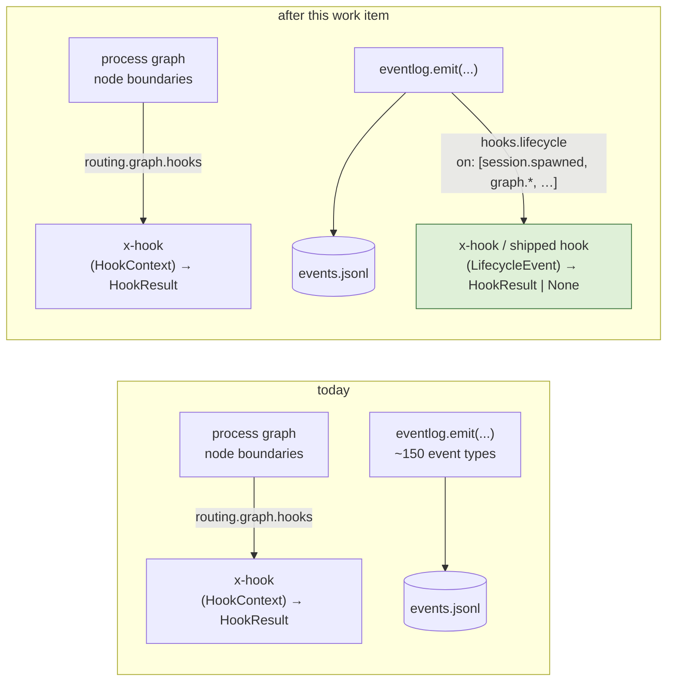

# Requirements: programmatic hooks throughout the lifecycle of the-loop

> Phase 1 of 3 (requirements → design → tasks). Following the Kiro spec approach
> (<https://kiro.dev/docs/specs/>). This phase MUST be reviewed and approved by the
> required collaborators before moving to design.

## Introduction

[Issue-344](https://github.com/MadaraUchiha-314/the-loop/issues/344) asks for hooks
**throughout the lifecycle** of the-loop: an enterprise that has to emit its own
telemetry when work starts and finishes, a user who wants to run actions of their own
around a work item, and — the owner's own direction — the-loop's internal features
refactored onto the same hook points over time. The hook system "should be extensive",
and configured from `cli-config.yaml`.

**What exists today is one hook surface, and it covers one place.** Since
[issue-248](https://github.com/MadaraUchiha-314/the-loop/issues/248) an operator can
append a hook of their own to a **node boundary of the process graph**
(`routing.graph.hooks`): `(HookContext) -> HookResult`, loaded once, `x-` namespaced,
append-only, non-routing, load-or-fail ([decision-096](../../decisions/decision-096.md)).
That surface is the right one for a *gate* — a licence-header check on `implementation`,
an architecture sign-off on `design`. It is the wrong one for everything the ticket
names, because none of it happens at a node boundary:

| The ticket's use | Where it actually happens | Reachable by a graph hook? |
|---|---|---|
| "work start" | the daemon spawns a session (`session.spawned`), a control keyword arms it (`control.command`), the graph is entered (`graph.started`) | only the last, and only as the `phase-selection` entry chain |
| "work finish" | a PR merges and the item is closed (`work_item.ended`, `session.closed`, `workspace.cleaned`) | no — `complete` is a terminal node; its exit chain never runs |
| "actions around work items" | every dispatch, every delivered comment, every PR spawn, every pause/resume, every channel post | no |
| "the-loop's own features as hooks" | announcements, reactions, mirroring — side effects the dispatcher hard-wires at those same points | no |

**What already enumerates every one of those points is the event log.** Every decision
the CLI takes is recorded as one typed event — about 150 types, catalogued in
`EVENT_TYPES`, printed by `the-loop events --types`, kept in sync with the code by a test
([observability](../../capabilities/observability.md), [decision-025](../../decisions/decision-025.md)).
The catalog is, by construction, the complete list of "things that happen" in the-loop's
lifecycle. This work item makes **each catalogued event a point an operator may attach a
hook to**, declared in the operator's CLI config, using the same authoring API and the
same load-or-fail rules the graph hooks already have.

Three things are deliberately **not** changed, and the requirements are written so a
reviewer can check each at a glance:

- **The graph hooks.** `routing.graph.hooks` keeps its shape, its rules and its tests.
  A lifecycle hook is a second *attachment surface* over the same registry and the same
  loader, not a second hook API.
- **The trust model.** A hook runs inside the-loop's process with the operator's
  credentials, so it is declared **only** in the operator's CLI config
  ([decision-123](../../decisions/decision-123.md)): a repository checkout cannot opt its
  own code in, and a load that cannot be honoured fails loudly rather than degrading to
  "no hooks".
- **The graph's authority.** A lifecycle hook observes; it cannot move the pointer, answer
  a gate, or choose an edge. Its only effect on the-loop is what it records when it fails.

## Requirements

### Requirement 1 — every recorded event is an attach point

**User story:** As an operator, I want to attach a hook to any point in the-loop's
lifecycle — work start, work finish, every dispatch in between — so that my own
telemetry and actions run where the-loop's own decisions are made, without waiting for
the-loop to bless each point individually.

#### Acceptance criteria (EARS)

1. THE attach points for lifecycle hooks SHALL be exactly the event types of the
   event-log catalog (`EVENT_TYPES`), minus the hook system's own `hooks.*` domain, so
   that the list `the-loop events --types` prints is the list an operator may attach to.
   (AC1.1)
2. WHEN an attachment names its events THEN the system SHALL accept an exact event name
   or an `fnmatch` pattern (`graph.*`, `session.spawn*`, `*`), and SHALL resolve the
   pattern against the catalog **at load**. (AC1.2)
3. IF a pattern matches no catalogued event THEN the load SHALL fail naming the pattern
   — a typo in a telemetry declaration must not silently disarm it. (AC1.3)
4. WHEN an event is emitted THEN every hook whose attachment matches it SHALL be invoked
   once, in declaration order, with the event's full record (envelope and fields).
   (AC1.4)
5. WHILE an event of the `hooks.*` domain is emitted the system SHALL invoke no hook,
   whatever the declared patterns, so that the hook system cannot feed itself. (AC1.5)

### Requirement 2 — declared in the operator's CLI config, resolved against it

**User story:** As an operator, I want to point at my hook modules from
`cli-config.yaml`, so that the decision to run code with my credentials sits in the one
file no pull request to a repository can edit.

#### Acceptance criteria (EARS)

1. THE declaration SHALL be a new top-level `hooks` block of the CLI config with
   `modules[]` (each exactly one of `path` or `module`, as `routing.graph.hooks.modules`)
   and `lifecycle[]` (each `hook`, `on` — a string or list of patterns — and an optional
   `with` mapping). (AC2.1)
2. WHEN a `modules[].path` is declared THEN the system SHALL resolve it against the
   **directory of the CLI config file** it was read from, and SHALL refuse an absolute
   path, a `..` escape or a symlink resolving outside that directory, so that the hook
   code lives with the declaration that runs it. (AC2.2)
3. THE CLI SHALL read no repository's harness config for this — a checkout carrying a
   hook module that no CLI config declares SHALL run nothing (decision-123). (AC2.3)
4. THE `hooks` block SHALL be described in the CLI-config schema (both copies), documented
   with type and default per leaf under `docs/config/cli/`, and present as a commented
   example in the shipped template and this repository's own config. (AC2.4)
5. WHEN the block is absent THEN the system SHALL behave exactly as it does today —
   nothing is imported, nothing is dispatched. (AC2.5)

### Requirement 3 — one authoring API; a lifecycle hook observes and never decides

**User story:** As a hook author, I want to write a lifecycle hook the way I write a
graph hook — same decorator, same result type, same failure rules — so that one
reference page and one mental model cover both.

#### Acceptance criteria (EARS)

1. A lifecycle hook SHALL be registered with the existing `@hook("x-<name>")` decorator
   from `the_loop.graph`, and SHALL have the signature
   `(LifecycleEvent) -> HookResult | None`, where `LifecycleEvent` carries the event's
   `event`, `level`, `ts`, `source`, `pid`, the per-event `fields`, the attachment's
   `with` as `params`, and the instance name. (AC3.1)
2. THE `x-` namespace rule SHALL hold: an operator module may register only `x-` names,
   and an attachment may name an `x-` hook a declared module registered **or** a shipped
   lifecycle hook (R5); a name that is neither SHALL fail the load. (AC3.2)
3. WHEN a hook raises, or returns a `HookResult` whose status is `block` THEN the system
   SHALL record one `hooks.failed` event (warning level) naming the hook, the event and
   the error class, and SHALL continue with the next hook and the next event — a failing
   observer never stops the daemon, the dispatch or the CLI command that emitted. (AC3.3)
4. A lifecycle hook SHALL have no effect on the process graph: it receives no
   `HookContext`, is never in a node chain, and nothing reads an `outcome` it declares.
   (AC3.4)
5. A `HookResult` a hook returns SHALL be optional: `None` and `HookResult.ok(...)` are
   both a success; `messages` on a result SHALL be logged at debug level and not recorded
   as events, so a chatty hook cannot double the event log. (AC3.5)

### Requirement 4 — fires wherever the-loop records, without slowing what recorded

**User story:** As an operator, I want my hooks to run in the daemon and in the one-shot
commands alike, and never to make a webhook delivery or an API request wait on my HTTP
call, so that adding telemetry costs the-loop nothing it can feel.

#### Acceptance criteria (EARS)

1. WHEN any entry point configures the event log from the CLI config THEN the system
   SHALL load the `hooks` block from the same file in the same call, so that the
   receiver, the poller, the service, and every one-shot command that records events
   dispatch to the same hooks. (AC4.1)
2. THE dispatch SHALL be independent of `eventLog.enabled`: the log file is one consumer
   of the record and the hooks are another. (AC4.2)
3. THE hooks SHALL run on one dedicated worker thread, in emission order, and `emit`
   SHALL return without waiting for them; the queue between them SHALL be bounded, and
   WHEN it is full the record SHALL be dropped for hooks (never for the log) and one
   `hooks.dropped` event recorded per overflow episode. (AC4.3)
4. WHEN the process exits normally THEN the system SHALL drain the queue for a bounded
   time before exiting, so that a one-shot command's final events reach the hooks.
   (AC4.4)
5. WHILE a hook runs, events it causes to be emitted SHALL be written to the log and
   SHALL NOT be dispatched to hooks, so that a hook cannot recurse through the system.
   (AC4.5)

### Requirement 5 — the-loop's own features can sit on the same points

**User story:** As the owner, I want the-loop's internal side effects to be expressible
as shipped lifecycle hooks, so that "send an update when the graph progresses" is one
attachment rather than a hard-wired call, and so that an enterprise's commonest need is
met without writing Python.

#### Acceptance criteria (EARS)

1. THE system SHALL keep a table of **shipped** lifecycle hooks — unprefixed names,
   defined inside the-loop, each with an optional parameter validator run at load — that
   an operator may attach with the same `lifecycle[]` entry as their own. (AC5.1)
2. THE first shipped lifecycle hook SHALL be `forward-event`: it POSTs the event record
   as JSON to `with.url`, with `with.headers` added verbatim, a bearer token read **at
   call time** from the environment variable `with.tokenEnv` names, and a
   `with.timeoutSeconds` (default 5). (AC5.2)
3. WHEN `forward-event` is attached THEN the load SHALL fail unless `url` is present and
   its scheme is `http` or `https`, and SHALL fail if `tokenEnv` or a header key is not a
   string. (AC5.3)
4. WHEN `tokenEnv` names a variable that is unset at call time THEN `forward-event` SHALL
   send nothing and fail (`hooks.failed`), never send unauthenticated. (AC5.4)
5. WHEN the POST fails or times out THEN `forward-event` SHALL fail for that event only
   and SHALL NOT retry — the event log is the durable record; the forwarder is
   best-effort by design. (AC5.5)

### Requirement 6 — inspectable before it runs; load failures are load failures

**User story:** As an operator, I want to see what my declaration would do — which
modules, which hooks, which events each pattern matches — without importing any of it,
so that I review the code before the-loop runs it.

#### Acceptance criteria (EARS)

1. THE CLI SHALL offer `the-loop hooks` (with `--format text|json`) reporting the shipped
   lifecycle hooks, the declared modules, and each attachment with the catalogued events
   its patterns match, **importing nothing**. (AC6.1)
2. WHEN the `hooks` block is malformed, a module is missing, unreadable, raises, registers
   nothing or registers a non-`x-` name, an attachment names an unknown hook, a pattern
   matches nothing, or a shipped hook's parameters fail validation THEN the entry point
   loading it SHALL fail with a message naming the declaration, and nothing SHALL degrade
   to "no hooks". (AC6.2)
3. WHEN the load succeeds THEN the system SHALL record one `hooks.loaded` event naming
   the counts (modules, attachments, matched event types). (AC6.3)

### Requirement 7 — documented as one hook system

**User story:** As a reader of the docs, I want the graph hooks and the lifecycle hooks
on one page with one set of rules and one table of differences, so that I do not learn
two systems.

#### Acceptance criteria (EARS)

1. THE `docs/cli/hooks.md` page SHALL gain a lifecycle section (write it, declare it,
   what it can and cannot do) and a table of the deliberate differences from a graph
   hook (attach point, context type, resolution root, effect on the graph, shipped hooks
   attachable). (AC7.1)
2. THE change SHALL ship a capability doc for lifecycle hooks, a config page for the
   `hooks` block, a command page for `the-loop hooks`, a decision record, the two
   `hooks.*` event types in the catalog, and the skill's configuration table row saying
   where lifecycle hooks are declared. (AC7.2)

## Non-functional requirements

- **Zero cost when undeclared.** With no `hooks` block, `emit` does one extra `None`
  check. No thread is started, no module imported.
- **Bounded cost when declared.** One thread, one bounded queue (1024 records), one dict
  lookup per event to find its hooks (patterns are pre-expanded to a per-event index at
  load). A hook's own cost is the hook author's.
- **stdlib only.** The forwarder uses `urllib.request`; no new dependency
  (`reference/minimalism.md`).
- **Static checks as the repository runs them:** ruff, ruff format, pyright, markdownlint,
  the schema-parity and docs-parity suites, `scripts/validate_config.py`.

## Security considerations

**New attack surface, stated:** (1) a second place where the CLI config names Python that
is imported into the-loop's process; (2) a shipped hook that makes outbound HTTP requests
carrying event records and a bearer token; (3) a worker thread and a queue that outlive
the call that filled them. The trust model for (1) is the one decision-096 and
decision-123 already set: **the operator's CLI config is executable configuration, reviewed
like code, and no repository can edit it**. (2) and (3) are new and are bounded below.

- **Untrusted actors.** Anyone who can open a pull request against a repository the
  instance drives (they cannot reach the CLI config); anyone who can post a comment that
  becomes an event record (their text can reach a hook's `fields` on the few events that
  carry excerpts, never a shell); the network on the far side of `forward-event`'s URL.
- **Trust boundaries.** The CLI config file and its directory (the declaration and the
  module code it may name); the-loop's process (where hooks run, with the operator's
  environment); the graph runtime (which a lifecycle hook has no handle on); the
  environment variable `tokenEnv` names (read at call time, never copied into config, a
  record, or a log line).
- **Abuse cases** (each closed by a named negative test in the testing plan):
  - **A1** — a checkout carries `.the-loop/hooks/evil.py` that nobody declared → never
    imported: only the CLI config's `hooks.modules` is read (AC2.3).
  - **A2** — a `modules[].path` that is absolute, contains `..`, or is a symlink out of the
    config directory → refused at load, naming the path (AC2.2).
  - **A3** — a hook that raises, returns `block`, or loops forever → the raise and the
    block are recorded as `hooks.failed` and the next hook runs; the loop stalls only the
    worker thread, the emitting thread never waits, the queue stays bounded and records
    its drops (AC3.3, AC4.3).
  - **A4** — a hook that emits events (directly, or by calling the-loop) hoping to trigger
    itself or another hook → records emitted on the worker thread are logged and not
    dispatched; `hooks.*` are never attach points (AC1.5, AC4.5).
  - **A5** — a hook that returns `data["outcome"]`, `wait` or `block` hoping to move or
    park the graph → nothing reads it; no `HookContext`, no chain, no pointer (AC3.4).
  - **A6** — a declaration that writes the bearer token into `with` → there is no such
    key: `tokenEnv` is a variable *name*, and the value is read from the environment when
    the hook runs. The record `forward-event` sends is the event log's, which already
    carries handles rather than secrets (observability capability). An unset variable
    sends nothing (AC5.4).
  - **A7** — `forward-event` pointed at `file://`, `ftp://` or a bare host → refused at
    load; only `http`/`https` (AC5.3). The URL is the operator's own declaration, so SSRF
    is not a concern the-loop can have on the operator's behalf; the scheme check is
    what keeps `urllib` from opening a local file.
  - **A8** — a malformed block, a missing module, a typo'd pattern → the entry point
    fails to start, naming the declaration (AC1.3, AC6.2). Degrading to "no hooks" is the
    failure this design is built against.
  - **A9** — a flood of events (a busy poller, `api.request` on every call) with a slow
    hook → the queue bounds memory at 1024 records; overflow drops for hooks only and
    records one `hooks.dropped` per episode; the log itself is never dropped (AC4.3).
- **Fail-closed expectations.** A declaration that cannot be honoured fails the load. A
  token that cannot be read sends nothing. A hook that cannot run is recorded and
  skipped. A queue that cannot take a record drops it *for hooks* and says so.

## Out of scope

- **Refactoring an existing internal feature onto a lifecycle hook** (announcements,
  reactions, comment mirroring). Each is injected into the dispatcher as a collaborator
  with its own configuration block and test doubles; moving one is its own work item, and
  this one ships the seam (R5) and proves it with `forward-event`. The design lists the
  candidates and the seam each needs.
- **Synchronous or blocking hooks** — a lifecycle hook cannot veto the event it observes.
  A veto is a gate, and gates are graph hooks.
- **Hooks on the harness session's own lifecycle** (Claude Code's `SessionStart`/`Stop`)
  — those are the plugin's `hooks/hooks.json`, a different mechanism for a different
  process.
- **Per-repository lifecycle hooks.** The declaration is the instance's, and so is the
  resolution root; a `path` that should differ per checkout is a graph hook.

## Open questions

None blocking. Two judgements are recorded for the reviewer in the design's
*Trade-offs* section: the queue bound (1024) and the exit drain (5 s) are one-constant
changes.

## Review comments

None yet.
