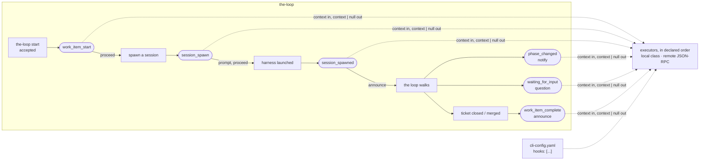

<!-- Authored per the the-loop:writing skill. -->

# Requirements: programmatic hooks around the lifecycle of a work item's delivery

> Phase 1 of 4 (requirements → design → testing plan → tasks). Following the Kiro spec
> approach (<https://kiro.dev/docs/specs/>). This phase MUST be reviewed and approved by
> the required collaborators before moving to design.

## Introduction

[Issue-344](https://github.com/MadaraUchiha-314/the-loop/issues/344) asks for hooks
**around the lifecycle of a work item's delivery** — work started, a session spawned, the
loop waiting on a person, the work item complete — with an interface that lets the hook
author **change the outcome** as well as observe it, implementable **locally or remotely**
through an SDK the-loop provides, and declared in the operator's `cli-config.yaml`. The
model the ticket points at is [sherma's hook system](https://madarauchiha-314.github.io/sherma/hooks.html):
a fixed set of named hook points, one typed context per point, an executor that returns
`None` to pass the context through or a modified context to replace it, a chain of
executors, and one remote protocol (JSON-RPC) over which the same executor can be hosted.

The-loop has one hook system already, and it is not this one. A **graph hook**
(issue-109, issue-248) is a *check at a node boundary*: `(HookContext) -> HookResult`,
`pass | block | wait | skip`, the thing that decides whether a work item moves from
`design` to `test-planning`. It answers "is this gate satisfied?". It cannot say "a
session is about to start; here is the prompt, change it", because no node boundary is
where a session starts, and its return type has no room for a changed prompt.

A first attempt at this ticket ([PR #357](https://github.com/MadaraUchiha-314/the-loop/pull/357),
closed) attached hooks to **every event the-loop records** — about 150 event-log types as
attach points, dispatched asynchronously on a worker thread, observation only. The owner
closed it and wrote on the ticket: *"it was a disaster because it was centered around
'events'. Let's not make the same mistake again."* The failure is structural, not
cosmetic: an event is a **record of something that already happened**, so a hook on one
can never change it; an event catalog is a **log schema**, so its field names, levels and
count are the log's concern and drift with it; and "every event" is not a lifecycle, it is
a firehose in which the four moments the ticket names are indistinguishable from
`poll.cycle_started`.

This work item delivers what the ticket asks for as a **curated, typed lifecycle**: six
named hook points at the moments a work item's delivery actually turns, each with a
context whose **facts** the hook reads and whose **decisions** the hook may change, run
**synchronously in the path of the thing they decide**, by executors that are local Python
or a remote JSON-RPC server, declared once in the CLI config, authored against one SDK.

```mermaid
flowchart LR
  subgraph the-loop
    S["the-loop start<br/>accepted"] --> P1(["work_item_start"])
    P1 -->|"proceed"| SP["spawn a session"] --> P2(["session_spawn"])
    P2 -->|"prompt, proceed"| L["harness launched"] --> P3(["session_spawned"])
    P3 -->|"announce"| RUN["the loop walks"]
    RUN --> P4(["phase_changed<br/>notify"])
    RUN --> P5(["waiting_for_input<br/>question"])
    RUN --> E["ticket closed / merged"] --> P6(["work_item_complete<br/>announce"])
  end
  P1 & P2 & P3 & P4 & P5 & P6 -. "context in, context | null out" .-> X["executors, in declared order<br/>local class · remote JSON-RPC"]
  CFG["cli-config.yaml<br/>hooks: [...]"] -.-> X
```

## Requirements

### R1 — the lifecycle is a fixed set of named points, not the event catalog

**User story:** As an operator, I want to attach code to *the moment a work item starts*
and *the moment it completes*, so that my telemetry and my policies key on the lifecycle
of the work, not on the shape of the-loop's log.

#### Acceptance criteria (EARS)

1. The system SHALL define a fixed catalog of lifecycle **points**, each with a name, a
   typed **context** and a description, shipped in the CLI: `work_item_start`,
   `session_spawn`, `session_spawned`, `waiting_for_input`, `phase_changed`,
   `work_item_complete`. The catalog SHALL be listable (`the-loop hooks points`) and
   SHALL be the only set of names a declaration may reference.
2. A point SHALL fire **synchronously, in the code path of the thing it describes**, before
   that thing is done wherever the point carries a decision about it: `work_item_start`
   before the work item's workspace is prepared or any session exists; `session_spawn`
   before the harness process is launched; `session_spawned` after the session is
   registered and before the-loop announces it; `waiting_for_input` before the question is
   posted (an agent's `the-loop ask`) and when a human gate is entered; `phase_changed`
   when the graph's phase label changes or a terminal node is reached, before the channels
   are told; `work_item_complete` when the ticket or pull request that *is* the work item
   closes, before the closure is announced.
3. The event-log catalog (`EVENT_TYPES`) SHALL NOT be a source of hook points. Adding an
   event type SHALL NOT add a hook point; a declaration naming an event type SHALL fail to
   load, naming the valid points.
4. Adding a point SHALL require exactly: one context type, one method on the base
   executor, one call site — and SHALL fail the suite until the catalog, the SDK base class
   and the documentation agree (a parity test).

### R2 — every point has one interface: facts in, decisions out

**User story:** As a hook author, I want one shape to learn — a typed context I receive
and either return unchanged or return modified — so that a policy hook and a telemetry
hook are written the same way and I can tell exactly what I am allowed to change.

#### Acceptance criteria (EARS)

1. Each context SHALL be a dataclass of **facts** (read-only: the work item as a modelled
   entity — its ref, tracker, host, repository, number, kind, URL and id — the loop, the
   harness, the node…) and **decisions** (the fields the-loop reads back:
   `proceed`, `reason`, `prompt`, `announce`, `question`, `summary`, `notify`). Every
   field SHALL carry a JSON-serialisable value (`str`, `bool`, `int`, a list of strings).
2. An executor method SHALL receive the context and SHALL return `None` (pass through
   unchanged) or a context of the same type (replace). The system SHALL read back **only
   the decision fields**; a changed fact SHALL be ignored and the drop logged.
3. Executors SHALL run in **declaration order**; each SHALL see the decisions the earlier
   ones made. The decisions after the last executor SHALL be what the-loop applies.
4. A decision SHALL keep its declared type: a `bool` decision set to a non-boolean, or a
   `str` decision set to a non-string, SHALL be treated as that executor's failure (R6),
   never coerced.
5. Every point SHALL document which decision it applies and how; the table in the design
   and the SDK docstrings SHALL be the same table (parity-tested).
6. `proceed: false` at `work_item_start` SHALL refuse the start: the work item is
   disarmed, one marked comment on the ticket names the hook and its `reason`, the event
   is settled (no retry), and `hooks.refused` is recorded. `proceed: false` at
   `session_spawn` SHALL prevent that launch, with the same record and comment; for a pull
   request's own session the event SHALL be delivered into the work item's session
   instead, as it is when no checkout exists for the pull request.
7. `prompt` at `session_spawn` SHALL replace the text handed to the harness on launch.
   `announce: false` at `session_spawned` and at `work_item_complete` SHALL suppress
   the-loop's own announcement of that fact (the session announcement comment; the closure
   message on the channels). `notify: false` at `phase_changed` SHALL suppress the
   `phase.*` lifecycle publish to the channels for that transition. `question` and
   `summary` at `waiting_for_input` SHALL replace the text posted for an agent's question;
   for a human gate the request text is the graph's, so those fields SHALL be empty and a
   change SHALL be ignored.

### R3 — declared once, in the operator's CLI config

**User story:** As an operator, I want to name my hooks in `cli-config.yaml`, beside my
critics and my graphs, so that what runs with my credentials is decided in my file and
nowhere a pull request can edit.

#### Acceptance criteria (EARS)

1. The CLI config SHALL accept a top-level `hooks`, a list of entries. Each entry SHALL
   carry a `name` (`^[a-z][a-z0-9-]*$`, unique) and **exactly one** of `module` (an
   installed dotted module), `path` (a `.py` file — absolute, `~`-relative, or relative to
   the directory of the CLI config file in effect, never a checkout) or `url` (a remote
   JSON-RPC endpoint). An absent or empty list SHALL change nothing.
2. A local entry MAY carry `executor` (the attribute in the module to use) and `with`
   (keyword arguments to its constructor). A remote entry MAY carry `tokenEnv` (the
   **name** of an environment variable whose value is sent as a bearer token), `headers`
   (non-secret request headers), and `timeoutSeconds` (default 10).
3. Any entry MAY carry `on` (the subset of points it handles; default: every point the
   local executor overrides, every point for a remote one), `required` (default `false`,
   R6.3) and `enabled` (default `true`).
4. WHEN an entry is malformed — a missing or duplicate `name`, none or several of
   `module`/`path`/`url`, an unknown key, an `on` naming a point that does not exist, a
   `tokenEnv` or `headers` on a local entry, an `executor` or `with` on a remote one — THEN
   loading the declaration SHALL fail naming the entry, never degrade to "no hooks".
5. WHEN a declared module cannot be imported, defines no `LifecycleHooks` subclass (or
   several, with no `executor` to choose), names an `executor` that is not one, or raises
   on construction THEN loading SHALL fail naming the entry.
6. A **daemon** (the poller, the webhook receiver, the control-plane service) SHALL load
   the declaration at start and SHALL refuse to start on a declaration that fails to load,
   as it refuses an unknown poll provider. A **one-shot command** (`the-loop ask`,
   `the-loop graph complete`) SHALL load it on first use; a load failure there SHALL be
   recorded (`hooks.load_failed`) and the command SHALL proceed with no hooks — the daemon
   holding the same file has already refused to start.
7. The declaration SHALL be read **once per process**. An edited module or declaration
   takes effect at the next start of that process.

### R4 — the same executor runs locally or remotely

**User story:** As a platform team, I want to run our compliance hook as a service our
security team owns, and our formatting hook as a file next to the config, so that where a
hook runs is a deployment choice and not a rewrite.

#### Acceptance criteria (EARS)

1. A **local** executor SHALL be a subclass of `LifecycleHooks` defining one method per
   point it handles; it SHALL run inside the-loop's process, synchronously.
2. A **remote** executor SHALL be reached by one `POST` per point invocation carrying a
   JSON-RPC 2.0 request — `method` the point's name, `params` the context's fields, an
   integer `id` — and SHALL read back a JSON-RPC response whose `result` is `null` (pass
   through) or an object whose **decision** fields replace the context's; other keys and
   an `error` member SHALL be handled per R6.
3. The request SHALL carry `Authorization: Bearer <value of $tokenEnv>` when `tokenEnv`
   is set and SHALL fail (R6) rather than send when the variable is unset or empty. A
   `url` SHALL be `https://…`, or `http://` to a loopback host; `http://` to any other
   host with a `tokenEnv` SHALL be refused at load — a bearer token is never sent in
   clear over a network.
4. The SDK SHALL provide the server half: `handle_request(executor, body) -> bytes`
   implementing the protocol for any HTTP framework, and `HookServer`, a stdlib HTTP
   server hosting one executor with an optional bearer check — so the same class an
   operator declared by `path` can be hosted by `url` unchanged.
5. The SDK (`the_loop.sdk.hooks`) SHALL export the base class, every context type, the
   catalog, `handle_request` and `HookServer`, and SHALL import no FastAPI, uvicorn or MCP
   module.

### R5 — an operator can see what is declared without running it

**User story:** As an operator, I want to read what would run — and where — before a work
item does, so that a typo in a URL or a module name is found by me, not by a ticket.

#### Acceptance criteria (EARS)

1. `the-loop hooks` SHALL list the declared entries — name, kind (`module`/`path`/`url`),
   target, points, `required`, `enabled` — **without importing a module or contacting a
   URL**, and SHALL exit `1` naming the error when the declaration cannot be read.
2. `the-loop hooks points` SHALL list the catalog: each point, when it fires, its facts
   and its decisions.
3. Every run of the chain SHALL be observable in the event log: `hooks.decided` when an
   executor changed a decision (point, hook, the changed fields), `hooks.failed` when one
   failed (point, hook, error), `hooks.refused` when a `proceed: false` was applied,
   `hooks.loaded` / `hooks.load_failed` at load.

### R6 — a failing hook is loud, never blocking by accident

**User story:** As an operator, I want a telemetry endpoint outage to cost me a warning,
not a stopped work item — and my compliance gate to stop the work item when it cannot be
reached, because I said so.

#### Acceptance criteria (EARS)

1. WHEN an executor raises, times out, returns a malformed result or a wrong-typed
   decision, or a remote returns an `error` member or a non-2xx status THEN the system
   SHALL record `hooks.failed` and continue with the context **unchanged by that
   executor**; the remaining executors SHALL still run; the operation SHALL proceed.
2. A hook SHALL NOT be able to raise into the-loop: no exception from the chain SHALL
   reach a dispatch, a graph advance or an `ask`.
3. WHEN an entry is `required: true` and it fails at a point that carries a `proceed`
   decision THEN the system SHALL set `proceed` to `false` with a `reason` naming the hook
   and the error — the refusal path of R2.6. At a point with no `proceed`, `required` has
   no further effect beyond the record.
4. A remote invocation SHALL be bounded by `timeoutSeconds`; a local one is in-process and
   is not.

### R7 — the-loop's own behaviour is consultable through the same seam

**User story:** As the-loop's maintainer, I want the announcements the-loop already makes
to ask the hooks first, so that the seam is proven by the-loop using it rather than
described for others to use.

#### Acceptance criteria (EARS)

1. The session announcement comment, the closure announcement on the channels and the
   `phase.*` lifecycle publishes SHALL consult the corresponding decision
   (`announce`, `announce`, `notify`) and SHALL be skipped when it is `false`. With no
   hooks declared each SHALL behave exactly as before.
2. Nothing else the-loop does SHALL change for an operator who declares no hooks: the
   dispatch path, the graph runtime and `ask` SHALL be byte-for-byte the same in effect,
   and the whole existing suite SHALL pass unchanged.

## Non-functional requirements

- **Latency.** A chain runs in the dispatch path. A local hook is the author's cost; a
  remote one is bounded by `timeoutSeconds` (default 10 s) per executor per point. The
  spawn path already spends a minute on a checkout; a gate advance is the daemon's, not a
  human's wait.
- **Dependencies.** None added: the remote client is `urllib`, the server is
  `http.server`, JSON-RPC is `json`. The minimalism ladder stops at stdlib.
- **Compatibility.** No CLI config version bump: `hooks` is a new optional key; no
  migration.
- **Observability.** Every load, decision change, failure and refusal is an event in the
  existing log (R5.3).

## Security considerations

- **Actors & trust:**
  - The **operator** — trusted. They own the CLI config and every module, file and URL it
    names, as they own `critics[]`, `routing.graph.hooks` and `graphs[]`
    (decision-043, decision-096, decision-123, decision-136).
  - A **remote hook server** — trusted to the extent the operator declared it: it receives
    the facts of the work item and may set decisions. It is the operator's service.
  - An **authorized user** on a ticket, an **unauthorized commenter**, the **agent**
    (prompt-injectable; runs `the-loop ask` and `the-loop graph complete`) and
    **repository content** — untrusted. None of them may declare a hook.
- **Trust boundaries & data:**
  - *Configuration → code execution.* A `module`/`path` entry imports Python into
    the-loop's process with the-loop's credentials. This is the boundary `critics[]` and
    `routing.graph.hooks` already have; the declaration is the operator's file, and a
    `path` resolves against **that file's directory**, never a checkout — so a session
    cannot place a module where its own daemon will import it.
  - *Facts → a remote server.* The context carries the work item's ref, the actor's
    login, the harness, the model, the node, the prompt text at `session_spawn` and the
    question text at `waiting_for_input`. No token, no secret, no environment variable
    value is a fact. The prompt text can contain the untrusted comment that triggered the
    event; it goes to a server the operator chose, over HTTPS unless loopback.
  - *A remote result → the-loop's decisions.* Only decision fields are read; only their
    declared types are accepted; a decision can refuse a start or a launch, reword a
    prompt or a question, or silence an announcement. It cannot select a graph, approve a
    gate, choose an edge, name a path, or reach anything the point does not expose.
  - *Secrets.* `tokenEnv` names a variable; the value is read at call time and appears in
    no log, no event and no context.
  - *An agent inside a session* runs `the-loop ask` with the daemon's exported config
    path (issue-393 B6), so the same hooks load in that process — the operator's hooks,
    from the operator's file, with the session's environment. A session cannot add one.
- **Abuse cases (EARS):**
  1. WHEN a repository carries a file at the path a `path:` entry names relative to a
     checkout THEN the system SHALL NOT import it — resolution is against the config
     file's directory only.
  2. WHEN a remote server returns a result setting a fact (`work_item`, `loop`,
     `harness`), an unknown key, or a decision of the wrong type THEN the system SHALL
     ignore the fact and the unknown key, and SHALL treat the wrong type as that hook's
     failure — the context the-loop applies SHALL carry no such value.
  3. WHEN a remote server is unreachable, slow past `timeoutSeconds`, or answers with an
     error THEN the system SHALL continue with the context unchanged by it (R6.1), or
     refuse the operation when the entry is `required` at a `proceed` point (R6.3) — never
     hang a dispatch and never raise.
  4. WHEN an `http://` URL to a non-loopback host is declared with a `tokenEnv` THEN
     loading SHALL fail — a bearer token is not sent in clear over a network.
  5. WHEN `tokenEnv` names a variable that is unset at call time THEN the system SHALL
     NOT send the request and SHALL record the hook's failure.
  6. WHEN a hook module raises on import or construction THEN a daemon SHALL refuse to
     start (R3.6) and a one-shot command SHALL run with no hooks and a recorded
     `hooks.load_failed` — no half-loaded chain runs.
  7. WHEN an executor raises inside a point THEN the dispatch, advance or ask SHALL
     complete (R6.2); the failure is recorded.
  8. WHEN a declaration names an event type or any name outside the catalog under `on`
     THEN loading SHALL fail (R1.3).
- **Accepted, stated risk.** A hook may reword the prompt a session boots on and the
  question an agent asks a human. That is the feature (an enterprise prefixes its own
  instructions; a policy adds a tag) and it is the operator's code on the operator's
  machine. The audit trail is the event log's `hooks.decided` naming the hook and the
  field, and the ticket comment that shows the final question text. A remote server sees
  the facts listed above; the operator chooses the server and the transport.
- **Fail closed:** a malformed declaration, an unloadable module, an unknown point, a
  cleartext-token URL — each stops the load and reports. A `required` hook that cannot
  answer refuses the operation it was asked about. Nothing degrades to "no hooks" in a
  daemon.

## Out of scope

- **A second remote transport (MCP).** sherma hosts hooks over MCP too. One transport
  ships here; the executor abstraction admits another without touching the call sites or
  the contract (design § Trade-offs).
- **Hooks on graph node boundaries.** That is `routing.graph.hooks` (issue-248); a
  lifecycle hook does not gate a node and a graph hook does not see a spawn. The docs say
  which to reach for.
- **Moving the-loop's existing side effects onto hooks.** R7 makes the announcements
  *consult* the seam; re-implementing the announcer, the channel publishers or the
  reactions as shipped hook executors is a later work item once this seam has been used
  in anger.
- **Asynchronous execution, queues, retries.** A hook runs in the path it decides; a
  slow hook is bounded by its timeout. An operator who wants fire-and-forget telemetry
  writes a hook that returns immediately and posts from its own thread.
- **Hot reload of the declaration.** Once per process (R3.7), as graph hook modules are.

## Open questions

Raised on the ticket as comments and linked here.

- The timeout default (10 s) and the six points' names are the design's; the owner may
  want other words or other moments — the catalog is the one place to change.

## Review comments

> Appended by the-loop's `record-feedback` hook when a human gate approves with
> comments (issue-109). Append-only and attributed: an approval never silently
> discards a reviewer's suggestions, and the feedback travels with the document
> it concerns rather than living in a side-channel tracker.
