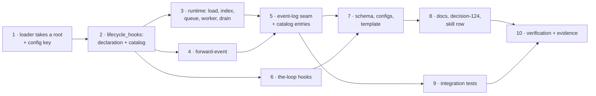

# Tasks: lifecycle hooks — every recorded event is an attach point

> Derived mechanically from [`design.md`](design.md) and
> [`testing-plan.md`](testing-plan.md). No approval gate (issue-281) — it advances on
> shape alone. Each `_Test:_` names a row of the testing plan.

## Task list

- [x] **1 · `graph/extensions.py` takes a root and a config key** — `load_module(root, ref,
  config_key=…, error=…)`, `_contained(root, raw, …)`, `read_modules(value, config_key=…)`
  exported; `_load_one`/`load_modules`/`read_declaration` keep their behaviour and
  messages. _Depends on:_ none. _Requirements:_ R2. _Test:_ T10 (unchanged suites green),
  T2.
- [x] **2 · `lifecycle_hooks.py`: declaration and catalog** — `HooksConfigError`,
  `LifecycleEvent`, `Attachment`, `Declaration`, `attach_points()`, `expand()`,
  `read_declaration()` with the shipped-name and shipped-params checks. _Depends on:_ 1.
  _Requirements:_ R1, R2, R3. _Test:_ T1 (red first: the module does not exist).
- [x] **3 · `lifecycle_hooks.py`: the runtime** — `Bound`, `LifecycleHooks` (load, index,
  `dispatch`, worker, `drain`, `close`), the re-entrancy and domain guards, overflow
  accounting, module-level `install`/`active`/`drain`/`reset`, `atexit` drain. _Depends
  on:_ 2. _Requirements:_ R3, R4, R6. _Test:_ T2, T3 (negative: A2, A3, A4, A5, A9).
- [x] **4 · `forward-event`** — `forward_event`, `validate_forward`, the `SHIPPED` table.
  _Depends on:_ 2. _Requirements:_ R5. _Test:_ T4 (negative: A6, A7).
- [x] **5 · The event-log seam** — `EventLog.build`/`write`, sinks, `emit` fan-out,
  `configure_from_file` installs, `reset` clears; `hooks.loaded`, `hooks.failed`,
  `hooks.dropped` in `EVENT_TYPES`. _Depends on:_ 3, 4. _Requirements:_ R4, R6. _Test:_
  T5 (negative: A8), T8 (catalog parity).
- [x] **6 · `the-loop hooks`** — `commands/hooks_cmd.py`, registered; text and json; exit 2
  on a `HooksConfigError`; imports nothing. _Depends on:_ 2. _Requirements:_ R6. _Test:_ T6.
- [x] **7 · Schema, configs, template** — the top-level `hooks` block in
  `.the-loop/cli-config.schema.json` and the packaged copy; a commented example in
  `.the-loop/cli-config.yaml` and `skills/the-loop/templates/cli-config.yaml`. _Depends
  on:_ 5, 6. _Requirements:_ R2. _Test:_ T8.
- [x] **8 · Docs** — `docs/cli/hooks.md` lifecycle section and differences table;
  `docs/capabilities/lifecycle-hooks.md` with its index row; `docs/config/cli/hooks-options.md`
  with its index row and sidebar entry; `docs/cli/commands/hooks.md` with its index row and
  sidebar entry; `docs/cli/commands/graph.md` cross-reference; `docs/decisions/decision-124.md`
  with its index row; observability capability and reference rows; the skill's
  configuration table row.
  _Depends on:_ 7. _Requirements:_ R7. _Test:_ T8 (P1–P5), T11 (markdownlint).
- [x] **9 · Integration tests** — `test_lifecycle_hooks_integration.py`, Gherkin-docstringed
  per the scenario table. _Depends on:_ 5. _Requirements:_ R1, R2, R5, R6. _Test:_ T7
  (negative: A1, A6, A8).
- [x] **10 · Verification and evidence** — run every row; `evidence/verification.md`,
  `evidence/security-review.md`; tick the plan; update the execution log; self-review
  passes. _Depends on:_ 8, 9. _Requirements:_ all. _Test:_ T9, T11.
