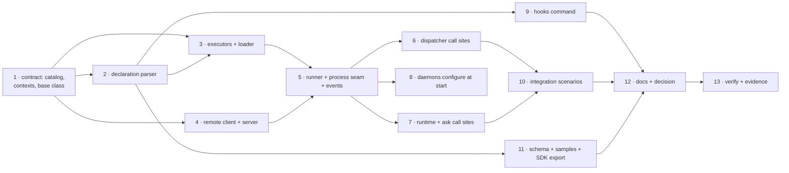

<!-- Authored per the the-loop:writing skill. -->

# Tasks: programmatic hooks around the lifecycle of a work item's delivery

> The last spec artifact. Derived from [design.md](design.md) and
> [testing-plan.md](testing-plan.md). Gate-less (issue-281): it advances on shape.

## Execution DAG

```mermaid
flowchart LR
  T1["1 · contract: catalog,<br/>contexts, base class"] --> T2["2 · declaration parser"]
  T1 --> T3["3 · executors + loader"]
  T2 --> T3
  T1 --> T4["4 · remote client + server"]
  T3 --> T5["5 · runner + process seam + events"]
  T4 --> T5
  T5 --> T6["6 · dispatcher call sites"]
  T5 --> T7["7 · runtime + ask call sites"]
  T5 --> T8["8 · daemons configure at start"]
  T2 --> T9["9 · hooks command"]
  T6 --> T10["10 · integration scenarios"]
  T7 --> T10
  T2 --> T11["11 · schema + samples + SDK export"]
  T9 --> T12["12 · docs + decision"]
  T10 --> T12
  T11 --> T12
  T12 --> T13["13 · verify + evidence"]
```

## Tasks

- [x] **1 · The contract.** `cli/the_loop/lifecycle/contract.py`: `Context` base with
      `POINT`, `to_params`, `apply` (decisions only, `DecisionTypeError`), `decisions`;
      the six contexts; `LifecycleHooks` with one method per point and `handles`;
      `POINTS`. Tests first in `tests/test_lifecycle_contract.py`, including the
      catalog ↔ base-class parity.
      _Requirements:_ R1.1, R1.4, R2.1, R2.2, R2.4. _Test:_ T1.
- [x] **2 · The declaration.** `lifecycle/declaration.py`: `Entry`, `Declaration`,
      `read_declaration`, `HooksConfigError`, path resolution against the config file's
      directory, the URL scheme rule. Tests in `tests/test_lifecycle_declaration.py`.
      _Requirements:_ R3.1–R3.4, R4.3, abuse 1, 4, 8. _Test:_ T2, T8.
- [x] **3 · Executors and the loader.** `lifecycle/executors.py`: `Executor`,
      `LocalExecutor`, `load(declaration, base_dir) -> list[Executor]` (module/path import,
      executor selection, `with`, cache). _Requirements:_ R3.5, R4.1, abuse 6. _Test:_ T3.
- [x] **4 · The remote protocol.** `lifecycle/remote.py`: `RemoteExecutor` (urllib,
      bearer from `tokenEnv`, timeout, JSON-RPC checks, `HookFailure`), `handle_request`,
      `HookServer`. Tests against a live server in
      `tests/test_lifecycle_remote_integration.py`. _Requirements:_ R4.2–R4.4, abuse 2, 3, 5.
      _Test:_ T5, T8.
- [x] **5 · The runner and the seam.** `lifecycle/runner.py` (`Runner.run`, the
      `hooks.*` events) and `lifecycle/__init__.py` (`configure`, `configure_from_config`,
      `configure_from_file`, `run` with lazy load, `reset`); `EVENT_TYPES` entries.
      Tests in `tests/test_lifecycle_runner.py`. _Requirements:_ R2.3, R3.6, R3.7, R5.3,
      R6.1–R6.4, abuse 3, 6, 7. _Test:_ T4, T8, T9.
- [x] **6 · The dispatcher call sites.** `ControlStore.mark_started`/`clear_started` and
      the `lifecycle` section; `_spawn_for` (`work_item_start`, refusal path,
      `CONTROL_REFUSAL_REMEDIES["hook-refused"]`); `_before_launch`/`_after_launch` in
      `_spawn_tmux`, `_spawn_endpoint`, `_respawn_tmux`; `_record_closure`
      (`work_item_complete`, `clear_started`). _Requirements:_ R1.2, R2.6, R2.7, R7.1.
      _Test:_ T6.
- [x] **7 · The runtime and `ask` call sites.** `Runtime.start`/`advance`
      (`phase_changed` gating `_lifecycle`; `waiting_for_input` for a human node);
      `ask_session` (`waiting_for_input` for the question). _Requirements:_ R1.2, R2.7,
      R7.1. _Test:_ T7.
- [x] **8 · Daemons configure at start.** Poller `run`, receiver `run`, service `serve`
      call `lifecycle.configure_from_file(strict=True)` and exit 1 on failure.
      _Requirements:_ R3.6. _Test:_ T4 (`test_a_daemon_refuses_to_start_on_a_bad_declaration`).
- [x] **9 · `the-loop hooks`.** `commands/hooks_cmd.py`: `list` (default) and `points`,
      text/json, strict read, no import. Tests in `tests/test_hooks_cmd.py`.
      _Requirements:_ R5.1, R5.2. _Test:_ T10.
- [x] **10 · Integration scenarios.** `tests/test_lifecycle_hooks_integration.py`: the
      Gherkin scenarios of T6/T7 over the real dispatcher, `Runtime` and `ask_session`.
      _Requirements:_ R1.2, R2.6, R2.7, R7.1, R7.2. _Test:_ T6, T7.
- [x] **11 · Schema, samples, SDK.** Top-level `hooks` in both schema copies; commented
      samples in `.the-loop/cli-config.yaml` and the template; `the_loop/sdk/hooks.py`.
      _Requirements:_ R3.1, R4.5. _Test:_ T9.
- [x] **12 · Docs and decision.** `docs/cli/lifecycle-hooks.md`, `docs/config/cli/hooks-options.md`,
      `docs/cli/commands/hooks.md`, `docs/capabilities/lifecycle-hooks.md` + index row,
      `docs/sdk/reference.md` section, sidebar, `docs/cli/hooks.md` and
      `docs/config/cli/index.md` cross-links, `skills/the-loop/reference/automation.md`,
      `docs/decisions/decision-137.md` + index row. _Requirements:_ R1.4, R2.5. _Test:_ T9, T13.
- [x] **13 · Verify and record.** Run T1–T11, T13; write `evidence/verification.md`,
      `self-review.md`, `security-review.md`, `documentation.md`; tick the plan's
      activities. _Test:_ all.

## Checkpoints

After tasks 5, 8 and 10: `make test`. After 12: `make check`. Each task's commit records
its test command and the red→green transition.

## Review comments

> Appended by the-loop's `record-feedback` hook when a human gate approves with
> comments (issue-109). Append-only and attributed: an approval never silently
> discards a reviewer's suggestions, and the feedback travels with the document
> it concerns rather than living in a side-channel tracker.
