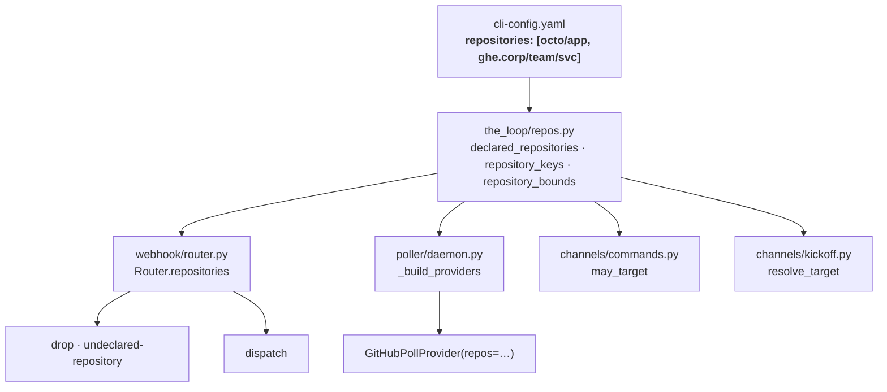
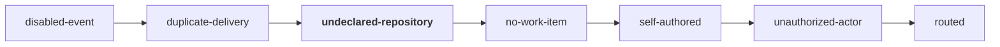
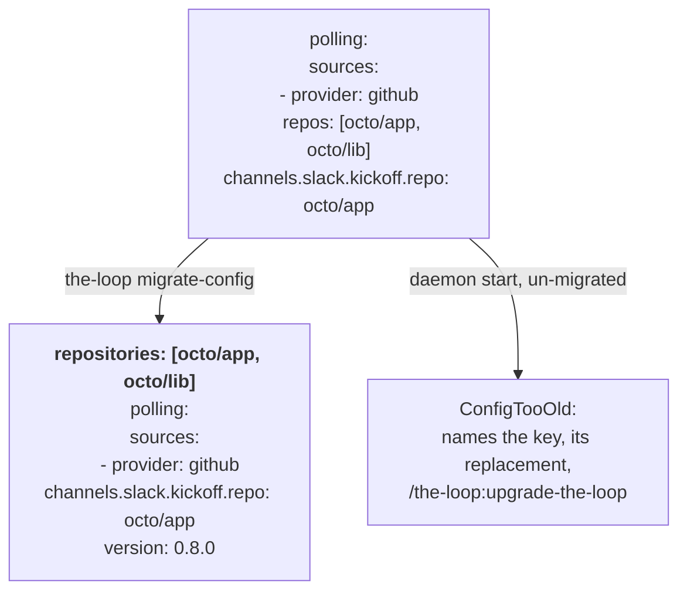

# Design: one top-level `repositories`, read by every ingress

> Phase 2 of 3. Derived from [`requirements.md`](requirements.md); reviewed with
> [`testing-plan.md`](testing-plan.md) at the one `design-approval` gate. Decisions are
> recorded in [`decision-121`](../../decisions/decision-121.md).

## The shape

One module answers *"which repositories is this instance for?"* and four callers ask it.
The module is `the_loop/repos.py` — moved up out of `channels/`, because the moment a
second ingress reads it, it is not a channels concern. Nothing else changes shape: the
poller keeps its sources, the receiver keeps its router, the slash command keeps
`may_target`.



## 1. The builder — `the_loop/repos.py`

Moved from `the_loop/channels/repos.py` with its public names intact
(`DeclaredRepo`, `parse_repo_path`, `declared_repositories`, `repository_keys`). The move
is not cosmetic: the old module imported `channels.slack` to read `kickoff.repo`, so
anything that wanted the declared set pulled the Slack channel's config parser in with
it. The new one imports `ghhost` and `sessions.registry` only, which is what lets the
webhook router — a stdlib-only, I/O-free module — read it.

### What it reads

```yaml
repositories:
  - MadaraUchiha-314/the-loop      # bare: this instance's host
  - ghe.corp.example/team/service  # qualified: issue-311 grammar
```

`declared_repositories(cli_config)` walks that list in order, hands each entry to
`parse_repo_path`, drops what does not parse (debug level), and deduplicates by
`DeclaredRepo.key` (`host/owner/repo`, lowercased). `DeclaredRepo.source` becomes the
constant `"repositories"` — one origin now, and the field stays because
`channels status` prints it.

`channels.slack.kickoff.repo` **stops contributing**. It is a pointer at one of the
declared repositories, not a second place to declare one (decision-121 D2); the migration
adds it to `repositories` so no existing install loses a target.

### Two shapes, two callers

| Function | Returns | Who asks |
|---|---|---|
| `declared_repositories(cfg)` | `Tuple[DeclaredRepo, …]`, in declaration order | the kickoff resolver, `channels status`, the poller |
| `repository_keys(cfg)` | `Set[str]` of `host/owner/repo` | `may_target` |
| `repository_bounds(cfg)` | `Optional[Set[str]]` — `None` when nothing is declared | the receiver |

`repository_bounds` is new and exists so the receiver can tell *"declared nothing"* from
*"declared, and this is not in it"* without the caller re-deriving the distinction. An
empty set and `None` mean opposite things at an ingress, and a function that returns only
a set forces every caller to remember which one an empty one is.

## 2. The receiver — `webhook/router.py`

`Router` gains one field, `repositories: Optional[Set[str]]`, defaulting to `None`
(unbounded), hot-swapped by the daemon's `apply()` beside `authorized_users`. The check
is a single new block in `route()`, placed after the dedup check and before work-item
extraction:



Two questions, one reason code:

1. **The delivery's own repository.** `repository_key(payload)` — `repository.full_name` for
   owner and repo, `_host(payload)` (already in this module, `html_url` first) for the
   host — lowercased into `host/owner/repo`. Not in the set → drop. A payload with no
   `repository` object at all yields no key; it is left to the existing `no-work-item`
   path rather than given a new way to fail, because every event the receiver enables
   carries one.
2. **The work items it names.** After `extract_work_items`, refs outside the set are
   filtered out (the issue-183 cross-repository case). An empty result drops the delivery
   with the same reason, so the event log answers *why* without a second vocabulary.

Ordering matters and is a requirement, not an implementation detail (R2.4): above the
actor check, so an undeclared repository's payload never reaches `is_authorized`, the
collaborator roster or the bus publisher. The drop is silent on the wire (R2.6) — the
same `202 accepted` every other drop gets, no reaction, no comment.

`Deduper` is untouched: a dropped delivery is not marked processed, so a redelivery after
the operator declares the repository is routed rather than swallowed.

### Unbounded, and saying so

`build_receiver` warns once at start when `repository_bounds` is `None`:

```
no repositories declared — this receiver will accept a delivery for ANY
repository that reaches it. Set the top-level `repositories` in the CLI
config to bound it to the ones this instance works with
```

This is the same shape as the existing `no authorizedUsers configured` warning three
lines above it, and for the same reason: the safe default is the one that does nothing,
and the operator has to be told which one they are running.

## 3. The poller

`polling.sources[]` keeps `provider`, `label`, `monitor` and `ghBinary` — how to poll —
and loses `repos`. The repository set arrives from the caller:

```python
# poller/base.py
def build_provider(source, *, default_label, default_host="", repositories=()) -> PollProvider

# poller/github.py
@classmethod
def from_source(cls, source, *, default_label, default_host="", repositories=()):
    if "repos" in (source or {}):
        raise ProviderError(…)                       # R3.5 — never silently ignored
    return cls(repos=parse_repos(list(repositories), default_host=default_host), …)
```

`poller/daemon.py::_build_providers` reads `declared_repositories(data)` once per build
and passes `entry.declared` — the operator's own string, so `gh --repo` keeps their
grammar (R1.5) — to every source. The hot-reload path already goes through
`_build_providers`, so editing `repositories` takes effect exactly as editing `repos`
did.

**Two sources, one set.** Every `github` source now polls every declared repository. With
one source (every shipped and documented configuration) nothing changes. With two, the
second is a *different label or monitor* over the same repositories, which is what a
source has meant since the repository list stopped living in it — and the poller's
per-work-item ledger makes a doubled listing a wasted API call, not a doubled dispatch.

The per-repository failure isolation of issue-315 is untouched: it lives in
`listing()`/`_list_scope`, below where the repository list comes from. The empty-set error
text changes to name the new key, and is otherwise the same failure.

## 4. Control surfaces

- `channels/commands.py::may_target` — import moves, behaviour identical.
- `channels/kickoff.py::resolve_target` — import moves. The fallback (`kickoff.repo`,
  used verbatim when a message carries no prefix, issue-341 R3.1) is now **checked
  against the declared set**: an undeclared fallback yields the existing `unknown-repo`
  outcome with the prefix slot carrying the configured slug, so the member gets the
  refusal that already exists rather than a new one. Without this the kickoff would be
  the one path that could still write into an undeclared repository.
- `commands/channels_cmd.py` — import moves; the status line's wording names
  `repositories` instead of `polling.sources`.
- `channels/kickoff.py::refusal_text` — the "I know no repositories" sentence names the
  new key.

## 5. The break and its migration

`migrations.py` gains one site and one refusal, following the four properties the module
already states (version the schema, fail closed and loudly, a deterministic key move,
tested both ways).



Order in the migrated list: entries already under a hand-written top-level
`repositories` first, then each `github` source's `repos` in source order, then
`kickoff.repo` — deduplicated by normalized key, first spelling wins. `kickoff.repo`
stays where it is: it is still the channel's default target, and #349 is the ticket that
decides what replaces it.

`CURRENT_CONFIG_VERSION` goes to `0.8.0`. `needs_migration` returns true for any source
carrying `repos`; `assert_current` raises `ConfigTooOld` for the same condition, with the
message pattern the other five refusals use — *what was removed, what replaced it, why it
is not being ignored, and the exact command*.

A non-`github` source carrying `repos` is left alone: the key is that provider's, and
`jira` is reserved. Only `provider: github` entries are migrated and only they are
refused.

## 6. Schema

```jsonc
"repositories": {
  "type": "array",
  "items": { "type": "string" },
  "description": "Every GitHub repository this instance of the-loop works with … ",
  "examples": [["octo/hello", "ghe.corp.example/team/service"]]
}
```

Added at the top level, a sibling of `polling`; `polling.sources[].repos` removed. Both
copies (`.the-loop/cli-config.schema.json` authored,
`cli/the_loop/schemas/cli-config.schema.json` packaged) are updated by copy, which
`test_config_schema_parity.py` asserts byte-for-byte.

## Error handling

| Condition | Where | Behaviour |
|---|---|---|
| Entry is not `[host/]owner/repo` | `parse_repo_path` | `ValueError`; the caller drops that entry at debug level. The set shrinks. |
| `repositories` is not a list | `declared_repositories` | Contributes nothing; debug line. The set is empty, i.e. unbounded at the receiver, with the start-up warning already raised. |
| `repositories` is empty/absent | receiver | Unbounded, warned at start (R2.3). |
| `repositories` is empty/absent | poller | `ProviderError` on the first cycle, naming the key — unchanged behaviour, new text. |
| A source still declares `repos` | config load | `ConfigTooOld`, the daemon does not start. |
| A source still declares `repos` (hand-built dict, tests, embedders) | `build_provider` | `ProviderError` naming the replacement. |

## Alternatives considered

| Option | Why not |
|---|---|
| Keep `polling.sources[].repos` and have the receiver read it too | The name is the bug. A key under `polling` that governs the webhook receiver is the same mistake issue-142 fixed for `webhooks.ghWebhook.routing`, in the other direction. |
| Accept `repos` with a deprecation warning for one release | A shadow override is how two lists drift for a whole release cycle, and this one decides what a machine will act on. The owner's standing call on breaking config changes is to break and migrate (`migrations.py` preamble). |
| Make an empty `repositories` fail closed | It would stop every webhook-only install on upgrade, this repository's own config included (`polling.sources: []` today). Deliberate, stated in R2.3, and separable — a future ticket can flip it with its own migration. |
| Filter only the delivery's repository, not the refs | Leaves the issue-183 cross-repository ref as a way to name a work item in a repository nobody declared. Two checks, one reason code, costs a set lookup per ref. |
| Filter only the refs, not the delivery's repository | An undeclared repository's payload would reach the actor check and the bus before being dropped, which R2.4 exists to prevent. |
| Put the check in `server.py`, at the HTTP boundary | The server is deliberately transport-only and knows nothing of config beyond its secret; the router is where every other drop reason already lives, and where the event log is written. |
