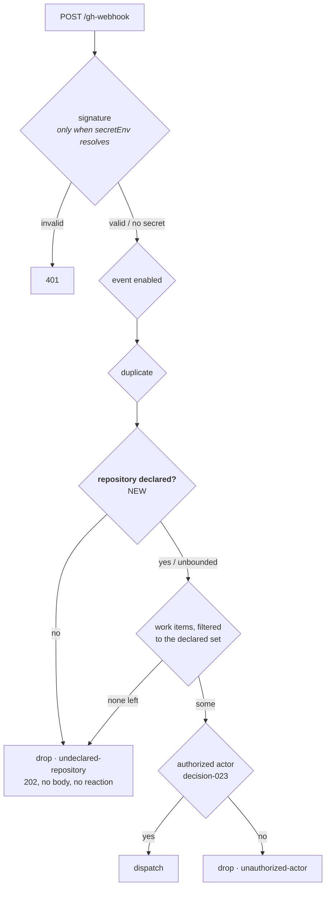

# Security review — issue-348

**Risk tier 4** (`autonomy.sensitivePaths` matches `**/*schema*`, and the change alters an
ingress's admission rules). `security.review.humanSignOffMinTier: 4`, so this review is
**not** sufficient on its own:

> ⚠️ **A named human security sign-off is outstanding.** The owner signs at the PR. This
> document is the agent's review, presented for that sign-off — not a substitute for it.

Mechanism: the built-in review skill was not available in this session, so the checklist
form of `reference/security.md` was used, one abuse case at a time against the code.

## What changed, in security terms

A fourth guard was added to the `gh-webhook` receiver, above the existing three. Nothing
was removed or relaxed.

The bound sits **above** the actor guard and above the bus publisher, so an undeclared
repository's payload is never read for an actor, never matched against a collaborator
roster and never mirrored into a Slack channel.

## Abuse cases

| # | Abuse case | Mitigation | Closed by |
|---|---|---|---|
| A1 | A caller who can reach the listener POSTs a crafted `issues` payload for an undeclared repository, with `sender.login` set to an authorized user. | Dropped at `undeclared-repository` before the actor is read. Unbounded only when the operator declared nothing (accepted, D4) — warned at start. | `test_a_forged_authorized_actor_on_an_undeclared_repository_is_dropped`, `test_the_repository_bound_is_checked_before_the_actor` |
| A2 | The payload names a declared repository in `full_name` and an undeclared host in `html_url` (or the reverse), to slip past the key comparison. | `repository_key` builds one key from both fields; a mismatch simply yields a key in nobody's set. Proved in both directions — the mismatched payload drops against a github.com declaration and routes against the matching Enterprise one. | `test_a_host_disagreement_between_full_name_and_html_url_is_dropped` |
| A3 | A pull request in an undeclared repository carries `Closes declared-owner/declared-repo#12` to reach a declared work item's session. | The delivery's own repository is judged first, so the linkage is never read. | `test_a_closing_keyword_from_an_undeclared_repository_reaches_nothing` |
| A4 | A delivery from a declared repository names a linked work item in an undeclared one (issue-183 cross-repository linkage), to have a session spawned there. | Refs are filtered to the declared set; the rest of the delivery proceeds, and a delivery with nothing left drops. | `test_a_ref_outside_the_declared_set_is_filtered_out`, `test_a_delivery_whose_every_ref_is_undeclared_is_dropped` |
| A5 | An operator upgrades; their `polling.sources[].repos` is silently ignored and the instance starts acting on everything that reaches it. | `assert_current` raises `ConfigTooOld`, naming the key, its replacement and the command. The daemon does not start. | `test_an_un_migrated_repos_key_is_refused` |
| A6 | A malformed entry (`../../etc/passwd`, `octo/app; rm -rf /`, `$(id)/app`, `https://…`, four segments, empty) becomes a `gh --repo` argument. | Every entry passes `is_github_host` / `is_github_name` in `parse_repo_path` before it can be a candidate; a failing one is dropped at debug level. Nine metacharacter and shape cases asserted. | `test_a_malformed_entry_is_skipped` (parametrized), `test_an_over_segmented_entry_is_skipped` |
| A7 | An Enterprise declaration is used to admit its github.com namesake (or the reverse). | The key carries the host, resolved per issue-311; `ghe.corp/octo/app` and `github.com/octo/app` are different keys. | `test_an_enterprise_host_does_not_admit_its_github_com_namesake` |
| A8 | A broken `repositories` section leaves the receiver with the *previous, wider* set, or with a half-read one. | Every read contributes nothing on fault: a non-list, a mapping, a scalar all yield the empty set, and the reload reads the whole document rather than patching the live one. | `test_a_broken_section_narrows_rather_than_widens` (parametrized) |
| A9 | The refusal discloses the operator's repository list to an unauthenticated caller. | The drop returns the same `202 accepted` body every delivery gets; the list appears only in this machine's log and event trail. No reaction, no comment, no reply. | `Scenario: A refusal discloses nothing about what the operator declared` |

## Residual risks, recorded

1. **An empty declaration still bounds nothing** (decision-121 D4). The receiver then
   accepts a delivery for any repository that reaches it — 13.12.0's behaviour exactly,
   not a new permission — and says so at start. Accepted deliberately: failing closed on
   empty would stop every webhook-only instance on upgrade, this repository's own config
   included. Narrowing it is a separate decision with its own migration.
2. **A8's fault mode lands on that same value.** A hot reload whose `repositories` section
   is broken narrows the set to empty, which *is* the unbounded case. The builder fails in
   the shrinking direction everywhere; here the shrink reaches the one value that means
   "no bound". Visible in the log (the section is reported unreadable at debug level and
   the start-up warning describes the resulting state), and closed entirely only by
   flipping residual risk 1.
3. **The bound is not authentication.** An instance running without
   `webhooks.ghWebhook.secretEnv` is still an unauthenticated endpoint; this change
   narrows what such a delivery can address, and the existing "signature NOT verified"
   warning is unchanged. Stated in the requirements, the design, the schema and the
   options page so no operator reads the new key as a replacement for the secret.

## Sensitive-path review

| Path | Change | Judgement |
|---|---|---|
| `.the-loop/cli-config.schema.json` (and its packaged copy) | one key added, one removed, three descriptions edited | `additionalProperties: false` still holds, so an un-migrated key is rejected by validation as well as by the version gate; the two copies are byte-identical (`test_config_schema_parity.py`) |
| `.the-loop/cli-config.yaml` | declares `repositories: [MadaraUchiha-314/the-loop]`, version `0.8.0` | this repository's own instance is now bounded to itself — the dogfooding case for the change |
| `.github/workflows/**` | untouched | — |
| `reviews.critics[]` (executable config) | untouched | — |

No credential, token, hostname or path outside the repository appears in this document or
in the tests it cites.
