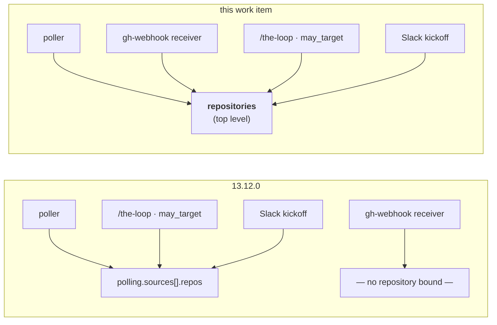
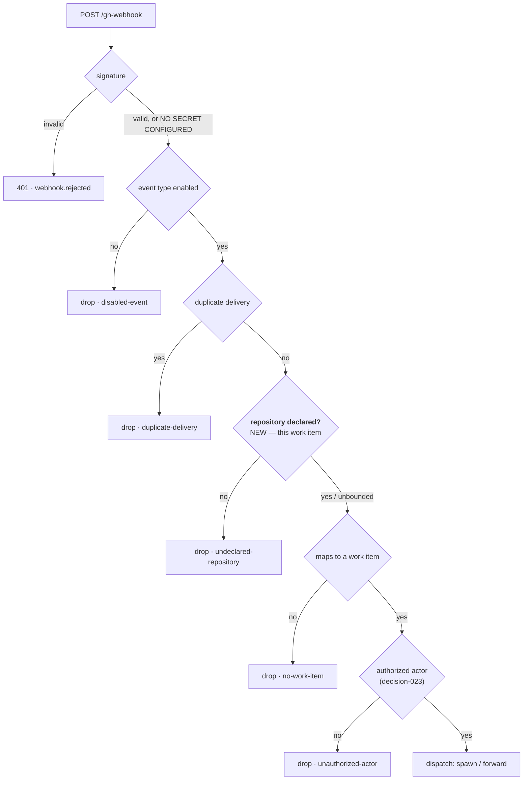

# Requirements: one top-level `repositories` bounds every ingress, and the webhook receiver gains the bound it never had

> Phase 1 of 3 (requirements → design → tasks). Tier 4 (`human-approves-pr` **and**
> `security.review.humanSignOffMinTier: 4` — a named human security sign-off, because
> `autonomy.sensitivePaths` matches `**/*schema*` and because the change closes a hole in
> an ingress). Breaking on purpose: `polling.sources[].repos` is removed, a version-gated
> migration moves it, and an un-migrated config refuses to run.

## Introduction

[Issue #348](https://github.com/MadaraUchiha-314/the-loop/issues/348), filed by the owner
out of [PR #347](https://github.com/MadaraUchiha-314/the-loop/pull/347): *"repos are
listed in `polling.sources.repos` and that means that the same repo filter are not
applied to gh-webhook events. we should unify the place where gh repo filter is
specified."*

The list of repositories this instance works with lives inside the poller's config, named
after the one ingress that reads it. The `gh-webhook` receiver does not read it — the
webhook package's only mention of `polling` is a comment about `maxRetries` at
`dispatcher.py:3337`. So the two ingresses are bounded differently, and one of them is
not bounded at all:

| | poller | `gh-webhook` receiver |
|---|---|---|
| repository bound | `polling.sources[].repos`, per source | **none** |
| signature | n/a | `X-Hub-Signature-256`, and only when a secret is configured (`server.py:28-41` returns `None`, not `False`, with no secret) |
| actor | `authz.is_authorized` (decision-023) | `authz.is_authorized` (decision-023) |
| instance | `instance.scope` (issue-322) — *which instance takes a work item* | `instance.scope` |

None of the right-hand column is *"the operator declared this repository"*. A delivery for
a repository nobody listed is judged on its actor and its signature alone, and is then
dispatched — spawning a session, checking out a working tree, running a harness — on a
repository this instance was never pointed at.

The shape was decided on #347: a **top-level `repositories`**, a sibling of `routing` /
`polling` / `channels`, in the `[host/]owner/repo` grammar issue-311 already established.
PR #347 also landed the one builder this change edits — `channels/repos.py`
(`declared_repositories`, `repository_keys`) — which stops being a channels concern the
moment a second ingress reads it.

## Requirements

### Requirement 1 — one declaration, named after what it is

**User story:** As an operator, I want one place to say which GitHub repositories this
instance of the-loop works with, so that I do not have to know which ingress reads which
key to know what my instance will act on.

#### Acceptance criteria

1. WHEN the CLI config declares a top-level `repositories` list THEN the system SHALL
   treat its entries as the complete set of GitHub repositories this instance works with.
2. WHEN an entry is read THEN the system SHALL accept the `[host/]owner/repo` grammar of
   issue-311, resolving a bare `owner/repo` against this instance's host
   (`ghhost.github_host`).
3. WHEN an entry is malformed THEN the system SHALL skip **that entry** and record why at
   debug level, and SHALL NOT widen the set or fail the read — a fault may only shrink
   the declared set.
4. WHEN two entries name the same repository THEN the system SHALL deduplicate them by
   their normalized `host/owner/repo` key, keeping the first declaration's spelling.
5. WHERE a value must reach `gh --repo`, the system SHALL pass the operator's own declared
   string, never a normalized or reconstructed one.
6. WHEN the set is built THEN the system SHALL build it in exactly one place, importable
   without importing any ingress or channel.

### Requirement 2 — the webhook receiver is bounded by it

**User story:** As an operator, I want a webhook delivery for a repository I never
declared to be dropped, so that the two doors into my machine are locked with the same
key.

#### Acceptance criteria

1. WHEN `repositories` is non-empty AND a delivery's own repository
   (`payload.repository`, on the host its `html_url` names) is not in the declared set
   THEN the system SHALL drop the delivery, record `routing.dropped` with reason
   `undeclared-repository` at warning level, and dispatch nothing.
2. WHEN `repositories` is non-empty AND a delivery names work items in repositories
   outside the declared set THEN the system SHALL drop **those refs** and continue with
   the ones inside it; IF no ref remains THEN the delivery SHALL be dropped with reason
   `undeclared-repository`.
3. WHEN `repositories` is empty or absent THEN the system SHALL bound nothing — every
   delivery is judged exactly as it is in 13.12.0 — and SHALL say so once at receiver
   start, at warning level, naming the key that would bound it.
4. WHEN the repository bound drops a delivery THEN the drop SHALL happen **before** the
   authorization guard reads the actor and before any comment is published to the bus, so
   an undeclared repository's payload reaches no other subsystem.
5. WHEN the CLI config is hot-reloaded THEN the receiver SHALL pick up an edited
   `repositories` on the next delivery, as it does `routing.authorizedUsers`.
6. WHILE the bound is in force, the system SHALL NOT reply, react or comment on the
   dropped delivery — a refusal leaves no mark (decision-111 D1).

### Requirement 3 — the poller reads it, and keeps what is genuinely per-source

**User story:** As an operator, I want my poll sources to describe *how* to poll, not
*what*, so that moving a repository between ingresses is not a two-place edit.

#### Acceptance criteria

1. WHEN a `github` poll source is built THEN the system SHALL take its repository set
   from the top-level `repositories`, not from the source.
2. WHERE a source declares `provider`, `label`, `monitor` or `ghBinary`, the system SHALL
   keep reading them from the source — these describe the poll, not the bound.
3. WHEN a repository cannot be listed THEN the system SHALL keep the per-repository
   failure isolation of issue-315 / decision-106 unchanged: that repository's scope
   fails, the others are polled.
4. WHEN `repositories` is empty AND a `github` source is configured THEN the system SHALL
   raise the existing "no repositories" provider error, naming the top-level key as the
   place to set them.
5. WHEN a poll source still declares `repos` THEN the system SHALL refuse to build it,
   naming the key, its replacement and the migration command.

### Requirement 4 — the control surfaces read the same set

**User story:** As an authorized user, I want `/the-loop` and a Slack kickoff to be
bounded by the same declaration as the ingresses, so that one answer means one answer.

#### Acceptance criteria

1. WHEN `may_target` bounds a slash command's target (decision-116 D4) THEN it SHALL read
   the declared set from the one builder.
2. WHEN a kickoff prefix is resolved (issue-341, decision-120 D1) THEN it SHALL resolve
   against the declared set from the one builder.
3. WHEN `channels.slack.kickoff.repo` names a repository outside the declared set THEN
   the kickoff fallback SHALL be refused with the existing `unknown-repo` refusal shape,
   and nothing SHALL be created.
4. WHEN `the-loop channels status` reports the declared set THEN it SHALL report the set
   this work item defines, and name the key that declares it.

### Requirement 5 — the break is migrated, and an un-migrated config refuses to run

**User story:** As an operator upgrading, I want my existing repository list to be moved
for me and my daemon to refuse rather than quietly widen, so that an upgrade cannot
silently change which repositories my machine acts on.

#### Acceptance criteria

1. WHEN `the-loop migrate-config` runs on a config declaring `polling.sources[].repos`
   THEN it SHALL move every entry of every `github` source into the top-level
   `repositories`, in declaration order, deduplicated, and remove the `repos` key.
2. WHEN that config also declares `channels.slack.kickoff.repo` THEN the migration SHALL
   add it to `repositories` as well, and leave `kickoff.repo` in place as the channel's
   fallback target.
3. WHEN the migration runs twice THEN the second run SHALL report no change and produce a
   byte-identical file.
4. WHEN the runtime loads a config that still declares `polling.sources[].repos` THEN it
   SHALL refuse to start with `ConfigTooOld`, naming the key, its replacement and
   `/the-loop:upgrade-the-loop` — never ignoring the value.
5. WHEN the schema version is read THEN `CURRENT_CONFIG_VERSION` SHALL be `0.8.0` and a
   config declaring less SHALL be refused as stale.
6. WHERE a config declares `repositories` **and** `polling.sources[].repos`, the
   migration SHALL keep the entries of both, the top-level ones first, and say so in its
   report.

## Security considerations

### Threat model — what the receiver accepts, before and after

The gate this work item adds is the one marked NEW. Everything else is unchanged.

**Trust boundaries.** The listener's socket (anyone who can reach the host and port); the
signature (only when `secretEnv` resolves to a value — `verify_signature` returns `None`,
which is not `False`, when it does not); the actor allow-list; and now the operator's
declared repository set. The new gate is the only one of the four that answers *"is this
repository mine?"*, and it is placed above the actor check because an undeclared
repository's payload should reach as little of the system as possible.

**What the change does not claim.** A repository bound is not authentication. It narrows
what a forged or unsigned delivery can address; it does not make one trustworthy. An
operator running without `secretEnv` is still running an unauthenticated endpoint, and
the existing warning for that stays.

**Fail-closed direction.** Every read in the builder contributes nothing on fault, so a
malformed entry, an unreadable section or a raised exception can only **shrink** the
declared set. The one direction that widens — an empty set bounding nothing — is
deliberate, stated in R2.3, warned about at start, and is exactly 13.12.0's behaviour for
the receiver rather than a new permission.

### Abuse cases

| # | Abuse case | Mitigation |
|---|------------|------------|
| A1 | An attacker who can reach the listener POSTs a crafted `issues` payload for a repository the operator never declared, with `sender.login` set to an authorized user. | R2.1 drops it at `undeclared-repository` before the actor is read. Unbounded only when the operator declared nothing (R2.3), which is warned about at start. |
| A2 | A payload declares a declared repository in `repository.full_name` but an undeclared one in `repository.html_url` (or vice versa), to slip past the key comparison. | The key is built from both together — `full_name` for owner/repo, `html_url` for the host — and compared as one lowercased `host/owner/repo`. A mismatch yields a key that is not in the set, so the delivery drops. |
| A3 | A pull request in an undeclared repository carries `Closes declared-owner/declared-repo#12` to reach a declared work item's session. | R2.1 drops the delivery on its own repository before refs are considered. R2.2 then filters what remains. |
| A4 | A delivery from a declared repository names a linked work item in an undeclared one (issue-183 cross-repository linkage), to have a session spawned there. | R2.2 drops that ref; the delivery proceeds only for refs inside the set, and drops entirely if none remain. |
| A5 | An operator upgrades; their `polling.sources[].repos` is silently ignored and the instance starts acting on every repository that reaches it. | R5.4: the runtime refuses the un-migrated config with `ConfigTooOld`. The value is never ignored. |
| A6 | A malformed entry (`../../etc`, `owner/repo/extra/segments`, an empty string) in `repositories` becomes a `gh --repo` argument. | R1.2/R1.3: every entry passes `is_github_host` / `is_github_name` before it can be a candidate, and a failing one is dropped rather than carried. |
| A7 | A crafted entry names an Enterprise host to make a declared `owner/repo` on github.com match a same-named repository elsewhere. | The key carries the host, resolved per issue-311, so `ghe.corp/octo/app` and `github.com/octo/app` are different keys and neither admits the other. |
| A8 | A hot reload with a broken `repositories` section leaves the receiver with the previous, wider set — or with none at all. | The builder reads the freshly loaded config per delivery (R2.5) and contributes nothing on fault, so a broken section narrows to the empty set; the empty set is the unbounded case, so the reload path also keeps the R2.3 warning honest. Recorded as an accepted residual risk in the design. |
| A9 | The refusal discloses the operator's repository list to an unauthenticated caller. | R2.6: a dropped delivery gets a `204`-shaped acknowledgement and no body naming anything; the list appears only in the operator's own log and event trail. |

## Out of scope

- The kickoff's repository **picker** — #349, which reads whatever this leaves behind.
- Any change to `instance.scope` (issue-322). It answers *which instance* takes a work
  item, a different question from *which repositories reach this machine*.
- Any change to the signature or actor guards. This gate sits beside decision-023, not in
  place of it.
- Making an empty `repositories` fail closed. It would stop every webhook-only operator's
  instance on upgrade, including this repository's own dogfooding config, and that is a
  deliberate second decision rather than a side effect of this one.
