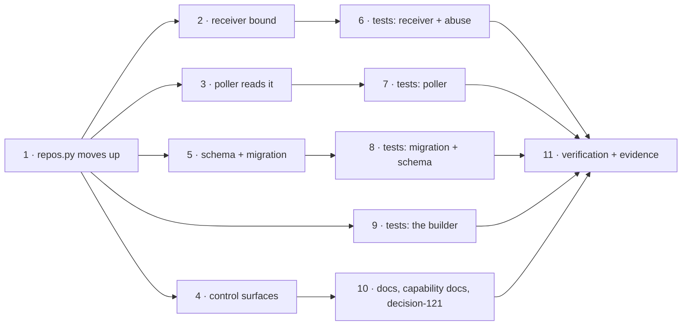

# Tasks: one top-level `repositories`, read by every ingress

> Derived mechanically from the locked [`design.md`](design.md) and
> [`testing-plan.md`](testing-plan.md). No approval gate (issue-281) — it advances on
> shape alone. Each `_Test:_` names a row of the testing plan.

## Tasks

- [x] **1. Move the builder to `the_loop/repos.py` and point it at the new key.**
  Move `channels/repos.py` → `repos.py`; drop the `channels.slack` import and the
  `_polled_paths` walk; read the top-level `repositories`; add `repository_bounds`
  returning `Optional[Set[str]]`; `DeclaredRepo.source` becomes `"repositories"`.
  _Requirements: R1.1–R1.6_ · _Test: T1_

- [x] **2. Bound the webhook receiver.**
  `Router.repositories: Optional[Set[str]]`; the delivery-repository check and the ref
  filter in `route()`, above the actor guard, emitting `routing.dropped` with reason
  `undeclared-repository`; `webhook/daemon.py` builds it from `repository_bounds`,
  hot-swaps it in `apply()`, and warns once at start when it is `None`. Register the new
  reason in `eventlog.py`'s catalog.
  _Requirements: R2.1–R2.6_ · _Test: T2, T5, T11_

- [x] **3. Take the poller's repositories from the top level.**
  `PollProvider.from_source` / `build_provider` gain `repositories`;
  `GitHubPollProvider` builds `RepoSpec`s from it, refuses a source still carrying
  `repos`, and names the top-level key in its empty-set error; `poller/daemon.py`
  passes `declared_repositories(data)`.
  _Requirements: R3.1–R3.5_ · _Test: T3, T5_

- [x] **4. Point the control surfaces at the moved builder.**
  `channels/commands.py`, `channels/kickoff.py`, `commands/channels_cmd.py`; the kickoff
  fallback is checked against the declared set; the refusal and status wordings name
  `repositories`.
  _Requirements: R4.1–R4.4_ · _Test: T1, T13_

- [x] **5. Break the config, and migrate it.**
  Both schema copies: add top-level `repositories`, remove `polling.sources[].repos`.
  `migrations.py`: `CURRENT_CONFIG_VERSION = "0.8.0"`, the move (sources + `kickoff.repo`,
  ordered and deduplicated), `needs_migration`, and the `assert_current` refusal. Update
  `skills/the-loop/templates/cli-config.yaml` and `.the-loop/cli-config.yaml`.
  _Requirements: R5.1–R5.6_ · _Test: T4, T13_

- [x] **6. Tests — the receiver bound and its abuse cases.**
  `test_routing.py` unit cases; `test_webhook_routing_integration.py` scenarios with
  Gherkin docstrings.
  _Requirements: R2.1–R2.6, A1–A4, A9_ · _Test: T2, T5, T11_

- [x] **7. Tests — the poller.**
  `test_poller.py` and `test_poll_daemon_integration.py`.
  _Requirements: R3.1–R3.5_ · _Test: T3, T5_

- [x] **8. Tests — the migration and the schema.**
  `test_cli_config.py` both directions; the schema, manifest, docs-parity and event-catalog
  suites green.
  _Requirements: R5.1–R5.6, A5_ · _Test: T4, T13_

- [x] **9. Tests — the builder.**
  New `cli/tests/test_repositories.py`.
  _Requirements: R1.1–R1.6, A6–A8_ · _Test: T1, T11_

- [x] **10. Docs, capability docs and the decision record.**
  New `docs/config/cli/repositories-options.md`; `polling-options.md`,
  `channels-options.md`, `webhook-options.md` and the config index updated; the guide's
  configuration page; capability docs `webhook-triggers.md`, `channels.md` and `cli.md`
  with history rows; `docs/decisions/decision-121.md`; `README.md` if it names the old
  key.
  _Requirements: R1.1, R2.3, R3.1, R5.1_ · _Test: T13_

- [x] **11. Verification and evidence.**
  Run T1–T5, T11, T13, T15; write `evidence/verification.md` and
  `evidence/security-review.md`; fill the testing plan's results section; update
  `execution-log.md`.
  _Requirements: all_ · _Test: T15, T16_
