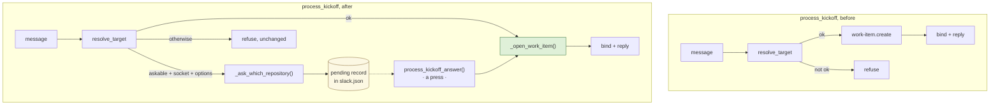
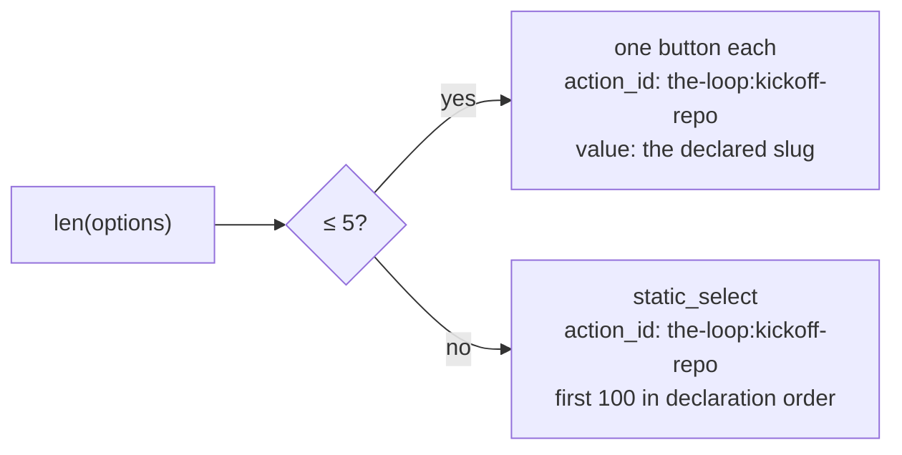
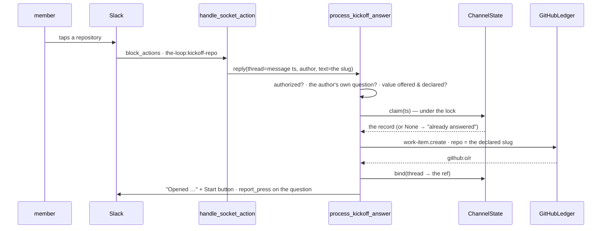

# Design: the kickoff holds its message and asks which repository

> Derived from [`requirements.md`](requirements.md). Decisions recorded as
> [decision-122](../../decisions/decision-122.md).

## The shape

One sentence: **`process_kickoff` stops being a single pass.** Where it today goes
message → resolve → create → bind → reply → return, it now forks at *resolve*, and the
fork that cannot resolve **parks the message** and asks. A press resumes at exactly the
point the fork left — `create → bind → reply` — which is why the two halves share one
function rather than two copies of the ledger call.



Four files change, and one of them is where the novelty is:

| File | What it gains |
|---|---|
| `channels/kickoff.py` | `askable` on `KickoffTarget`, uniform prefix stripping, `question_text()` |
| `channels/state.py` | a fourth map, `pending`, with a TTL, a cap and a claim |
| `channels/slack.py` | the picker's blocks, the select-menu read, the status of the ask |
| `channels/inbound.py` | the fork, `_open_work_item()`, `process_kickoff_answer()` |

## 1. The resolver decides what is askable, not what is refusable

`resolve_target` keeps every outcome it has. What it gains is **one property**, so that
the fork in `process_kickoff` is a read rather than a list of outcome names that would
have to be kept in sync with this module:

```python
@dataclass(frozen=True)
class KickoffTarget:
    ...
    @property
    def askable(self) -> bool:
        """Whether a pick could answer this. Everything unresolved except an
        empty message: no pick puts words in a message that has none."""
        return self.outcome in ("no-target", "ambiguous-repo", "unknown-repo")
```

`ok` and `askable` partition the six outcomes: `ok` covers `resolved` and `fallback`,
`askable` covers three, and `empty-message` is neither — the one refusal that survives.

**`text` becomes uniform.** Today `target.text` is the stripped message for `resolved`
and the raw message for every refusal, which was invisible because no refusal path read
it. A pick does read it, so the field now means one thing everywhere: *the message the
issue is composed from, with any prefix that was actually read stripped off.* Concretely,
`ambiguous-repo` and the qualified `unknown-repo` now carry the stripped text; `no-target`
and the fallback arm of `unknown-repo` read no prefix and so carry the message untouched.
Two consequences follow, and both are deliberate:

- An `ambiguous-repo` or qualified `unknown-repo` whose message is *nothing but the
  prefix* now resolves to `empty-message` instead. That is the correct answer — parking a
  question whose only possible outcome is an empty issue title helps nobody — and it
  moves those cases from one refusal to another.
- `refusal_text` is unchanged: it reads `prefix` and `candidates`, never `text`.

**`question_text(target)`** joins `refusal_text` as the second renderer, and is built the
same way: fixed words, the prefix quoted, no other config value and nothing else of the
member's message. One preamble per askable outcome, then one shared closing line that
teaches the prefix.

## 2. The pending record

It lives in `ChannelState` — the file that already holds this deployment's bindings and
cursors, is already locked, already capped, already `GENERATED_PATHS`-registered and
already documented in `docs/cli/state.md`. A fourth map beside three:

```jsonc
"pending": {
  "1757577600.001200": {            // the member's message ts == the thread
    "channel":  "C0123",
    "author":   "U0456",
    "text":     "flaky teardown in the batch runner",   // as the issue will read
    "options":  ["expertise-help/slim-gym", "jchou2/devbox"],
    "asked":    "2026-09-11T07:20:00Z"
  }
}
```

Keyed by the **message ts**, because that is what a press can name: a `block_actions`
payload for a question posted in the thread carries `message.thread_ts` — the member's
original message — which `handle_socket_action` already computes as `thread`.

Five methods, each one line of policy:

```python
PENDING_TTL_SECONDS = 24 * 60 * 60   # a phone-shaped window; a day-old answer
                                     # still refers to a message right above it
PENDING_CAP = 50                     # THREAD_CAP's rule, smaller: a question is
                                     # transient, a binding is not

state.ask(ts, channel_id, author, text, options)   # write one, prune, cap
state.pending(ts)          -> Optional[Dict]       # None when absent OR expired
state.claim(ts)            -> Optional[Dict]       # pop-if-live; the answer-once rule
state.restore(ts, record)  -> None                 # put a claimed one back
state.prune_pending()      -> None                 # drop the expired; called on ask
```

`pending()` treats expiry as absence (R3.2) rather than deleting on read, so a read path
never has to write. The expired record is swept by the next `ask()`.

**Answering twice is prevented by `claim`, not by a flag.** `process_kickoff_answer` opens
the state lock, pops the record, closes the lock, and *then* publishes. A second press
arriving in between finds nothing and is told the question was already answered. If the
create fails, `restore` puts it back — which lines up exactly with the existing press
report, where a landed press removes the buttons and a failed one keeps them.

`load()` gains `pending` the way it gained `conversations`: a file without the key loads
as `{}`, and `save()` writes it. No migration, no version.

## 3. Rendering the question



`render_kickoff_question(text, options)` returns the section plus one `actions` block.
Both shapes carry the **same** `action_id`, `KICKOFF_REPO_ACTION = f"{ACTION_PREFIX}kickoff-repo"`,
so the handler has one branch to grow, not two:

- **Buttons** (`≤ BUTTON_CHOICE_LIMIT`, 5) — `value` is the declared slug. A press
  arrives with a top-level `value`, which is what `handle_socket_action` already reads.
- **A select menu** (more) — Slack's `static_select` carries no top-level `value`; the
  chosen slug arrives at `actions[0].selected_option.value`. `handle_socket_action`'s
  filter is widened by one helper, `_action_value(action)`, which prefers
  `selected_option.value` and falls back to `value`. Every existing caller keeps reading
  exactly what it read.

`OPTION_LIMIT = 100` is Slack's own ceiling for a static select. Past it the question
offers the first hundred in declaration order and says the rest are reachable by typing
the prefix — a truthful statement, since the prefix resolver is untouched.

An option's `text` and its `value` are both `DeclaredRepo.declared`, capped at Slack's
75-character option limit for display only. Nothing of the member's message is rendered
into the question at all (abuse case 8): the question is fixed words plus operator
strings, so a hostile message cannot size it, style it or ping anyone through it.

## 4. The fork, and the two halves of the create

`process_kickoff` keeps its refusals and gains one branch. The condition is read in the
order a reviewer would check it:

```python
target = resolve_target(reply.text, config, cli_config)
if target.ok:
    return _open_work_item(reply, config, cli_config, target.repo, target.text, ...)
if target.askable and config.kickoff_picker and target.candidates:
    return _ask_which_repository(reply, config, target, bot)
<today's refusal, unchanged>
```

`config.kickoff_picker` is `read_mode == "socket" and kickoff_enabled` — the same
two-part rule `interactive` and `command_buttons` already use, with the grant that is
already required rather than a new one (R4, D1). The options **are** `target.candidates`, which the resolver already built and returned:
the whole declared set for `no-target` and `unknown-repo`, and for `ambiguous-repo` only
what the prefix matched (R1.2). Reusing the field the refusal already renders is what
stops the question and the refusal ever disagreeing about what is on offer — and an empty
`candidates` means nothing is declared, so a question with no options is not a question
(R5.3) and it falls to the refusal, which already has words for exactly that case.

`_open_work_item(...)` is the tail of today's `process_kickoff`, lifted verbatim: the
`Event`, the `GitHubLedger`, `publish`, the `create-failed` drop, `bind`, the reply with
its Start button, `channel.created`, the ✅. It is called from the resolved path and from
the press path, which is how R4.3 and R4.4 are true by construction rather than by
inspection.

### The press path



`handle_socket_action` routes on the `action_id` before it builds the reply for
`process_reply`, because a kickoff answer has no work item and `process_reply` would drop
it as `unmapped`. The routing is the first thing in the function after the action filter,
so the existing path is untouched below it.

Five gates, in this order, each returning a distinct drop reason:

| Gate | Reason | Why here |
|---|---|---|
| `config.kickoff_picker` | `unpublishable-event` | The channel's own permission, **re-read at press time** rather than trusted from when the question went out. An operator who revokes `work-item.create` (or leaves Socket Mode) has revoked it for the answer too — this is the one gate a pending record could otherwise smuggle a member past. |
| in `config.authorized_users` | `unauthorized-actor` | Same fail-closed rule as every other inbound; an empty allow-list denies everyone (abuse case 3). |
| `record.author == presser` | `not-your-kickoff` | The message is its author's, and the issue is opened as them. An authorized member directing someone else's message would attribute it wrongly (abuse case 4). |
| a live `pending(ts)` | `no-pending-kickoff` | Covers expired, already-answered and never-asked with one read (abuse cases 6, 7). |
| value ∈ `record.options` **and** still declared | `undeclared-repository` | Two bounds, not one: the offered set stops a value that is declared but was never on this question (abuse case 2); the declared re-check stops one the operator has since removed. What reaches the ledger is the matched `DeclaredRepo.declared` (abuse case 1). |

Gates 2 and 3 come before the record read on purpose: an unauthorized presser must
learn nothing, including whether a question exists.

### Telling the member a pick did not work

decision-111 D1 says a refusal leaves no mark. decision-120 D2 already narrowed it — *an
authorized refusal now answers* — and that narrowing is what applies here. A press that
gets past the allow-list is written back onto the question through the existing
`report_press`, whatever became of it: opened, failed to open, or refused by one of the
gates below the allow-list. The words come from a fixed table (`KICKOFF_REFUSALS`) and
name no repository, no other member and no config value — nothing the presser could not
already read on the question above it — and only a press that *opened* something takes
the picker away, so a refused one is still answerable.

Below the allow-list nothing changes: an unauthorized press edits no message, adds no
reaction and posts nothing. The reason the line is drawn there rather than at "every
drop" is the failure this whole work item exists to end: a member who taps and sees
absolutely nothing happen.

## 5. `channels status`

The `kickoff` line gains one clause, because R5.2 asks the operator to be able to find
out without a member telling them:

```text
kickoff:      (no fallback — every message must name one) (labels: none);
              a `<repo>:` prefix may name any of 12 declared repositories;
              asks which repository when a message names none
```

and, when it cannot ask, why — `read.mode is poll, so a press cannot be received` or
`nothing is declared`.

## Error handling

| Failure | Behaviour |
|---|---|
| State file corrupt / unreadable | `ChannelState.load` already resolves to empty. Nothing is pending, so a press is `no-pending-kickoff` and the member is asked again by re-posting. Never a create without an answer (abuse case 9). |
| State file unwritable | `save` already logs and swallows. The question is posted and simply cannot be answered — the fail-closed direction. |
| `chat_postMessage` fails for the question | `say` returns `False`; the record is then **removed**, so the member is not left with an invisible question that suppresses the next one (R3.7 would otherwise bite them). |
| `publish` fails after a claim | `restore`, ⚠️ press report, buttons kept, `create-failed` drop — R3.5. |
| `report_press` fails | Already never raises; the work item exists either way. |
| Slack redelivers a press | The claim is gone; `no-pending-kickoff`. At-most-once without a cursor, which the action path has never had. |

## Alternatives considered

- **Put the whole message in the button `value`.** No state at all. Rejected: Slack caps
  a value at 2000 characters, it would round-trip a member's text through a field the
  handler treats as an instruction, and it cannot express "answer once".
- **A separate `pending.json`.** Rejected by the minimalism ladder: a fourth map in a
  file with the same lifetime, the same locality, the same lock and the same cap rule is
  reuse; a second file is a second thing to register, document, prune and lock.
- **Bind the thread to a placeholder so the poll reader can see the answer.** This is the
  `poll`-mode text fallback in disguise, and it makes `work_item_for(thread)` sometimes
  lie. Rejected with D1.
- **Ask on `empty-message` too, then ask for a title.** A second question, which D2 rules
  out — and the member is one message away from doing it themselves.
- **Let any authorized member answer any question.** Rejected: it makes "who is this
  issue attributed to" a new question, for no gain the asker cannot get by pressing.

## Security design

Every trust boundary the requirements name is enforced at a named place:

- *Member text may never become a repository argument.* Enforced in
  `process_kickoff_answer`'s fourth gate: the pressed value is matched against
  `record.options` **and** `declared_repositories()`, and the string handed to the event
  is the matched `DeclaredRepo.declared`. The member's value is never passed through.
- *The question sits below the allow-list.* `process_kickoff`'s authorization check is
  above `resolve_target` today and stays there; the fork is below it, so an unlisted
  member sees no question and no repository name (R2.6 of #341, preserved).
- *No new authority.* `kickoff_picker` requires `work-item.create` — already required to
  reach this code — and `read.mode: socket`. No grant, no scope, no config key is added.
- *New data at rest.* One member's unsent message text per pending question, in a file
  that is already local-only, already excluded from anything portable, and now
  self-clearing after 24 hours and 50 records. No token, no PII beyond a Slack user id
  the file already stores.
- *Fail closed.* Every fault — unreadable state, unwritable state, an unparseable
  payload, a removed repository — moves toward refusing.
