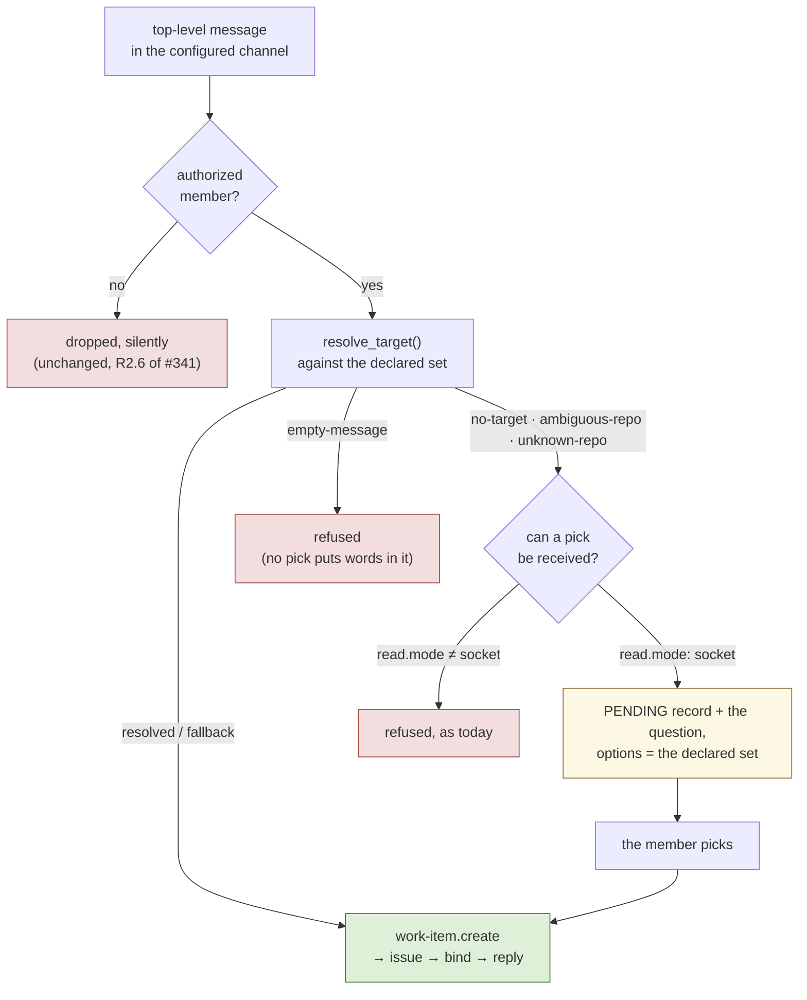

# Requirements: a Slack kickoff asks which repository, with the declared set as options

> Phase 1 of 3 (requirements → design → tasks). Following the Kiro spec approach
> (<https://kiro.dev/docs/specs/>). This phase MUST be reviewed and approved by the
> required collaborators before moving to design.

## Introduction

[Issue-349](https://github.com/MadaraUchiha-314/the-loop/issues/349). A top-level Slack
message that cannot be resolved to a repository is **refused** today, with the declared
repositories listed as prose. The refusal is correct and safe; it is also a demand that
the member read a list on a phone, pick from it, and retype their whole message with a
prefix they have never seen before.

This work item turns that refusal into a **question with the repositories as pickable
options** — and answers the question by letting the pick finish the kickoff that was
already in flight.

Three things stay exactly as they are, and the requirements below are written so that a
reviewer can check each one at a glance:

- **The universe of targets.** `declared_repositories()` over the top-level
  `repositories` key ([issue-348](https://github.com/MadaraUchiha-314/the-loop/issues/348)),
  and nothing else. A pick is a **selector into a closed set**, never a string from a
  member that reaches `gh --repo`.
- **The authority.** The existing `work-item.create` grant and the existing allow-list.
  No new grant, no new scope, no new config key.
- **The ledger path.** A pick produces the same `work-item.create` event, through the
  same `publish` → `GitHubLedger` seam, with the same record.

What is genuinely new is one thing: **the-loop asks a question of its own, and the answer
is an argument to an action it has not taken yet.** Every button the channel renders
today either answers a graph gate (Approve / Request changes) or relays a control keyword
(Execute / Start) — both about a work item that already exists. This one is not, which is
why it needs state, and the state is the bulk of what follows.

## Requirements

### Requirement 1 — the unresolved kickoff becomes a question, not a refusal

**User story:** As a member filing work from my phone, I want the-loop to ask me which
repository and show me the ones it knows, so that I do not have to learn a prefix format
to file my first issue.

The rule is one sentence, and R1.1–R1.4 are its four readings: **if a pick could answer
it, ask; otherwise refuse.**

#### Acceptance criteria (EARS)

1. WHEN an authorized member's top-level message resolves to no target (`no-target` — no
   prefix read and no `kickoff.repo`) AND a pick can be received THEN the system SHALL
   post a question in that message's thread offering every declared repository as a
   pickable option, and SHALL create nothing.
2. WHEN a read prefix names several declared repositories (`ambiguous-repo`) THEN the
   system SHALL ask the same question offering **only the repositories that prefix
   matched**, so the question is the narrow one the member already half-answered.
3. WHEN a read prefix names no declared repository (`unknown-repo` from a qualified
   prefix) OR `kickoff.repo` names none (`unknown-repo` from the fallback) THEN the
   system SHALL ask the question offering every declared repository.
4. WHEN the message resolves but nothing is left of it once the prefix is stripped
   (`empty-message`) THEN the system SHALL refuse exactly as it does today, because no
   pick puts words in an empty message.
5. WHEN a prefix already resolves to exactly one declared repository (`resolved`) OR the
   `kickoff.repo` fallback takes the message (`fallback`) THEN the system SHALL create
   the work item immediately and SHALL ask nothing — a member who typed a prefix has
   already answered the question.
6. WHILE a question is unanswered the system SHALL hold the message's text unchanged, so
   that the issue a pick opens is composed from exactly what was written, minus any
   prefix that was read.

### Requirement 2 — the question is rendered as options, sized to the set

**User story:** As a member on a phone, I want one tap, so that picking a repository is
cheaper than retyping my message.

#### Acceptance criteria (EARS)

1. WHEN the question offers at most `BUTTON_CHOICE_LIMIT` (5) repositories THEN the
   system SHALL render them as Block Kit **buttons**, one per repository.
2. WHEN the question offers more than `BUTTON_CHOICE_LIMIT` repositories THEN the system
   SHALL render a Block Kit **static select menu** instead.
3. WHEN more repositories are declared than a select menu may carry (`OPTION_LIMIT`,
   100 — Slack's own ceiling) THEN the system SHALL offer the first `OPTION_LIMIT` in
   declaration order and SHALL say in the question that the rest are reachable by typing
   the `<repo>:` prefix.
4. The rendered label of every option SHALL be the operator's **declared** slug
   (`DeclaredRepo.declared`), and the option's value SHALL be that same string — never
   anything derived from the member's text.
5. WHEN the question is rendered THEN the system SHALL also say that a `<repo>:` prefix
   skips the question next time, so the ask teaches the shortcut rather than replacing
   it.

### Requirement 3 — a pending question is held, expires, and is answered once

**User story:** As an operator, I want the state this introduces to be bounded and
self-clearing, so that an unanswered question is never a leak, a replay or a surprise.

#### Acceptance criteria (EARS)

1. WHEN a question is asked THEN the system SHALL persist a **pending kickoff** record
   keyed by the message's `ts`, carrying the channel, the asking member, the message
   text as the issue will be composed from it, the offered slugs, and the time it was
   asked.
2. WHEN a pending record is older than `PENDING_TTL_SECONDS` (24 hours) THEN the system
   SHALL treat it as absent, and SHALL remove it the next time the state is written.
3. WHEN more than `PENDING_CAP` (50) questions are outstanding THEN the system SHALL drop
   the **oldest** record, exactly as `THREAD_CAP` drops the oldest binding.
4. WHEN a pick is accepted THEN the system SHALL **remove the pending record under the
   state lock before** publishing `work-item.create`, so that two presses of the same
   question cannot open two issues.
5. IF the create then fails THEN the system SHALL restore the pending record, so the
   question stays answerable — matching the existing rule that a failed press keeps its
   buttons and a landed one removes them.
6. WHEN a pick names a repository that is not in the record's offered set, or is no
   longer declared, THEN the system SHALL create nothing and SHALL leave the record
   untouched.
7. WHEN a pending record exists for a message THEN the system SHALL NOT ask a second
   question about that same message.

### Requirement 4 — the pick rides the pipeline that already exists

**User story:** As a reviewer, I want to be able to check that a press buys nothing a
typed prefix would not, so that I can approve this without re-auditing the ingress.

#### Acceptance criteria (EARS)

1. WHEN a `block_actions` payload carries the repository picker's `action_id` THEN the
   system SHALL handle it through `handle_socket_action`, the same entry point every
   other press uses.
2. WHEN the picker's action is a select menu THEN the system SHALL read the chosen value
   from `selected_option.value`, because a `static_select` carries no top-level `value`.
3. WHEN a pick is accepted THEN the system SHALL publish exactly the `work-item.create`
   event `process_kickoff` publishes today — same `repo`, `labels`, `thread` detail, same
   `principal_for` actor, same `GitHubLedger`, same record.
4. WHEN a pick is accepted THEN the system SHALL bind the thread with origin `kickoff`
   and reply with the same "Opened …, this thread is now that work item's conversation"
   message and Start button `process_kickoff` posts today.
5. WHEN a press gets past the allow-list THEN the system SHALL write its outcome onto
   the question message through the existing `report_press` path — opened, failed to
   open, or refused — removing the picker once the work item is open and keeping it when
   it is not. The words SHALL name no repository, no other member and no config value.
6. WHEN a press arrives THEN the system SHALL re-read the channel's own permission
   (`read.mode: socket` and the `work-item.create` grant) at that moment, and SHALL
   create nothing if either has since been taken away.

### Requirement 5 — what cannot receive a pick says so

**User story:** As an operator, I want `channels status` to tell me whether my
configuration can ask this question, so that I am not told by a member who did not get
one.

#### Acceptance criteria (EARS)

1. IF `channels.slack.read.mode` is not `socket` THEN the system SHALL NOT ask the
   question, and SHALL refuse an unresolved kickoff with today's text — a question nobody
   can answer is worse than a refusal that says what to type.
2. WHEN `the-loop channels status` runs THEN the `kickoff` line SHALL say whether the
   repository question is available and, when it is not, name the reason (`read.mode` is
   not `socket`, or nothing is declared).
3. WHEN nothing at all is declared THEN the system SHALL refuse rather than ask, because
   a question with no options is not a question.

## Non-functional requirements

- **No new I/O on the hot path.** The pending read is one key in a file the pipeline
  already loads (`ChannelState`), under the lock it already takes.
- **Observability.** The two new outcomes emit through the existing `eventlog` seam:
  `channel.kickoff_asked` when a question goes out, and the existing `channel.created`
  when a pick opens the issue. A rejected pick is a `channel.dropped` with its own
  reason, like every other refusal.
- **Backward compatibility.** A configuration that is not `read.mode: socket`, or that
  resolves every message through a prefix or fallback, behaves byte-for-byte as it does
  on 14.0.0. No config key is added, so a 14.0.0 config upgrades untouched.
- **State file compatibility.** A `slack.json` written before this change has no
  `pending` map; it loads as an empty one, and is written back with the key the next time
  any writer saves.

## Security considerations

- **Actors & trust:**
  - *Untrusted:* any Slack workspace member — their message text, their `block_actions`
    payload, the `value` inside it, the `action_id`, and the user id the payload claims.
  - *Trusted:* the operator's CLI config (the declared repositories, the allow-list, the
    grants) and the state file the daemon itself writes.
- **Trust boundaries & data:** the boundary is unchanged and sits in the same place — a
  member's text may become an issue **body**; it may never become a repository
  **argument**. A pick does not move that boundary: the value is matched against the
  offered slugs and the currently declared set, and what reaches the ledger is
  `DeclaredRepo.declared`, a string from the operator's own file. The new state holds one
  new class of data — a member's unsent message text — in a file that already holds
  thread bindings; it is local, never portable, and expires.
- **Abuse cases (EARS):**
  1. WHEN a crafted `block_actions` payload carries the picker's `action_id` and a
     `value` of `../../etc` (or any string outside the offered set) THEN the system SHALL
     create nothing and SHALL record a drop.
  2. WHEN a crafted payload carries a value that **is** a real repository but was never
     offered for that message THEN the system SHALL create nothing — the record's own
     offered set is the bound, not the declared set alone.
  3. WHEN an **unauthorized** member presses the picker THEN the system SHALL create
     nothing, SHALL leave the pending record untouched, SHALL edit no message, add no
     reaction and post nothing — so they learn not even that a question exists.
  4. WHEN an **authorized** member presses the picker on a question asked about *another
     member's* message THEN the system SHALL create nothing, because the message is not
     theirs to direct and the issue would be attributed to its author.
  5. WHEN an unauthorized member posts a top-level message THEN the system SHALL ask
     nothing — the question is a bigger disclosure than a refusal, so it sits **below**
     the allow-list, exactly where the refusal already sits.
  6. WHEN the same picker is pressed twice in quick succession THEN the system SHALL open
     exactly one work item, because the record is claimed under the state lock before the
     create.
  7. WHEN a pick arrives for a record that has expired THEN the system SHALL create
     nothing and SHALL say the question has expired, naming no repository.
  8. WHEN a member's message text contains Block Kit markup, a pyramid of `@channel`, or
     3000 characters THEN the system SHALL neither render it into the question nor let it
     size the message — the question is fixed words plus declared slugs.
  9. WHEN the state file is corrupt or unwritable THEN the system SHALL behave as though
     nothing is pending: the question is asked (and simply cannot be answered) rather
     than an issue being created without one.
  10. WHEN a pick arrives after the operator has revoked `work-item.create` or left
      Socket Mode THEN the system SHALL create nothing — a pending record SHALL NOT
      carry a member past a permission the channel no longer has.
- **Fail closed:** no `read.mode: socket` → no question. No declared repositories → no
  question. A revoked grant, no pending record, an expired one, a value outside the
  offered set, an unauthorized presser, or a presser who is not the message's author →
  no work item. The
  only direction a fault can move the system is toward *refusing*, never toward creating
  an issue somewhere the operator did not declare.

## Out of scope

- **A text fallback in `poll` mode** (`reply 1, 2 or 3`) — settled as D1 on the ticket:
  the typed prefix stays the only route there, and `channels status` says so.
- **Any second question** — labels, phase selection, assignees. Settled as D2: one
  question, one record, one answer.
- **Per-repository labels.** Still the separate ask decision-120 parked.
- **A Request URL / HTTP interactivity endpoint.** decision-116 D5 stands: Socket Mode is
  the only way an interactive payload reaches the-loop.
- **Editing the pending message's text.** A member who wants to change their wording
  posts a new message; the old question expires.

## Open questions

None outstanding. The ticket's two named design decisions (D1 `poll` mode, D2 the scope
of "a series") were settled **before** this artifact was written, with the reasoning
posted to the ticket as the paper trail:
[issue-349, phase-selection comment](https://github.com/MadaraUchiha-314/the-loop/issues/349#issuecomment-5636183291).

## Review comments

> Appended by the-loop's `record-feedback` hook when a human gate approves with
> comments (issue-109).
