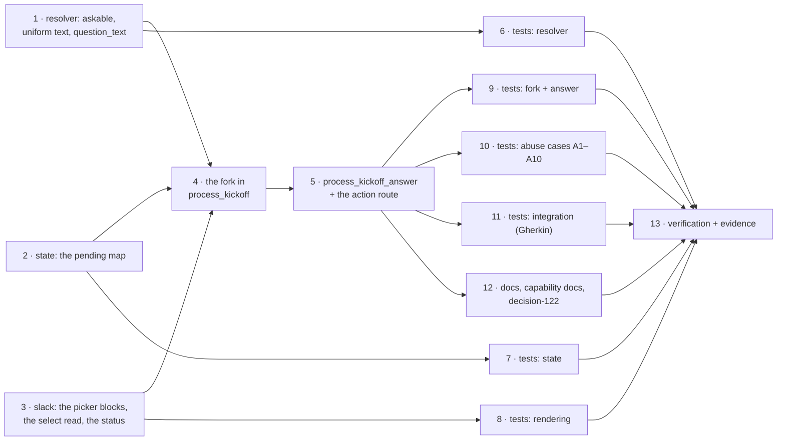

# Tasks: the kickoff holds its message and asks which repository

> Derived mechanically from the locked [`design.md`](design.md) and
> [`testing-plan.md`](testing-plan.md). No approval gate (issue-281) — it advances on
> shape alone. Each `_Test:_` names a row of the testing plan.

## Tasks

- [x] **1 · `channels/kickoff.py`: what is askable, and one meaning for `text`**
  Add `KickoffTarget.askable`. Make `_strip_prefix` apply wherever a prefix was actually
  read (`ambiguous-repo`, qualified `unknown-repo`), so `text` means "the message the
  issue is composed from" on every outcome; route a now-empty message to `empty-message`.
  Add `question_text(target)` beside `refusal_text` — one preamble per askable outcome,
  one shared closing line naming the `<repo>:` shortcut, nothing of the member's message.
  Update the module docstring's outcome table.
  _Requirements: R1.1–R1.4, R1.6, R2.5._ _Test: T1._

- [x] **2 · `channels/state.py`: the pending map**
  A fourth map, `pending`, loaded as `{}` from a file that lacks it and always saved.
  `PENDING_TTL_SECONDS = 24 * 60 * 60`, `PENDING_CAP = 50`. Methods `ask`, `pending`,
  `claim`, `restore`, `prune_pending`, with expiry read as absence and swept on write,
  and the cap dropping the oldest. Update the module docstring.
  _Requirements: R3.1, R3.2, R3.3, R3.4._ _Test: T2._

- [x] **3 · `channels/slack.py`: the picker, the select read, the status**
  `KICKOFF_REPO_ACTION`, `BUTTON_CHOICE_LIMIT = 5`, `OPTION_LIMIT = 100`;
  `render_kickoff_question(text, options)` choosing buttons or a `static_select`;
  `_action_value(action)` preferring `selected_option.value`; a `BUTTON_NAMES` entry;
  `SlackChannelConfig.kickoff_picker`.
  _Requirements: R2.1–R2.4, R4.2, R5.1._ _Test: T3._

- [x] **4 · `channels/inbound.py`: the fork and `_open_work_item`**
  Lift the create/bind/reply tail of `process_kickoff` into `_open_work_item` unchanged,
  and call it from the resolved path. Add the askable branch: options (matched candidates
  for `ambiguous-repo`, otherwise every declared slug), `kickoff_picker`, a non-empty
  option set, no record already pending — then `state.ask` + the question, with the record
  removed if the post fails.
  _Requirements: R1.1–R1.5, R3.7, R5.1, R5.3._ _Test: T4._

- [x] **5 · `channels/inbound.py`: `process_kickoff_answer` and the action route**
  Route `KICKOFF_REPO_ACTION` in `handle_socket_action` above the `process_reply` path.
  Five gates in order — the channel's own permission re-read at press time, authorized,
  the message's own author, a live record, a value in both the offered set and the
  declared set — each with its own drop reason; then claim, `_open_work_item`, restore on
  failure, and `report_press` for every press above the allow-list (`KICKOFF_REFUSALS`
  gives the refusals their words; only a press that opened something takes the picker
  away). Widen the action filter through `action_value`.
  _Requirements: R3.4, R3.5, R3.6, R4.1–R4.6; A1–A4, A6, A7, A10._ _Test: T5, T11._

- [x] **6 · Tests: the resolver** — `cli/tests/test_channels_kickoff.py`.
  _Test: T1._

- [x] **7 · Tests: the pending record** — `cli/tests/test_channel_state.py`.
  _Test: T2._

- [x] **8 · Tests: rendering and the payload read** — `cli/tests/test_channels_slack.py`.
  _Test: T3._

- [x] **9 · Tests: the fork and the answer** — `cli/tests/test_channels_inbound.py`.
  _Test: T4, T5._

- [x] **10 · Tests: abuse cases A1–A10** — one negative test each, named so the trace is
  readable from the test name alone.
  _Test: T11._

- [x] **11 · Tests: integration** — `cli/tests/test_channels_kickoff_integration.py`,
  Gherkin docstrings with `Requirement:` links, through `handle_socket_event` and
  `handle_socket_action` as they are actually composed.
  _Test: T8._

- [x] **12 · Docs, capability docs, decision-122**
  `channels status` line; `docs/cli/state.md` (the fourth map); `docs/capabilities/channels.md`
  (current behaviour + a history row); `docs/config/cli/channels-options.md` and
  `docs/guide/slack.md` (what `read.mode: socket` now also buys); the event catalog entry
  for `channel.kickoff_asked`; `docs/decisions/decisions.md`.
  _Requirements: R5.2; the skill's capability-docs and user-facing-docs rules._ _Test: T14._

- [x] **13 · Verification + evidence** — execute the testing plan, tick each activity only
  once it has run, and commit `evidence/verification.md` and `evidence/security-review.md`.
  _Test: T16, T17._
