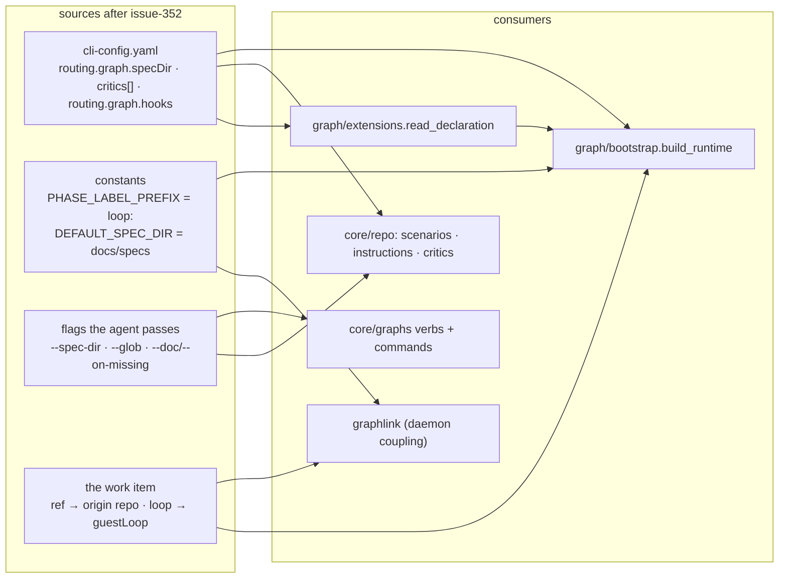

# Design: one file for the agent, one for the CLI, and flags between them

> Derived from [`requirements.md`](requirements.md). Decisions recorded as
> [decision-123](../../decisions/decision-123.md).

## The shape

One sentence: **delete the reader, and give each of its eight keys a home that is not the
repository.** The CLI had one module that opened the harness config (`harness_config.py`,
decision-044) and eight call sites that consumed what it read. Every call site is rewired
to one of three sources — the CLI config, a constant, or a flag the agent passes — and
the module is removed so the rule cannot regress quietly.

## Design points

| # | Point | Where |
|---|---|---|
| D1 | `harness_config.py` and `harness-config.default.yaml` deleted; `graphlink.adopt/_adopt/_write_default` and the dispatcher's two `adopt` calls removed; `scaffold` has no successor. | `cli/the_loop/`, `graphlink.py`, `webhook/dispatcher.py` |
| D2 | `bootstrap.resolve_spec_root(cli_cfg, override)` is the one resolution: override → `routing.graph.specDir` → `DEFAULT_SPEC_DIR`. `build_runtime` and `core.graphs._runtime` call it; `GraphLinkConfig.spec_dir` empty means the default. `--spec-dir` rides `check`/`graph` → `core.graphs.*` → API bodies (`specDir`) → SDK `Graph.*`. | `graph/bootstrap.py`, `core/graphs.py`, `commands/graph_cmd.py`, `api/routes.py`, `sdk/client.py` |
| D3 | `PHASE_LABEL_PREFIX = "loop:"` in `graph/hooks/sideeffects.py`; `set-phase-label` reads no config. | `graph/hooks/sideeffects.py` |
| D4 | `ghhost.origin_repo(root)` (the slug parser moved from `graphlink`) supplies the in-session origin; `build_runtime(origin_repo=…)` takes the daemon's word first. `graphlink._build_runtime` passes `f"{owner}/{repo}"`. | `ghhost.py`, `graph/bootstrap.py`, `graphlink.py` |
| D5 | `config["guestLoop"] = loop in GUEST_LOOPS` replaces `repoInitialized`; `Runtime.start` and `publish-artifact` key on it. | `graph/bootstrap.py`, `graph/runtime.py`, `graph/hooks/sideeffects.py` |
| D6 | `_recipients` reads `ctx.params["roles"]` only. | `graph/hooks/sideeffects.py` |
| D7 | `critics.load_critics(config_path=None)` reads the resolved CLI config with `_load_cli_config_raw(strict=True)`: absent → `[]`, unparseable → `CriticConfigError`. `core.repo.critics()` ignores `repo`; `critic_run` finds by name. | `critics.py`, `core/repo.py`, `commands/critic_cmd.py` |
| D8 | `read_declaration(cli_config)` parses `routing.graph.hooks`; `load_graph(…, declaration=)` replaces `allow_repo_hooks`; `build_runtime` parses once and applies to every runtime; `graph hooks` reports from `load_cli_config_best_effort()`. | `graph/extensions.py`, `graph/model.py`, `graph/bootstrap.py`, `commands/graph_cmd.py` |
| D9 | `core.repo.scenarios(globs)` → defaults when empty; `core.repo.instructions(repo, docs, on_missing)` builds the mapping `instructions.collect_docs` already reads; the command parses `--doc` (path or JSON object) and `--on-missing`; the API route and SDK/MCP gain the parameters. | `core/repo.py`, `commands/instructions_cmd.py`, `commands/scenarios.py`, `api/routes.py`, `api/mcp.py`, `sdk/client.py` |
| D10 | Schemas: harness schema loses nine keys and rewrites its onboarding groups; CLI schema gains `critics` (the old items, minus object examples the runtime validator cannot walk, `timeoutSeconds.minimum: 1`) and `routing.graph.hooks`, loses `repoHooks`, defaults `specDir` to `docs/specs`; `cli/the_loop/schemas/` copies follow. `migrations.CURRENT_CONFIG_VERSION = "0.9.0"`; `_retire_repo_hooks` pops the key and notes where critics and hooks live. | `.the-loop/*.schema.json`, `cli/the_loop/schemas/`, `migrations.py` |
| D11 | Configs/templates: harness `0.3.0` without the removed blocks; CLI `0.9.0` with `critics: []` and `routing.graph.{specDir, hooks}` commented; `validate_config.py` drops the packaged-default target; `hooks.json` and `rules/the-loop.mdc` both test for `harness-config.yaml`. | `.the-loop/`, `skills/the-loop/templates/`, `scripts/`, `hooks/`, `rules/` |
| D12 | Skill and commands: `SKILL.md` § Configuration rewritten with the key → flag table; `reviewing.md`, `automation.md`, `collaboration.md`, `workflow.md`, `tooling.md`, `instructions.md`, `testing.md`; `init.md` step 4 from the graph, `upgrade-the-loop.md` migration block, `<phaseLabelPrefix>` → `loop:` everywhere. | `skills/`, `commands/` |
| D13 | Docs: `docs/config/harness-config.md` rewritten around "what moved where"; `critics-options.md` new; `routing-options.md` `graph.hooks.*` + `graph.specDir`; command pages; capabilities with history rows; decision-123 supersedes decision-044. | `docs/` |

## Security design

- **No read, no injection surface.** A1–A3 of the requirements are closed by D1: there is
  no parser to reach with a crafted value.
- **Executable configuration in the operator's file only.** D7/D8 move both blocks; the
  CLI config joins this repository's `sensitivePaths`. The `critics` schema keeps
  `env` a string map and says "never a secret".
- **Ownership proof unchanged.** `_checkout_belongs_to` still gates the daemon's coupling
  on the `origin` remote (A4); `_is_contained` still bounds the operator's `specDir` (A3).
- **`--doc` JSON is a selector of two fields.** `collect_docs` reads `path` and `notes`;
  a doc's body never reaches the report (issue-132's boundary, unchanged).

## Testing strategy

The testing plan is [`testing-plan.md`](testing-plan.md). The centre of gravity is the
negatives: a committed critic is inert, an undeclared hook module is never imported, a
checkout's `workflow.specDir` is not consulted, and no verb writes into `.the-loop/`.
