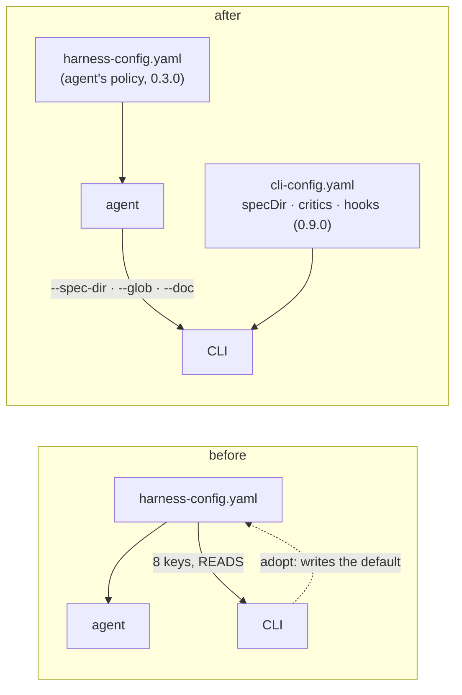

# Requirements: the harness config is the agent's alone — the CLI reads no key of it

> Phase 1 of 3 (requirements → design → tasks). Following the Kiro spec approach
> (<https://kiro.dev/docs/specs/>). This phase MUST be reviewed and approved by the
> required collaborators before moving to design.
>
> **How this work item got here.** It began as an audit
> ([`docs/reports/harness-config-audit.md`](../../reports/harness-config-audit.md)):
> which systems read `.the-loop/harness-config.yaml`, how each key is enforced, and
> whether the file is needed. The owner's review of that audit on
> [PR #353](https://github.com/MadaraUchiha-314/the-loop/pull/353) turned it into a
> breaking change, and these requirements are that change. The audit's findings are the
> evidence behind each requirement and are not repeated here.

## Introduction

[Issue-352](https://github.com/MadaraUchiha-314/the-loop/issues/352), and the owner's
review on PR #353:

> Let's remove most of the harness-config. Additionally the CLI shouldn't read any of
> the harness config. the-loop's skill should tell the coding harness (cursor/claude/codex)
> about the config and how to use it. CLI shouldn't depend on it at all. Make this
> breaking change.

with six inline rulings on the audit's per-key table: `ticketing` — *"Not needed. Users
can use whatever ticketing system they want. Repository shouldn't enforce"*;
`workflow.phaseLabelPrefix` — *"remove"*; `workflow.requireHumanReviewPerPhase` —
*"delete"*; `localOrchestration` — *"remove this. not needed."*; `reviews.critics[]` —
*"this should be moved to cli-config."*; `notifications` — *"delete"*.

A second review of the shrunken file (PR #353, 2026-09-12 07:18Z) went further —
*"remove all the bs in harness config pls"* — with one ruling per remaining policy
block: `autonomy`, `security`, `tdd`, `minimalism`, `tokenEconomy`, `selfImprovement`,
`contextManagement`, `userInteraction` — *"we should remove it"* — and `externalTools`
— *"no need to declare external tools. the harness can auto discover it"*. Those blocks
configured behaviour that is simply the loop's rule; the rules stay, as the skill's, and
the keys go (R3.5).

Until this change the CLI read eight keys of a repository's harness config through one
declared, test-pinned module ([decision-044](../../decisions/decision-044.md)), wrote
the-loop's default harness config into an unconfigured checkout before spawning a
session there (issue-193, issue-201), and kept `workflow.phases` faithful to the graph by
a parity test. After it, the file is read by the agent and by nothing else.

## Requirement 1 — The CLI does not open a repository's harness config

**User story:** As the operator, I want every `the-loop` command and daemon to take its
configuration from my own `cli-config.yaml` and from its arguments, so that no checkout
can configure the tool I run and no file I did not write is read on my behalf.

### Acceptance criteria (EARS)

1. THE CLI SHALL contain no code path that opens `.the-loop/harness-config.yaml` or the
   pre-rename `.the-loop/config.yaml` in any checkout. (AC1.1)
2. WHEN a repository's harness config declares a critic, a graph hook, a spec directory,
   a ticketing repository or a notification filter THEN the CLI SHALL behave exactly as if
   the file were absent. (AC1.2)
3. THE CLI SHALL NOT write a harness config into any checkout: the adopt-on-spawn path and
   the packaged default are removed, and the `harness.config_scaffolded` event leaves the
   catalog. (AC1.3)
4. WHEN `the-loop check`, `graph`, `scenarios`, `instructions` or `critic` runs in a
   checkout with no CLI config anywhere THEN it SHALL run on defaults, as before. (AC1.4)

## Requirement 2 — What the CLI needed has another source

**User story:** As the operator, I want the spec directory, the critic roster and the
graph hooks in my CLI config, and the rest passed on the command line, so that the CLI
loses no capability when it loses the harness-config read.

### Acceptance criteria (EARS)

1. THE spec directory SHALL resolve as `--spec-dir` (on `check` and `graph`, carried
   through the API bodies and the SDK), else `routing.graph.specDir` (default
   `docs/specs`), else `docs/specs` — one value for every checkout an instance drives, and
   the same value for the coupling's skip decision and the runtime it builds. (AC2.1)
2. THE phase label SHALL be `loop:<phase>`, a constant. (AC2.2)
3. THE origin repository SHALL be the work item's own when the daemon builds the runtime
   (passed from the ref), else the checkout's `origin` remote, else unknown — in which
   case no ref is derived and the failure names both remedies. (AC2.3)
4. A contribution or a review (`GUEST_LOOPS`) SHALL keep its spec tree out of git and post
   its plan to the thread; the work item's own loops SHALL do neither — keyed on the loop
   (`guestLoop`), never on the checkout. (AC2.4)
5. THE `notify` hook SHALL read roles only from the node's `with:`. (AC2.5)
6. THE critic roster SHALL be the CLI config's top-level `critics[]`, same entry shape as
   before, read strictly from the resolved CLI config; `reviews.criticReviewCount` SHALL
   stay in the harness config. (AC2.6)
7. THE graph hooks SHALL be the CLI config's `routing.graph.hooks`, same shape, a `path`
   resolving against each checkout; `routing.graph.repoHooks` SHALL be removed and
   migrated; `the-loop graph hooks` SHALL report the CLI config's declaration without
   importing it. (AC2.7)
8. `the-loop scenarios` SHALL search `--glob` patterns, else the built-in defaults;
   `the-loop instructions` SHALL check the `--doc` entries (a path, or a JSON object
   carrying `path` and `notes`) under `--on-missing`, and SHALL refuse a `--doc` that
   starts like JSON and is not. (AC2.8)

## Requirement 3 — The harness config shrinks to the agent's policy

**User story:** As a repository owner, I want the harness config to hold only what the
agent reads about how work is done here, so that nothing in it pretends to govern a tool
that does not read it.

### Acceptance criteria (EARS)

1. THE schema, the template and this repository's config SHALL drop `ticketing`,
   `workflow.phases`, `workflow.phaseLabelPrefix`, `workflow.specApproach`,
   `workflow.requireHumanReviewPerPhase`, `localOrchestration`, `notifications`,
   `reviews.critics` and `graph`, and SHALL carry `version: "0.3.0"`. (AC3.1)
2. THE schema's onboarding groups SHALL name only keys that exist. (AC3.2)
3. THE CLI config schema SHALL gain `critics[]` and `routing.graph.hooks`, lose
   `routing.graph.repoHooks`, default `routing.graph.specDir` to `docs/specs`, and carry
   `version: "0.9.0"`; `the-loop migrate-config` SHALL strip `repoHooks` and say where
   critics and hooks live now. (AC3.3)
4. EVERY new CLI-config leaf SHALL be documented under `docs/config/cli/` with its type
   and default. (AC3.4)
5. THE schema, the template and this repository's config SHALL also drop `autonomy`,
   `security`, `tdd`, `minimalism`, `tokenEconomy`, `selfImprovement`,
   `contextManagement`, `userInteraction` and `externalTools`; the behaviour each
   configured SHALL be stated as the skill's fixed rule in the reference file that
   owns it (risk tiers and sensitive paths, the security gates, TDD, minimalism, the
   token economy, learnings, context management, the writing contract), and the
   harness SHALL discover its own tools. (AC3.5)
6. WHEN a document, command or docstring names one of those keys as configuration,
   THE text SHALL state the rule instead — nothing shipped refers to a key that does
   not exist. (AC3.6)

## Requirement 4 — The skill tells the harness

**User story:** As the coding harness, I want the skill to tell me what the harness config
is for and what to hand the CLI, so that I pass the flags the CLI no longer reads for
itself.

### Acceptance criteria (EARS)

1. `SKILL.md` § Configuration SHALL state that the file is the agent's and that the CLI
   never reads it, and SHALL map each key the CLI once read to the flag or CLI-config key
   that carries it now. (AC4.1)
2. THE reference files and commands that named `reviews.critics[]`, `graph.hooks`,
   `notifications.events`, `workflow.phases`, `<workflow.phaseLabelPrefix>` or
   `localOrchestration` SHALL be updated; `/the-loop:init` SHALL create labels from the
   graph's phases; `/the-loop:upgrade-the-loop` SHALL carry the `0.3.0`/`0.9.0`
   migration. (AC4.2)
3. THE Claude SessionStart hook and the Cursor rule SHALL both test for
   `.the-loop/harness-config.yaml`. (AC4.3)

## Requirement 5 — The record

1. THE change SHALL be recorded as a decision superseding decision-044, the affected
   capability docs SHALL gain a history row, and the audit report SHALL say what became
   of its recommendations. (AC5.1)

## Out of scope

- Moving `observability.browserLogging` — the owner ruled on no such row; it stays
  agent-read policy. (`tokenEconomy` and `externalTools` were out of scope until the
  second review; R3.5 now removes them.)
- Per-repository spec directories under one instance. One value per instance is the
  accepted cost; an operator with two layouts runs two instances.
- A `the-loop graph phases` command. `/init` lists the phases from the graph file the
  CLI already ships; a command is a later nicety.

## Security considerations

Threat-model-lite for the change itself:

| # | Abuse case | Disposition |
|---|---|---|
| A1 | A pull request to a repository adds a `reviews.critics[]` entry whose `command` is hostile, hoping the daemon runs it. | Closed by construction: the CLI never reads the file. A committed critic entry is inert (T5). |
| A2 | A checkout carries a hook module the operator never declared, hoping `load_graph(repo=…)` imports it. | Nothing is imported without a declaration in the operator's CLI config (T6). |
| A3 | A checkout's `workflow.specDir` names `../elsewhere` to steer a write outside the checkout. | The CLI does not read it. The operator's own `specDir` is still contained by `_is_contained` (T7). |
| A4 | A forged `origin` remote in a foreign checkout makes the daemon drive a graph there. | Unchanged gate: `_checkout_belongs_to` must match the work item's repository first (T8). |
| A5 | The migration silently drops an operator's `repoHooks: false`, re-enabling hooks they refused. | There is nothing to re-enable: hooks run only when declared in the CLI config, and the migration report says so (T9). |
| A6 | A `--doc` value that is JSON smuggles a key other than `path`/`notes`. | `collect_docs` reads `path` and `notes` only; other keys are ignored, and a doc's body never reaches the report (T10). |

`.the-loop/**` is one of the skill's fixed sensitive paths (the `autonomy.sensitivePaths`
key is gone with R3.5), so an edit to either config raises the tier; `cli-config.yaml`
matters most because `critics[]` and `routing.graph.hooks` are executable configuration.

## Risk tier

**Tier 4** (`human-approves-pr`, and a named human security sign-off — the fixed rule
at tier 4 and above): two schemas change, executable configuration
moves files, the daemon's coupling changes behaviour, and `.the-loop/harness-config.yaml`
is a sensitive path. The owner's review on PR #353 is the named decision; their approval
of the PR is the sign-off.
