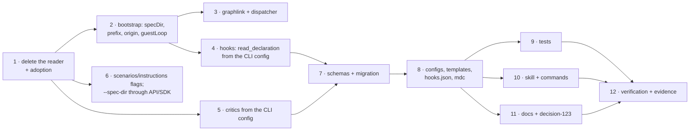

# Tasks: delete the reader, re-home its eight keys, tell the harness

> Derived mechanically from the locked [`design.md`](design.md) and
> [`testing-plan.md`](testing-plan.md). No approval gate (issue-281) — it advances on
> shape alone. Each `_Test:_` names a row of the testing plan.

## Tasks

- [x] **1 · Delete `harness_config.py`, the packaged default, and adoption** — remove the
  module, `harness-config.default.yaml`, `graphlink.adopt/_adopt/_write_default`,
  `_ADOPTING_ACTIONS`, the dispatcher's two `adopt` calls, the scaffold in
  `core.graphs._runtime`, and the `harness.config_scaffolded` catalog entry. _Test:_ T11.
- [x] **2 · `graph/bootstrap.py`** — `DEFAULT_SPEC_DIR`, `load_cli_config_best_effort`,
  `resolve_spec_root`; `build_runtime(origin_repo=…)` with `guestLoop`, `originRepo`
  from the argument or `ghhost.origin_repo`; `PHASE_LABEL_PREFIX` in `sideeffects`;
  `_recipients` from params; `Runtime.start` on `guestLoop`. _Test:_ T6.
- [x] **3 · `graphlink.py` and the dispatcher** — `_spec_dir()` from the CLI config,
  `_build_runtime(origin_repo=…)`, the slug parser moved to `ghhost.repo_slug`. _Test:_ T5.
- [x] **4 · `graph/extensions.py` + `graph/model.py`** — `read_declaration(cli_config)` on
  `routing.graph.hooks`; `load_graph(declaration=…)`; `graph hooks` reports the CLI
  config. _Test:_ T1, T8.
- [x] **5 · `critics.py` + `core/repo.py` + `critic_cmd.py`** — `load_critics(config_path)`
  from the CLI config, strictly; `find_critic(name, path)`; messages name `critics[]`.
  _Test:_ T2, T3, T8.
- [x] **6 · `scenarios`, `instructions`, `--spec-dir`** — `core.repo.scenarios` defaults;
  `core.repo.instructions(docs, on_missing)`; `--doc` (path or JSON) + `--on-missing`;
  `--spec-dir` on `check`/`graph` through `core.graphs`, the API bodies and the SDK.
  _Test:_ T3, T4, T8.
- [x] **7 · Schemas + migration** — harness schema minus nine keys, groups rewritten; CLI
  schema with `critics`, `routing.graph.hooks`, no `repoHooks`, `specDir` default; packaged
  copies; `CURRENT_CONFIG_VERSION = "0.9.0"` and `_retire_repo_hooks`. _Test:_ T7, T9.
- [x] **8 · Configs, templates, existence checks** — this repo's and the template harness
  config at `0.3.0`; this repo's and the template CLI config at `0.9.0` with `critics` and
  `routing.graph`; collaborators text; `validate_config.py`; `hooks.json`; `rules/the-loop.mdc`;
  `loops.py`'s origin message. _Test:_ T9, T11.
- [x] **9 · Tests** — delete `test_harness_config*.py`; rewrite extensions, critics,
  core-repo, cli, instructions, graphlink, contribution, review, refs, loops, ghhost,
  drive, parity (drop P4), cleanup, channels, manifest, lifecycle tests; fixtures to
  `0.9.0`. _Test:_ T1–T9.
- [x] **10 · Skill + commands** — `SKILL.md` § Configuration; `reviewing.md`,
  `automation.md`, `collaboration.md`, `workflow.md`, `tooling.md`, `instructions.md`,
  `testing.md`; `init.md`, `upgrade-the-loop.md`, `work-on.md`, `execute-tasks.md`,
  `create-ticket.md` and the `<phaseLabelPrefix>` commands. _Test:_ T11 (markdownlint).
- [x] **11 · Docs + decision** — `docs/config/harness-config.md`, `docs/config/index.md`,
  `critics-options.md`, `routing-options.md`, `migrate-config.md`, command pages,
  `hooks.md`, `concepts.md`, CLI index, capabilities with history rows, decision-123,
  decision-044 superseded, the audit's outcome note, `cli/README.md`. _Test:_ T9 (docs
  parity), T11.
- [x] **13 · The second review: the policy blocks** — drop `autonomy`, `security`, `tdd`,
  `minimalism`, `tokenEconomy`, `selfImprovement`, `contextManagement`,
  `userInteraction`, `externalTools` from the schema (and their `$defs`), the template
  and this repo's config; rewrite the onboarding groups; state each rule in its
  reference file; fix every command, docstring, capability doc and config page that
  named a key; `test_writing_parity` without the schema read. _Test:_ T9, T11.
- [x] **14 · The third review: inferred facts and the review policy** — drop
  `repository`, `tooling`, `hooks`, `observability` from the harness schema, template
  and config; `reviews` to the CLI schema/config/template; `load_review_policy`,
  `core.repo.review_policy`, `critic policy`, the API route in the authored contract,
  SDK and MCP; `/init` and `onboarding.md` without the inferred groups;
  `reference/tooling.md`'s detection as the per-session procedure; every reference in
  the skill, commands and docs. _Test:_ T2, T3, T9, T11.
- [x] **15 · The fourth review: the doc trees** — drop `workflow` from the harness schema,
  template and config; the literal paths in the skill, commands, templates and docs;
  `routing.graph.specDir` described as the departure from the convention; `/init` and
  `upgrade-the-loop` accordingly. _Test:_ T9, T11.
- [x] **12 · Verification + evidence** — `make check`; the grep; `evidence/verification.md`
  and `evidence/security-review.md`; execution log; PR body. _Test:_ all.
