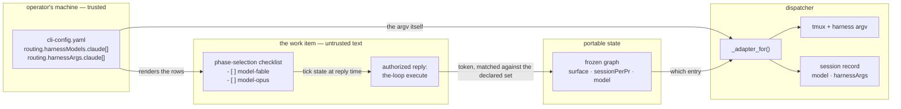
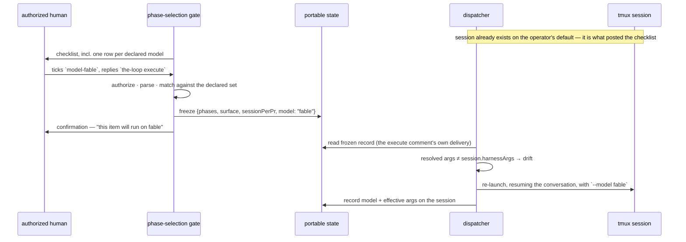

# Design: per-work-item model choice, answered at the phase-selection gate

> Phase 2 of 3 (requirements → design → tasks). Derives from
> [`requirements.md`](requirements.md). MUST be reviewed and approved before moving to
> tasks breakdown.
>
> **Presented for approval together with the requirements.** No authorized
> `the-loop execute` reaches a cloud session, so neither gate can be answered here; the
> owner asked to approve the design before any implementation, and this document is that
> ask. Nothing below is implemented.

## Overview

**A model choice is a fourth question on the phase-selection checklist, resolved against a
closed set the operator declared, frozen by the same signed reply, and read at spawn time
by the dispatcher exactly as `sessionPerPr` already is.**

The change reuses three mechanisms that already exist and adds no fourth:

| Existing mechanism | What it already does | What this work item adds |
|---|---|---|
| `phase-selection` ([selection.py](../../../cli/the_loop/graph/hooks/selection.py)) | asks three per-work-item questions, freezes the answers on one authorized reply | a `model-*` row group |
| the frozen record (`control_store.frozen_graph`) | carries `surface` and `sessionPerPr` | carries `model` |
| `_tmux_for` ([dispatcher.py](../../../cli/the_loop/webhook/dispatcher.py)) | overrides one operator default per work item | `_adapter_for` overrides `harnessArgs` the same way |

The only genuinely new object is the **declaration**: `routing.harnessModels`, a per-harness
list of pickable models in the operator's CLI config. It is the answer to the owner's
first question — the-loop discovers nothing.



Read the two arrows into `_adapter_for` together: the work item chooses **which declared
entry**, and the operator's config supplies **the argv**. No string from a comment is ever
part of a command line.

## Architecture

### Where each piece lives

| Component | File | Status |
|---|---|---|
| the vocabulary: declared models, resolution, merge | `cli/the_loop/harnessmodels.py` | new |
| the adapter's model flag, asked by name | `cli/the_loop/harness/__init__.py` | extended |
| an adapter copy carrying different args | `cli/the_loop/harness/base.py` | extended |
| the checklist rows, the parse, the frozen key | `cli/the_loop/graph/hooks/selection.py` | extended |
| seeding the hook's config | `cli/the_loop/graph/bootstrap.py` | extended |
| resolution at spawn / respawn / drift | `cli/the_loop/webhook/dispatcher.py` | extended |
| the two recorded fields | `cli/the_loop/sessions/registry.py` | extended |
| the `Model` column | `cli/the_loop/commands/sessions_cmd.py` | extended |
| the JSON contract | `cli/the_loop/api/routes.py`, `docs/api-specs/openapi/the-loop.v1.yaml` | extended |
| the declaration's schema | `cli/the_loop/schemas/cli-config.schema.json` | extended |

`harnessmodels.py` exists for the reason `prsessions.py` exists: its two readers cannot see
each other. The selection hook cannot import the dispatcher — `dispatcher → graphlink →
graph` makes that a cycle — and a second copy of the resolution rule is how the checklist
and the daemon come to disagree about what `fable` means. The module imports no ingress and
no graph; it asks `the_loop.harness` one question (`model_flag(name)`) and otherwise reads
only mappings.

### The life of one choice



The re-launch on drift (R4.3) is the design's one real cost, and it is what makes the
choice take effect at all: the gate is answered *after* a session exists, because the
session is what posts the checklist. A resume keeps the conversation, so the item loses
nothing but a few seconds of boot — and in the common case the re-launch happens on the
execute comment's own delivery, before any work has been done.

## Components & interfaces

### `harnessmodels.py` — the vocabulary

```python
@dataclass(frozen=True)
class DeclaredModel:
    """One pickable model, exactly as the operator declared it."""
    id: str                 # the token the checklist renders and a reply names
    harness: str            # which harness it is declared under
    args: Tuple[str, ...]   # resolved argv: the entry's own, else (model_flag, id)
    about: str = ""         # one line rendered beside the row

def declared_models(cli_config: Mapping, harness: str) -> List[DeclaredModel]: ...
def resolve_model(token: str, declared: Sequence[DeclaredModel]) -> Optional[DeclaredModel]: ...
def effective_args(base: Sequence[str], chosen: Optional[DeclaredModel]) -> List[str]: ...
```

- `declared_models` is **fail-closed in the shrinking direction**, the rule `repos.py`
  already follows: a malformed entry contributes nothing, so a fault can only remove a
  choice — it can never invent one.
- `resolve_model` matches on `id`, exactly, case-sensitively. It takes the declared list as
  an argument rather than re-reading config, so every caller is provably resolving against
  the same set it rendered.
- `effective_args` is `list(base) + list(chosen.args)` and nothing else (R3.1, R3.2).

### `routing.harnessModels` — the declaration

```yaml
routing:
  harnessArgs:
    claude: ["--dangerously-skip-permissions"]     # unchanged, still applies to everything
  harnessModels:                                   # NEW (issue-358)
    claude:
      - id: fable
        about: fast and cheap — good for small, well-specified items
      - id: opus
        about: the default for anything with real design in it
      - id: opus-deep                              # the "effort" axis, same mechanism
        args: ["--model", "opus", "--thinking", "high"]
    cursor:
      - id: gpt-5.5
```

An entry with no `args` resolves to `[<adapter.model_flag>, <id>]` — `--model fable` for
Claude Code, `-m gpt-5.5` for Cursor (R2.3). An entry with `args` is taken verbatim, which
is what lets a harness the-loop has no model flag for, or a choice that is a model *and* an
effort, ride the same list without a second key (R2.5 rejects the third case: no `args` and
no flag is a config error, named at validation).

The key sits beside `harnessArgs`, `harnessTrust` and `harnessPlugins` because it is the
same kind of thing — per-harness operator policy — and in `cli-config.yaml` rather than the
harness config because it is executable configuration on the machine that runs the daemon,
which decision-123 already settled for `critics[]`.

### `selection.py` — the rows, the parse, the freeze

Four changes, each mirroring what `pr-sessions-*` does today:

1. **Tokens.** `MODEL_TOKENS = {f"model-{m.id}": m.id for m in declared}`, added to
   `_NON_PHASE_TOKENS` so a model row is never read as a phase skip and never as a refusal.
2. **Rendering.** A section of its own, below the `pr-sessions-*` rows, rendered only when
   the harness has declared choices (R1.6), capped at `CANDIDATE_LIMIT` with an
   "…and N more" line (R2.4). The operator's default — meaning "no entry", i.e. plain
   `harnessArgs` — is described in the section's prose rather than given a row, so there is
   nothing to tick for "leave it alone".
3. **Parse.** `_parse_model(body, declared) -> str`: exactly one ticked row is a choice;
   zero, several, an unknown token, or an unreadable body is `""` (R1.4).
4. **Freeze and confirm.** `_frozen_graph` gains `"model": <id or "">`, and the
   confirmation comment names the outcome in both directions (R1.5).

`""` is the right literal for "no choice", and it is deliberately *not* the id of a default
entry: the frozen record then says "this item chose nothing", which is what makes a later
change to the operator's default apply to it.

### `dispatcher.py` — resolution, and the drift check

```python
def _adapter_for(self, work_item: WorkItemRef, harness: str) -> Optional[HarnessAdapter]:
    """The operator's adapter with THIS work item's own model applied."""
```

The body is `_tmux_for`'s, one field over: read `control_store.frozen_graph(work_item)`,
take `model`, resolve it against `declared_models(config, harness)`, and return
`adapter.with_args(effective_args(adapter.extra_args, chosen))` — or the adapter itself when
there is no choice, so the no-choice path allocates nothing and behaves identically to today
(R6.1). Every failure — unreadable record, unknown id, no declaration — returns the adapter
unchanged and logs once (R4.5).

`HarnessAdapter.with_args(args)` returns a shallow copy sharing `trust` and `plugins`. It is
a method rather than a `replace()` at each call site so that an adapter subclass can never
be rebuilt with half its configuration.

Three call sites switch from `self.adapters.get(...)` to `self._adapter_for(...)`:
`_spawn_for`, `_spawn_endpoint` and `_respawn_tmux` — which is the whole of R4.1 and R4.2,
because a respawn already re-derives everything else from the record rather than from the
dead session.

**The drift check** (R4.3) sits at the top of the deliver-into-a-live-session path: if the
session record's `harnessArgs` differ from the resolved ones, the delivery becomes a respawn
(resume) instead of a paste, and emits `session.model_changed` with both values (R4.4). It
compares *recorded* against *resolved*, never against the config, so a session launched
before this change (no recorded args) is left alone until something else respawns it.

### The session record

```json
{
  "harness": "claude",
  "harnessSessionId": "…",
  "model": "fable",
  "harnessArgs": ["--dangerously-skip-permissions", "--model", "fable"]
}
```

Both keys are **omitted when empty**, so every record written before this change round-trips
byte-identically and parses unchanged (R5.4) — the rule `pullRequests` already follows.
`the-loop sessions list` gains a `Model` column showing `-` when absent (R5.2), and the two
fields appear in the JSON form, the control-plane API response and the OpenAPI contract
(R5.3), which this repository regenerates its API documentation from.

## UI/UX design

N/A — no product UI. The two human surfaces are text: the checklist section rendered by
`selection.py`, and the `Model` column in `sessions list`. Both are specified above in the
form they are read in.

## Data models

| Where | Key | Type | Default | Validated by |
|---|---|---|---|---|
| `cli-config.yaml` | `routing.harnessModels.<harness>[]` | `{id, args?, about?}` | absent | `cli-config.schema.json` + `scripts/validate_config.py` |
| portable frozen graph | `model` | string | `""` | re-validated on read against the declared set |
| session record | `model` | string | omitted | — |
| session record | `harnessArgs` | string[] | omitted | — |

Schema constraints worth stating because they are the guard, not decoration: `id` matches
`^[A-Za-z0-9][A-Za-z0-9._:-]*$` (so an id can never be a flag, a path or a shell fragment),
ids are unique within a harness, and `args` is an array of strings with no placeholder
substitution of any kind — unlike `critics[].args`, nothing here is templated, so there is
no `{…}` to expand.

## Error handling

| Situation | Behaviour | Surfaced as |
|---|---|---|
| declared entry with no `args` and a harness with no model flag | config validation fails, naming the entry | `the-loop diagnose` / `validate_config.py`, at startup — never at spawn (R2.5) |
| `harnessArgs.<harness>` already carries the same flag | validation warns, naming both | as above (R3.4) |
| reply ticks several model rows | the operator's default | named in the gate's confirmation comment (R1.4) |
| reply names an undeclared token | the operator's default | debug log; the token never reaches argv (R2.2) |
| frozen record unreadable, or names an id no longer declared | the operator's default | one `warning`, same shape as `_tmux_for`'s (R4.5) |
| the checklist comment cannot be read at execute time | the operator's default | existing warning path, unchanged |

Every row resolves to *the operator's configuration unchanged*. There is no failure mode in
which the-loop runs a session on a model nobody declared.

## Security design

- **AuthN/AuthZ:** none added. The model row is authorized by the reply that carries the
  execute keyword — `routing.authorizedUsers`, the same boundary the phase skips, the
  surface and `sessionPerPr` already answer to, with the-loop's own self-marked comments
  dropped before authorization is considered.
- **Input validation & injection surfaces:** the one untrusted ingress is the checklist
  body. It is matched by `_CHECK_LINE` — an existing regex whose token grammar admits no
  whitespace, quotes or metacharacters — and the token is then used as a **key into the
  operator's declared list**. What reaches argv is `DeclaredModel.args`, built from
  `cli-config.yaml`. Command injection is therefore not mitigated but *absent*: there is no
  data path from comment text to a command line. Nothing is run through a shell (tmux is
  execed with an argv), and no value is interpolated into a path, a prompt or a ref.
- **Secrets handling:** none involved. A model id is not a credential, and this work item
  reads and writes no secret, token or environment variable.
- **Least privilege:** a model choice contributes only the arguments its declaration
  carries (R3.3). the-loop adds no permission flag of its own here, which is the same
  promise `harnessArgs` already makes and the reason `harnessTrust.acceptBypassPermissions`
  defaults to following the operator's own args rather than widening them.
- **Fail-closed behaviour:** every ambiguity resolves to `routing.harnessArgs.<harness>`
  unchanged — the operator's stated configuration, which is the closed direction here (the
  *narrowest* model would be a different and wrong reading of "closed": it would let a
  malformed reply silently downgrade a tier-5 work item's model).
- **Abuse-case coverage:**

  | Abuse case (requirements) | Mechanism | Negative test |
  |---|---|---|
  | A1 unauthorized user ticks and executes | existing `_authorized_comments` filter, upstream of any parse | `test_selection.py::unauthorized_reply_freezes_nothing` |
  | A2 reply names a flag / path / metacharacter | token grammar + lookup into the declared set | `test_harnessmodels.py::undeclared_token_resolves_to_default` |
  | A3 a declared entry widens permissions | applied as declared, and only from the declaration | `test_harnessmodels.py::args_come_only_from_config` |
  | A4 hand-edited portable record | re-validated on read against the declared set | `test_dispatcher_model.py::forged_frozen_model_is_ignored` |
  | A5 a label named after a model | no label is read anywhere in this path | `test_dispatcher_model.py::label_does_not_select_a_model` |
  | A6 checklist comment unreadable | existing empty-body path resolves to the default | `test_selection.py::unreadable_checklist_keeps_the_default` |

## Testing strategy

Unit tests carry the resolution rules (`harnessmodels.py`: declaration parsing, unknown
tokens, the `args`-vs-`model_flag` fork, the merge order) and the schema validation
(`validate_config.py` rejecting an entry with no flag and no args, warning on a duplicated
flag). Selection-hook tests cover rendering (rows present only when declared, capped,
default described in prose), parsing (one tick, no tick, two ticks, unknown token) and the
frozen record. Dispatcher tests cover spawn, respawn and drift with a fake registry and a
stub tmux, plus every abuse case above as a negative test.

Two integration scenarios carry Gherkin docstrings under `cli/tests/test_*_integration.py`
per `testing.integrationTestGlobs`:

- `Scenario: a work item that chose a model is respawned on it` — freeze a choice, kill the
  session, deliver an event, assert the argv the runner was handed.
- `Scenario: an unauthorized reply cannot choose a model` — same setup, unauthorized author,
  assert the frozen record and the argv are untouched.

Evidence: the argv assembled at each spawn (captured from the stubbed runner), the
before/after `sessions list` table, and the config-validation output for the two rejected
declarations. The executable detail — the full matrix, the verification environment, the
`n/a` rows and their reasons — belongs to `testing-plan.md`, which is not authored yet
because this design is not approved.

## Trade-offs & decisions

**The owner's three questions, answered.**

1. *How does the-loop discover all possible models?* **It does not, by design.** No harness
   offers a stable machine-readable list of what a given account may run; the set moves with
   the vendor, the plan and the CLI version, and a list fetched over the network would be an
   ingress this daemon does not need. So the operator declares the few they actually use —
   the same posture `repositories` took in decision-120 ("nothing of the member's text ever
   becomes a repository") and `critics[]` in decision-123. It also disposes of the UX half
   of the question: the list is short because a human curated it, and the checklist caps and
   counts rather than paging.
2. *How does it work for claude vs cursor vs codex?* Through the adapter, which already owns
   this knowledge: `HarnessAdapter.model_flag` is `--model` for Claude Code and `-m` for
   Cursor, and `oneshot_argv(prompt, model)` already uses it for critics. A harness with no
   adapter, or no flag, is served by an entry's explicit `args`; a declaration that is
   neither is a config error rather than a runtime guess. Adding codex later is an adapter
   plus a `model_flag`, and this feature works for it with no further change.
3. *Model choice and effort choice in the phase-selection lifecycle.* Both, in one
   mechanism: a declared choice is a **named argv**, so `opus-deep` carries a model and an
   effort flag together. A separate effort axis is deliberately not modelled — no harness
   the-loop adapts exposes a common effort flag, so the vocabulary would have one member and
   would have to be renegotiated for the second.

**What this costs.**

- **One re-launch per work item that chooses a non-default model.** The choice is made after
  the session exists, so it lands on the execute comment's own delivery. The alternative —
  choosing before the spawn — requires an authorized channel that exists before a session
  does, which today is either a label (refused, R's security section) or the kickoff
  (out of scope, open question 2).
- **A second place where argv is assembled.** `_adapter_for` joins `build_adapters` as a
  place the harness command line is decided. Contained by keeping the merge itself in
  `harnessmodels.effective_args`, which both call.
- **A larger config surface.** One key, with a shape a reader can hold in their head, on a
  file that already carries `harnessArgs`, `harnessTrust` and `harnessPlugins`.

**Rejected alternatives.**

| Alternative | Why not |
|---|---|
| `routing.harnessArgsByLabel` (the ticket's proposal) | a label rides GitHub's permission model, not `authorizedUsers`, and the payload does not attribute a label to a person — so it would let anyone with triage rights choose an unattended agent's argv. Same argument as issue-177's, with an argv at the end of it. |
| a `the-loop model: <id>` control keyword | works before a session exists, which is attractive — but it is a second surface for a per-work-item decision the gate already collects three of, and the control parser is deliberately argument-free except for `@login` (issue-307). Revisit only if open question 1's re-launch proves costly. |
| free-form args in the reply (`the-loop execute --model X`) | comment text into argv. Refused outright. |
| a per-work-item key in the repository's harness config | the harness config is the *agent's* file and a pull request can edit it; decision-123 put executable configuration in the operator's file precisely so it cannot be. |
| changing the running session's model in place | no harness exposes it. |

**Durable decisions to record** (at implementation, as `docs/decisions/decision-124.md`):
the model choice is a phase-selection question, not a label; the pickable set is declared by
the operator and never discovered; and a declared choice is a named argv, which is how the
effort axis is served without its own vocabulary.

## Open questions

1. **Is the re-launch acceptable?** (requirements, open question 1.) The alternative is to
   accept that the first session of a work item runs on the default until it next dies.
2. **Should the confirmation comment also say the argv?** It names the model today in this
   design. Naming the arguments would be more honest about what the operator declared, and
   would also print `--dangerously-skip-permissions` onto a public ticket. Proposed: name
   the model only.
3. **`harnessModels` or `models`?** Proposed `harnessModels`, for symmetry with the three
   sibling keys.

## Review comments

> Appended by the-loop's `record-feedback` hook when a human gate approves with
> comments (issue-109).
