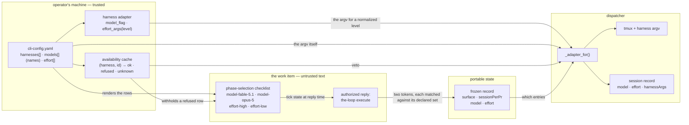
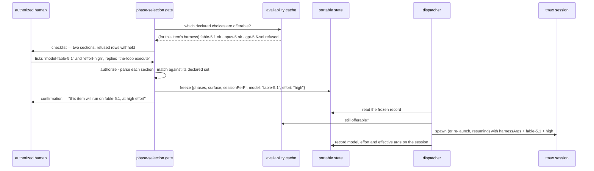

# Design: per-work-item model and effort choice, answered at the phase-selection gate

> Phase 2 of 3 (requirements → design → tasks). Derives from
> [`requirements.md`](requirements.md). MUST be reviewed and approved before moving to tasks
> breakdown.
>
> **Revision 6** — a model name may optionally carry `harnesses:`, which **narrows** it (and the
> probe matrix) without ever being authoritative — a declaration may restrict, only the probe may
> confirm. Revision 5 made `models` a plain list of provider-named models, **not tied to a
> harness**:
> the model × harness relation is *measured* by R7's availability probe rather than declared, which
> is what makes the owner's flat list sound and retires the `harness:` field revision 3 proposed.
> Revision 4 brought the spawn-order change in scope as **R8** (§ *Spawning after the gate, not
> before*). Revision 3 moved the declarations out of `routing` into three top-level sections
> (`harnesses`, `models`, `effort`), `models` became a flat list whose rows name a harness, and
> **effort is normalized by the-loop** rather than described per harness by the operator — all
> three from the owner's second round of review on PR #359. Revision 2 split model from effort
> and added the availability requirement (R7); revision 1 was the label-to-args map's
> replacement. Still **presented for approval with the requirements**, and still nothing
> implemented: no authorized `the-loop execute` reaches a cloud session, so neither gate can be
> answered here.

## Overview

**Two independent questions — which model, and how much effort — are added to the
phase-selection checklist, resolved against two closed sets the operator declared, frozen by
the same signed reply, and read at spawn time by the dispatcher exactly as `sessionPerPr`
already is.**

The change reuses three mechanisms and adds one:

| Existing mechanism | What it already does | What this work item adds |
|---|---|---|
| `phase-selection` ([selection.py](../../../cli/the_loop/graph/hooks/selection.py)) | asks three per-work-item questions, freezes the answers on one authorized reply | a `model-*` section and an independent `effort-*` section |
| the frozen record (`control_store.frozen_graph`) | carries `surface` and `sessionPerPr` | carries `model` and `effort` |
| `_tmux_for` ([dispatcher.py](../../../cli/the_loop/webhook/dispatcher.py)) | overrides one operator default per work item | `_adapter_for` overrides `harnessArgs` the same way |
| — | — | **availability**: a cached verdict per declared choice, so a model the harness refuses is never offered (R7) |

The declarations are two per-harness lists in the operator's CLI config. They are the answer
to the owner's first question — the-loop discovers nothing; it validates what it is told.



Read the arrows into `_adapter_for` together: the work item chooses **which declared
entries**, the cache may **veto** one, and the operator's config supplies **the argv**. No
string from a comment is ever part of a command line.

## Spawning after the gate, not before (R8)

**In scope, on the owner's instruction** ("implement in this same PR"). Today
`dispatcher._spawn_tmux` spawns the tmux session and *then* calls `graphlink.on_spawn`, which
enters the graph — whose start node is `phase-selection`, whose entry hook posts the checklist.
So a harness session exists, and has been told to wait, before anyone has said what the work
item should do.

The current order is deliberate, and its reason is in the code
([dispatcher.py:2466](../../../cli/the_loop/webhook/dispatcher.py)): *"a failed spawn must not
leave a labelled ticket pointing at a node nobody stands on."* That was sound when the graph was
entered nowhere else. It is load-bearing in one other way too: the arming comment rides into the
first gate (issue-199), which is how `the-loop contribute` carries its goal.

What makes the reorder possible is one fact: **the checklist is posted by the daemon, not by the
agent.** `selection.py` posts it through the CLI's own github integration
(`_resolve(ctx).call("post-comment")`). Nothing about phase selection needs a harness session.

```mermaid
flowchart TB
  subgraph today["today"]
    a1["authorized start"] --> a2["prepare workspace"] --> a3["spawn tmux + harness"] --> a4["on_spawn: enter graph"] --> a5["post checklist"] --> a6["session waits at the gate,<br/>already on the default model"]
  end
  subgraph proposed["proposed — R8"]
    b1["authorized start"] --> b2["prepare workspace"] --> b3["on_arm: enter graph"] --> b4["post checklist"] --> b5["NO spawn — pointer parked"] --> b6["authorized execute<br/>freezes the selection"] --> b7["spawn tmux + harness<br/>on the chosen model"]
  end
```



**One correction to what I claimed before folding this in.** The reorder saves the **harness
session**, not the checkout: `graphlink._guarded` verifies the checkout belongs to the work item
and the pointer is written to `graph-state.json` **under the checkout's spec directory**, so the
workspace must be prepared before the graph can be entered at all. That is no regression — the
checkout already happens before the checklist today — but "no checkout is spent" was wrong and is
struck. What is saved is a tmux session plus a harness process, per work item, for as long as the
gate goes unanswered.

### What changes

`graphlink.on_spawn` does two things today — *enter the graph* and *bind the session*. They
separate:

| Seam | When | What it does |
|---|---|---|
| `graphlink.on_arm(work_item, cwd, routed)` | after the workspace is prepared, before any spawn | `rt.start()`, evaluate a **start node that is a human gate** with the arming event attached (issue-199, unchanged), report whether the pointer is parked there |
| `graphlink.on_spawn(work_item, cwd, session_id, runner)` | after a session exists | `_bind_session` only — the re-bind a respawn already needs |

`_spawn_for` gains one early return: when `on_arm` reports the pointer parked at a
daemon-serviced start gate, it emits `session.spawn_deferred` and returns **without** spawning.
The work item is then visible in `the-loop check` (waiting at that node) and in the checklist
comment on the ticket; it has no session, which is the point.

**When the gate is answered**, the `execute` comment is routed as it is today, the gate freezes
the selection and the pointer advances — and because the work item now has no session, the
ordinary "no session for this work item" path spawns one, resolving the model through
`_adapter_for` from the record that was just frozen. The first spawn is therefore already on the
chosen model, and the drift re-launch (R4.3) becomes a safety net that no ordinary path
exercises.

### The narrow rule, and why it cannot strand a work item

A spawn is deferred **only** while both hold: the pointer has never advanced past the graph's
start node, **and** that start node is a human gate (`_entered_a_human_gate`, the predicate
`on_spawn` already uses). Everything else spawns exactly as today:

- a **mid-graph** work item — any pointer that has moved — always spawns and respawns;
- a **crashed** session on a mid-graph item respawns, because deferral cannot apply to it;
- graph linkage disabled (`routing.graph.enabled: false`), no spec-id convention, a foreign
  checkout, a spec dir outside the checkout — every existing `_guarded` skip path means `on_arm`
  reports nothing parked, so the spawn happens as it does now;
- an **inner (per-PR) loop**, whose start node is not a human gate, is untouched.

The original rationale survives: a pointer parked on `phase-selection` is standing on a node the
**daemon itself** services, so there is no labelled ticket pointing at a node nobody stands on.

### What it costs

The blast radius is the honest cost, and it is why I had proposed splitting this out: the arming
path, `on_spawn`'s idempotency contract, the issue-199 comment hand-off, the announce and
conversation-open side effects (announce moves with the spawn, conversations stay at arm time),
and every existing test that assumes a session exists once a work item is armed. The behaviour
change is also user-visible: an armed work item no longer has a tmux session until its gate is
answered, so `sessions list` shows nothing for it and `the-loop check` is where it is followed.
That is the line to document loudest.
**The safety net (R4.3).** The dispatcher compares the session record's recorded arguments with
the currently resolved ones and, on a difference, re-launches the session — resuming its
conversation — instead of delivering into it. With R8 in place no ordinary path reaches it: the
first spawn already carries the frozen choice. It still earns its keep for a choice changed after
the gate (an operator re-freezing, a declaration withdrawn, a verdict turning `refused`) and for
every session launched before this change, which carries no recorded arguments at all.

## Architecture

### Where each piece lives

| Component | File | Status |
|---|---|---|
| the vocabulary: declared models and efforts, resolution, merge | `cli/the_loop/modelchoice.py` | new |
| the availability probe and its cache | `cli/the_loop/modelprobe.py` | new |
| `the-loop models check` / `models list` | `cli/the_loop/commands/models_cmd.py` | new |
| the adapter's model and effort flags, asked by name | `cli/the_loop/harness/__init__.py`, `harness/base.py` | extended |
| an adapter copy carrying different args | `cli/the_loop/harness/base.py` | extended |
| the two checklist sections, the parse, the frozen keys | `cli/the_loop/graph/hooks/selection.py` | extended |
| seeding the hook's config | `cli/the_loop/graph/bootstrap.py` | extended |
| resolution at spawn / respawn / drift, and the deferred spawn (R8) | `cli/the_loop/webhook/dispatcher.py` | extended |
| the `on_arm` / `on_spawn` split (R8) | `cli/the_loop/graphlink.py` | extended |
| the three recorded fields | `cli/the_loop/sessions/registry.py` | extended |
| the `Model` column | `cli/the_loop/commands/sessions_cmd.py` | extended |
| the verdict report | `cli/the_loop/commands/diagnose_cmd.py` | extended |
| the JSON contract | `cli/the_loop/api/routes.py`, `docs/api-specs/openapi/the-loop.v1.yaml` | extended |
| the declarations' schema | `cli/the_loop/schemas/cli-config.schema.json` | extended |

`modelchoice.py` exists for the reason `prsessions.py` exists: its two readers cannot see each
other. The selection hook cannot import the dispatcher — `dispatcher → graphlink → graph` makes
that a cycle — and a second copy of the resolution rule is how the checklist and the daemon
come to disagree about what `fable-5.1` means. It imports no ingress and no graph; it asks
`the_loop.harness` for a flag by name (verified cycle-free: `the_loop.harness` pulls only
stdlib, `trust` and `harness_plugins`) and otherwise reads mappings.

`modelprobe.py` is separate because it is the only part that **runs a process**. Keeping the
pure resolution rules out of reach of a subprocess call is what lets every rule above be unit
tested without a harness installed.

### The life of one choice



## Components & interfaces

### `modelchoice.py` — the vocabulary

```python
def declared_models(cli_config: Mapping) -> List[str]:
    """The model names this instance offers — the provider's own spelling, verbatim."""

def declared_effort(cli_config: Mapping) -> List[str]:
    """The effort levels this instance offers, from the-loop's own enum."""

def model_args(name: str, adapter: HarnessAdapter) -> Tuple[str, ...]:
    """``(adapter.model_flag, name)`` — or ``()`` for a harness with no model flag."""

def effort_args(level: str, adapter: HarnessAdapter) -> Tuple[str, ...]:
    """The adapter's own translation of a normalized level, or ``()``."""

def effective_args(base: Sequence[str], *resolved: Sequence[str]) -> List[str]:
    """``base`` then each resolved fragment, in order. Nothing else (R3.1, R3.2)."""
```

Two lists of **names** and two functions that turn a name into argv through the adapter. There is
no declared-choice record any more, because after revision 5 a declaration carries nothing but the
name: a **model** name is the provider's, passed to `adapter.model_flag` verbatim; an **effort**
level is the-loop's, passed to `adapter.effort_args`. That is the whole difference between them,
and it is one line each.

- Both readers are **fail-closed in the shrinking direction**, the rule `repos.py` already
  follows: a malformed entry contributes nothing, so a fault can only remove a choice — it can
  never invent one.
- A token from a reply is matched against the returned list, exactly and case-sensitively. Callers
  are handed the list they rendered rather than re-reading config, so the checklist and the daemon
  are provably resolving against the same set.

### `harnesses`, `models`, `effort` — three top-level sections

**Not under `routing`, and not nested.** `routing` answers *how an event reaches a session*.
Which harnesses this instance has, and what they can be asked to run, is a property of **the
machine's installed tooling** — the same kind of fact as `repositories` (this instance's scope)
and `critics[]` (this instance's harness+model combos). So three top-level keys, beside those:

```yaml
# ── top level, beside `repositories` and `critics` ──────────────────────────────
harnesses:                       # NEW — the harnesses this instance has
  - name: claude
    default: true                # the one an unmatched event spawns
    args: ["--dangerously-skip-permissions"]   # this harness's launch args
  - name: cursor

models:                          # NEW — the model names, in each provider's own
  - opus-5                       #   naming convention. A bare name is a candidate
  - fable-5.1                    #   for every declared harness, and the probe (R7)
  - name: gpt-5.6-sol            #   decides. An OPTIONAL `harnesses:` narrows it.
    harnesses: [cursor]

effort:                          # NEW — the-loop's OWN normalized vocabulary
  - low                          #   the levels this instance offers, drawn from
  - medium                       #   the loop's fixed enum. NO flags here: the
  - high                         #   mapping to each harness is the ADAPTER's job.
```

**`models` is a list of model names; a name may optionally say which harnesses support it**
(revisions 5 and 6, the owner's calls). The two together are one rule: **a declaration may narrow,
only the probe may confirm.**

| | what it does | what it cannot do |
|---|---|---|
| a bare name (`opus-5`) | candidate for every declared harness | — |
| `harnesses: [cursor]` on a name | restricts it to those harnesses, and to those probes | grant a capability the harness refuses |
| the probe (R7) | the only thing that makes a name *offerable* on a harness | widen past a declared `harnesses:` |

So the optional link is an operator's **restriction** — keep an expensive model off one harness,
or skip probing combinations you already know are pointless — and it cuts the matrix from
*models × harnesses* down to what was declared, which is the practical reason to use it. It can
never say a harness supports something it does not: that remains measured. This is the same
fail-closed intersection `repos.py` follows, where a declaration can only ever shrink the set.

Two accepted shapes on one list is deliberate and in house style (`sessionPerPr` still takes its
legacy booleans, `--doc` takes a string or an object, a kickoff prefix has three spellings): the
bare string is the common case, and the mapping exists for the operator who wants to narrow.

My original objection was that a harness-independent list forces the-loop to *attribute* a name to
a harness, and attribution is a guess. What I missed is that **R7 already replaces the guess with a
measurement.** The availability probe asks each harness whether it can actually run a given name
and caches the answer, so the model × harness relation is *observed* rather than inferred:

```text
                 claude        cursor
  opus-5         ok            refused
  fable-5.1      ok            refused
  gpt-5.6-sol    refused       ok
```

A work item's harness is already decided before any of this (`harnesses[].default`, or the
per-item harness), so resolution only ever consults **that harness's column**. A name the harness
cannot run is `refused`, which R7 already means "not offered, never spawned". Nothing is
attributed and nothing is guessed — an undeclared combination is *asked about*, and a declared one
is still asked before it is offered.

**Names stay the provider's.** `opus-5`, `fable-5.1`, `gpt-5.6-sol` — the-loop does not normalize
model names and does not parse them for a vendor. The name is passed to the harness's model flag
verbatim; if the harness disagrees, the probe says so. This is deliberately the opposite choice
from `effort`, and the contrast is the point: an effort *level* is a the-loop concept that three
harnesses spell differently, so the-loop owns the vocabulary; a model *name* is the provider's
identifier, so the-loop owns nothing and copies it exactly.

**`effort` is normalized by the-loop, not described by the operator.** Revision 2 had the
operator hand-writing `["--thinking-effort", "high"]`, which is worse than nesting: it makes
every operator restate a flag per harness, and it lets two configs disagree about what "high"
means. So the vocabulary is **fixed and the-loop's** — `low | medium | high`, one enum, the same
three words whatever harness runs — and the translation is the adapter's:

```python
class HarnessAdapter:
    #: This harness's own way of asking for more or less thinking. Empty tuple for a
    #: level this harness cannot express, and for a harness with no effort control at
    #: all — never a guess, and never the operator's problem.
    def effort_args(self, level: str) -> Tuple[str, ...]: ...
```

One consequence, stated plainly because it is the thing to check: **the per-harness mapping
table is the one fact this design cannot settle from the-loop's own codebase.** No adapter has
an effort flag today, and a spec must not invent one. So the table is filled in at implementation
from each harness CLI's own `--help`, every mapping is validated by the availability probe (R7 —
the same probe that validates a model, for the same reason), and a level a harness cannot express
is simply **not offered for that harness**. `the-loop models check` prints which levels each
harness actually supports. That is the honest version of "the-loop normalizes this": one
vocabulary for the human, per-harness truth underneath, and nothing asserted that has not been
probed.

**Where `harnesses[].args` leaves `routing`.** The merge in R3.1 is onto this harness's launch
args, which live in `routing.harnessArgs.<harness>` today. `harnesses[].args` is their new home:
read from there when present, from `routing.harnessArgs` otherwise with a deprecation warning —
the warn-never-fail shim this repository already used when `routing.runner` was removed
(issue-156) and when the repository list left `polling.sources[].repos` (issue-348). The other
three per-harness keys — `routing.harnessTrust`, `routing.harnessPlugins` and
`routing.defaultHarness` — belong in `harnesses[]` by exactly the same argument, and folding them
in is a **follow-up work item**, not this one: it is a breaking config migration with its own
tests, and `harnesses[].default` is included here only because resolution has to know which
harness a work item will run on.

A model name resolves to `[<adapter.model_flag>, <name>]` and nothing else. There is **no `args`
escape hatch on a model** — a harness with no `model_flag` cannot be handed a model at all, so it
is offered no model section rather than given a hand-written flag (R2.7). One way to do the
ordinary thing, and no way to do an extraordinary one.

### `modelprobe.py` — availability (R7)

The mechanism that answers *"what if the harness does not have that model?"*: **do not offer
it, and never spawn on it.**

```python
@dataclass(frozen=True)
class Verdict:
    harness: str            # which harness was asked
    kind: str               # "model" | "effort"
    name: str               # the model name, or the effort level
    args_digest: str        # the argv probed — a changed adapter mapping invalidates
    verdict: str            # "ok" | "refused" | "unknown"
    checked_at: str

def probe(kind: str, name: str, adapter: HarnessAdapter) -> Verdict: ...
def offerable(kind: str, name: str, harness: str, cache: VerdictCache) -> bool: ...
```

The cache is therefore a **matrix**, model × harness and level × harness — which is exactly what
lets `models[]` be a plain list of names (§ the declarations). Resolution reads one cell: this work
item's harness, this name.

- **What it probes.** Every model name against every harness it is a candidate for — all declared
  harnesses for a bare name, or just the ones its `harnesses:` names — and every **effort** level
  against every declared harness, because the effort mapping is the-loop's own assertion about a
  harness CLI and is exactly the kind of claim that must be checked rather than trusted. An
  operator who declares `harnesses:` is therefore also choosing how much probing happens.
- **How it probes.** `adapter.oneshot_argv(PROBE_PROMPT, …)` plus the choice's resolved args — the
  harness's own cheapest non-interactive invocation, the same surface critics already use. The
  prompt is a fixed the-loop constant; **no text from a work item is ever sent** (the
  requirements' egress rule). A non-zero exit or an error envelope is `refused`; a binary that
  is not on PATH, or a run that could not start, is `unknown`.
- **When it probes.** `the-loop models check` (explicitly), at daemon start, and on the single
  stale-verdict path of R7.5 — never inline in a delivery. A verdict's lifetime is bounded
  (proposed 24h, open question 2) and any change to the declaration's args invalidates it
  through `args_digest`.
- **What `unknown` means.** Offerable. An operator on a machine with no harness binary, or no
  network at probe time, must not lose a capability they declared (R7.6).
- **Where it is stored.** The machine-local state beside the session registry, never the
  portable tree: a verdict is a fact about *this machine's* harness installation, and it must
  not travel in a repository or be writable by an agent session.
- **The one loop it closes.** A choice cached `refused` that still reaches resolution — a
  frozen record older than the verdict, or a hand-edited one — spawns on `harnessArgs`
  unchanged, posts one comment naming the refused choice and what ran instead, and is not
  retried until its verdict changes (R7.4). That is what stops the failure mode the owner
  named: a work item dying in a pane nobody is watching, forever.

### `selection.py` — the sections, the parse, the freeze

Four changes, each mirroring what `pr-sessions-*` does today:

1. **Tokens.** `MODEL_TOKENS = {f"model-{c.id}": c.id}` and `EFFORT_TOKENS = {f"effort-{c.id}":
   c.id}`, both added to `_NON_PHASE_TOKENS` so such a row is never read as a phase skip and
   never as a refusal.
2. **Rendering.** Two sections, each rendered only when its list has offerable entries (R1.7),
   each capped at `CANDIDATE_LIMIT` with an "…and N more" line (R2.7). "Leave it alone" is
   described in each section's prose rather than given a row, so there is nothing to tick for
   the default.
3. **Parse.** `_parse_choice(body, tokens) -> str`, called **once per section**: exactly one
   ticked row is a choice; zero, several, an unknown token, or an unreadable body is `""`
   (R1.5). Per-section resolution is what keeps an ambiguous model from discarding a valid
   effort.
4. **Freeze and confirm.** `_frozen_graph` gains `"model"` and `"effort"`, and the confirmation
   comment names both outcomes in both directions (R1.6).

`""` is the right literal for "no choice", and it is deliberately *not* the id of a default
entry: the frozen record then says "this item chose nothing", which is what makes a later change
to the operator's default apply to it.

### `dispatcher.py` — resolution, and the bridge

```python
def _adapter_for(self, work_item: WorkItemRef, harness: str) -> Optional[HarnessAdapter]:
    """The operator's adapter with THIS work item's own model and effort applied."""
```

The body is `_tmux_for`'s, two fields over: read `control_store.frozen_graph(work_item)`, take
`model` and `effort`, resolve each against its declared set, drop any whose cached verdict is
`refused`, and return `adapter.with_args(effective_args(adapter.extra_args, model, effort))` —
or the adapter itself when there is no choice, so the no-choice path allocates nothing and
behaves identically to today (R6.1). Every failure returns the adapter unchanged and logs once
(R4.5).

`HarnessAdapter.with_args(args)` returns a shallow copy sharing `trust` and `plugins`. A method
rather than a `replace()` at each call site, so an adapter subclass can never be rebuilt with
half its configuration.

Three call sites switch from `self.adapters.get(...)` to `self._adapter_for(...)`: `_spawn_for`,
`_spawn_endpoint` and `_respawn_tmux` — the whole of R4.1 and R4.2, because a respawn already
re-derives everything else from the record rather than from the dead session.

**The bridge** (R4.3) sits at the top of the deliver-into-a-live-session path: if the session
record's `harnessArgs` differ from the resolved ones, the delivery becomes a respawn (resume)
instead of a paste, and emits `session.choice_changed` with both values (R4.4). It compares
*recorded* against *resolved*, never against the config, so a session launched before this
change (no recorded args) is left alone until something else respawns it.

### The session record

```json
{
  "harness": "claude",
  "harnessSessionId": "…",
  "model": "fable-5.1",
  "effort": "high",
  "harnessArgs": ["--dangerously-skip-permissions", "--model", "fable-5.1", "<the adapter's args for high>"]
}
```

All three keys are **omitted when empty**, so every record written before this change
round-trips byte-identically and parses unchanged (R5.4) — the rule `pullRequests` already
follows. `the-loop sessions list` gains a `Model` column showing `-` when absent (R5.2), and the
fields appear in the JSON form, the control-plane API response and the OpenAPI contract (R5.3),
which this repository regenerates its API documentation from.

## UI/UX design

N/A — no product UI. The three human surfaces are text: the two checklist sections rendered by
`selection.py`, the `Model` column in `sessions list`, and the verdict table in
`the-loop models check` / `diagnose`. Each is specified above in the form it is read in.

## Data models

| Where | Key | Type | Default | Validated by |
|---|---|---|---|---|
| `cli-config.yaml` | `harnesses[]` (top level) | `{name, default?, args?}` | absent → inferred from `routing.defaultHarness` | `cli-config.schema.json` + `scripts/validate_config.py` |
| `cli-config.yaml` | `models[]` (top level) | `string[]` — provider-named, e.g. `opus-5` | absent | as above; shape only, since which harness can run a name is probed |
| `cli-config.yaml` | `effort[]` (top level) | `enum[]` — `low` \| `medium` \| `high` | absent | as above; no flags, the adapter maps each level |
| portable frozen record | `model`, `effort` | string | `""` | re-validated on read against the declared set |
| machine-local state | availability cache | `Verdict[]` | empty | re-validated against the declared set on read |
| session record | `model`, `effort` | string | omitted | — |
| session record | `harnessArgs` | string[] | omitted | — |

Schema constraints worth stating because they are the guard, not decoration: a model name matches
`^[A-Za-z0-9][A-Za-z0-9._:-]*$` — so a name can never be a flag, a path or a shell fragment, which
is what makes it safe to pass verbatim to a provider's own spelling — names are unique within the
list, an effort level must be one of the-loop's enum, and **nothing in either list is templated**:
unlike `critics[].args` there is no `{…}` to expand anywhere in this feature.

## Error handling

| Situation | Behaviour | Surfaced as |
|---|---|---|
| a harness with no `model_flag` | offered no model section at all — never handed a hand-written flag | `models check` reports the harness as unable to take a model (R2.7) |
| a model whose `harnesses:` names one that is not declared | that link contributes nothing, named at validation; the rest of the row stands | `validate_config.py` / `diagnose` |
| a model declared for a harness that then refuses it | not offered there — the declaration narrows, it cannot confirm | the probe matrix in `models check` (R2.3) |
| an effort level a harness cannot express | not offered for that harness | `models check` names the level as unsupported there (R2.8) |
| a model name this work item's harness cannot run | not offered for that work item; refused at resolution | the probe matrix in `models check` (R7.3, R7.4) |
| `harnessArgs.<harness>` already carries the same flag | validation warns, naming both | as above (R3.4) |
| a declared choice the harness refuses | not offered; if resolved anyway, spawn on `harnessArgs` + one comment naming it | `models check`, the checklist's absence, the comment (R7.3, R7.4) |
| the harness cannot be probed at all | `unknown` — offered, never blocking | `models check` / `diagnose` report it as unprobed (R7.6) |
| a section with several ticked rows | no choice for that section | named in the gate's confirmation comment (R1.5) |
| a reply naming an undeclared token | no choice for that section | debug log; the token never reaches argv (R2.3) |
| frozen record unreadable, or names an id no longer declared | the operator's arguments unchanged | one `warning`, same shape as `_tmux_for`'s (R4.5) |
| a session dead with a non-default choice and nothing to resume | re-probe that choice once, then respawn | `models check` cache update + the R7.4 comment if it is now refused |
| the checklist comment cannot be read at execute time | the operator's arguments unchanged | existing warning path, unchanged |

Every row resolves to *the operator's configuration unchanged*. There is no failure mode in
which the-loop runs a session on a model nobody declared, and none in which it retries a
refused one indefinitely.

## Security design

- **AuthN/AuthZ:** none added. Both rows are authorized by the reply that carries the execute
  keyword — `routing.authorizedUsers`, the same boundary the phase skips, the surface and
  `sessionPerPr` already answer to, with the-loop's own self-marked comments dropped before
  authorization is considered.
- **Input validation & injection surfaces:** the one untrusted ingress is the checklist body. It
  is matched by `_CHECK_LINE` — an existing regex whose token grammar admits no whitespace,
  quotes or metacharacters — and each token is then used as a **key into the operator's declared
  list**. What reaches argv is `DeclaredChoice.args`, built from `cli-config.yaml`. Command
  injection is therefore not mitigated but *absent*: there is no data path from comment text to
  a command line. Nothing is run through a shell (tmux and the probe are both exec'd with an
  argv), and no value is interpolated into a path, a prompt or a ref.
- **The probe's egress:** `modelprobe` is the one component that starts a process and talks to a
  vendor. It sends a fixed the-loop constant as its prompt and the declared args, never any
  repository or work-item text, and it runs off the delivery path. Its cache lives in the
  machine-local tree, so it is not agent-writable and does not travel in a repository.
- **Secrets handling:** none involved. A model id is not a credential, and this work item reads
  and writes no secret, token or environment variable. The probe inherits the daemon's
  environment exactly as a critic run does — it adds no variable of its own.
- **Least privilege:** a choice contributes only the arguments its declaration carries (R3.3).
  the-loop adds no permission flag of its own here, the same promise `harnessArgs` already makes
  and the reason `harnessTrust.acceptBypassPermissions` defaults to following the operator's own
  args rather than widening them.
- **Fail-closed behaviour:** every ambiguity resolves to `routing.harnessArgs.<harness>`
  unchanged — the operator's stated configuration, which is the closed direction here. The
  *narrowest* model would be a different and wrong reading of "closed": it would let a malformed
  reply silently downgrade a tier-5 work item.
- **Abuse-case coverage:**

  | Abuse case (requirements) | Mechanism | Negative test |
  |---|---|---|
  | A1 unauthorized user ticks and executes | existing `_authorized_comments` filter, upstream of any parse | `test_selection.py::unauthorized_reply_freezes_nothing` |
  | A2 reply names a flag / path / metacharacter | token grammar + lookup into the declared set | `test_modelchoice.py::undeclared_token_resolves_to_nothing` |
  | A3 a declared entry widens permissions | applied as declared, and only from the declaration | `test_modelchoice.py::args_come_only_from_config` |
  | A4 hand-edited portable record | re-validated on read against the declared set | `test_dispatcher_choice.py::forged_frozen_choice_is_ignored` |
  | A5 a label named after a model | no label is read anywhere in this path | `test_dispatcher_choice.py::label_does_not_select_a_model` |
  | A6 checklist comment unreadable | existing empty-body path resolves to no choice | `test_selection.py::unreadable_checklist_keeps_the_default` |
  | A7 forged availability verdict | resolution is against the declared set; a verdict can only withhold | `test_modelprobe.py::forged_verdict_cannot_introduce_a_choice` |

## Testing strategy

Unit tests carry the resolution rules (`modelchoice.py`: declaration parsing per kind, unknown
tokens, the `args`-vs-flag fork, the three-part merge order) and the schema validation
(`validate_config.py` rejecting an effort level outside the loop's enum, rejecting a malformed
`models[]` entry, warning on a duplicated flag and on a deprecated `routing.harnessArgs`). `modelprobe` tests use a stub adapter: `ok`,
`refused`, `unknown`, digest invalidation, and the withhold-not-introduce rule. Selection-hook
tests cover rendering (each section present only when offerable, capped, default in prose),
per-section parsing (one tick, no tick, two ticks, unknown token, an ambiguous model beside a
valid effort) and the two frozen keys. Dispatcher tests cover spawn, respawn, the safety-net re-launch and the
refused-at-resolution fallback with a fake registry and a stub tmux, plus every abuse case above
as a negative test. R8 gets its own set on the `on_arm`/`on_spawn` split: deferral at a
human-gate start node, no deferral for every existing `_guarded` skip path, no deferral once the
pointer has moved, the arming event still reaching the first gate (issue-199), and the announce
side effect moving with the spawn while conversations stay at arm time.

Three integration scenarios carry Gherkin docstrings under `cli/tests/test_*_integration.py`
per `testing.integrationTestGlobs`:

- `Scenario: a work item that chose a model and an effort is respawned on both` — freeze both,
  kill the session, deliver an event, assert the argv the runner was handed.
- `Scenario: an unauthorized reply cannot choose a model` — same setup, unauthorized author,
  assert the frozen record and the argv are untouched.
- `Scenario: a model the harness refuses is never spawned` — cache a `refused` verdict against a
  frozen choice, deliver an event, assert the argv is the operator's own and that one comment
  names the refusal.
- `Scenario: an armed work item gets no session until its gate is answered` — arm an item, assert
  the checklist was posted and no tmux session was created; then answer the gate as an authorized
  user and assert exactly one spawn, carrying the frozen choice (R8.1, R8.2).
- `Scenario: a mid-graph work item still respawns` — advance the pointer past the start node, kill
  the session, deliver an event, assert the respawn happened (R8.3 — the rule that keeps deferral
  from stranding anything).

Evidence: the argv assembled at each spawn (captured from the stubbed runner), the before/after
`sessions list` table, the `models check` verdict table, and the config-validation output for the
three rejected declarations. The executable detail — the full matrix, the verification
environment, the `n/a` rows and their reasons — belongs to `testing-plan.md`, which is not
authored yet because this design is not approved.

## Trade-offs & decisions

**The owner's questions, answered.**

1. *How does the-loop discover all possible models?* **It does not, by design.** No harness
   offers a stable machine-readable list of what a given account may run; the set moves with the
   vendor, the plan and the CLI version, and a list fetched over the network would be an ingress
   this daemon does not need. So the operator declares the few they use — the posture
   `repositories` took in decision-120 and `critics[]` in decision-123 — and the-loop
   **validates** that declaration against the harness (R7) instead of enumerating it. That also
   disposes of the UX half: the list is short because a human curated it, and the checklist caps
   and counts rather than paging.
2. *How does it work for claude vs cursor vs codex?* Through the adapter, which already owns this
   knowledge: `HarnessAdapter.model_flag` is `--model` for Claude Code and `-m` for Cursor, and
   `oneshot_argv(prompt, model)` already uses it for critics. **Which names a given harness can
   actually run is measured, not declared** — R7's probe fills a model × harness matrix, so
   `gpt-5.6-sol` simply comes back `refused` on a harness that cannot run it. Adding codex later
   is an adapter plus a `model_flag`; this feature then works for it with no further change and no
   new configuration.
3. *What happens when the chosen model is not available in the harness?* **R7**: probe each
   declared choice with the harness's own cheapest invocation, cache the verdict, withhold a
   `refused` choice from the checklist so a human cannot pick it, fall back visibly if one is
   resolved anyway, and re-probe once on a dead session so a stale `ok` cannot become a respawn
   loop. The failure surfaces at `models check` and `diagnose`, not in an unattended pane.
4. *Per harness or overall?* **A flat list of provider-named models, with an optional
   `harnesses:` link per name** (revisions 5 and 6). I argued twice that an untied list forces
   the-loop to *attribute* a name to a harness, which would be a guess. That was wrong once R7
   existed: the probe **measures** the matrix, so the relation is observed, resolution reads one
   cell, and a name the work item's harness cannot run is `refused` — already "not offered, never
   spawned". The optional link then does the one thing a declaration legitimately can: **narrow**
   — restrict a model to some harnesses and shrink the probe matrix to match — while never
   granting support the harness refuses. Revision 3's mandatory per-row `harness:` is gone; this
   is its optional, plural, non-authoritative descendant.
5. *Model and effort coupled?* **No — two inputs, two lists, two questions.** Revision 1 coupled
   them into one named argv, which would have made the operator declare the cross product. They
   are now independent all the way through: declaration, checklist section, frozen key, and
   concatenation order.
6. *Who owns the effort vocabulary?* **the-loop.** Revision 2 had the operator writing
   `["--thinking-effort", "high"]` per harness, which is worse than the coupling it replaced: it
   restates a flag in every config and lets two of them disagree about what "high" means. So the
   enum is fixed and the-loop's (`low | medium | high`), the translation is
   `adapter.effort_args(level)`, and a level a harness cannot express is not offered there. The
   per-harness mapping table is the **one fact this design cannot settle from the codebase** — no
   adapter has an effort flag today — so it is read from each harness CLI's own `--help` at
   implementation and validated by the same probe that validates a model. A spec does not invent
   a flag.
7. *Why were these under `routing`?* They should not have been. `routing` answers how an event
   reaches a session; the harnesses an instance has and what they can run is installed-tooling
   configuration, like `repositories` and `critics[]`. Three top-level sections now.
8. *Why does a session exist before the gate is answered?* It should not, and on your
   instruction the fix is **in this work item** (R8, § *Spawning after the gate, not before*): the
   graph is entered when the work item is armed, the spawn is deferred while the pointer is parked
   on a daemon-serviced start gate, and the first spawn therefore already carries the frozen
   choice. One claim of mine is struck in the process — the checkout is still needed at arm time,
   because the pointer lives in it, so what is saved is the tmux session and the harness process,
   not the clone.

**What this costs.**

- **A probe that runs the harness.** One cheap non-interactive call per declared choice per
  verdict lifetime, off the delivery path. It is the first time the-loop runs a harness to learn
  something rather than to do work, and it is why `modelprobe` is a module of its own.
- **A second place where argv is assembled.** `_adapter_for` joins `build_adapters` as a place
  the harness command line is decided. Contained by keeping the merge itself in
  `modelchoice.effective_args`, which both call.
- **Two new config keys**, with a shape a reader can hold in their head, on a file that already
  carries `harnessArgs`, `harnessTrust` and `harnessPlugins`.
- **R8's blast radius.** Deferring the spawn touches the arming path, `on_spawn`'s idempotency,
  the issue-199 comment hand-off, the announce/conversation-open side effects, and every test that
  assumes an armed work item has a session. It is the largest part of this work item and the
  reason it was first proposed as a ticket of its own; the deferral rule is deliberately narrow so
  that nothing mid-graph can be stranded by it.
- **A user-visible behaviour change**: an armed work item has no tmux session until its gate is
  answered, so it appears in `the-loop check` rather than `sessions list`.

**Rejected alternatives.**

| Alternative | Why not |
|---|---|
| `routing.harnessArgsByLabel` (the ticket's proposal) | a label rides GitHub's permission model, not `authorizedUsers`, and the payload does not attribute a label to a person — so it would let anyone with triage rights choose an unattended agent's argv. Same argument as issue-177's, with an argv at the end of it. |
| one coupled model+effort choice (revision 1) | the operator would declare the cross product; the owner's review rejected it, and it would grow multiplicatively. |
| a **required** single `harness:` per model row (revision 3) | superseded by the optional plural `harnesses:`: requiring it makes the operator restate a fact the harness can be asked for, and one harness per row cannot express a model two harnesses both run. |
| treating a declared `harnesses:` as authoritative (skipping the probe for it) | a declaration would then be able to assert support that does not exist, and the failure would land in an unattended pane — the thing R7 exists to prevent. |
| parsing a model name for its vendor (`gpt-*` → OpenAI → cursor) | a guess dressed as a convention, and it breaks the first time a provider renames or a harness adds a model family. The probe answers the same question with evidence. |
| nesting `models` under `harnesses[]`, or under `routing` | the owner's review rejected both: `routing` is about event delivery, and nesting hides the one table an operator wants to read. |
| the operator declaring effort flags per harness (revision 2) | restates a flag in every config and lets two configs disagree about what "high" means. the-loop normalizes instead. |
| enumerating models from the harness or a vendor API | no stable machine-readable source; a network ingress this daemon does not need; and it would go stale between the fetch and the spawn anyway. R7 validates instead. |
| a `the-loop model: <id>` control keyword | works before a session exists, which is attractive — but it is a second surface for a per-work-item decision the gate already collects three of, and the control parser is deliberately argument-free except for `@login` (issue-307). The ordering fix removes the motivation. |
| free-form args in the reply (`the-loop execute --model X`) | comment text into argv. Refused outright. |
| a per-work-item key in the repository's harness config | the harness config is the *agent's* file and a pull request can edit it; decision-123 put executable configuration in the operator's file precisely so it cannot be. |
| changing the running session's model in place | no harness exposes it. |

**Durable decisions to record** (at implementation, as `docs/decisions/decision-124.md`): the
choice is a phase-selection question, not a label; the harnesses, models and effort levels an
instance offers are top-level installed-tooling configuration, not `routing`; model names are the
provider's and are not tied to a harness, because the model × harness relation is measured by the
availability probe rather than declared; the effort vocabulary is the-loop's and the
per-harness translation is the adapter's; declarations are validated against the harness rather
than discovered from it; and a choice the harness refuses is withheld from the checklist rather
than failed at spawn.

## Open questions

1. ~~Is the prerequisite ordering ticket wanted?~~ **Answered by the owner: implement it in this
   PR.** R8 and § *Spawning after the gate, not before*.
2. **What lifetime should an availability verdict have?** Proposed 24 hours, plus invalidation on
   a changed declaration, plus the one re-probe of R7.5.
3. **Should the confirmation comment also say the argv?** It names the model and the effort level
   in this design. Naming the arguments would be more honest about what was resolved, and would
   also print `--dangerously-skip-permissions` onto a public ticket. Proposed: the ids only.
4. **Is `low | medium | high` the right effort enum?** Three levels is the smallest useful
   vocabulary and adding a level is easier than removing one. Say if you want `minimal` / `max`
   at the ends.
5. **Does the follow-up that folds `harnessTrust`, `harnessPlugins` and `defaultHarness` into
   `harnesses[]` get raised now?** This work item needs only `name`, `default` and `args`; the
   rest is a breaking config migration with its own tests.

## Review comments

### 2026-09-13 — @MadaraUchiha-314, review of PR #359

| Feedback | Where it landed |
|---|---|
| handle a model the harness does not have | R7 and § `modelprobe.py`; trade-off 3; the refused-at-resolution rows of § Error handling; scenario 3 and abuse case A7 |
| per harness or overall? | first answered "per harness" (revision 3), then corrected to a plain list in revision 5 — see the round below; trade-off 4 |
| model and effort are coupled — keep them separate | § *Two lists, not their product*; the two checklist sections; the three-part merge order; trade-off 5 |
| "just models" | `models[]` (+ `effort[]`), and the module renamed `modelchoice.py` |
| why is a session started before phase selection? we ideally shouldn't | § *Spawning after the gate, not before* — agreed, and now **in scope as R8** on the owner's "implement in this same PR" |

### 2026-09-13 — @MadaraUchiha-314, second round on PR #359

| Feedback | Where it landed |
|---|---|
| "separate section for harnesses, a separate section for models, a separate list for efforts" | § *`harnesses`, `models`, `effort` — three top-level sections*; the data-models table |
| "the-loop should take care of normalizing" the effort enums | the enum is the-loop's (`low \| medium \| high`); `adapter.effort_args(level)` translates; a level a harness cannot express is not offered; the mapping table is probed, never invented — trade-off 6 |
| "putting it under routing key doesn't make any sense to me" | agreed — top level, beside `repositories` and `critics`; `routing` is event delivery. `harnesses[].args` is the new home for `routing.harnessArgs.<harness>`, with the warn-never-fail shim issue-156 and issue-348 used; the other three per-harness keys are a named follow-up — trade-off 7 |
| (implicit) the nested per-harness map | replaced by a flat `models[]`; revision 5 then dropped the `harness:` field too |
| "implement in this same PR" (the spawn-order change) | **R8** and § *Spawning after the gate, not before*: the `on_arm`/`on_spawn` split, the narrow deferral rule, the struck claim about the checkout, and the blast radius stated as the cost |

### 2026-09-13 — @MadaraUchiha-314, third round on PR #359

| Feedback | Where it landed |
|---|---|
| "Let's not tie model to harness. Let's just keep it models" | § the declarations, rewritten: `models` is a plain list of names. My twice-stated objection — that the-loop would have to *attribute* a name to a harness — dissolves, because R7's probe **measures** the model × harness matrix instead. Trade-off 4 says so; the `harness:` field is in the rejected table. |
| "models will be like opus 5, fable 5.1, gpt 5.6 sol … use whatever naming convention each of the model providers follow" | names are the provider's, passed to `adapter.model_flag` verbatim; the-loop neither normalizes nor parses them, which is the deliberate contrast with `effort`, where it owns the vocabulary |
| "for each model, we can link it to supported harnesses" | an **optional** `harnesses:` on a name (revision 6). It narrows — restricting the model and shrinking the probe matrix — and it is never authoritative: the probe still decides what is offerable, so a declaration cannot assert support the harness refuses. § the declarations carries the three-row table of what each source may do. |
