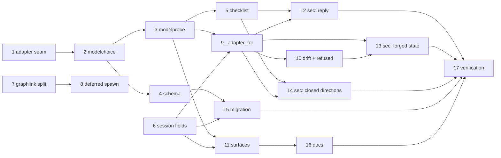

# Tasks: per-work-item model and effort choice, and spawning after the gate

> Derived mechanically from [`design.md`](design.md) and [`testing-plan.md`](testing-plan.md).
> No approval gate of its own — it advances on shape.

## Task list

TDD invariant throughout: the test that motivates each task is written first and watched
go red. Tasks 12–14 are the security-relevant ones and name their negative tests.

- [x] 1. The adapter seam: `effort_args(level)` and `with_args(args)`
  - `HarnessAdapter.effort_args` returns `()` by default; `EFFORT_LEVELS = ("low", "medium", "high")`
  - `with_args` returns a shallow copy sharing `trust` and `plugins`
  - fill each shipped adapter's mapping from its CLI's own `--help`; where a harness has
    no effort control, the mapping stays empty and is **documented as such**, not invented
  - _Depends on:_ none
  - _Requirements:_ R2.6, R2.8
  - _Test:_ `T1 — cli/tests/test_harness_adapters.py` (red→green)

- [x] 2. `cli/the_loop/modelchoice.py`
  - `declared_models`, `declared_effort`, `model_args`, `effort_args`, `effective_args`
  - entries accept a bare name or `{name, harnesses?}`; malformed entries contribute nothing
  - _Depends on:_ 1
  - _Requirements:_ R2.1–R2.9, R3.1–R3.3
  - _Test:_ `T1 — cli/tests/test_modelchoice.py`

- [x] 3. `cli/the_loop/modelprobe.py`
  - `Verdict`, `probe`, `offerable`, the machine-local cache with `args_digest` and a 24h lifetime
  - probes only candidate combinations (all declared harnesses, or those a name narrows to)
  - _Depends on:_ 2
  - _Requirements:_ R7.1–R7.3, R7.6
  - _Test:_ `T1 — cli/tests/test_modelprobe.py`

- [x] 4. The three top-level config sections in the schema
  - `harnesses[]`, `models[]`, `effort[]`; the name grammar; `routing.harnessArgs` deprecation
  - `scripts/validate_config.py` rules and warnings
  - _Depends on:_ 2
  - _Requirements:_ R2.1, R2.10, R2.12, R3.4
  - _Test:_ `T3 — make validate`; `T1 — cli/tests/test_cli_config.py`

- [x] 5. The two checklist sections in `selection.py`
  - `model-*` and `effort-*` token groups, both in `_NON_PHASE_TOKENS`; rendering capped at
    `CANDIDATE_LIMIT`; refused choices withheld; per-section parse; `model`/`effort` frozen
  - `bootstrap.py` seeds the hook config with the declared lists and the work item's harness
  - _Depends on:_ 3
  - _Requirements:_ R1.1–R1.8
  - _Test:_ `T1 — cli/tests/test_selection_choices.py`

- [x] 6. The session record fields
  - `model`, `effort`, `harnessArgs` on `Session`, omitted when empty
  - _Depends on:_ none
  - _Requirements:_ R5.1, R5.4
  - _Test:_ `T1 — cli/tests/test_registry.py` (round-trip + legacy record)

- [x] 7. **R8a** — split `graphlink.on_spawn` into `on_arm` and `on_spawn`
  - `on_arm` does `rt.start()`, evaluates a human-gate start node with the arming event
    attached (issue-199 unchanged), and reports whether the pointer is parked
  - `on_spawn` binds the session only
  - _Depends on:_ none
  - _Requirements:_ R8.1, R8.5
  - _Test:_ `T1 — cli/tests/test_graphlink.py`

- [x] 8. **R8b** — defer the spawn in the dispatcher
  - `_spawn_for` calls `on_arm` after the workspace is prepared and returns early when the
    pointer is parked; emits `session.spawn_deferred`; announce moves with the spawn,
    conversations stay at arm time
  - every existing `_guarded` skip path means nothing is deferred
  - _Depends on:_ 7
  - _Requirements:_ R8.1–R8.4, R8.6–R8.8
  - _Test:_ `T2 — Scenario: an armed work item gets no session until its gate is answered`;
    `T2 — Scenario: a mid-graph work item still respawns`

- [x] 9. `dispatcher._adapter_for` and the three call sites
  - resolve the frozen `model`/`effort` against the declared sets and the verdict cache;
    return the adapter unchanged when there is no choice
  - `_spawn_for`, `_spawn_endpoint`, `_respawn_tmux`
  - _Depends on:_ 3, 6
  - _Requirements:_ R3.1, R4.1–R4.2, R4.5, R6.1
  - _Test:_ `T2 — Scenario: a work item that chose a model and an effort is respawned on both`

- [x] 10. The drift re-launch and the refused-at-resolution fallback
  - recorded args ≠ resolved args → respawn (resume) instead of paste; `session.choice_changed`
  - a `refused` verdict at resolution → operator's args + one comment + no retry
  - _Depends on:_ 9
  - _Requirements:_ R4.3–R4.4, R7.4–R7.5
  - _Test:_ `T2 — Scenario: a model the harness refuses is never spawned`

- [x] 11. The surfaces: `models check|list`, the `Model` column, the API contract
  - `cli/the_loop/commands/models_cmd.py` printing the verdict matrix; `diagnose` reports it
  - `sessions list` gains `Model`; `api/routes.py` and the OpenAPI session schema gain the three fields
  - _Depends on:_ 3, 6
  - _Requirements:_ R5.2–R5.3, R7.7
  - _Test:_ `T1 — cli/tests/test_sessions_cmd.py`; `T3 — make validate`

- [x] 12. **Security** — the reply cannot reach an argv
  - negative tests for A1, A2, A3 against the real parse and resolution path
  - _Depends on:_ 5, 9
  - _Requirements:_ A1–A3
  - _Test:_ `T8 — cli/tests/test_choice_abuse.py -k "unauthorized or metacharacter or only_config"`

- [x] 13. **Security** — forged state cannot introduce a choice
  - negative tests for A4 (hand-edited frozen record) and A7 (forged verdict)
  - _Depends on:_ 9, 10
  - _Requirements:_ A4, A7
  - _Test:_ `T8 — cli/tests/test_choice_abuse.py -k "forged"`

- [x] 14. **Security** — the closed directions
  - negative tests for A5 (a label selects nothing) and A6 (an unreadable checklist keeps
    the operator's arguments)
  - _Depends on:_ 5, 9
  - _Requirements:_ A5, A6
  - _Test:_ `T8 — cli/tests/test_choice_abuse.py -k "label or unreadable"`

- [x] 15. Migration and no-op behaviour
  - a config with none of the new sections; a legacy session record; the `routing.harnessArgs` shim
  - _Depends on:_ 4, 6
  - _Requirements:_ R6.1–R6.3, R2.12, R5.4
  - _Test:_ `T10 — make test`

- [x] 16. Documentation, capability docs and the decision record
  - `docs/config/cli/` for the three sections; the `routing.harnessArgs` deprecation note
  - capability docs: `interactive-sessions.md`, `process-graph.md` (the gate's questions and
    R8's ordering), `cli.md` (the new verb and column)
  - the operating model's phase-selection section; `skills/the-loop/templates/cli-config.yaml`
  - `docs/decisions/decision-124.md` and the decisions index
  - _Depends on:_ 11
  - _Requirements:_ all (the ready-to-ship gate)
  - _Test:_ `T1 — make lint` (markdownlint over the changed docs)

- [x] 17. Verification pass and evidence
  - run every activity of the testing plan, tick each only once run, record command,
    outcome and evidence under `evidence/`
  - _Depends on:_ 12, 13, 14, 15, 16
  - _Requirements:_ all
  - _Test:_ the plan itself

## Dependency graph (DAG)

Tasks 1–6 and 7–8 are two independent chains — the choice machinery and R8 — that meet only
at the verification pass. R8 is committed on its own, with its test sweep beside it, because
it is the change with the widest blast radius.

## Checkpoints

- After 3: `make test` — the two new modules are provable without any dispatcher wiring.
- After 8: `make check` — R8 is where the existing suite is most likely to object, so the
  full parity run happens before anything else is stacked on it.
- After 11: `make check` — the surfaces and the contract.
- After 17: `make check` plus the committed evidence.
