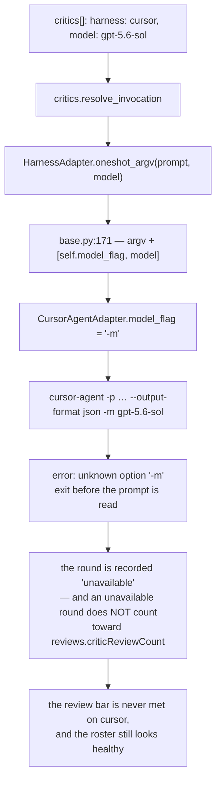

# Bugfix spec: the cursor adapter passes the model as `-m`, an option `cursor-agent` does not have

## Summary

**Every critic declared `harness: cursor` with a `model:` has never run.** The adapter
spells the model `-m`; `cursor-agent` has only `--model`, so the process dies on
`error: unknown option '-m'` before it reads the prompt. The same critic with no `model:`
runs fine — which is why the defect reads as *missing review rounds* rather than as a
broken configuration: `the-loop critic list` shows the entry as runnable, `critic policy`
still asks for its rounds, and each round comes back `unavailable` with a CLI error
nobody attributed to the-loop.

Reported against 15.0.0 by a collaborator running `cursor-agent 2026.09.10-fd3934a`.
Ticket: [issue-360](https://github.com/MadaraUchiha-314/the-loop/issues/360).



The last step is what makes this worth a spec rather than a one-character commit: an
`unavailable` round is deliberately not counted (`reference/reviewing.md`), so a wrong
flag does not degrade the review loop loudly — it removes a critic from it quietly.

## Steps to reproduce

1. Declare a cursor critic with a model in the CLI config:

   ```yaml
   critics:
     - name: cursor-gpt56
       harness: cursor
       model: gpt-5.6-sol-high
   ```

2. `the-loop critic run --name cursor-gpt56 --prompt "review this"`.
3. The critic exits non-zero with `error: unknown option '-m'` on stderr.

Without the CLI, the argv the-loop builds shows it on its own:

```console
$ uv run --project cli python -c "from the_loop.harness import CursorAgentAdapter as C; \
print(C().oneshot_argv('review this', model='gpt-5.6-sol'))"
['-p', 'review this', '--output-format', 'json', '-m', 'gpt-5.6-sol']
```

The reporter's live proof, on `cursor-agent 2026.09.10-fd3934a`:

```console
$ cursor-agent -p "say OK" --output-format json -m auto --force
error: unknown option '-m'

$ cursor-agent -p "reply with exactly: OK" --output-format json --model auto --force
{"type":"result","subtype":"success","is_error":false,"result":"OK", ...}
```

## Expected vs actual

- **Expected:** a critic on a built-in harness runs with the model it declares, because
  the adapter passes it in a spelling that harness's own `--help` lists.
- **Actual:** `cursor-agent` rejects the argv outright. The model never reaches a model;
  the round is lost, and the operator's only workaround is to leave `model:` empty and
  put `["--model", "<name>"]` in `args` — which works, but then the review attribution
  prefix reads `[cursor/default]` and the paper trail no longer names what reviewed the
  diff.

## Root cause (confirmed)

**`cli/the_loop/harness/cursor_agent.py:22` declares `model_flag = "-m"`, and
`cursor-agent` has no such option.** `HarnessAdapter.oneshot_argv`
(`harness/base.py:171-172`) appends `[self.model_flag, model]` whenever a model is
resolved, so the bad flag reaches the argv of every cursor invocation that carries one —
critics today and the model probe with them.

The probe is the second victim, and the more corrosive one. `the-loop models check`
builds the same one-shot argv (`modelprobe.py:158`) and reads a **non-zero exit as
`refused`** (`modelprobe.py:165-174`) — the harness said no. `cursor-agent` exits
non-zero on `-m` before it has an opinion about any model, so every declared model comes
back `refused` on cursor, is cached as such, and is then **withheld from the
phase-selection checklist** so a human cannot pick it. A parse error about the-loop's own
flag is recorded as the vendor refusing the operator's model.

Interactive dispatch is not affected: `cursor-agent` has no pre-assignable session id, so
the adapter's `interactive_*` methods raise `UnsupportedRunnerError` and no cursor session
is ever spawned.

It was never measured. `-m` is a plausible short form — `claude` has `--model`, many
CLIs alias it — and the repository's own tests asserted the *adapter's* constant back to
itself (`test_critics.py:222`, `test_modelchoice.py:128` both pinned `-m`), so the suite
agreed with the bug rather than catching it. The only test that ran a real one-shot argv
end to end (`test_oneshot_argv_without_a_model_is_the_plain_one_shot_run`) passed **no**
model, and so walked past the defect.

## Requirements

### Requirement 1 — a cursor critic with a model runs

**User story:** as an operator, I want a critic declared `harness: cursor` with a
`model:` to actually run on that model, so that the review rounds I configured happen and
the attribution prefix names what reviewed the diff.

#### Acceptance criteria (EARS)

1. WHEN a model is resolved for the cursor harness THEN the system SHALL pass it as
   `--model <name>`, the spelling `cursor-agent --help` lists.
2. WHEN a critic declares `harness: cursor` and `model: <name>` and no `command` THEN
   `resolve_invocation` SHALL produce
   `["cursor-agent", "-p", <prompt>, "--output-format", "json", "--model", <name>]`.
3. WHEN no model is resolved THEN the cursor argv SHALL be unchanged from today's — the
   fix SHALL NOT introduce a flag into a run that declares no model.
4. The fix SHALL include a regression test that fails before the fix and passes after.

### Requirement 2 — the flag is a measured fact, not adapter folklore

**User story:** as a maintainer adding the next adapter, I want the rule that a
`model_flag` is a spelling the harness's own `--help` carries to be written down where
the capability is described, so the next adapter is not guessed the same way.

#### Acceptance criteria (EARS)

1. The `review-loop` capability doc SHALL state that an adapter's `model_flag` is a
   spelling that harness's `--help` lists, SHALL prefer the long form where a CLI offers
   both, and SHALL name the current value for each shipped adapter.
2. The capability doc's History table SHALL carry a row tracing this behaviour to
   issue-360.

## Security considerations

**No new attack surface.** The change is one string constant on an argv the-loop already
built, handed to a binary it already spawned, with the operator-declared model name it
already passed.

| Abuse case | Boundary | How it fails closed |
|---|---|---|
| AC1 — a model name smuggles a second option into the cursor argv (`--model`, then `; rm -rf`) | the critic spawn | Unchanged: `run_critic` spawns a list argv with no shell, and the name is one list element. The long flag consumes exactly one following argument, as the short one was meant to; nothing about that changes here. |
| AC2 — the long form makes the-loop accept a model it previously rejected | model resolution | There is no such gate to weaken: `model_args` never validated a *name*, and `modelprobe`'s verdicts are measured per harness. A name that cursor refuses still comes back `refused` — measured now through a flag the CLI parses instead of one it rejects before it can refuse anything. |
| AC3 — the fix silently changes what a *claude* critic runs | the claude adapter | Untouched: `ClaudeCodeAdapter.model_flag` was already `--model`, and its argv assertion is unchanged in the suite. |

The bug itself is **availability**-relevant in the direction that matters for a review
harness: it removed review rounds while reporting a healthy roster. Restoring them
restores a control rather than relaxing one.

## Out of scope

- **Probing a harness's flags.** `the-loop models check` probes whether a *model* runs;
  it does not parse `--help` to verify the-loop's own flag spellings. Making it do so is
  a real idea and a different work item — it needs the binary present, which neither CI
  nor this repository's test suite has.
- **`docs/specs/issue-358/design.md`**, which names `-m` as cursor's flag in an answer to
  the owner's question. Locked specs are the record of what was decided and believed at
  the time; they are not edited after the fact. The living statement moves to the
  capability doc (R2), which is where a reader is meant to look for current behaviour.
- **An effort flag for cursor.** Still none (`_EFFORT_ARGS` stays empty, issue-358).
- **The `args` workaround in the ticket.** It keeps working — `args` is appended verbatim
  and always was.

## Open questions

None. The reporter measured the CLI, and the fix is the spelling they measured.
