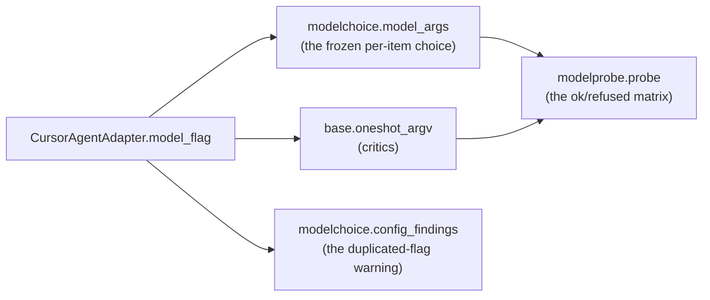

# Design: the cursor adapter's model flag

> Phase 2 of 3 (bugfix → design → tasks). Derives from the approved `bugfix.md`.

## Overview

**One constant, changed to the spelling the CLI parses.** `model_flag` is the adapter's
whole contribution to the argv, and both consumers already read it through the base class:

```python
# cli/the_loop/harness/cursor_agent.py
model_flag = "--model"      # was "-m"
```

There is nothing else to design, and designing more would be the wrong answer. The seam
is already correct — `HarnessAdapter.oneshot_argv` appends `[self.model_flag, model]`,
`modelchoice.model_args` resolves through the same attribute, and `modelprobe` builds on
both — so every call site is fixed by fixing the value, and no call site learns that
cursor is special.



`config_findings` is the fifth reader, and it earns a mention because it silently starts
working: it warns when `harnesses[<name>].args` already carries the model flag, since a
work item's model is *appended* after it and which one wins is the harness's own parsing
rule. An operator who wrote `args: ["--model", "gpt-5.6-sol"]` there — the shape the
ticket's workaround takes on the critic side — got no warning while the-loop compared
against `-m`. Now they do. No code changes for that.

The workaround the ticket documents is on the **critic** entry (`critics[].args`), which
is a different surface with no such check; it keeps working exactly as it does today
(appended verbatim), and an operator can now drop it in favour of `model:`.

## Decisions

**D1 — the long form, not a second accepted spelling.** The adapter carries exactly one
flag, so the choice is which one, not how many. `cursor-agent --help` lists `--model
<model>` with no short alias, and a long form is the one spelling a CLI that offers both
always accepts. This costs nothing even against the hypothetical older `cursor-agent` the
ticket allows for.

**D2 — no `--help` parsing, no compatibility shim.** A tempting "correct" fix is to probe
the binary's `--help` and pick a spelling it lists. That buys a fallback for a version of
`cursor-agent` nobody has seen, at the price of running (and parsing) a second process on
a path that runs per critic round, and of a flag whose value depends on the machine —
which is exactly the kind of unmeasurable behaviour `bugfix.md` §Root cause is about.
Declared, wrong and visible beats derived, plausible and machine-dependent.

**D3 — no migration for the cached verdicts.** The `-m` era cached a `refused` verdict for
every cursor model. Nothing has to clear it: a verdict records `argsDigest`, the digest of
the argv it was taken against, and `VerdictCache.get` drops a verdict whose digest no
longer matches (`modelprobe.py:225`). Changing the flag changes the digest, so the stale
refusals stop applying the moment this lands and the next `models check` asks again.
Asserted, not assumed — T3.

**D4 — the record of the belief stays where it was written.** `docs/specs/issue-358/design.md`
answers the owner's "how does it work for cursor?" with "`model_flag` is … `-m` for
Cursor". That was true of the code and false of the CLI, and it is now part of the paper
trail for how the defect got in. Locked specs are not rewritten; the current-behaviour
statement is added to the `review-loop` capability doc, which is the organized view of
specs a reader is pointed at for what is true *now* (R2).

## Components

| Component | Change |
|---|---|
| `cli/the_loop/harness/cursor_agent.py` | `model_flag = "--model"`, with a comment recording that `--help` lists no short form and what `-m` cost (issue-360) |
| `cli/tests/test_critics.py` | a new argv-level regression test with a model; the existing `resolve_invocation` assertion corrected from `-m` |
| `cli/tests/test_modelchoice.py` | the `model_args` assertion corrected from `-m` |
| `cli/tests/test_modelprobe.py` | a new test that a `-m`-era `refused` verdict no longer withholds the choice (D3) |
| `docs/capabilities/review-loop.md` | the rule that a `model_flag` is a spelling the harness's own `--help` lists, the current value per adapter, and a History row |

## UI/UX

None — no user-facing surface. The operator-visible change is that a cursor critic's
attribution prefix reads `[cursor/<model>]` instead of the round being `unavailable`.

## Risks

| Risk | Mitigation |
|---|---|
| An older `cursor-agent` accepts only `-m` | None known to exist, and no such version is documented. `--model` is what the shipped CLI parses; an operator on a hypothetical older one still has `args`, which is appended verbatim and untouched here. |
| The three corrected assertions hide a *different* regression | They are corrected, not deleted, and one of them (`test_builtin_harness_derives_argv_from_the_adapter`) is the end-to-end critic argv — the assertion that should have caught this bug and was pinned to it instead. The new test at T1 asserts the same fact from the adapter's own surface, so the two would have to be wrong together. |
