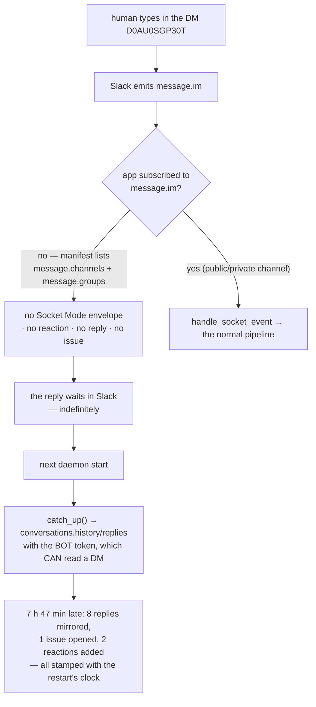

# Bugfix spec: a DM channel receives nothing in real time — the manifest subscribes the bot to `message.channels` / `message.groups` only

## Summary

**Configure `channels.slack.channel` with a direct-message id (`D…`) and the inbound half
of the channel is dead until the next daemon start.** Thread replies, top-level kickoffs
and the 👀 acknowledgement all wait for the catch-up read that runs when the listener
reconnects. Everything *outbound* works, the buttons work, and `channels status` reports
`read: socket` — so the configuration looks healthy while a human's typed answer sits in
Slack for hours.

The shipped app manifest subscribes the bot to `message.channels` and `message.groups`.
A DM emits **`message.im`**, which is on neither list, so Socket Mode never delivers the
envelope. Nothing downstream is at fault: the listener's filter
(`cli/the_loop/channels/slack.py:1572`) checks only `event.get("type") != "message"`, and
`inbound.handle_socket_event` would have accepted a DM message as readily as a channel
one. The event simply never arrives.

Reported against 15.0.0 → 16.0.1 by a collaborator running a single-operator instance on
channel `D0AU0SGP30T`. Ticket:
[issue-362](https://github.com/MadaraUchiha-314/the-loop/issues/362).



The right-hand branch is what makes this a silent failure rather than a loud one: the
**bot token's `conversations.history` scope is not what is missing**. Reading a DM works
— that is how the catch-up read recovers everything at restart. Only the *push*
subscription is absent, so the channel degrades from push to "once per process lifetime"
with no error anywhere.

## Steps to reproduce

1. Create the Slack app from the shipped manifest (`the-loop channels manifest`) and
   install it. Its bot events are `message.channels` and `message.groups`.
2. Configure the channel with the DM the app opened with you:

   ```yaml
   channels:
     slack:
       enabled: true
       channel: D0AU0SGP30T          # a direct message, not C… / G…
       publish: [gate.feedback, control.command, work-item.create]
       read:
         mode: socket
   ```

3. `the-loop start` (or `the-loop channels listen`). The listener connects;
   `the-loop channels status` prints `read: socket`, `buttons: on`, kickoff on.
4. Type a top-level message in the DM, and a reply in any thread the-loop opened.
5. Observe: no 👀 reaction, no `channel.reply_received`, no `channel.created` — for as
   long as the process lives. Press an **Approve** or **Execute** button in the same
   thread and it responds instantly.
6. Restart the daemon. Every message from step 4 is processed in one burst.

## Expected vs actual

- **Expected:** a message typed in the configured channel reaches the-loop within
  seconds, whatever *kind* of conversation that channel is — the-loop accepts a `D…` id
  everywhere else, so it should read one too.
- **Actual:** in a DM (and a group DM, `message.mpim`), nothing is delivered. The
  reporter's event log over 9.5 hours of live use carries **zero** inbound Slack events,
  then this at the restart:

  ```
  {"ts":"2026-09-14T05:04:38.126Z","event":"channel.thread_opened","work_item":"…#500","thread":"1789334239.641199","origin":"kickoff"}
  {"ts":"2026-09-14T05:04:38.491Z","event":"channel.caught_up","replies":333,"processed":8,"delivered":5,"created":1,"dropped":324}
  ```

  `thread: 1789334239.641199` is the 21:17Z message — opened as an issue 7 h 47 min
  after it was sent.

- **Also expected, and also absent:** *some* signal that the inbound half cannot work.
  `channels status` is happy to print `read: socket` and list the reactions it will add
  for a configuration where none of it can happen.

## Root cause (confirmed)

**`cli/the_loop/channels/slack-app-manifest.yaml` subscribes the bot to two of the four
message events Slack has.** The manifest is the only place the subscription is declared,
and an operator who follows the guide imports it verbatim:

```yaml
oauth_config:
  scopes:
    bot:
      - channels:history    # read thread replies and kickoffs in a public channel
      - groups:history      # the same in a private channel
settings:
  event_subscriptions:
    bot_events:
      - message.channels
      - message.groups
```

Slack emits a different event type per conversation kind — `message.channels` for a
public channel, `message.groups` for a private one, `message.im` for a DM,
`message.mpim` for a group DM — and delivers only what the app subscribed to. `im:history`
and `mpim:history` are the matching bot scopes.

Three things kept it hidden:

1. **The buttons work.** An interactivity payload is not a message event; it is delivered
   to the same Socket Mode connection regardless of conversation kind. So the listener is
   demonstrably alive, which reads as "Socket Mode is fine" and points the investigation
   at the message pipeline, where nothing is wrong.
2. **The catch-up read works.** `catch_up()` (added in issue-334 for the downtime gap)
   calls `conversations.history` / `conversations.replies` with the *bot* token, and
   `chat:write` + the thread cursors are enough to read a DM. Every lost message
   eventually arrives, so the ledger is correct — just late — and no error is ever
   logged.
3. **Nothing checks the pairing.** `channels status` prints the read mode, the buttons,
   the kickoff and the reactions from config alone. No code anywhere relates the
   *configured channel's kind* to the *events the app is subscribed to*.

The catch-up read is also the only reconcile in socket mode, and it runs **exactly once**,
right after `client.connect()` (`slack.py:1580`). That is what converts "an event was
missed" into "an event is lost until someone restarts the daemon" — and it applies to
every cause of a missed event, Socket Mode's own reconnect gaps included, not only to
this one.

It was never measured because the manifest was authored for the shape the maintainers
run — a shared channel — and a DM was never wrong enough to fail: it was accepted by
config, bound threads, posted into, and read at every restart.

## Requirements

### Requirement 1 — a DM is a first-class channel

**User story:** as a single-operator instance running the-loop in a DM with the bot, I
want what I type to reach the-loop in seconds like it does in a shared channel, so that
an `awaiting_input` question I answer from my phone is answered.

#### Acceptance criteria (EARS)

1. WHEN the shipped manifest is imported THEN the app SHALL be subscribed to
   `message.im` and `message.mpim` in addition to `message.channels` and
   `message.groups`, and its bot scopes SHALL include `im:history` and `mpim:history`.
2. WHEN a human posts a message in a DM the app is subscribed to THEN the listener SHALL
   process it through the same path a public-channel message takes — the filter SHALL
   remain kind-agnostic, and no new branch SHALL be introduced for a DM.
3. The manifest reproduced in `docs/guide/slack.md` SHALL stay byte-identical to the
   packaged file (the existing parity test), and the guide's "upgrading the app you
   already have" table SHALL name the scopes and events an operator must add by hand.

### Requirement 2 — a channel whose events the app cannot receive is reported

**User story:** as an operator, I want the-loop to tell me that its configured channel
emits events the app is not subscribed to, so that I find out from `channels status`
rather than from a colleague who never got an answer.

#### Acceptance criteria (EARS)

1. WHEN `channels status` runs with a channel id whose prefix says it is a DM (`D…`) or
   a private/group conversation (`G…`) THEN it SHALL print the conversation kind and the
   scope + bot event that kind requires — **without** any network call, so the existing
   contract that `status` "reads the state file, calls nothing" is preserved for the
   default invocation.
2. WHEN `channels status --probe` runs THEN the system SHALL call `conversations.info` on
   the configured channel and read the bot's granted scopes from `auth.test`, and SHALL
   print a finding for each scope the conversation's kind needs and the token lacks.
3. WHEN the probe cannot run (no bot token, the channel unset, an API error) THEN it
   SHALL print why and SHALL exit 0 — a diagnostic SHALL NOT fail the command.
4. WHEN the Socket Mode listener starts THEN it SHALL run the same probe once,
   best-effort, and SHALL log each finding at `warning` — an operator who never runs
   `status` still learns of it, and a probe that raises SHALL NOT keep the listener from
   listening.
5. A finding SHALL name the channel, its kind, the missing scope and the missing bot
   event, and SHALL say what the consequence is ("replies and kickoffs are only read
   when the listener starts").

### Requirement 3 — a missed event is bounded by a periodic reconcile, not by the process lifetime

**User story:** as an operator, I want socket mode to re-read the threads periodically, so
that any event Slack did not deliver — a missing subscription, a reconnect gap, an
acknowledgement that raced a restart — costs minutes rather than "until someone notices".

#### Acceptance criteria (EARS)

1. WHEN the Socket Mode listener is running THEN it SHALL run `catch_up()` every
   `channels.slack.read.catchUpSeconds` seconds in addition to the one it already runs at
   connect.
2. `channels.slack.read.catchUpSeconds` SHALL default to `900` (15 minutes), SHALL accept
   `0` to mean "only at connect" (today's behaviour), and SHALL have a minimum of `60`
   for any non-zero value — a reconcile is a safety net, not a second poll transport.
3. WHEN a periodic cycle raises THEN the listener SHALL log it and keep listening, and
   the stop event SHALL still end the listener promptly — waiting for the next reconcile
   SHALL NOT delay shutdown.
4. A reconcile SHALL be indistinguishable from the connect-time one downstream: the same
   `inbound.poll_once` over the same shared cursors, so nothing is processed twice.

### Requirement 4 — the documentation says which events a channel kind needs

**User story:** as an operator choosing a channel, I want the guide to tell me that a
`D…` id needs `message.im`, so I do not discover the requirement from a silence.

#### Acceptance criteria (EARS)

1. `docs/guide/slack.md` SHALL carry a table mapping conversation kind → id prefix → bot
   scope → bot event, and SHALL state that the shipped manifest covers all four.
2. The guide's **Downtime** section SHALL describe the periodic reconcile and name
   `catchUpSeconds`.
3. `docs/config/cli/channels-options.md` SHALL document `read.catchUpSeconds` with its
   type and default (the docs-parity test requires it for every schema leaf).
4. The `channels` capability doc SHALL state the new behaviour and carry a History row
   tracing it to issue-362.

## Security considerations

The change **widens what the bot may read**, so the widening is the thing to be precise
about: it is scoped to conversations the bot is already a member of, and it is opt-in per
installation.

| Abuse case | Boundary | How it fails closed |
|---|---|---|
| AC1 — `im:history` lets the bot read every DM in the workspace | Slack's own scope model | `im:history` grants history **only for conversations the bot is a member of** — a bot cannot be in a DM between two humans. The scope reaches the bot's own DMs and nothing else. `mpim:history` is the same for group DMs it was invited to. |
| AC2 — subscribing to `message.im` makes the-loop act on messages from an unknown DM | the inbound allow-list | Unchanged and untouched: `inbound` authorizes every message against `routing.authorizedUsers` before it is classified, and a reply is bound to a thread the-loop itself opened. A new *event* reaching the listener is not a new *authority*; an unauthorized author is dropped exactly as they are in a public channel today. |
| AC3 — the doctor probe leaks the bot token or the workspace's contents | `channels status` | The probe prints token **presence** only, as `_status` already does (R3.1), and reports the conversation's *kind* and the *names of missing scopes* — never the channel's messages, members, or the token. Scopes are read from `auth.test`'s response headers, which carry no secret. |
| AC4 — the probe becomes a way to make the-loop call an arbitrary Slack endpoint | the probe's call list | Two fixed calls, `conversations.info` on the operator's own configured channel id and `auth.test`; no argument comes from a message, a button or a ticket. |
| AC5 — the periodic reconcile re-processes messages, replaying a gate answer | the shared cursors | `catch_up()` is `inbound.poll_once`, which advances the per-thread cursor under the state lock and drops anything at or before it as `duplicate` (issue-334). A reconcile that finds nothing new makes no delivery; the second transport has read through the same cursors since issue-334. |
| AC6 — `catchUpSeconds: 1` turns the reconcile into an unthrottled API loop | the schema | The schema's minimum is 60 for a non-zero value, and the config parser clamps a smaller one with a warning rather than honouring it. |

The bug's own security relevance runs the other way: a human's **"request changes"** on a
gate, typed in a DM, was not read until the next restart, while the **Approve button**
next to it was read instantly. A control that arrives late while its counterpart arrives
at once is a real asymmetry, and closing it restores a control rather than relaxing one.

## Out of scope

- **Making `channels status` probe by default.** `status` has a stated contract — it
  reads the state file and calls nothing — and a diagnostic that adds latency and a
  network dependency to the one command an operator runs when things are already broken
  is the wrong trade. The prefix-derived line covers the reported case with no call at
  all; `--probe` is there when an operator wants the confirmed answer.
- **Auto-repairing the app's subscriptions.** Slack's manifest API could update the app
  in place; it needs a *configuration* token that the-loop does not hold and should not
  ask for. The finding names the two things to add; the operator adds them.
- **A reconcile in `poll` mode.** Poll mode *is* the reconcile — `read.intervalSeconds`
  already re-reads every cycle. `catchUpSeconds` is read only in socket mode.
- **The `channel.caught_up` event's shape.** It already carries the counts a periodic
  cycle needs; nothing is added to it.
- **Slack's Events API over HTTP.** Still not a transport the-loop offers
  (decision-116 D5) — it would need an exposed Request URL.

## Open questions

None. The reporter measured the failure and named the four manifest entries; the two
additions beyond their proposal (the prefix-derived line in `status`, and the 60-second
floor on the reconcile) are the fail-closed forms of asks 2 and 3.
