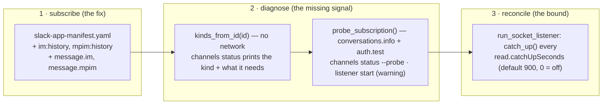

# Design: a DM is a channel like any other — subscription, diagnosis, reconcile

> Phase 2 of 3 (bugfix → design → tasks). Derives from the approved `bugfix.md`.

## Overview

**Three layers, in the order they fail.** The manifest is the *fix*; the doctor is what
would have made the fix unnecessary to find; the reconcile is what bounds the damage of
the next missed event, whatever causes it.



Nothing in the inbound pipeline changes. `handle_socket_event` stays kind-agnostic
(bugfix R1.2), the cursors stay shared, the allow-list stays where it is. The whole
change is: what the app is subscribed to, what the-loop says about that, and how often it
re-reads.

## Decisions

### D1 — the manifest gains all four message events, not just `message.im`

The reported case is a DM. `message.mpim` (a group DM) costs one line and fails in
exactly the same silent way, and an operator who adds `message.im` by hand and later
moves the-loop into a 3-person DM would hit the identical bug. The manifest is the
declaration of *what kind of conversation this app can work in*; the answer is "any of
them".

The comments keep the existing one-line-per-scope style, so the file still reads as a
table of kinds:

```yaml
      - channels:history    # read thread replies and kickoffs in a public channel
      - groups:history      # the same in a private channel
      - im:history          # the same in a direct message with the bot (issue-362)
      - mpim:history        # the same in a group direct message (issue-362)
```

`docs/guide/slack.md` reproduces the manifest verbatim and a test asserts byte parity
(`test_the_guide_reproduces_the_packaged_manifest`), so the fence moves with it.

### D2 — the conversation's kind is derived from the id prefix first, and *confirmed* by the API second

Slack's conversation ids carry the kind in their first character: `D…` is an IM, `G…` is
a private channel or an MPIM, `C…` is a public (and, since the 2019 conversations model,
often a private) channel. That is enough to warn about the reported case with **no
network call at all**, which matters because `channels status` has a stated contract —
token *presence* only, reads the state file, calls nothing — and it is the command an
operator runs when things are already broken.

So the design splits the diagnosis in two:

| | source | when it runs | what it can say |
|---|---|---|---|
| `kinds_from_id(channel_id)` | the id's first character | always, in `channels status` | the kinds it **could** be: `D…` → `(im,)`; `G…` → `(private, mpim)`; `C…` → `(public, private)`; anything else → `()` |
| `probe_subscription(config)` | `conversations.info` + `auth.test` | `channels status --probe`, and once at listener start | the *actual* kind (`is_im` / `is_mpim` / `is_private`) and the *granted* scopes — so it also catches a `C…`-prefixed private channel installed without `groups:history` |

A `C…` prefix is deliberately reported as *no finding*, only a note: it is the ambiguous
one, and a false warning on the configuration 95% of operators run would be worse than
the silence this ticket is about. The probe is how a `C…` operator gets certainty.

### D3 — a finding is a sentence, not a status code

Two pure functions returning tuples of strings — the callers differ only in where they
put them (`print()` for `status`, `logger.warning()` for the listener), so both say the
same words and a test asserts the words once:

| | when | rule |
|---|---|---|
| `subscription_findings(channel_id, kinds, scopes)` | something was **measured** | a finding needs **every** candidate kind's scope to be missing from `scopes`; `scopes=None` means the header was unreadable, and yields **no** finding |
| `unchecked_advice(channel_id)` | **nothing** was probed | only a `D…` is called out — the one prefix Slack leaves unambiguous *and* the one the manifest could not serve at all before this work item |

> **Corrected during implementation.** The first draft had one function where
> `scopes=None` meant both "not probed" and "probed, header unreadable", so an unreadable
> header answered *"run `--probe` to check"* — advice to do the thing just done. A test
> caught it (`evidence/verification.md` § What the tests found); the split gives each
> function one meaning and one test.

A measured finding reads:

```text
channel D0AU0SGP30T is a direct message and the app lacks the bot scope im:history
— Slack never delivers message.im, so replies and kickoffs are only read when the
listener starts or reconciles. Add the scope and the event to the Slack app
(`the-loop channels manifest` prints the manifest that carries them, then Reinstall).
```

Purity is the point: the sentence is testable without a Slack client, and the network
half (`probe_subscription`) is a thin adapter around it that tests substitute with a fake
client, exactly as the rest of `slack.py` does with `build_client`.

### D4 — the reconcile is a deadline inside the existing wait loop, not a second thread

`run_socket_listener` already runs `while not waiter.wait(1.0)`. A second thread (the
`watcher.py` shape) would need its own lifecycle and would duplicate the connect-time
`catch_up()` call for no gain. Instead the existing 1-second tick carries a deadline:

```python
report_subscription(config)               # D3's probe, best-effort
catch_up(frozen_config)
interval = config.catch_up_seconds        # 0 = only at connect
tick = min(1.0, interval) if interval > 0 else 1.0
due = time.monotonic() + interval if interval > 0 else None
while not waiter.wait(tick):
    if due is not None and time.monotonic() >= due:
        try:
            catch_up(frozen_config)
        except Exception:                 # R3.3 is a rule about the LISTENER
            logger.exception("slack: reconcile cycle raised; still listening")
        due = time.monotonic() + interval
```

`catch_up` already swallows what `poll_once` raises, so the guard looked redundant in the
first draft and was left out — until a test killed the listener with it
(`evidence/verification.md`). R3.3 is a requirement on the *listener*, not on `catch_up`:
everything **around** the call (the event emit, any future refactor) needs covering too,
because a listener that dies on a reconcile is strictly worse than one that never
reconciled. `run_socket_listener` also takes a `catch_up_override` — the shape
`watcher.start_watcher`'s `interval_override` already set — so a test drives the deadline
without a 60-second wait, and `tick` follows the interval down so a sub-second override
still ticks.

This keeps bugfix R3.3 free: the stop event is waited on every tick — a second at the
default, less only when the interval is smaller — so shutdown is never delayed by a
15-minute reconcile interval.

`time.monotonic()` rather than wall clock: a reconcile cadence must not be moved by an
NTP step or a DST change.

### D5 — `catchUpSeconds` defaults to 900, floors at 60, and `0` means "today"

| value | meaning |
|---|---|
| `900` (default) | reconcile every 15 minutes — a missed event costs at most a quarter hour |
| `0` | only at connect — 16.0.1's behaviour, for an operator who wants exactly that |
| `1`–`59` | clamped to `60` with a warning |

The floor exists because the reconcile is a *safety net*, not a transport: each cycle is
one `conversations.history` call plus one `conversations.replies` per bound thread, and an
instance with 40 bound threads on a 5-second cadence would spend its rate limit on
reconciling a push channel. 900 is chosen against the failure it bounds — a human waiting
for an answer notices 15 minutes as "slow", and 8 hours as "broken".

Parsing follows the section's existing fail-closed shape, with one deliberate difference
from its neighbour: `intervalSeconds` uses `float(read.get("intervalSeconds") or 30)`,
where `or` makes `0` mean 30. `catchUpSeconds` must distinguish `0`, so it reads the key
explicitly.

### D6 — no config version bump

`read.catchUpSeconds` is additive and optional, with a default that is a strict
improvement on the absent-key behaviour. `CURRENT_CONFIG_VERSION` gates *removals and
renames* — a config written against 0.9.0 loads unchanged and gets the reconcile.
Nothing in `migrations.py` moves.

## Components

| Component | File | Change |
|---|---|---|
| The app manifest | `cli/the_loop/channels/slack-app-manifest.yaml` | +2 scopes, +2 bot events (D1) |
| Kind & findings | `cli/the_loop/channels/slack.py` | `ConversationKind`, `CONVERSATION_KINDS`, `KIND_PREFIXES`, `kinds_from_id`, `kind_from_info`, `kind_summary`, `unchecked_advice`, `subscription_findings`, `probe_subscription` (D2, D3) |
| Config | `cli/the_loop/channels/slack.py` | `SlackChannelConfig.catch_up_seconds` (D5) |
| Schema | `cli/the_loop/schemas/cli-config.schema.json`, `.the-loop/cli-config.schema.json` | `read.catchUpSeconds` — byte-identical copies (D6) |
| The listener | `cli/the_loop/channels/slack.py` | probe-and-warn at start; the reconcile deadline (D3, D4) |
| `channels status` | `cli/the_loop/commands/channels_cmd.py` | the kind line, the reconcile line, `--probe` |
| Guide | `docs/guide/slack.md` | the manifest fence, the upgrade table, a kind→scope→event table, the Downtime section |
| Options | `docs/config/cli/channels-options.md` | `read.catchUpSeconds` (docs-parity P4) |
| Capability | `docs/capabilities/channels.md` | behaviour + History row |
| Template | `skills/the-loop/templates/cli-config.yaml` | the commented `read:` block gains the key |

### The probe's contract

```python
def probe_subscription(
    config: SlackChannelConfig,
    *,
    client_factory: Optional[Callable[[str], Any]] = None,   # default: build_client
) -> Dict[str, Any]:
    """{"skipped": str} | {"kind": str, "scopes": tuple | None, "findings": tuple}"""
```

Two calls, both fixed (`bugfix.md` §AC4): `conversations.info(channel=<configured id>)`
and `auth.test()`. Scopes come from `auth.test`'s **response headers**
(`x-oauth-scopes`) — a comma-separated list Slack returns on every Web API call, carrying
no secret (§AC3). `slack_sdk` normalises header names to lowercase and may hand back a
list or a string, so the reader handles both and treats anything else as "unknown
scopes", which yields no findings rather than a false one.

Every failure path returns `{"skipped": "<why>"}`: no bot token, no channel, an
`SlackApiError`, a transport error. `status` prints it; the listener logs it at `info`.
A diagnostic that fails is not an error (R2.3).

## UI/UX

No product UI. Two terminal surfaces change, both additive:

```console
$ the-loop channels status
  channel:      D0AU0SGP30T
  ...
  read:         socket, reconciling every 900s
  channel kind: direct message — needs bot scope im:history and bot event message.im
  [!] channel D0AU0SGP30T is a direct message: it needs the bot scope im:history and the
      bot event message.im, which the-loop's app manifest did not always carry — … Run
      `the-loop channels status --probe` to check the installed app.
```

```console
$ the-loop channels status --probe
  channel kind: direct message — needs bot scope im:history and bot event message.im
  probe:        conversations.info says im; granted bot scopes: chat:write, channels:history
  [!] channel D0AU0SGP30T is a direct message and the app lacks the bot scope im:history —
      Slack never delivers message.im, so replies and kickoffs are only read when the
      listener starts or reconciles. …
```

When the probe cannot run it says so in the same slot and `status` still exits 0:

```console
  probe:        not probed — no bot token — THE_LOOP_SLACK_BOT_TOKEN is unset
```

The `[!]` prefix is the one `_status` already uses for "you configured something that
cannot work" (the unknown-subscribe-name line), so the finding reads as the same class of
thing.

## Risks

| Risk | Mitigation |
|---|---|
| The prefix heuristic mislabels a conversation | Only `D…` produces a finding; `G…` produces a *note* naming both possibilities; `C…` produces a note only. The authoritative answer is one `--probe` away, and the probe is what the listener runs. |
| An operator upgrades the-loop and not the Slack app, and sees no change | This is the common case, and it is exactly what the finding is for: the listener now warns on every start, and the guide's upgrade table lists the four entries to add. The reconcile also caps their exposure at 15 minutes in the meantime. |
| The periodic reconcile costs rate limit on a large instance | The 60-second floor, the 900-second default, and `0` to opt out. A cycle with no bound threads and no kickoff grant still makes no API call (`poll_once`'s existing behaviour). |
| `auth.test` header parsing breaks on an SDK change | Unknown/unparseable scopes yield **no** findings, never a wrong one, and the kind line from the prefix is unaffected. |
