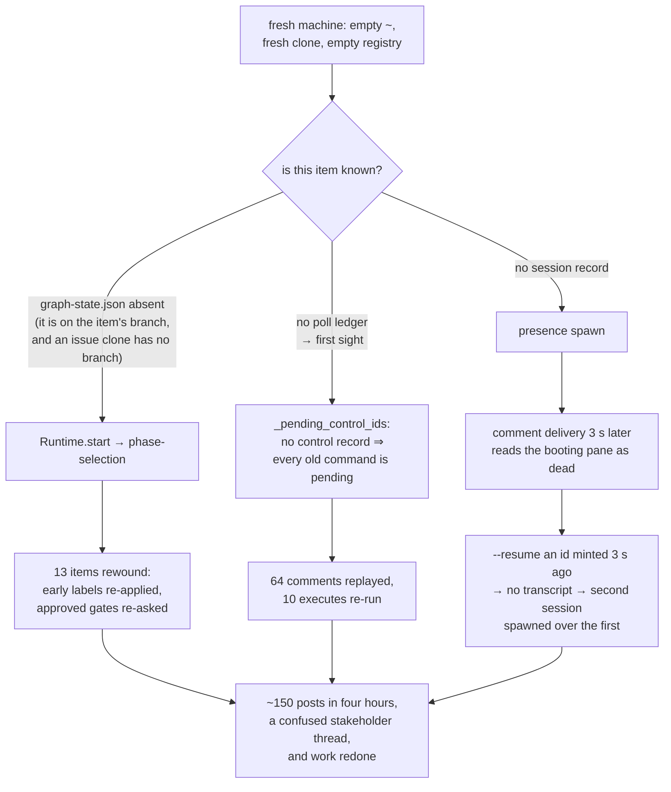

# Bugfix spec: after a machine loss the daemon rewinds every work item, replays old commands, and double-spawns

## Summary

**the-loop treats "this machine has never seen the item" as "this item has never
started".** The three records that answer *where is this work item?* — the graph
pointer, the comment ledger, the control record — all live on the daemon's disk, and
every one of them fails open to "nothing has happened here". Rebuild the box and the
daemon does what it does for a brand-new ticket: enters the graph at `phase-selection`,
reads the whole thread as unprocessed input, and re-posts every gate.

Reported against 15.0.0 by a collaborator whose devbox was destroyed and rebuilt:
13 of 18 in-flight items were reset to the first node, 64 old comments were replayed as
new events (10 of them `the-loop execute` control commands, 5 old approvals), 41 of
45 daemon posts were byte-identical repeats of posts from days earlier, four humans
re-approved gates they had already approved, and one agent redid a brainstorm and
re-drafted an 8.7 KB requirements document that already existed on the item's PR. Four
items were spawned twice, because a comment delivery three seconds behind the presence
spawn found the booting pane "not found" and respawned over it.
Ticket: [issue-363](https://github.com/MadaraUchiha-314/the-loop/issues/363).

The reboot earlier the same day, where the transcripts survived, resumed cleanly. This
is specifically the machine-loss path — and the three failures are one defect seen three
times, which is why they are fixed together rather than in three tickets.

## Steps to reproduce

1. Run a daemon (poller mode) against a repository with a labelled work item that has
   advanced past its first node — `loop:implementation`, say, with an open PR carrying
   `docs/specs/<id>/graph-state.json` on its branch, and a thread containing an
   authorized `the-loop execute` and an approval.
2. Delete the daemon's state root and the harness transcripts, and re-clone the
   repository (a new machine, or `rm -rf` of `~` and the checkout).
3. Start the daemon again.

Observed, within one poll cycle:

- `graph.frozen` + `graph.advanced {"node": "phase-selection", "to": "brainstorming"}`
  on an item labelled `loop:implementation`, and the early phase label written back over
  the late one.
- `poll.comment_forwarded` for every historical comment, and
  `control.command {"command":"execute","effect":"handed-to-graph"}` for each old
  control comment.
- With a comment queued in the same cycle as the presence spawn:
  `session.spawned` → `session.resume_failed … no transcript for that session id?` →
  `session.respawned`, three to five seconds apart.

## Expected vs actual

- **Expected:** a machine that has forgotten a work item says so, and does nothing that
  depends on remembering it. It does not move the pointer, does not re-run a command it
  cannot prove it has not already run, and does not spawn twice.
- **Actual:** every forgotten record is read as an empty one, and an empty record means
  "new work item" everywhere it is read.

## Root cause (confirmed)

Four independent reads of local-only state, each of which fails open.

| # | Where | The read | What absence is taken to mean |
|---|-------|----------|-------------------------------|
| 1 | `cli/the_loop/graph/state.py:162` → `runtime.py:735` | `GraphState.load` returns an empty state when `docs/specs/<id>/graph-state.json` is missing; `Runtime.start` then enters the **start node** | "this item has not begun" |
| 2 | `cli/the_loop/poller/poller.py:1279` | `_pending_control_ids` returns *every* authorized control comment on the thread when there is no control record | "no command here has ever run" |
| 3 | `cli/the_loop/runner.py:744` | `deliver` declares the pane missing the instant `has_live_session` is false | "the harness crashed" — including while it is still booting |
| 4 | `skills/the-loop/templates/webhook-autoexecute-prompt.md:10` | the spawn prompt tells the agent to read the thread, and never that its previous conversation is gone | the agent narrates "picking up where I left off", which is false |

(1) is the load-bearing one. The file **is** checked in — `state.py:1-5` says so — but on the
work item's **branch**, and a `clone`-strategy workspace for an *issue* work item is
prepared with no branch at all (`workspace.prepared` carries a `checkout` and no
`branch`; only PR work items get one). The daemon already publishes the frozen graph to
the portable record (`runtime.py:541`, `frozenGraphSink`), so a portable channel exists —
it just carries the *selection* and not the *position*, and nothing reads it back.

## Requirements

### Requirement 1 — a machine that has forgotten a work item never rewinds it

The pointer only ever moves forward. A daemon with no local graph state for an item whose
ticket says it has advanced must refuse to enter the graph rather than start it over.

#### Acceptance criteria (EARS)

1. WHEN the daemon enters the graph for a work item whose local `graph-state.json` is
   absent AND whose ticket carries a `loop:<phase>` label naming a phase other than the
   start node's, THEN the system SHALL NOT call `Runtime.start`, SHALL emit
   `graph.rewind_refused`, and SHALL leave every label, gate and artifact untouched.
2. WHEN a rewind is refused, THEN the spawn itself SHALL still proceed, so the work item
   gets a session that can be told what happened (R5) rather than being stranded.
3. WHEN the ticket carries no `loop:` label, or carries only the start node's own phase,
   THEN the system SHALL enter the graph exactly as it does today.
4. WHEN a rewind is refused, THEN the system SHALL name the audited operator remedy
   (`the-loop graph force <id> --to <node> --reason <why>`) in the log and in the ticket
   notice of R3.3, and SHALL take no such action itself.

### Requirement 2 — the graph position travels with the work item

#### Acceptance criteria (EARS)

1. WHEN the daemon completes a graph write for a work item's **outer** loop, THEN the
   system SHALL publish that work item's whole graph state into the `graph` section of
   its portable record, under `position`, WITHOUT discarding the frozen selection
   recorded beside it.
2. WHEN the daemon is about to enter the graph for a work item whose local
   `graph-state.json` is absent AND whose portable record carries a `position`, THEN the
   system SHALL write that position to disk as the item's graph state and SHALL emit
   `graph.position_restored`, so the subsequent `Runtime.start` is the no-op it already
   is for an item with a pointer.
3. WHEN a restored position is written, THEN it SHALL be byte-equivalent to the state
   that was published, so a restore is a move, never a re-derivation.

### Requirement 3 — a control command is executed once, ever

#### Acceptance criteria (EARS)

1. WHEN the poller sees a work item for the first time AND the item shows evidence of
   prior the-loop work (a `loop:<phase>` label naming a phase past the start, or a
   self-authored the-loop comment on its thread), THEN the system SHALL baseline the
   whole thread INCLUDING its control comments, SHALL execute none of them, and SHALL
   emit `poll.context_lost`.
2. WHEN the poller sees a work item for the first time AND the thread shows no prior
   the-loop work, THEN historical control commands SHALL still be forwarded exactly as
   issue-119 specified — a `the-loop execute` posted before the poller ever saw the item
   still starts it.
3. WHEN R3.1 baselines a thread, THEN the system SHALL post exactly one comment on the
   work item saying that the-loop lost its record of the item, naming the cutoff instant
   and stating that no command posted before it will be re-run, and SHALL post it at most
   once per work item.

### Requirement 4 — a session that is still booting is not a session that has died

#### Acceptance criteria (EARS)

1. WHEN a delivery targets a session whose record was created less than
   `routing.tmux.spawnGraceSeconds` ago AND whose pane does not answer as live, THEN the
   system SHALL report a **transient** failure (released for retry) rather than a missing
   session, and SHALL NOT respawn, resume, or spawn a second session.
2. WHEN the grace window has elapsed, THEN a pane that does not answer as live SHALL be
   reported missing exactly as it is today.
3. `routing.tmux.spawnGraceSeconds` SHALL default to 20 and SHALL be settable to 0 to
   restore the pre-fix behaviour.

### Requirement 5 — a recovery session is told its conversation is gone

#### Acceptance criteria (EARS)

1. WHEN the dispatcher spawns a session for a work item that has no local graph pointer
   AND whose ticket carries a `loop:<phase>` label naming a phase past the start, THEN
   the spawn prompt SHALL state that this is a fresh conversation replacing a lost one,
   and SHALL require the session to locate the existing pull request, branch and
   `docs/specs/<id>/` artifacts and reconcile the graph position before producing or
   re-posting any artifact.
2. WHEN the spawn is an ordinary one, THEN the prompt SHALL render byte-identical to
   today's modulo an empty substitution.

### Requirement 6 — every one of the above is proved by a regression test

#### Acceptance criteria (EARS)

1. Each of R1–R5 SHALL have a test that fails before the fix and passes after it.

## Security considerations

The bug is not itself exploitable, but three of the five requirements move a trust
boundary, so each is stated with how it fails closed.

- **Untrusted actor:** anyone who can write to the repository — and therefore anyone who
  can add, remove or edit a `loop:<phase>` **label**, which R1 and R5 now read as
  evidence.
- **Trust boundary moved (R1):** a label becomes an input to a control-flow decision. It
  fails closed in the only direction that matters: the label can make the daemon
  **refuse** to enter the graph, never make it enter at a chosen node. Forging
  `loop:complete` on a fresh ticket buys a refusal and a notice, which is a denial of
  convenience, not an escalation; the audited `graph force` remains the only way to place
  a pointer, and it already requires an actor and a reason.
- **Trust boundary moved (R2):** the portable record is tracked, so a restored position is
  content anyone who can open a pull request could propose. It is no more trusted than
  `graph-state.json`, which is checked in and agent-writable for exactly the same reason —
  and `Runtime.reconstruct` still re-derives the node from the artifacts at every
  repository-boundary check (`state.py:1-11`, issue-109 R8.4). A restore is therefore
  subject to the same re-derivation that already stops an agent from passing a gate by
  editing its own scorecard. The restore path writes **only** when no local state exists,
  so it can never overwrite a pointer this machine established.
- **Trust boundary moved (R3):** a comment's *age* now decides whether it is executed. The
  direction is again closed: the new rule only ever **withholds** execution. No command
  becomes executable that was not executable before, and every existing guard —
  `is_authorized`, the self-authored marker, the unambiguous-keyword parse — is
  unchanged and still applies to everything that is forwarded.
- **R3.3's notice** is written from the-loop's own prose plus values it minted (the ref, a
  timestamp); no commenter's body reaches it, which is what makes `mark_self_authored`
  safe to apply to it (the rule `giveup_notice` already states).
- **Accepted property, not a defect (found by the security review):** `context_lost`'s
  second signal is answered by `authz.is_self_authored`, whose marker is a comment body
  anyone can type — so an unauthorized commenter can force the withholding branch on a work
  item's first-sight cycle. The consequence is *only* withholding (the thread is baselined,
  nothing is executed, one fixed-text notice is posted), which is the same power the phase
  label already gives anyone with repo write access. It is also pre-existing and deliberate
  in the same direction: the poller has always *dropped* a self-marked comment rather than
  forwarding it (issue-64). Raising it to an authenticated signal would mean a second marker
  carrying a secret, which is a worse trade for a guard whose only power is to say *stop*.
- **R4** changes a timing check on a local tmux probe and touches no boundary.
- **No new attack surface** otherwise: no new network call, no new credential, no new
  parser, no new write target outside the-loop's own state root.

## Out of scope

- **Committing and pushing the portable directory from the daemon.** The ticket offers it
  as an alternative to R2's publish; it is not taken. A daemon that pushes to a work
  item's repository on its own is a new write path with its own failure modes (conflicts,
  force-push, a branch nobody asked for) and it would not have helped the reporter
  anyway, whose 9 missing records had never been committed by *anything*. R2 makes the
  record complete; whether an operator tracks it is their existing choice.
- **Checking out the work item's PR head branch for an issue work item** (the ticket's
  first proposal). It would make `graph-state.json` findable in more cases, but it
  changes what an issue work item's workspace *is* for every item, started or not — a
  workspace-strategy change wearing a recovery hat. R1 makes the missing file harmless;
  finding it more often is a separate improvement.
- **Coalescing a presence spawn with same-cycle forwarded comments** in the poller. R4
  removes the harm (the comment now waits for the booting pane instead of racing it)
  without reordering the cycle.
- **The inner (`pdlc-pr-loop`) loops' positions.** R2 publishes the outer loop's state.
  A PR loop's state lives under `pr-loops/<owner>__<repo>/pr-<n>/` and its recovery is
  the PR's own branch, which a PR work item's workspace *does* check out.

## Open questions

None. The reporter supplied the event log, the code sites and the expected behaviour;
every choice above is recorded in [`design.md`](design.md) or in
[decision-126](../../decisions/decision-126.md).
