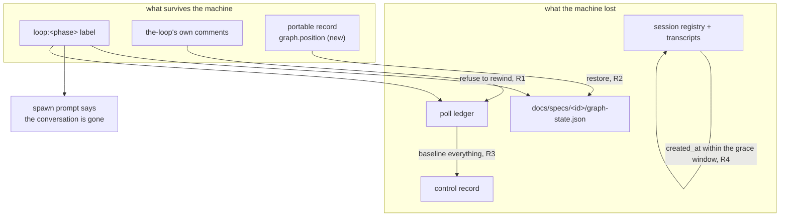

# Design: surviving a machine loss

## Summary

**One rule, applied at four reads: absence of local state is not evidence of absence of
work.** Every fix below is a guard that distinguishes *"nothing has happened"* from
*"nothing is remembered here"*, and each one fails in the direction that costs a human a
re-post rather than a rewind.

The rule needs a portable answer to "has this item been worked?", and the-loop already has
two, both written by the-loop itself and both living where the work item lives rather than
where the daemon lives:

1. the ticket's **`loop:<phase>` label**, written by the `set-phase-label` hook at every
   node entry — the one fixed label vocabulary across every repository (issue-352); and
2. the-loop's own **self-authored comments** on the thread, already recognised by
   `authz.is_self_authored` because the poller must not read its own posts back as input.

Neither is trusted to *place* a pointer. Both are trusted to say *"stop"*.



## Components & interfaces

### New: `cli/the_loop/recovery.py`

One small module owning the vocabulary, so the poller, the graph link and the dispatcher
answer the same question the same way rather than each growing its own heuristic.

```python
PHASE_LABEL_PREFIX = "loop:"          # re-exported from graph.hooks.sideeffects
NOT_ADVANCED = frozenset({"", "not-started", "phase-selection"})

def phase_labels(labels: Iterable[str]) -> List[str]
    """The phases named by an item's `loop:` labels, in order."""

def advanced_phase(labels, *, start_phase: str = "") -> str
    """The first phase label that is evidence the item has moved past its start
    node — `""` when there is none. `start_phase` narrows the answer to a
    specific graph (the adhoc loop starts at phase `implementation`); without it
    the graph-free default `NOT_ADVANCED` applies."""

def context_lost(*, labels, comments_self_authored: bool) -> bool
    """The thread shows the-loop has worked this item."""

def context_lost_notice(*, ref: str, cutoff: str) -> str
    """The one comment posted per item — the-loop's own prose plus minted values."""
```

`context_lost_notice` takes **no** parameter through which a commenter's body could reach
a comment the-loop posts with the operator's credentials; that is the precondition
`giveup_notice` already documents for applying `mark_self_authored`.

### R1/R2 — `graphlink.GraphLink`

Three changes, all on the `start` action and all for the **outer** loop only
(`pr_number is None`):

| Where | What |
|---|---|
| `_guarded`, before `_outer_loop_name` | **Restore.** No local `graph-state.json` and a portable `graph.position` ⇒ write the position to disk under `state_lock`, emit `graph.position_restored`. Placed before the loop name is resolved because `_outer_loop_name` is state-first, and a restored state names the loop the item actually walks. |
| `on_arm` / `on_spawn`, inside `call` | **Refuse.** `_may_start(rt, item_id, work_item, routed)` returns False when the state file is still absent and the item's labels name a phase other than `rt.graph.node(rt.graph.start).phase`. `rt.start` is then not called at all: no node entered, no label written, no hook run. `on_arm` returns False (do not hold the spawn back), `on_spawn` returns. |
| `_guarded`, after `call` | **Publish.** For every write action, read the saved state back and hand `{"state": <graph-state.json>, "at": <utc>}` to the injected `position_sink`. Inside the same `state_lock` the call held, so what is published is what was written. |

The labels reach `_may_start` from the event that triggered the start —
`router.event_labels(payload)`, a new pure reader beside `event_carries_label`, which
already reads the same two payload keys. Both ingresses carry them: the webhook payload
has `issue.labels`, and the poller synthesises its events from a listing that reads
`labels` (`poller/github.py:479`).

Why the refusal is not "adopt the phase from the label": the label says which *phase* the
item reached, not which *node*, not which gates were approved, not which phases the human
declared away at selection, and not which model the item was frozen to. Entering at a node
derived from a label would fabricate all four. Refusing fabricates nothing, and the
operator's audited escape hatch — `the-loop graph force <id> --to <node> --reason <why>` —
already exists to place a pointer with an actor and a reason on it. See
[decision-126](../../decisions/decision-126.md).

### R2 — `control.ControlStore`

`record_frozen_graph` and the new `record_graph_position` write **into** the `graph`
section rather than replacing it, so the selection and the position coexist:

```python
def record_graph_position(self, work_item, position: Dict[str, Any]) -> None
def graph_position(self, work_item) -> Optional[Dict[str, Any]]
```

The published `position` is the whole `graph-state.json` payload verbatim, not a summary.
A summary would need a reader that rebuilds a `GraphState` from it — a second serialiser
of the same data, and the place the next drift bug lives. Verbatim makes restore a file
copy and R2.3 an equality assertion.

### R3 — `poller.Poller._process_item`

The first-sight branch gains one question before it asks `_pending_control_ids`:

```python
if first_sight:
    lost = recovery.context_lost(
        labels=item.labels,
        comments_self_authored=any(is_self_authored(c.body) for c in comments),
    ) and not has_session and self.control_store.get(ref) is None
    pending = set() if lost else self._pending_control_ids(ref, comments)
```

`has_session` and the control record are in the predicate because either one means this
machine has *not* forgotten the item — a first sight with a live session is a ledger that
was cleared, not a machine that was rebuilt, and replaying is still wrong but refusing is
not this ticket's business.

The notice is posted through the existing `post_issue_comment` seam the give-up report
uses (`self._comment_runner`, `dispatcher.config.announce.gh_binary`), with the same
contract: best-effort, swallowed on failure, and never able to change what the ledger
already recorded. It is posted at most once because the same cycle baselines the thread,
so no later cycle is a first sight for that item.

### R4 — `runner.TmuxRunner.deliver`

```python
if not self.has_live_session(target):
    if self._within_spawn_grace(session):
        return TmuxResult(ok=False, session_missing=False, error=...)
    return TmuxResult(ok=False, session_missing=True, error=...)
```

`_within_spawn_grace` parses `session.created_at` and compares it with now against
`spawn_grace_seconds`. An unparseable or empty `created_at` is **not** in the window —
a record with no creation time is an old record, and old records are exactly the ones the
issue-156 respawn path exists for.

The distinction `session_missing` carries is already load-bearing at
`dispatcher.py:2423`: True respawns, False falls through to the ordinary failure path,
which logs and releases the delivery for retry. So the grace window needs no new
dispatcher branch — it re-uses the one that already exists for "the paste failed, try
again". This is also why R4 subsumes the ticket's coalescing proposal: the comment that
was racing the boot now simply arrives after it, into the same pane.

`deliver_to` — the standing-session path, which has no `Session` and therefore no
`created_at` — is untouched, exactly as the liveness refusals already are.

### R4 — configuration

`routing.tmux.spawnGraceSeconds`, a number, minimum 0, default 20. Twenty seconds is a
harness TUI's boot budget with room for a loaded machine; the reporter's race was three
seconds. `0` restores the pre-fix behaviour, which is what makes the change reversible
without a revert.

Four files move together, as every routing key does: both copies of
`cli-config.schema.json` (byte-identical, `test_config_schema_parity.py`),
`docs/config/cli/routing-options.md` (Type and Default, `test_docs_parity.py`), and the
two shipped `cli-config.yaml` templates.

### R5 — the spawn prompt

`webhook-autoexecute-prompt.md` gains one placeholder, `$recovery_notice`, rendered empty
on an ordinary spawn (R5.2) and, on a recovery spawn, carrying the notice that this is a
new conversation replacing a lost one and that the session must reconcile before it
writes. `DEFAULT_SPAWN_TEMPLATE` in `dispatcher.py` is the byte-identical fallback
`test_interaction.py` asserts.

The dispatcher decides from what it already has at the spawn site: the graph context it
resolved a line earlier (`ctx.current_node` empty ⇒ no local pointer) and the event's
labels. No plumbing from the poller, and no new state to keep in sync — the same two facts
R1 reads, read at the other end.

## Data models

The `graph` section of `<state.root>/portable/<slug>.json` gains one key:

```json
{
  "graph": {
    "loop": "pdlc-work-item-loop",
    "workItem": "issue-363",
    "surface": "", "sessionPerPr": "cross-repository",
    "model": "", "effort": "", "nodes": [ … ],
    "position": {
      "at": "2026-09-14T09:00:00Z",
      "state": { "workItem": "issue-363", "currentNode": "implementation", "nodes": { … } }
    }
  }
}
```

Additive: every pre-issue-363 record simply has no `position`, which reads as "this
machine has nothing to restore" — the same honest answer `frozen_graph` gives for an item
that never answered the gate.

## Error handling

| Failure | Behaviour |
|---|---|
| The portable position is unreadable, or not a dict | Ignored; the refusal of R1 still applies, so the outcome is a notice rather than a rewind. |
| Writing the restored state fails (`OSError`) | Logged, `graph.position_restore_failed`; R1 then refuses. A restore that half-worked cannot happen — `GraphState.save` is tempfile + rename. |
| Publishing the position fails | Logged and swallowed, exactly as `_publish_frozen_graph` already does. A bookkeeping write never gates a transition. |
| The R3 notice cannot be posted | Logged, `poll.context_lost_notice_failed`; the baseline already happened and is not undone. A notice must not end a poll cycle. |
| `state_lock` is busy during a restore | `StateLockBusy` propagates into `_guarded`'s existing `except Exception`, which reports `graph.link_failed` and skips the cycle — the next event retries. |

## Testing strategy

See [`testing-plan.md`](testing-plan.md). The load-bearing shape is that each of R1–R5 has
a test that reproduces the reporter's sequence on a *fresh* state root and asserts the
absence of the damage — no `graph.advanced` to the start node, no `control.command`, no
second `session.spawned` — rather than only asserting the new happy path. An absence is
what the reporter observed the lack of, and a test that only asserts the new code ran
would pass with the old code still reachable by another route.

## Security design

The three moved boundaries and how each fails closed are stated in
[`bugfix.md`](bugfix.md) § Security considerations; the design decisions that keep them
closed are:

- **A label can refuse, never place.** `_may_start` returns a boolean. There is no code
  path from a label to a node id, so the worst a forged `loop:complete` achieves is that
  the-loop declines to start an item and says so on the ticket.
- **A restore writes only into a vacuum.** The restore is guarded by
  `not GraphState.path_for(state_dir).is_file()`, so a portable record — tracked, and
  therefore proposable by anyone who can open a pull request — can never overwrite a
  pointer this machine established. What it *can* do is what `graph-state.json` itself can
  already do, and `Runtime.reconstruct` re-derives the node from the artifacts at every
  repository-boundary check for exactly that reason (issue-109 R8.4).
- **The age rule only withholds.** R3 removes comments from the pending set and adds none.
  `is_authorized`, the self-authored marker and the unambiguous-keyword parse are
  untouched and still judge everything that is forwarded.
- **The notice is the-loop's own prose.** No parameter of `context_lost_notice` accepts
  foreign text, which is the precondition for `mark_self_authored`.

## Minimalism

Against the ladder: no new dependency (stdlib only), no new abstraction beyond the one
5-function module that exists to stop three call sites inventing three predicates, and
no new CLI verb — the remedy R1 names, `graph force`, already ships with an actor, a
reason and an audit record. The two proposals from the ticket that *would* have added
surface — a daemon that pushes to the repository, and a workspace that checks out a PR
branch for issue work items — are declined in [`bugfix.md`](bugfix.md) § Out of scope.
