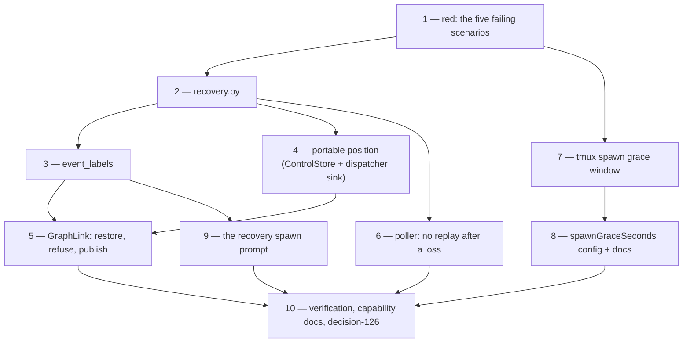

# Tasks: surviving a machine loss

> A DAG, derived mechanically from `bugfix.md` and `design.md`. No approval gate
> (issue-281) — it advances on shape. Each task names the testing-plan row that proves it.

- [x] **1. Write the red tests.** `cli/tests/test_recovery.py` and
  `cli/tests/test_recovery_integration.py`: the reporter's sequence on a fresh state root,
  the portable restore, issue-119's preserved behaviour, the boot-window delivery, and the
  four abuse cases. Capture the failing run before any production code changes.
  _Requirements: R6.1_ _Test: T5, T6, T7, T8, T12_

- [x] **2. Add `cli/the_loop/recovery.py`.** `phase_labels`, `advanced_phase`,
  `context_lost`, `context_lost_notice`, and the recovery paragraph the spawn prompt uses.
  _Requirements: R1.1, R3.1, R3.3, R5.1_ _Test: T1_

- [x] **3. Add `router.event_labels`.** A pure reader beside `event_carries_label`, over
  the same two payload keys.
  _Requirements: R1.1, R5.1_ _Test: T4_

- [x] **4. Carry the graph position in the portable record.**
  `ControlStore.record_graph_position` / `graph_position`, both graph writers merging into
  the `graph` section instead of replacing it; `Dispatcher._record_graph_position` wired as
  `position_sink` beside `frozen_graph_sink` at both construction sites.
  _Requirements: R2.1_ _Test: T2, T11_

- [x] **5. Make `GraphLink` restore, refuse and publish.** Restore before the loop name is
  resolved; `_may_start` inside `on_arm`/`on_spawn`; publish after every outer-loop write,
  inside the state lock. New events `graph.position_restored`,
  `graph.position_restore_failed`, `graph.rewind_refused`, `graph.position_published`.
  _Requirements: R1.1, R1.2, R1.3, R1.4, R2.2, R2.3_ _Test: T5, T6, T7, T12_

- [x] **6. Stop the poller replaying a forgotten item's thread.** The context-lost branch
  in `_process_item`, the `poll.context_lost` event, and the one notice posted through the
  existing comment seam.
  _Requirements: R3.1, R3.2, R3.3_ _Test: T5, T7, T12_

- [x] **7. Give a booting session its grace window.** `TmuxRunner.spawn_grace_seconds` and
  `_within_spawn_grace`; `deliver` returns a transient failure inside the window.
  _Requirements: R4.1, R4.2_ _Test: T3, T8_

- [x] **8. Configure it.** `routing.tmux.spawnGraceSeconds` in both schema copies (byte
  identical), `docs/config/cli/routing-options.md`, and both shipped `cli-config.yaml`
  templates; `TmuxConfig` parses it and the dispatcher hands it to the runner.
  _Requirements: R4.3_ _Test: T11, T18_

- [x] **9. Tell a recovery session its conversation is gone.** `$recovery_notice` in the
  shipped template and in `DEFAULT_SPAWN_TEMPLATE`; the dispatcher decides from the graph
  context it already resolved plus the event's labels.
  _Requirements: R5.1, R5.2_ _Test: T9_

- [x] **10. Verify and document.** Run the plan, capture evidence, write
  [decision-126](../../decisions/decision-126.md), and update the capability docs
  (`process-graph.md`, `webhook-triggers.md`, `interactive-sessions.md`) and the execution
  log's `## Documentation` section in this same PR.
  _Requirements: R6.1_ _Test: T18_
