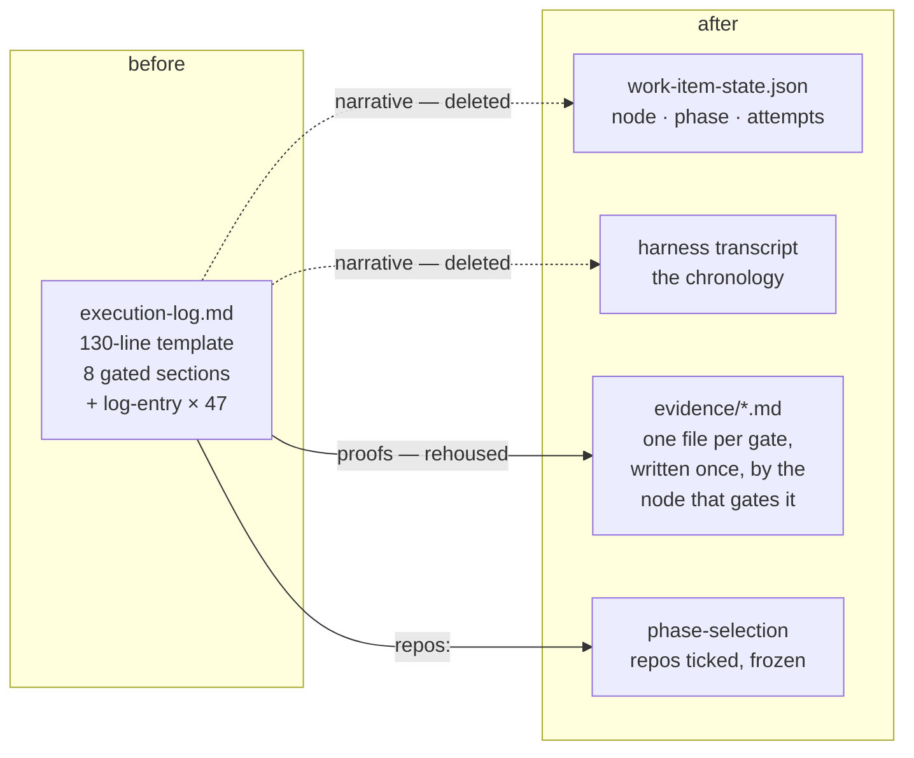
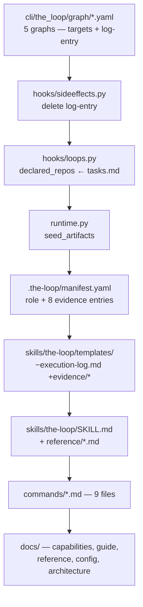

# Design: retire the execution log

> Phase 2 of 3 (requirements → design → tasks). Derives from the approved
> `requirements.md`.

## Overview

**Delete the narrative; give each gate its own small proof under `evidence/`.**

Three properties carry the whole design:

1. **Nothing is generated twice.** The phase, the current node and the attempt count live
   in `work-item-state.json` and on the `loop:<phase>` label; the chronology lives in the
   harness's own transcript. the-loop stops re-deriving both.
2. **Every gate keeps a subject.** `validate-artifacts` blocks when a content gate resolves
   no artifact ([decision-063](../../decisions/decision-063.md)); that rule and the parity
   test behind it (P5a) are untouched. Each of the eight sections the log carried becomes a
   file of its own, gated by the one node that writes it.
3. **A skip relaxes one gate, not the chain.** This is the reason for *one file per node*
   rather than one shared file — see § D2.

## The mapping

Every gate that named a section of `execution-log.md` now names a file under
`docs/specs/<id>/evidence/`. The `spec-evidence` role already covers that directory —
"committed verification evidence" widens to *the proof each gate leaves behind*.

| Node (outer loop) | was | now |
|---|---|---|
| `design-critic-review` (opt-in) | log § Design critic review | `evidence/design-critic-review.md` |
| `self-review` | log § Review cycles | `evidence/self-review.md` |
| `critic-review` | log § Review cycles | `evidence/critic-review.md` |
| `security-review` | log § Security review (gate) | `evidence/security-review.md` |
| `verification` (only when `test-planning` was declared away) | log § Verification results | `evidence/verification.md` (`onlyWhenSkipped`) |
| `evidence` | log § Final validation evidence | `evidence/final-validation.md` |
| `capability-docs` | log §§ Capability docs, Documentation | `evidence/documentation.md` |
| `reviewer-briefing` | log § Pull requests | `evidence/pull-requests.md` |

Every one of them keeps the `validates:` verb it uses today — only the target changes. The
inner loops (`pdlc-pr-loop`, `pdlc-contribution-loop`) gate the same names the same way.

`log-entry` is deleted from `hooks/sideeffects.py` and from all 47 entry chains across the
five shipped graphs. Nothing replaces it: a node boundary is already an event in
`event-log` and a transition in `work-item-state.json`.

## Decisions

**D1 — `validates:`, not `produces:`, even though the node writes the file.** Tempting to
switch: "this node wrote it" is true again once the record is per-node. But `produces:` is
not a synonym for authorship in this codebase — it is the artifact a **phase** is judged
by, and the manifest binds each one to a phase that the parity suite then checks in both
directions (P1: the phase's node accepts the name; P2: every produced name is tracked *at a
phase*). Five of the six review-chain nodes carry no `phase:` at all, deliberately — the
chain was one `needs-review` label, and minting a label per node would change every
consuming repository's vocabulary. So `produces:` would force either a phase these nodes
must not have, or a manifest entry P1 cannot satisfy. `validates:` already means exactly
what is meant here — *this gate reads this file* — and keeps the shape the manifest,
the graphs and the parity tests already agree on. Only the target changes.

**D2 — one file per node, not one `evidence/reviews.md`.** A shared file looks tidier and
is wrong here, for two independent reasons:

- **A gate would be satisfied by another node's writing.** `self-review` and
  `critic-review` both demand a `Review cycles` section. On the shared execution log, the
  first to write one cleared both gates. One file each makes each assertion its own.
- **A skip could soften a walked node's gate.** `skipped_artifacts` is the set of names
  **produced** by declared-skipped nodes, and `validate-artifacts` tolerates the absence of
  anything in it (`hooks/artifacts.py:157`). Nothing here is produced, so the set stays
  empty of these names and the question does not arise — and a skipped node is routed past
  before its own chain runs (`Runtime._route_skips`), so skipping one node removes exactly
  one assertion. R2.3 holds by construction rather than by care.

The same reasoning separates the pair at the end of verification. `evidence/verification.md`
— the kept gate when the plan was declared away — is written by no node's `produces:`, so
it can never become a planned absence and `verification` blocks on it unconditionally,
which is what issue-179's kept-gate rule requires. `evidence/final-validation.md` is the
`evidence` node's own record and goes away with that node.

**D3 — `repos` is ticked at `phase-selection` and frozen into `work-item-state.json`**
(revised after the owner's review; [decision-127](../../decisions/decision-127.md)). It
first moved to `tasks.md`'s front matter, which kept it an artifact — and this input
decides which repositories an unattended agent opens pull requests in, so a channel anyone
who can edit a file can answer is the wrong channel. It is the fifth per-work-item choice
the one signed reply freezes, beside `surface`, `sessionPerPr`, `model` and `effort`. Rows
come from the instance's own `repositories` (issue-348), so a tick names a key into what
the operator declared rather than a string that becomes a directory name; any number may be
ticked, and none means *no declaration* exactly as an absent key did (R3.2).

**D3a — the state file is the work item's.** `graph-state.json` → `work-item-state.json`
(R7): the pointer and node records are the graph's, but the surface, session, PR-session
mode, model, effort and now repositories are not. The old name is **read** and the new one
written (`existing_path`, present-name-wins), and the inner-loop scan globs both — an outer
gate that stopped seeing a loop started before the rename would release on work that never
finished.

**D4 — the resume anchor is `work-item-state.json` + `tasks.md`.** `reference/context.md`'s
checkpoint-then-reset protocol keeps its discipline and loses its prose: before a reset,
tick the checkmarks, commit, and let the state file say where the pointer is. A fresh
window re-enters by reading `work-item-state.json` (current node), the specs, and the first
unticked task — which is what "Next:" said, derived rather than written.
`Runtime.resolve_session`'s fallback seeds `requirements.md`, `design.md`, `tasks.md`
(`runtime.py:302`).

**D5 — existing logs are left exactly where they are.** 132 in this repository, more in
consuming projects. They are the operator's data, and the repo already has a precedent for
data the loop stops reading: the relocated learnings tree, which `upgrade-the-loop` reports
and never touches, and which is *deliberately* absent from `manifest.deprecated`
(`commands/upgrade-the-loop.md:185`) because everything there is safe-to-delete plugin
internals. An execution log is neither. So: no `deprecated` entry, no deletion, a reported
line in the upgrade report, and nothing in the-loop reads the file again (R5.3 falls out of
deleting every reader).

**D6 — the rejected alternative: drop the gates with the log.** The ticket says "remove
this functionality", and the smallest reading is to delete the eight sections and their
gates outright. That would delete `validate-artifacts`' fail-closed block, parity
assertion P5a, and decision-063 — and return `self-review`, `critic-review`,
`security-review`, `evidence`, `capability-docs` and `reviewer-briefing` to reporting
success on every run without asserting anything, which is precisely the defect issue-167
was filed for. The ticket's stated cost is *generation*, and the generation is the
narrative: a 130-line template, 47 hook appends and a prose checkpoint before every context
reset. The proofs are a handful of lines written once by the node that ran. This design
removes the first and keeps the second; if the owner wants the gates gone too, that is a
second, separately-approvable work item and not a side effect of this one.

## Token arithmetic

The ticket is a token complaint, so the change is measured in tokens.

| | before | after |
|---|---|---|
| Template materialized per work item | 130 lines, always | 0 |
| Files written | 1, re-read and re-appended at every phase | ≤ 8, each written once, only for phases walked |
| Hook appends per work item | one per node boundary (`log-entry`, 15–17 in a full outer walk) | 0 |
| Checkpoint before a context reset | a prose entry with **Did/Next/Context** | checkmarks + commit |
| Phase recorded in | front matter **and** `work-item-state.json` **and** the label | `work-item-state.json` + the label |

A full outer walk stops emitting the phase-transition table, ~15 `log-entry` appends, and
every progress entry; it keeps ~8 short records it already had to write inside the log.

## Security design

**No trust boundary moves.** Every file involved is checked in, read from the work item's
own spec directory, and written by the same actor as before; no new input reaches an argv,
a network call or a subprocess.

Two properties are worth stating because this is a *removal*:

- **The security review gate is not weakened.** `security-review` keeps `skippable: true`
  (issue-179's trade) and keeps a subject it blocks on — now `evidence/security-review.md`.
  Its planned absence is still a named human's declaration at `phase-selection`, recorded
  before any work starts.
- **A new path segment is introduced** (`evidence/<name>.md` as a `produces` entry).
  `resolve_produces` joins it to `spec_dir` (`model.py:257`); the names are **graph
  constants**, never operator or ticket input, so there is no traversal surface. The
  existing `validate_produces_entry` compile-time check is unchanged.

Abuse case: *a work item drops a review gate by deleting its evidence file.* Unchanged from
today — the gate re-blocks on the next run, since `validate-artifacts` reads the disk, not
the state file, and `the-loop status --recompute` derives completion from artifacts alone.

## Affected surfaces

Not touched: `docs/specs/**` (history), `docs/decisions/decision-0*.md` (history),
`docs/learnings/**` (history), `docs/reports/**` (dated surveys), `CHANGELOG.md`
(generated by commitizen at release).
