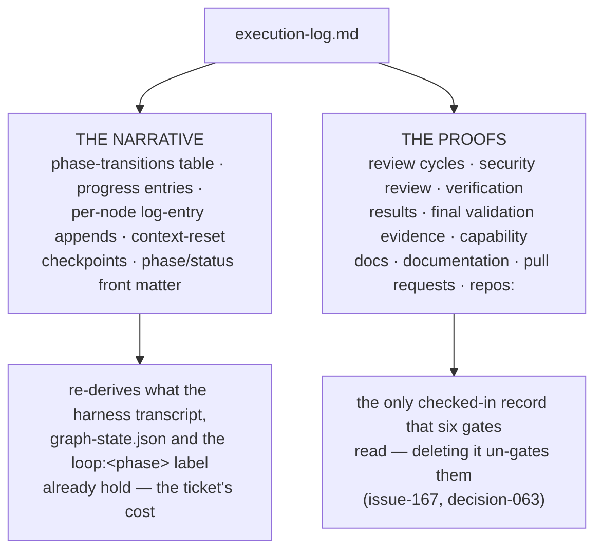

# Requirements: retire the execution log

> Phase 1 of 3 (requirements → design → tasks). Following the Kiro spec approach
> (<https://kiro.dev/docs/specs/>). This phase MUST be reviewed and approved by the
> required collaborators before moving to design.

## Introduction

[Issue-365](https://github.com/MadaraUchiha-314/the-loop/issues/365): *"generating the
execution log is costing a LOT of tokens — agent harnesses already maintain a log of what
has happened, we don't need that to be generated again. Remove this functionality from
the-loop."*

`docs/specs/<id>/execution-log.md` is today **two different things wearing one name**, and
the ticket is about one of them:

The **narrative** is the cost the ticket names: a 130-line bundled template materialized
into every work item, appended to by a `log-entry` hook at 47 node boundaries across five
graphs, re-read and re-written at every phase, and required in prose before every context
reset. Every fact in it exists already — the node and phase in `graph-state.json`, the
phase on the ticket's `loop:<phase>` label, and the chronology in the harness's own
transcript.

The **proofs** are not a log. They are the subjects six review-chain gates read, and the
reason `validate-artifacts` fails closed when a gate resolves no artifact at all
(issue-167, [decision-063](../../decisions/decision-063.md)) — six nodes, `security-review`
among them, once reported success on every run because they named no file. Removing the
file without rehousing them re-opens exactly that hole.

So: **the log goes; what the gates read keeps a home.** Requirements below separate the two
so the removal can be approved without approving a silent regression of the review chain.

## Requirements

### R1 — the execution log is no longer an artifact of the-loop

- **R1.1** The system SHALL NOT track `docs/specs/<id>/execution-log.md` as a work-item
  artifact: the `execution-log` role SHALL be removed from `.the-loop/manifest.yaml`.
- **R1.2** The system SHALL NOT ship a bundled `execution-log.md` template.
- **R1.3** WHEN a work item is started THEN the-loop SHALL NOT scaffold, seed or require an
  execution log at any phase.
- **R1.4** The system SHALL NOT expose a hook whose purpose is appending node-boundary
  entries to a per-work-item log (`log-entry`), and no shipped graph SHALL reference one.
- **R1.5** WHEN the-loop's own documentation describes the record of a work item THEN it
  SHALL NOT name an execution log.

### R2 — nothing that gates on content loses its subject

- **R2.1** WHERE a node gated a section of `execution-log.md` before this change, the node
  SHALL gate an equivalent section of a **named checked-in artifact** afterwards.
- **R2.2** The system SHALL keep `validate-artifacts`' fail-closed rule: a gate that
  declares content checks and resolves no artifact SHALL block, not skip (decision-063).
- **R2.3** WHEN a work item declares a review-chain phase away at `phase-selection` THEN
  only **that** phase's gate SHALL be relaxed — a declared skip SHALL NOT soften the gate
  of any phase the work item still walks.
- **R2.4** WHEN `test-planning` was declared away THEN `verification` SHALL still block
  until verification results are written (issue-179's kept-gate rule), against a subject
  that is not the execution log.
- **R2.5** The parity assertions that hold the manifest, the shipped graphs and the bundled
  templates to each other SHALL continue to pass, including P5a (every content gate
  resolves an artifact to read).

### R3 — the multi-repo declaration survives

- **R3.1** The system SHALL read the contributing repositories of a work item (issue-183's
  `repos:`) from a checked-in, human-authored artifact that is **not** the execution log.
- **R3.2** WHEN no such declaration is present THEN `await-inner-loops` SHALL behave exactly
  as it does when the key is absent today — no declaration, not an empty one.
- **R3.3** WHEN a declared repository is malformed THEN the gate SHALL block naming the
  offending entry, exactly as today.

### R4 — resuming a work item does not depend on a narrative

- **R4.1** WHEN a session resumes a work item THEN the-loop SHALL re-enter from
  `graph-state.json` (current node, phase, attempts), `tasks.md` checkmarks and the ticket,
  and SHALL NOT require a prose "Next:" entry.
- **R4.2** WHEN a node runs with `session: inherit` and the bound session has died THEN the
  fresh session SHALL be seeded with artifacts that still exist after R1.
- **R4.3** The context-reset protocol (`reference/context.md`) SHALL state a checkpoint
  discipline that costs no generated narrative.

### R5 — existing execution logs are left alone

- **R5.1** The system SHALL NOT delete, rewrite or migrate `execution-log.md` files already
  checked into a project: they are the operator's data and a historical record.
- **R5.2** `/the-loop:upgrade-the-loop` SHALL report the file as no longer read and SHALL
  NOT remove it, following the precedent set for the relocated learnings tree.
- **R5.3** The system SHALL NOT read an execution log that is present — presence SHALL NOT
  change any gate's outcome.

### R6 — the change is legible and measurable

- **R6.1** The system SHALL record the removal as a decision record with the alternative it
  rejected (drop the gates entirely) and why.
- **R6.2** The affected capability docs SHALL be updated in the same PR (`spec-workflow`,
  `process-graph`, `review-loop`, `capability-docs`, `documentation`, `token-economy`,
  `testing-and-contracts`).
- **R6.3** This is a **breaking** change to the work-item artifact contract and SHALL be
  committed as such (`!`), so consuming projects see it in the release.

## Non-goals

- **Weakening the review chain.** Removing the six gates is *not* in scope; the ticket is
  about generation cost, and decision-063 exists because those gates once passed silently.
- **Deleting historical records.** Checked-in execution logs — 132 in this repository — stay.
- **Replacing the harness transcript.** the-loop does not gain a log of its own in any
  other form; the chronology belongs to the harness and to `graph-state.json`.
- **Changing `validates:`, `onlyWhenSkipped:` or the skip vocabulary.** They are reused
  as-is.

## Acceptance criteria

| # | Criterion | Proved by |
|---|-----------|-----------|
| A1 | No shipped graph, hook, template, manifest entry or command mentions an execution log | grep gate in tests + parity suite |
| A2 | Every review-chain node still blocks when its proof is missing | graph review-chain integration tests |
| A3 | A declared skip relaxes only its own node's gate | graph skips tests |
| A4 | `verification` still blocks with `test-planning` declared away | verification integration test |
| A5 | `repos:` still drives `await-inner-loops` from its new home | multirepo integration test |
| A6 | An existing `execution-log.md` on disk changes no outcome | regression test |
| A7 | The e2e PDLC scenarios pass with no execution-log assertions | `test_pdlc_e2e_integration.py` |
