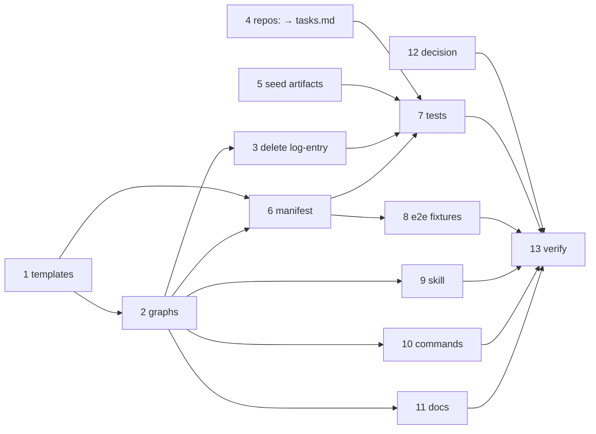

# Tasks: retire the execution log

> The last spec artifact (requirements → design → testing plan → tasks). A DAG of
> implementation tasks derived from the approved design and testing plan.

## Task list

- [x] 1. Bundle the evidence templates that replace the log's gated sections
  - `skills/the-loop/templates/evidence/`: `self-review.md`, `critic-review.md`,
    `security-review.md`, `design-critic-review.md`, `verification.md`,
    `final-validation.md`, `documentation.md`, `pull-requests.md`
  - Each carries exactly the section(s) its gate demands and nothing else — no phase
    table, no progress entries, no front-matter phase mirror
  - _Depends on:_ none
  - _Requirements:_ R2.1, R1.2
  - _Test:_ T3 — `test_p3_every_gated_name_has_a_template_that_can_satisfy_it` (red→green)

- [x] 2. Re-target the five shipped graphs
  - `pdlc-work-item-loop`, `pdlc-pr-loop`, `pdlc-contribution-loop`: every
    `validates: execution-log.md` becomes the mapped `evidence/*.md` — the verb is
    unchanged, only the target moves (design D1)
  - Remove `log-entry` from all 47 entry chains across all five graphs
  - _Depends on:_ 1
  - _Requirements:_ R1.4, R2.1, R2.3
  - _Test:_ T1, T3, T4 (red→green)

- [x] 3. Delete the `log-entry` hook
  - `cli/the_loop/graph/hooks/sideeffects.py`; update the docstring in `runtime.py` that
    lists the best-effort hooks
  - _Depends on:_ 2
  - _Requirements:_ R1.4
  - _Test:_ T1 (red→green)

- [x] 4. Move `repos:` to `tasks.md`
  - `hooks/loops.py:declared_repos` reads `tasks.md`'s front matter; the docstring states
    the absence rule unchanged
  - _Depends on:_ none
  - _Requirements:_ R3.1, R3.2, R3.3
  - _Test:_ T2, T7 (red→green)

- [x] 5. Re-seed the dead-session fallback
  - `runtime.py:resolve_session` seeds `requirements.md`, `design.md`, `tasks.md`
  - _Depends on:_ none
  - _Requirements:_ R4.2
  - _Test:_ T10 (red→green)

- [x] 6. Retire the artifact from the manifest and the template tree
  - `.the-loop/manifest.yaml`: drop the `execution-log` role, add the eight evidence
    entries; `skills/the-loop/templates/execution-log.md` deleted
  - Widen `_SPEC_FILE` in `test_graph_parity.py` so a `pathPattern` with one directory
    segment (`evidence/x.md`) is matched rather than silently excluded
  - _Depends on:_ 1, 2
  - _Requirements:_ R1.1, R1.2, R2.5
  - _Test:_ T3 (red→green)

- [x] 7. Update the tests that assert the old shape
  - `test_graph_hooks`, `test_graph_loops`, `test_graph_skips`, `test_graph_cleanup`,
    `test_graph_review_chain_integration`, `test_graph_verification_integration`,
    `test_graph_multirepo_integration`, `test_graphlink_integration`,
    `test_bus_integration`, `test_writing_parity`
  - New: the skip-isolation case (T5), the legacy-log-on-disk case (T8)
  - _Depends on:_ 2, 3, 4, 5, 6
  - _Requirements:_ R2.3, R5.3
  - _Test:_ T4, T5, T6, T7, T8 (red→green)

- [x] 8. Update the e2e scenario fixtures
  - `cli/tests/test_pdlc_e2e/`: `runner.py`, the three scenarios' `scenario.yaml` and
    `artifacts/` — `execution-log.md` fixtures become the `evidence/*.md` the loop now
    gates
  - _Depends on:_ 2, 6
  - _Requirements:_ A7
  - _Test:_ T9 (red→green)

- [x] 9. Rewrite the operating model
  - `skills/the-loop/SKILL.md` and `reference/{workflow,context,reviewing,security,
    token-economy,tooling,instructions,automation,design-artifacts}.md`
  - `reference/context.md` carries the new reset protocol (D4): checkmarks + commit, no
    prose checkpoint
  - _Depends on:_ 2
  - _Requirements:_ R1.5, R4.1, R4.3
  - _Test:_ T18, T19

- [x] 10. Rewrite the commands
  - `commands/{work-on,work-status,execute-tasks,finish-tasks,verify-work,create-design,
    create-testing-plan,contribute-to,init}.md`; `upgrade-the-loop.md` gains the
    "no longer read, never deleted" note (D5)
  - _Depends on:_ 2
  - _Requirements:_ R1.3, R1.5, R5.1, R5.2
  - _Test:_ T18, T19

- [x] 11. Update the docs site and capability docs
  - `docs/capabilities/{spec-workflow,process-graph,review-loop,capability-docs,
    documentation,token-economy,testing-and-contracts}.md` — requirement lines updated,
    one history row each
  - `docs/{guide,reference,architecture,config}`, `docs/specs/index.md`,
    `docs/.vitepress/config.mts`, `README.md`, `CLAUDE.md`,
    `.the-loop/harness-config.schema.json`'s `onMissing` description
  - _Depends on:_ 2
  - _Requirements:_ R1.5, R6.2
  - _Test:_ T18, T19

- [x] 12. Record the decision
  - `docs/decisions/decision-126.md` + a row in `decisions.md`: the log retired, the proofs
    rehoused, the rejected alternative (D6)
  - _Depends on:_ none
  - _Requirements:_ R6.1
  - _Test:_ T18

- [x] 13. Verify and present evidence
  - Run the matrix; record rows in `evidence/verification.md`, the security round in
    `evidence/security-review.md`, the review rounds, docs and PRs in their own files
  - _Depends on:_ 1–12
  - _Requirements:_ all
  - _Test:_ T18 (`make check`)

## Review round 1 — the owner's review of PR #366

- [x] 14. Rename the state file and the concept
  - `graph-state.json` → `work-item-state.json`, `GraphState` → `WorkItemState`, the lock
    with them; the pre-rename name is **read** and never written, and the inner-loop scan
    globs both
  - _Depends on:_ 13
  - _Requirements:_ R7.1, R7.2, R7.3
  - _Test:_ T20 (red→green)

- [x] 15. Move `repos` to the `phase-selection` gate
  - A repository section on the checklist, one row per declared repository, any number
    ticked; frozen into `work-item-state.json` and the portable record by the same signed
    reply; `declared_repos` reads the state; the key leaves the `tasks.md` template
  - _Depends on:_ 14
  - _Requirements:_ R3.1, R7.4
  - _Test:_ T21, T22 (red→green)

- [x] 16. Record the decision and re-document both
  - `docs/decisions/decision-127.md` + index row; decision-126's superseded bullet
    cross-linked; capability history rows; the skill, commands, site and `.gitignore`
  - _Depends on:_ 14, 15
  - _Requirements:_ R6.1, R6.2
  - _Test:_ T18, T19

## Execution DAG

