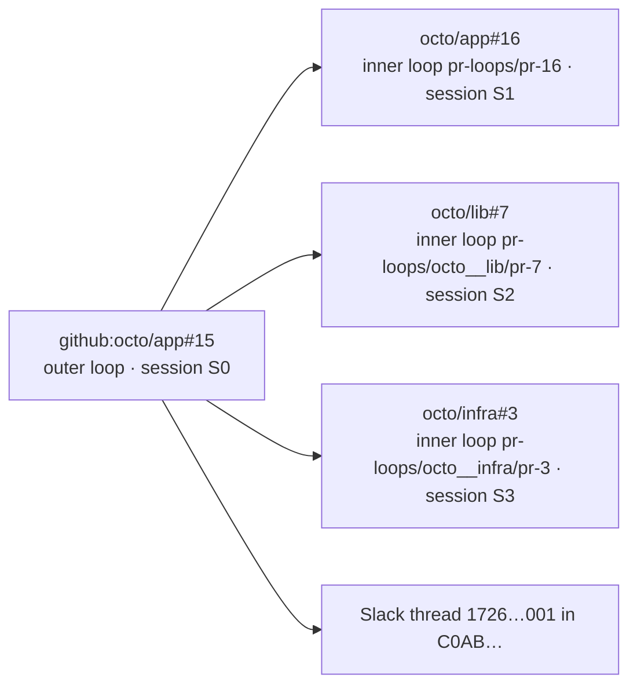
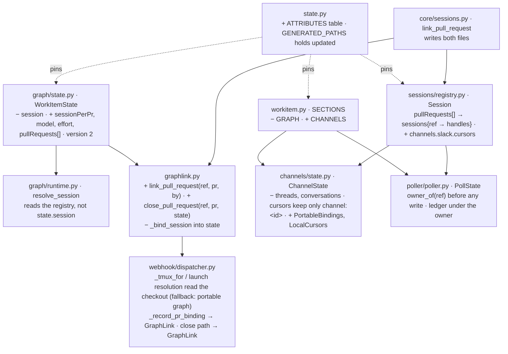

# Design: one rule for where a work item's attributes live

> Phase 2 of 3 (requirements → design → tasks). Derives from `requirements.md`. This is
> the ticket's second report — the viewpoint, and the from → to with a worked example.
> MUST be reviewed and approved before moving to tasks breakdown.

## Overview

**Three files per work item, one per party that owns the facts, and a rule that says
which party owns which attribute.** The ticket's principles hold; what they were missing
is the party.

```mermaid
flowchart TB
    subgraph R["the REPOSITORY's file · docs/specs/&lt;id&gt;/work-item-state.json · tracked on the branch"]
        R1["the pointer<br/>currentNode · nodes · parked · completions · decisions"]
        R2["what a human froze<br/>skips · optIns · surface · repos · loop<br/>+ sessionPerPr · model · effort (moved in)"]
        R3["the repositories' entities<br/>pullRequests[] (moved in)"]
    end
    subgraph O["the OPERATOR's file · &lt;state.root&gt;/portable/&lt;slug&gt;.json · tracked in the operator's repo"]
        O1["what an authorized human said<br/>control · collaborators"]
        O2["what this deployment has seen<br/>poll · ended"]
        O3["the workspace's entities<br/>channels.slack (moved in)"]
        O4["the pull requests' ledgers<br/>pullRequests{ref → poll} (folded in from N records)"]
    end
    subgraph M["the MACHINE's file · &lt;state.root&gt;/local/&lt;slug&gt;.json · never tracked"]
        M1["sessions{ref → handles}<br/>harnessSessionId · tmuxTarget · cwd · status · recentDeliveries · harnessArgs"]
        M2["cursors<br/>channels.slack.cursors (moved in)"]
    end
    X1["session {id, runner, alive} — leaves R"] -.-> M1
    X2["graph {…} — leaves O"] -.-> R2
    X3["pullRequests[].identity — copied from M"] -.-> R3
    X4["conversations · threads — leave channels/slack.json"] -.-> O3
    X5["cursors — leave channels/slack.json"] -.-> M2
    X6["portable/&lt;pr-slug&gt;.json × N — folded into O"] -.-> O4
```



Why three and not the ticket's one-plus-one: **who may write a file decides what may be
in it.** A file on the work item's branch is writable by the agent and proposable by any
pull-request author; the operator's `state.root` is neither; the machine's `local/` is
gone after `cleanup`. So the repository's file may hold everything the repository may
know (the process, and the pull requests, which are the repository's own objects); the
operator's file holds what only an authorized human or the daemon may say, and what
must outlive the checkout; the machine's file holds what means nothing anywhere else.
Every attribute is written **once**, and any other file that needs it carries an
identity, never a copy. And **one file per work item on each side**: a pull request has
no file of its own anywhere — it is a key in its work item's files.

## The rule (D1)

| Kind | Home | Why that file and no other |
|---|---|---|
| pointer | repository | must survive machine and session changes and be reviewable in a PR diff; re-derived from artifacts, so a stale copy costs a recompute (decision-041) |
| human decision about the work item | repository | the same reasoning as skips (issue-177): a declaration with provenance, honoured only within what the compiled graph and the operator's config allow |
| remote entity of a **repository** (a pull request, its inner loop) | repository | a PR is an object of the repository; the repository's branch may name it, and CI (`the-loop check`) must see it without a registry |
| remote entity of the **operator's workspace** (a Slack thread) | operator | the identifiers are the operator's (channel id, member id, workspace domain) and must not enter the repository (R7.3); the binding must outlive the checkout so a closed item's thread is still attributed |
| operator ledger (armed, roster, seen comments, closure) | operator | proposable by nobody but an authorized human; needed after the checkout is gone (R7) |
| machine handle | machine | a conversation id, a tmux name, a path, a cursor: useless or harmful elsewhere (decision-046) |
| derived | wherever its reader is, declared derived | rebuilt from sources on every write, read to gate nothing (decision-047) |

The rule is data, pinned by a test: an `ATTRIBUTES` table beside `GENERATED_PATHS` in
`state.py` lists every top-level key of the three files with its kind, and the parity
test fails when a file gains a key the table does not name or the table puts a kind in
the wrong file (R1.5).

## From → to

| Attribute | From | To | Kind |
|---|---|---|---|
| `session {id, runner, alive}` | `work-item-state.json` (outer and every inner) | `local/<slug>.json` — already there as `harnessSessionId` on the record and on each PR endpoint; the block is deleted | M |
| `graph.sessionPerPr`, `graph.model`, `graph.effort` | `portable/<slug>.json` | `work-item-state.json` top-level `sessionPerPr`, `model`, `effort` | H |
| `graph.loop`, `graph.workItem`, `graph.surface` | `portable/<slug>.json` (a second copy) | deleted — `work-item-state.json` already carries `loop`, `workItem`, `surface` | H |
| `graph.nodes[]` | `portable/<slug>.json` | deleted — derived by `the-loop check` from the compiled graph + `skips` + `optIns` | D |
| the fact "PR *p* delivers this work item" | `local/<slug>.json.pullRequests[].workItem` (only) | `work-item-state.json.pullRequests[{ref, repository, number, url, stateDir, state, linkedAt, linkedBy}]` | R |
| the PR's session handle | `local/<slug>.json.pullRequests[{workItem{ref, provider, owner, repo, number}, url, …handles}]` | `local/<slug>.json.sessions{<ref> → handles}` — the ref is the key; nothing else about the PR is kept | M |
| the PR's poll ledger | `portable/<pr-slug>.json.poll` — a record per PR | `portable/<slug>.json.pullRequests{<ref> → {seenComments, commentAttempts, lastPolledAt}}` — under the owner | L |
| `ended` stamped on the PR's own record | `portable/<pr-slug>.json.ended` | deleted — the PR's state is `work-item-state.json.pullRequests[].state`; the nested ledger is dropped on close | R |
| the PR's upstream state (merged/closed) | the local endpoint's `status: closed` (a handle's status) | `work-item-state.json.pullRequests[].state`, written by the close path; the endpoint's `status` stays a handle's status | R |
| `conversations{workItem → …}` | `channels/slack.json` | `portable/<slug>.json.channels.slack {channel, thread, opened, origin, permalink}` | R (operator's) |
| `threads{thread → workItem}` | `channels/slack.json` | deleted — an in-memory index built from the portable records at listener start and on every bind | D |
| `cursors{thread → ts}` for a work item's thread | `channels/slack.json` | `local/<slug>.json.channels.slack.cursors {thread → ts}` | M |
| `cursors["channel:<id>"]`, `pending` | `channels/slack.json` | unchanged — no work item's | M |
| `control`, `poll`, `collaborators`, `ended` | `portable/<slug>.json` | unchanged | L |
| `index.json.sections` | `[control, poll, graph, collaborators, ended]`, one entry per record — PRs included | `[control, poll, collaborators, ended, channels, pullRequests]`, one entry per **work item**, each naming the PR refs it links | D |
| pidfiles, heartbeat, logs, verdicts, self-diagnosis, standing | machine-wide | unchanged, named machine-wide by the table | M |

## Worked example

One work item, three contributing repositories, `pr-sessions-always`, a Slack thread.
`octo/app` is the origin; the ticket is `github:octo/app#15`, "Rate-limit the poller".
The three pull requests are `octo/app#16`, `octo/lib#7` and `octo/infra#3`; each has a
session of its own, and the work item has one.



### Before

`docs/specs/issue-15/work-item-state.json` — tracked. Note `session`.

```json
{
  "version": 1,
  "workItem": "github:octo/app#15",
  "currentNode": "implementation",
  "nodes": {"phase-selection": {"attempts": 1, "outcome": "selected", "…": "…"},
            "implementation": {"attempts": 1, "outcome": "", "…": "…"}},
  "decisions": {"phase-selection": {"outcome": "selected", "by": "@octocat", "…": "…"}},
  "forced": [], "parked": null,
  "session": {"id": "0f1c-…-S0", "runner": "tmux", "alive": true},
  "completions": {},
  "skips": {"brainstorming": {"via": "selection", "by": "@octocat", "at": "…"}},
  "optIns": {},
  "surface": "",
  "repos": ["octo/app", "octo/lib", "octo/infra"],
  "loop": "pdlc-work-item-loop"
}
```

`docs/specs/issue-15/pr-loops/pr-16/work-item-state.json`,
`…/pr-loops/octo__lib/pr-7/work-item-state.json`,
`…/pr-loops/octo__infra/pr-3/work-item-state.json` — tracked; three more `session`
blocks (`S1`, `S2`, `S3`); which PR each is for is said only by the directory name.

`<state.root>/portable/github-octo-app-15.json` — tracked. Note `graph`.

```json
{
  "ref": "github:octo/app#15",
  "url": "https://github.com/octo/app/issues/15",
  "control": {"command": "start", "source": "comment", "actor": "octocat",
              "requestedAt": "2026-09-14T09:11:58Z", "note": "", "instance": ""},
  "poll": {"seenComments": ["2451…", "2452…"], "commentAttempts": {},
           "spawn": {"attempts": 0, "gaveUp": false, "deliveryId": ""},
           "lastPolledAt": "2026-09-15T10:42:00Z", "title": "Rate-limit the poller"},
  "graph": {"loop": "pdlc-work-item-loop", "workItem": "issue-15", "surface": "",
            "sessionPerPr": "always", "model": "opus-5", "effort": "high",
            "nodes": [{"id": "brainstorming", "phase": "brainstorming", "skipped": true,
                       "selectable": true}, {"id": "…", "…": "…"}]},
  "collaborators": {"users": [{"login": "dana", "addedBy": "octocat", "…": "…"}]}
}
```

`<state.root>/portable/github-octo-app-16.json`, `…-lib-7.json`, `…-infra-3.json` —
tracked, one **more** per pull request, because the poller lists each labelled PR as an
item of its own; `index.json` has four entries for one work item.

```json
{
  "ref": "github:octo/lib#7",
  "url": "https://github.com/octo/lib/pull/7",
  "poll": {"seenComments": ["2460…"], "commentAttempts": {},
           "spawn": {"attempts": 0, "gaveUp": false, "deliveryId": ""},
           "lastPolledAt": "2026-09-15T10:42:00Z", "title": "lib: token bucket"}
}
```

`<state.root>/local/github-octo-app-15.json` — never tracked. The **only** record that
three pull requests deliver `#15`, spelled with the PR's owner, repo, number and URL.

```json
{
  "workItem": {"ref": "github:octo/app#15", "provider": "github", "owner": "octo",
               "repo": "app", "number": 15},
  "url": "https://github.com/octo/app/issues/15",
  "harness": "claude", "harnessSessionId": "0f1c-…-S0",
  "cwd": "/home/op/.the-loop/workspace/github.com/octo/app/issue-15",
  "status": "active", "tmuxTarget": "loop-github-octo-app-15",
  "model": "opus-5", "effort": "high", "harnessArgs": ["--model", "opus-5", "…"],
  "recentDeliveries": ["8f2c…"],
  "pullRequests": [
    {"workItem": {"ref": "github:octo/app#16", "…": "…"}, "url": "…/app/pull/16",
     "harness": "claude", "harnessSessionId": "…-S1",
     "cwd": "/home/op/.the-loop/workspace/github.com/octo/app/pr-16",
     "status": "active", "tmuxTarget": "loop-github-octo-app-16", "recentDeliveries": []},
    {"workItem": {"ref": "github:octo/lib#7", "…": "…"}, "url": "…/lib/pull/7",
     "harnessSessionId": "…-S2", "cwd": "…/github.com/octo/lib/pr-7",
     "status": "active", "tmuxTarget": "loop-github-octo-lib-7", "…": "…"},
    {"workItem": {"ref": "github:octo/infra#3", "…": "…"}, "url": "…/infra/pull/3",
     "harnessSessionId": "…-S3", "cwd": "…/github.com/octo/infra/pr-3",
     "status": "active", "tmuxTarget": "loop-github-octo-infra-3", "…": "…"}
  ]
}
```

`<state.root>/channels/slack.json` — never tracked, every work item in one file.

```json
{
  "threads": {"1726…001": {"workItem": "github:octo/app#15", "channel": "C0AB…"},
              "1725…900": {"workItem": "github:octo/app#12", "channel": "C0AB…"}},
  "conversations": {"github:octo/app#15": {"channel": "C0AB…", "thread": "1726…001",
                    "opened": "2026-09-14T09:12:00Z", "origin": "start",
                    "permalink": "https://octo.slack.com/archives/C0AB…/p1726…001"},
                    "github:octo/app#12": {"…": "…"}},
  "cursors": {"1726…001": "1726…340", "1725…900": "1725…950", "channel:C0AB…": "1726…400"},
  "pending": {}
}
```

What a hand-off loses today: the three pull requests (they are only in `local/`), the
Slack thread (only in `channels/`), and — the other way round — what the repository
gains that it should not: four session ids. And what the operator's directory carries
that it should not: four records for one work item.

### After

`docs/specs/issue-15/work-item-state.json` — tracked. No `session`; the three choices
that lived only in the portable record; the three pull requests.

```json
{
  "version": 2,
  "workItem": "github:octo/app#15",
  "loop": "pdlc-work-item-loop",
  "currentNode": "implementation",
  "nodes": {"…": "…"}, "decisions": {"…": "…"}, "forced": [], "parked": null,
  "completions": {},
  "skips": {"brainstorming": {"via": "selection", "by": "@octocat", "at": "…"}},
  "optIns": {},
  "surface": "",
  "sessionPerPr": "always",
  "model": "opus-5",
  "effort": "high",
  "repos": ["octo/app", "octo/lib", "octo/infra"],
  "pullRequests": [
    {"ref": "github:octo/app#16", "repository": "octo/app", "number": 16,
     "url": "https://github.com/octo/app/pull/16", "stateDir": "pr-loops/pr-16",
     "state": "open", "linkedAt": "2026-09-15T08:00:12Z", "linkedBy": "session"},
    {"ref": "github:octo/lib#7", "repository": "octo/lib", "number": 7,
     "url": "https://github.com/octo/lib/pull/7", "stateDir": "pr-loops/octo__lib/pr-7",
     "state": "open", "linkedAt": "2026-09-15T08:03:40Z", "linkedBy": "session"},
    {"ref": "github:octo/infra#3", "repository": "octo/infra", "number": 3,
     "url": "https://github.com/octo/infra/pull/3", "stateDir": "pr-loops/octo__infra/pr-3",
     "state": "merged", "linkedAt": "2026-09-15T08:05:02Z", "linkedBy": "event"}
  ]
}
```

The three inner-loop state files keep their pointer and lose their `session` block;
each is now also named from the outer file's `pullRequests[].stateDir`, so the directory
name is no longer the only spelling of "which PR".

`<state.root>/portable/github-octo-app-15.json` — tracked, and the **only** portable
record for this work item. No `graph`; the thread; the three pull requests' ledgers
under the PRs' refs (the merged one has already been dropped).

```json
{
  "ref": "github:octo/app#15",
  "url": "https://github.com/octo/app/issues/15",
  "control": {"command": "start", "source": "comment", "actor": "octocat", "…": "…"},
  "poll": {"…": "…", "title": "Rate-limit the poller"},
  "collaborators": {"users": [{"login": "dana", "…": "…"}]},
  "channels": {
    "slack": {"channel": "C0AB…", "thread": "1726…001", "opened": "2026-09-14T09:12:00Z",
              "origin": "start",
              "permalink": "https://octo.slack.com/archives/C0AB…/p1726…001"}
  },
  "pullRequests": {
    "github:octo/app#16": {"seenComments": ["2470…"], "commentAttempts": {},
                           "lastPolledAt": "2026-09-15T10:42:00Z"},
    "github:octo/lib#7":  {"seenComments": ["2460…"], "commentAttempts": {},
                           "lastPolledAt": "2026-09-15T10:42:00Z"}
  }
}
```

`<state.root>/local/github-octo-app-15.json` — never tracked. A map of **sessions keyed
by the ref they serve**, handles only: the file does not know that three of its keys
are pull requests, and it says nothing about them — no URL, repository, number or
state. The ref is the join key into `work-item-state.json.pullRequests[]`.

```json
{
  "workItem": "github:octo/app#15",
  "channels": {"slack": {"cursors": {"1726…001": "1726…340"}}},
  "sessions": {
    "github:octo/app#15": {
      "harness": "claude", "harnessSessionId": "0f1c-…-S0",
      "cwd": "/home/op/.the-loop/workspace/github.com/octo/app/issue-15",
      "status": "active", "tmuxTarget": "loop-github-octo-app-15",
      "model": "opus-5", "effort": "high", "harnessArgs": ["…"], "recentDeliveries": ["8f2c…"]},
    "github:octo/app#16": {
      "harness": "claude", "harnessSessionId": "…-S1", "cwd": "…/octo/app/pr-16",
      "status": "active", "tmuxTarget": "loop-github-octo-app-16", "recentDeliveries": []},
    "github:octo/lib#7": {
      "harness": "claude", "harnessSessionId": "…-S2", "cwd": "…/octo/lib/pr-7",
      "status": "active", "tmuxTarget": "loop-github-octo-lib-7", "recentDeliveries": []},
    "github:octo/infra#3": {
      "harness": "claude", "harnessSessionId": "…-S3", "cwd": "…/octo/infra/pr-3",
      "status": "closed", "tmuxTarget": "loop-github-octo-infra-3", "recentDeliveries": []}
  }
}
```

`<state.root>/channels/slack.json` — never tracked; only what belongs to no work item.

```json
{
  "cursors": {"channel:C0AB…": "1726…400"},
  "pending": {}
}
```

What a hand-off carries now: the repository's branch says which three pull requests
deliver the item and what it runs on; the operator's **one** record says it is armed,
who may speak to it, what was seen on the item and on each of its pull requests, and
which thread carries it. The new machine's `local/` is
empty, which is correct: the daemon rebuilds handles by spawning, reads the thread
binding from the portable record, and reads the three pull requests from the checkout
instead of from `gh`.

## Decisions

**D2 — pull requests go to the repository's file; Slack threads go to the operator's.**
Both are remote entities the work item created, and the ticket puts both "in a file
related to the work item" — but they belong to different systems. A pull request is an
object of the repository the branch lives in: its number is public, its URL is the
repository's, and the inner loop that walks it already keeps state under the same spec
directory. A Slack thread is an object of the operator's workspace: `docs/cli/state.md`
already refuses to put channel and member ids in a repository, and R7.3 keeps that. The
portable record is "a file related to the work item" too — the operator's — so
principle 1 is honoured for both without putting a workspace domain into a public
`docs/specs/`.

**D3 — the frozen choices move to the repository's file, and the portable `graph` copy
is retired.** The ticket's strongest objection is duplication, and this section is the
duplication: five of its eight keys are already in the state file. Two consequences are
taken deliberately. (1) The dispatcher reads `sessionPerPr`, `model` and `effort` from
the checkout named by the work item's session record rather than from `state.root`; it
already has that path, and it already re-validates every value on the way in because it
treats the portable record as agent-writable (`_tmux_for`'s docstring). The exposure
does not grow: a model can only resolve to one the operator declared and this machine's
verdict cache accepts; a mode outside the vocabulary is the default; and `repos` — which
decides where an unattended agent opens pull requests — has lived in this file since
issue-365. (2) The control plane loses the checkout-free `nodes[]` view; it gets the
same rendering from `the-loop check`, which it already calls for the pointer. A work
item frozen before the change keeps its portable `graph` and the dispatcher reads it
only when the state file lacks the keys (R4.4) — read old, write new.

**D4 — the `session` block leaves the state file, and `session: inherit` resolves
through the registry.** The runtime's `resolve_session` reads `state.session`
(`runtime.py:310`); after this it asks the session registry for the live endpoint of
the work item (or of the PR, for an inner loop) and inherits that conversation id. The
CLI and the daemon both have the registry; CI does not and falls to
`fresh-with-artifacts`, which is the right answer in CI. The inner-loop runtimes bind
the same way against their PR endpoint. A legacy block is ignored on read and gone on
the next save (R3.3); the one cost is that a work item mid-flight on the day of the
upgrade inherits nothing once.

**D5 — one verb records a pull request in both files.** `the-loop sessions link-pr`
(issue-274) writes the local endpoint today; the dispatcher's `_record_pr_binding`
writes the same on the first routed event. Both now also append the
`pullRequests[]` entry to `work-item-state.json` through GraphLink — under the state
lock, in the checkout the record names — with `linkedBy: session | event`. Idempotent
by ref, as today. The close path (`Dispatcher` on `pull_request.closed`) sets `state`
to `merged` or `closed` in the same place it closes the endpoint. Both files carry the
PR's **ref**; only the repository's file carries its record.

**D6 — the Slack reverse index is memory, not a file.** `threads{ts → work item}`
existed so the socket transport could look a `thread_ts` up and the poll transport
could iterate bound threads. Both are served by an index built from the portable
records at listener start and updated on every bind — the same records the writer's map
now lives in, so nothing on disk can be stale against itself. The 200-thread cap goes
with the map: a work item's thread is read while the work item has a live local record
on this machine, and stops being read when `cleanup` removes it — a tighter and more
honest bound than "the oldest 200".

**D7 — the local file stays `<state.root>/local/<slug>.json`, one per work item.** The
ticket's `work-item-local-state.json` is read as *one local file per work item holding
all its local tracking*, which is what this file becomes once it also carries the
cursors. It is not moved into the checkout (R5.5): the registry's directory scan is how
the daemon knows which work items have a session here; a record inside each checkout
would be invisible for a `sessions register` outside `routing.workspace.root`, would
vanish with a `git clean`, and would put a session id one forgotten `.gitignore` line
away from a public repository. It is not merged into one machine-wide file either
(R5.2): four writers on one file is the lock `channels/slack.json` needed and the
registry was designed to avoid.

**D8 — the rejected alternative: everything in `work-item-state.json`.** It is the
ticket's literal proposal and the audit says why it fails on three attributes.
`control` decides whether an unattended agent runs; `collaborators` decides whose
comments it reads; `ended` decides whether it is over. On the work item's branch each
is proposable by any pull-request author and editable by the agent whose behaviour it
governs — the reason `model-verdicts.json` and the portable record are kept out of the
repository in the first place. And after `cleanup` the checkout is gone, so anything
the daemon or a board needs about a finished item would be unreadable. The file is the
right candidate for everything the *repository* may know; three things the repository
may not know, and the operator's workspace identifiers, are why it cannot be the only
file.

**D9 — one portable record per work item; a pull request's ledger is a key in its
owner's record.** The owner's review named it: three pull requests should not be three
more files. The poller lists a labelled PR as an item of its own and baselines it under
its own ref because, at listing time, nothing tells it who the PR delivers. So the
resolution moves *before* the write: `owner_of(ref)` asks the session registry
(`record_owning`, the same scan every event uses), then the portable records'
`pullRequests` maps, then the router's linkage rules on the listed item itself (closing
references, the branch convention, a bare mention — the order the router already
applies). A resolved owner gets the ledger under `pullRequests[<ref>]`; a PR that
resolves to nothing is a work item of its own — a review (issue-279) or a labelled PR
that closes no issue — and keeps its own record, because it *is* the work item. The
close path stops stamping `ended` on a PR: the PR's state is the repository's fact
(`pullRequests[].state`), and its nested ledger is dropped as `poll` is dropped today
for an ended work item. The control plane's client-side reconciliation of "the PR's
own record" with "the PR nested under its owner" (issue-302) is deleted, because there
is nothing left to reconcile: `GET /api/v1/work-items` serves one record per work
item, each naming its pull requests. A PR record written before this change is read
for the PR's ledger until the owner's record carries it, then never again, and is
reported — not removed — by `upgrade-the-loop`.

**D10 — the local file replicates nothing about a pull request.** The owner asked why
PR information is in the local file. Today's endpoint carries the PR's `workItem`
object (provider, owner, repo, number), its URL and its status — a second record of
the pull request in a file that must never travel. After this change the local file
is `sessions{<ref> → handles}`: one entry for the work item's own session and one per
pull request that has, or may get, a session on this machine, each holding a harness
conversation id, a tmux target, a cwd, a status, recent delivery ids and what it was
launched as. The **ref is the key and the only thing the file knows about the pull
request**; everything else about the PR is in the repository's file, joined by that
key. `record_owning(ref)` becomes a key lookup across the local records instead of a
walk over nested objects; `link_pull_request` writes an empty-handled entry under the
PR's ref (so the next event that needs a session knows which record owns it), and the
repository entry through GraphLink (D5). A record written before this change with a
`pullRequests[]` list is read into the same map and rewritten as one on its next save.

## Components & interfaces



| Component | Responsibility after this change | Contract |
|---|---|---|
| `WorkItemState` | the repository's file: pointer, decisions, frozen choices, `pullRequests[]` | `load` reads v1 (drops `session`, tolerates absent keys); `save` writes v2; `link_pr(entry)`, `set_pr_state(ref, state)` idempotent by ref |
| `Runtime.resolve_session` | the `session: inherit` binding | `(registry.session_for(ref) → {id: harnessSessionId, runner: "tmux", alive: True}) or fresh-with-artifacts` |
| `GraphLink` | the daemon's writer to the repository's file | `link_pull_request`, `close_pull_request`, and the existing gate freezing now writes `sessionPerPr/model/effort` into the state; no `_bind_session` |
| `Dispatcher` | reads choices from the checkout | `_choices_for(work_item) → {sessionPerPr, model, effort}`: state file in `record.cwd`, else portable `graph`, else defaults |
| `WorkItemStore` | the operator's file | `SECTIONS = (CONTROL, POLL, COLLABORATORS, ENDED, CHANNELS, PULL_REQUESTS)`; `graph` read only by the dispatcher's fallback; `owner_of(ref)` scans the `pullRequests` maps |
| `PollState` (poller) | the ledgers | `baseline_comments`/`mark_*` take `(owner, ref)`: `owner == ref` writes `poll`, otherwise `pullRequests[ref]`; `owner_of` resolves registry → portable maps → router linkage, else the PR itself |
| `Dispatcher._record_closure` | closure | a PR that has an owner: `GraphLink.close_pull_request` + drop the nested ledger, **no** `ended`; a standalone PR or an issue: `ended`, as today |
| `ChannelState` | machine-wide Slack state only | `cursors` restricted to `channel:*` keys; `pending` unchanged; a legacy file's `threads`/`conversations`/`cursors` exposed read-only as `legacy_bindings()` for R5.4 |
| `SlackChannel` | binding + cursor through the two per-item stores | `thread_for(work_item)`: portable `channels.slack`, else legacy; `bind` writes portable; `cursor`/`advance` read and write the local record |
| `SessionRegistry` | the machine's file | a record is `{workItem, channels?, sessions{ref → Endpoint}}`; `record_owning(ref)` is a key lookup; `session_for`, `link_pull_request`, `save_endpoint`, `close_endpoint`, `touch` keep their signatures and address `sessions[ref]`; a legacy `pullRequests[]` loads into the map |
| control plane (`api/routes.py`, `ui/`) | the board | the issue-302 client-side join is removed; `GET /api/v1/work-items` serves one record per work item with its `pullRequests` keys |
| `ATTRIBUTES` (`state.py`) | the rule as data | `(file, key, kind)`; test asserts every top-level key of the three writers is listed and every kind is in its allowed file |

## UI/UX design

N/A — no user-facing surface. The control plane's *Work* board changes only in where
one field comes from (`nodes[]` via `the-loop check`).

## Data models

**`work-item-state.json` v2** (additive on v1 except the removed `session`):

```json
{
  "version": 2,
  "workItem": "github:<owner>/<repo>#<n>",
  "loop": "pdlc-work-item-loop | pdlc-pr-loop | …",
  "currentNode": "…", "nodes": {}, "decisions": {}, "forced": [], "parked": null,
  "completions": {}, "skips": {}, "optIns": {},
  "surface": "" ,
  "sessionPerPr": "" ,
  "model": "" ,
  "effort": "" ,
  "repos": [],
  "pullRequests": [
    {"ref": "github:<owner>/<repo>#<n>", "repository": "<owner>/<repo>", "number": 0,
     "url": "https://…", "stateDir": "pr-loops/[<owner>__<repo>/]pr-<n>",
     "state": "open | merged | closed", "linkedAt": "<iso>", "linkedBy": "session | event"}
  ]
}
```

`sessionPerPr`, `model`, `effort`: `""` is *no choice* (the operator's default applies),
exactly the portable record's semantics today. `pullRequests[].stateDir` is
`inner_loop_state_dir(Path(), number, repository)` relative to the spec directory —
derived at write, recorded so a reader needs no code to find the inner loop.
`repository` goes through `repo_state_key`'s validation before it is written, as `repos`
does (issue-365 R7.4).

**`portable/<slug>.json`**: `graph` retired; new section:

```json
"channels": {
  "slack": {"channel": "C…", "thread": "<ts>", "opened": "<iso>",
            "origin": "event | kickoff | legacy | start", "permalink": "https://…"}
}
```

One binding per channel type per work item (issue-312's "one work item, one thread"); a
pull request's events post into its owner's thread, resolved through the owner's
`pullRequests` map. `index.json.sections` lists `channels` when present.

A second new section, the pull requests' ledgers, keyed by ref:

```json
"pullRequests": {
  "github:<owner>/<repo>#<n>": {"seenComments": [], "commentAttempts": {}, "lastPolledAt": "<iso>"}
}
```

No `spawn` and no `title` per PR: a pull request is never spawned as a work item from
here, and its title is the repository's. `index.json` lists the keys per work item as
`pullRequests: [refs]`.

**`local/<slug>.json`** v2:

```json
{
  "workItem": "github:<owner>/<repo>#<n>",
  "channels": {"slack": {"cursors": {"<thread ts>": "<last ts>"}}},
  "sessions": {
    "github:<owner>/<repo>#<n>": {"harness": "claude | cursor", "harnessSessionId": "…",
      "cwd": "…", "status": "active | paused | closed", "createdAt": "<iso>",
      "lastEventAt": "<iso>", "tmuxTarget": "…", "recentDeliveries": [],
      "model": "", "effort": "", "harnessArgs": []}
  }
}
```

The work item's own entry is `sessions[workItem]`; every other key is a pull request
that has, or may get, a session here. `channels` is absent rather than empty. A v1 file
(`workItem{…}` + top-level handles + `pullRequests[]`) loads into this shape and is
written back as v2 on its next save; nothing in it is lost, and the derived fields
(`provider`, `owner`, `repo`, `number`, `url`) are not carried forward — the ref parses
to all of them.

**`channels/slack.json`**: `threads` and `conversations` no longer written; `cursors`
keeps only `channel:<id>` keys; `pending` unchanged. A file with the old maps loads, is
read for R5.4, and is written back without them on the next save.

## Error handling

| Failure | Response |
|---|---|
| state file unreadable when the dispatcher resolves choices | operator's defaults, one warning, delivery continues (today's portable-read behaviour) |
| checkout gone but record live (an operator deleted it) | as above; the next spawn re-prepares the checkout and the file is on the branch |
| `link_pull_request` cannot take the state lock | the local endpoint is still written (routing works); the repository entry is retried on the next event for that PR, and `graph.hook_degraded` is recorded — never a dropped delivery |
| a `pullRequests[]` entry fails validation on read (bad `repository`, bad `ref`) | that entry is skipped with a warning, the rest of the file is honoured (the `from_dict` rule for PR endpoints) |
| the poller lists a PR and `owner_of` resolves nothing | the PR is treated as a work item of its own and gets its own record (R10.3); the first event that binds it to an owner moves the ledger under the owner and stops reading the PR's record |
| `owner_of` resolves two owners (a PR closing two issues) | the router's first — the same order dispatch uses — and a `poll.owner_ambiguous` event naming both |
| portable record has no `channels.slack` and legacy `slack.json` has no binding | open a thread, as today for a first event |
| both a portable binding and a legacy binding exist for one work item | the portable one wins; the legacy one is neither read again nor rewritten |
| local record has no cursor for a bound thread | the thread root, as `cursor()` returns today for a new thread |

Every one of these is logged at the level the existing path logs, and none changes an
outcome from "event delivered" to "event dropped".

## Security design

- **AuthN/AuthZ.** Unchanged: who may arm, who may speak, who may answer a gate are
  decided by the ingress before any of these files is written. No file read grants any
  of them.
- **Input validation & injection surfaces.** Two new values enter a filesystem path or
  an argv. `pullRequests[].repository` and `stateDir` pass `repo_state_key` (refuses
  `.`, `..`, anything outside `[A-Za-z0-9._-]`) before write and again on read; `model`
  and `effort` are resolved only against the operator's declared names and the verdict
  cache (`Dispatcher._resolve_launch`, issue-358), so a name that is not declared never
  reaches an argv; `sessionPerPr` is `session_per_pr_mode`-validated to three values.
  Thread and channel ids written to the portable record are the ones Slack returned,
  and are only ever passed back to Slack as opaque ids.
- **Secrets handling.** None stored. The change *removes* a resumable session id from
  the repository (R3) and keeps workspace identifiers out of it (R7.3).
- **Least privilege.** The daemon writes the repository's file only through GraphLink,
  in the checkout it already owns, under the state lock; the agent's session cannot
  write `state.root` sections through any verb this change adds (`link-pr` writes the
  local endpoint and the repository entry, neither of which arms anything).
- **Fail-closed behaviour.** Absent, unreadable or out-of-vocabulary → the operator's
  default; never a spawn, never a route to a session that does not exist.
- **Abuse-case coverage.**

| Abuse case (requirements) | Mechanism | Negative test |
|---|---|---|
| 1 — undeclared model/effort in the state file | resolution against declared names + verdict cache | T9 |
| 2 — `sessionPerPr` outside the vocabulary | `session_per_pr_mode` → default | T9 |
| 3 — a `pullRequests[]` entry spawns nothing | spawn only from an authorized routed event; the entry is a binding | T5 |
| 4 — legacy `session` block | ignored on load | T3 |
| 5 — copied local record | unchanged, documented | — |
| 6 — binding to a thread the bot cannot post in | `ChannelError`, no second root | T7 |

## Testing strategy

Requirements map to unit tests on the three stores (state, portable, registry) and the
channel state, and to integration scenarios through the dispatcher and the Slack
transport with a fake client: *"a hand-off carries the pull requests and the thread"*,
*"the daemon routes a PR event by the choice in the checkout"*, *"a pre-change file of
each shape is read and rewritten in the new shape"*, *"a legacy session block is never
resumed"*. The parity test over `ATTRIBUTES` is the standing proof of R1. Evidence is
the test output in the plan's results table and the parity between `docs/cli/state.md`
and the code. No API contract changes; `POST /api/v1/sessions/link-pr` keeps its shape.
The executable detail is `testing-plan.md`.

## Trade-offs & decisions

- **Two tracked files, not one.** The cost is that "what is happening with #15?" is
  still two files; the gain is that neither can be proposed by a stranger's PR and the
  operator's half outlives the checkout. Recorded as the decision that supersedes
  decision-046's file-level rule (R9.3).
- **The daemon reads the checkout on every PR event.** One extra file read per event
  against a path it already resolved; the fallback keeps in-flight items routing.
- **A work item upgraded mid-flight inherits its session once less.** Accepted; the
  alternative (honouring a checked-in id once) is abuse case 4.
- **A closed item's thread stops being read at `cleanup`.** Today it is read until 200
  newer threads push it out; after, until the item's local record goes. The board still
  attributes the thread from the portable binding.
- **The poller resolves an owner per listed pull request.** A registry scan and a
  portable-record scan per PR per cycle, both over small local files; no extra provider
  call, because the linkage the router reads is already on the listed item.

## Open questions

Carried from `requirements.md` and raised on the ticket: whether the owner accepts D3's
read of frozen choices from the agent-writable file, and per-item versus machine-wide
for the local file (D7).

## Review comments

> Appended by the-loop's `record-feedback` hook when a human gate approves with
> comments (issue-109). Append-only and attributed: an approval never silently
> discards a reviewer's suggestions, and the feedback travels with the document
> it concerns rather than living in a side-channel tracker.
