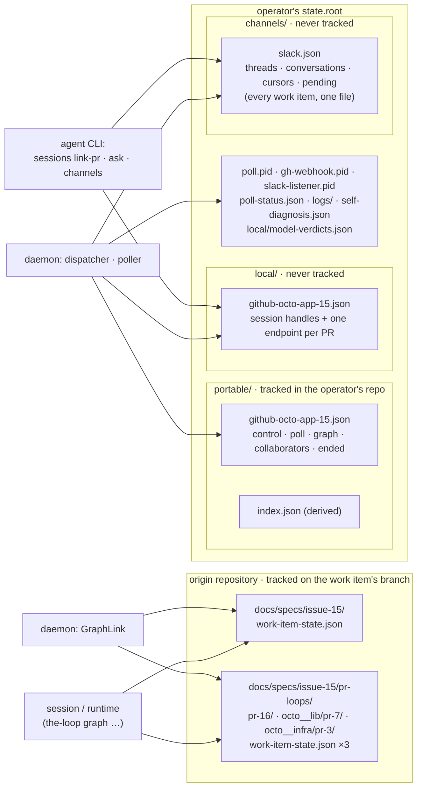

# Requirements: one rule for where a work item's attributes live

> Phase 1 of 3 (requirements → design → tasks). Following the Kiro spec approach
> (<https://kiro.dev/docs/specs/>). This phase MUST be reviewed and approved by the
> required collaborators before moving to design.
>
> The ticket asks for two reports. **The audit is § Audit below** — it is this
> document's "what was broken". **The viewpoint and the from → to example are
> `design.md`** — they are the "what we did about it", and the owner approves them at
> `design-approval`. Neither is duplicated under `docs/reports/`.

## Introduction

[Issue-368](https://github.com/MadaraUchiha-314/the-loop/issues/368): *"various
attributes that are tracked by the-loop for a work item are scattered across many
different files and folders — some listed as portable, some as private — and there is no
principle-driven approach to this."* The ticket states the principle it wants:

1. **A remote entity created for a work item** (a pull request, a Slack thread) is
   tracked in a file that belongs to the work item.
2. **An entity local to the machine** (a tmux session, a harness conversation id, a pid,
   a heartbeat) is tracked in a local file.
3. **One file for the work item** — the ticket proposes `work-item-state.json`.
4. **One file for all local tracking** — the ticket proposes `work-item-local-state.json`.

The audit below confirms the diagnosis and sharpens it: the-loop already classifies its
*generated files* by portability ([decision-046](../../decisions/decision-046.md)), but
it has **no rule for attributes**, and the two files that would carry a work item's
remote entities today carry none of them — a hand-off to another machine loses which
pull requests deliver the item and which Slack thread carries it — while the one file
that is checked into the repository carries a harness session id it should not.

## Audit — what is tracked where today

**Five kinds of file hold state about one work item, written by four components, and no
two of them agree on why an attribute is where it is.** For a work item
`github:octo/app#15` that three pull requests deliver:

### The attributes, file by file

Each attribute is classified by **what it is** — the axis the ticket asks for — and
checked against the ticket's two principles. Kinds:

| Kind | Meaning | Where the ticket's principle puts it |
|---|---|---|
| **P** pointer | where the graph is for this work item | with the work item |
| **H** human decision | a choice an authorized human froze (skips, surface, model…) | with the work item |
| **R** remote entity | something that exists upstream because of this work item (a PR, a thread) | with the work item |
| **L** operator ledger | what this deployment was told or has already seen (armed, roster, seen comments, closure) | with the work item, on the operator's side |
| **M** machine handle | a conversation id, a tmux name, a cwd, a cursor, a pid | a local file |
| **D** derived | rebuildable from other attributes; read by nothing or by a dashboard only | anywhere, declared derived |

**`docs/specs/<id>/work-item-state.json`** — checked in, written by the runtime
(session verbs and the daemon's GraphLink), a cache re-derived from the artifacts
(`graph/state.py`).

| Attribute | Kind | Principle held? |
|---|---|---|
| `version`, `workItem`, `loop` | P | yes |
| `currentNode`, `nodes{attempts, outcome, enteredAt, exitedAt, lastBlock, forced}`, `parked`, `forced[]`, `completions` | P | yes |
| `decisions` (gate outcomes with provenance) | H | yes |
| `skips`, `optIns` (with `via`, `by`, `at`) | H | yes |
| `surface` | H | yes |
| `repos[]` (declared by the agent through `graph repos`) | H | yes |
| **`session {id, runner, alive}`** | **M** | **no — a harness conversation id in a tracked file** |

**`docs/specs/<id>/pr-loops/[<owner>__<repo>/]pr-<n>/work-item-state.json`** — one per
inner loop, same shape. Same verdict: the pointer belongs here; the `session` block does
not. The inner loop's *identity* (which repository, which number) is carried only by the
**directory name**.

**`<state.root>/portable/<slug>.json`** — tracked in whichever repository holds the
operator's `state.root`; written by execution control, the poller, the collaborator
store and the dispatcher's close path (`workitem.py`, `control.py`, `poller.py`,
`collaborators.py`).

| Section · attribute | Kind | Principle held? |
|---|---|---|
| `ref`, `url` | identity (D for `url`) | yes |
| `control {command, source, actor, requestedAt, note, instance}` | L | yes |
| `poll {seenComments, commentAttempts, spawn{attempts, gaveUp, deliveryId}, lastPolledAt, closureCheckedAt, title}` | L (`title` is D) | yes |
| `collaborators {users[{login, addedBy, addedAt, source, note}]}` | L | yes |
| `ended {state, kind, reason, at, source, actor}` | L (an upstream fact this deployment observed) | yes |
| **`graph {loop, workItem, surface, sessionPerPr, model, effort, nodes[]}`** | **H** | **partly — the same decision as the state file's, written a second time; `sessionPerPr`, `model` and `effort` exist *only* here, so the work item's own file does not say what it runs on; `nodes[]` is D** |

**`<state.root>/local/<slug>.json`** — never tracked; the session registry
(`sessions/registry.py`), written by the dispatcher on spawn, `sessions register`,
`sessions link-pr`, and on every delivered event.

| Attribute | Kind | Principle held? |
|---|---|---|
| `workItem {ref, provider, owner, repo, number}`, `url` | identity | yes |
| `harness`, `harnessSessionId`, `cwd`, `tmuxTarget`, `status`, `createdAt`, `lastEventAt`, `recentDeliveries[]`, `model`, `effort`, `harnessArgs[]` | M (`model`/`effort` here mean *launched as*) | yes |
| **`pullRequests[{workItem{ref…}, url, harness, harnessSessionId, cwd, tmuxTarget, status, recentDeliveries}]`** | **R + M mixed** | **no — the fact "PR #7 in octo/lib delivers #15" is a remote entity, recorded only in a file that must never leave the machine** |

**`<state.root>/channels/slack.json`** — never tracked; one file for every work item;
written by the agent's session (`the-loop ask`, the `notify` hook), both daemons'
ingress and the poll watcher (`channels/state.py`).

| Map | Kind | Principle held? |
|---|---|---|
| **`conversations {workItem → {channel, thread, opened, origin, permalink}}`** | **R** | **no — the thread the-loop opened for a work item is recorded only locally, so a second machine opens a second thread (the defect issue-312 fixed within one machine)** |
| `threads {thread → {workItem, channel}}` | D (the reverse of `conversations`) | derived, but read on every inbound message |
| `cursors {thread → last ts}` | M (what *this* deployment mirrored) | yes, but keyed by thread in a file shared by every work item |
| `pending {ts → {channel, author, text, options, asked}}` | M (a question with no work item yet) | yes — not a work item's |

**Machine-wide files** — `poll.pid`, `gh-webhook.pid`, `slack-listener.pid`,
`poll-status.json`, `logs/events.jsonl`, `logs/poller.out`, `self-diagnosis.json`,
`local/model-verdicts.json`, `local/standing/<name>.json`: all **M**, none per work
item, all already local. The ticket lists three of them as examples of principle 2;
they already satisfy it and nothing about them moves (a pidfile cannot become a key in a
JSON document — it is the flock the single-instance guard holds, and an atomic rewrite
would release it, [decision-076](../../decisions/decision-076.md)).

### Findings

- **F1 — a work item's pull requests are recorded only in the file that never travels.**
  `local/<slug>.json.pullRequests[]` is the *only* record that PR #7 in `octo/lib`
  delivers `#15`. After a hand-off the new machine re-derives that from `gh`'s closing
  references on each event — the inference issue-172 stopped trusting — or waits for a
  session to re-run `sessions link-pr`. A pull request the-loop opened itself carries
  none of the derivable linkages, so it is simply lost.
- **F2 — the Slack thread is recorded only locally, once for every work item.** The
  binding is a remote entity the-loop created; on the next machine the next event opens
  a second root, and replies in the first thread are dropped as `unmapped`.
- **F3 — a machine handle is checked into the repository.** `work-item-state.json.session`
  holds the harness conversation id and runner; every inner-loop state holds one more.
  `local/` is never tracked precisely because a resumable session id and an absolute
  path do not belong in a repository ([`state.py`](../../../cli/the_loop/state.py)
  `GENERATED_PATHS`); the state file carries the first of them anyway.
- **F4 — the frozen selection is written twice, and the work item's copy is the
  incomplete one.** `skips`, `optIns`, `surface`, `repos`, `loop` are in the state file;
  `sessionPerPr`, `model`, `effort` and the rendered `nodes[]` are only in the portable
  record. The daemon reads the portable copy on every pull-request event; the session
  reads the state file; neither file says everything.
- **F5 — one pull request has three spellings.** Its endpoint in `local/`, its
  inner-loop directory (`pr-loops/octo__lib/pr-7/`), and — when it is labelled or
  linked upstream — a portable record of its own (the two identities
  [`control-plane.md`](../../capabilities/control-plane.md) joins by hand).
- **F6 — `channels/slack.json` mixes two lifetimes.** Per-work-item state
  (`conversations`, `threads`, `cursors`) shares a file, a cap and a lock with state that
  has no work item (`pending`, the kickoff cursors), so a work item's thread is forgotten
  by a cap on *someone else's* count.
- **F7 — there is no rule to check a new attribute against.** `GENERATED_PATHS` pins
  every generated *file* to portable/local and fails the build when a path is added
  unclassified. Nothing does that for an *attribute*, and `work-item-state.json` is
  outside the declaration entirely (it does not live under `state.root`).

## Requirements

### R1 — one rule, written down and enforced

**User story:** As the owner of the-loop, I want every attribute of a work item to have
one home chosen by a stated rule, so that the next attribute lands where it belongs
without a review argument.

1. The system SHALL classify every attribute it records about a work item by kind
   (pointer, human decision, remote entity, operator ledger, machine handle, derived)
   and SHALL state, in one place, which file each kind is written to.
2. WHEN an attribute is a remote entity or a human decision about the work item THEN it
   SHALL be recorded in the work item's checked-in state file.
3. WHEN an attribute is a machine handle THEN it SHALL be recorded only in a file that
   is never tracked.
4. WHEN an attribute is what this operator's deployment was told about the work item or
   has already seen (armed, roster, seen comments, closure) THEN it SHALL be recorded in
   the operator's portable record.
5. A parity test SHALL fail when a state file gains a top-level key that no
   classification names, in the same way `GENERATED_PATHS` fails an unclassified path.
6. WHERE an attribute is derived, the derivation SHALL be stated and the value SHALL be
   rebuilt from its sources rather than maintained by hand (decision-047).

### R2 — a work item's remote entities travel with the work item

**User story:** As an operator moving a deployment to another machine, I want the new
machine to know which pull requests deliver each work item and which thread carries it,
so that nothing is re-derived and no second thread is opened.

1. WHEN a pull request delivers a work item — recorded by the daemon on the first event
   that routes, or by the session that opened it — THEN the system SHALL record it in
   the work item's checked-in state file: its ref, its repository, its number, its URL,
   its inner-loop state path and its upstream state (`open`, `merged`, `closed`).
2. WHEN a pull request merges or closes THEN its entry's upstream state SHALL be updated
   in that file by the daemon's one close path.
3. WHEN the-loop opens a channel thread for a work item THEN the binding (channel,
   thread, permalink, when and how it opened) SHALL be recorded in that work item's
   **portable record**, because the thread is an entity of the operator's workspace and
   its identifiers SHALL NOT be written into the work item's repository (R7.3).
4. Each remote entity SHALL be recorded **once**: any other file that refers to it SHALL
   carry its identity only (a ref, a thread ts), never a second copy of its record.

### R3 — no machine handle in a tracked file

**User story:** As a repository owner, I want no harness session id, tmux name or
absolute path committed to my repository, so that a public spec directory leaks nothing
about the operator's machine.

1. The system SHALL NOT write a `session` block into `work-item-state.json`, nor into
   any inner-loop state file.
2. WHEN a node runs with `session: inherit` THEN the runtime SHALL resolve the bound
   session from the machine-local session record for that work item (or that PR's
   endpoint) and SHALL fall back to `fresh-with-artifacts` when none is live — including
   in CI, where no local record exists.
3. WHEN a state file written before this change carries a `session` block THEN the
   system SHALL ignore it on read and drop it on the next save; it SHALL NOT be used to
   resume a conversation (a checked-in id may be anyone's).

### R4 — the frozen selection is recorded once, in the work item's file

**User story:** As a session reading `work-item-state.json`, I want it to say everything
a human froze about this work item, so that the daemon and I read the same record.

1. WHEN an authorized reply answers `phase-selection` THEN `sessionPerPr`, `model` and
   `effort` SHALL be recorded in `work-item-state.json` beside `skips`, `optIns`,
   `surface` and `loop` — as the *chosen* values, `""` meaning "no choice", exactly as
   the portable copy distinguishes today.
2. The system SHALL NOT write a `graph` section into the portable record.
3. WHEN the dispatcher routes a pull-request event, or launches a session, THEN it SHALL
   read the work item's choices from `work-item-state.json` in the checkout the work
   item's session record names; an absent file, an absent key or a value outside the
   vocabulary SHALL resolve to the operator's configured default, as an unreadable
   portable record does today.
4. WHEN a work item was frozen before this change — its state file lacks the keys and
   its portable record carries `graph` — THEN the dispatcher SHALL read the portable
   copy, so a work item in flight keeps its routing across the upgrade; the copy SHALL
   NOT be rewritten.
5. The rendered `nodes[]` view SHALL NOT be recorded; whoever needs it (the control
   plane) SHALL derive it from the compiled graph plus `skips` and `optIns`, through the
   verb that already renders it (`the-loop check`).

### R5 — one local file per work item holds every handle

**User story:** As an operator debugging "why did nothing happen?", I want every handle
this machine holds for a work item in one file, so that I open one file, not three.

1. The machine-local session record SHALL carry, for the work item and for each of its
   pull requests: harness, conversation id, cwd, tmux target, status, recent
   deliveries, launched model, effort and argv — as today — **and** the read cursor of
   every channel thread bound to the work item (what this deployment last mirrored).
2. The system SHALL keep one local file **per work item**, not one for the machine: the
   registry's file-per-item property is what lets concurrent sessions write without a
   shared lock and what lets `cleanup` release one item without touching another.
3. WHEN an inbound channel message names a thread THEN the reader SHALL resolve the
   work item from the portable records' bindings (R2.3) and read the cursor from the
   work item's local record; `channels/slack.json` SHALL keep only state that belongs
   to no work item (`pending`, the per-channel kickoff cursors).
4. WHEN a `channels/slack.json` written before this change still binds a thread that no
   portable record binds THEN the reader SHALL honour that binding, and the next write
   for that work item SHALL record it in the new place; nothing SHALL open a second
   thread for a work item that already has one.
5. The local file SHALL keep its location under `<state.root>/local/`: the daemon's
   "which work items have a session on this machine" is a scan of that directory, and a
   record inside each checkout would be unfindable for a session registered in a
   checkout outside `routing.workspace.root` and would need a `.gitignore` rule in
   every consuming repository to keep a session id out of git.

### R6 — machine-wide daemon files are named by the rule and left alone

1. The classification SHALL name `poll.pid`, `gh-webhook.pid`, `slack-listener.pid`,
   `poll-status.json`, the logs, `self-diagnosis.json`, `model-verdicts.json` and the
   standing-session records as machine-wide, not per work item, and SHALL NOT move or
   merge them (decision-076 for the pidfile/heartbeat pair).

### R7 — the security boundaries of each file are kept

1. `control`, `collaborators` and `ended` SHALL stay in the operator's portable record
   and SHALL NOT move into the work item's repository: a file on a work item's branch
   is proposable by anyone who can open a pull request, and these three decide whether
   an unattended agent runs, whose comments it reads, and whether the item is over.
2. WHEN `cleanup` removes a work item's checkout THEN everything the daemon or a control
   plane still needs about the item afterwards (`control`, `poll`, `ended`,
   `collaborators`, the channel bindings) SHALL still be readable — which is the second
   reason those stay outside the checkout.
3. The system SHALL NOT write a Slack channel id, thread ts, member id or workspace
   permalink into the work item's repository.

### R8 — no migration step; old shapes are read, new shapes are written

1. WHEN a file of any of the four shapes written before this change is read THEN the
   system SHALL read it as it did, and SHALL write the new shape on that file's next
   save; no command SHALL rewrite state files in bulk.
2. `/the-loop:upgrade-the-loop` SHALL report the retired locations (`session` in a
   state file, `graph` in a portable record, `conversations`/`threads`/`cursors` in
   `channels/slack.json`) as no longer written and SHALL NOT delete them.
3. `portable/index.json`'s `sections` list SHALL stop naming `graph` and SHALL name the
   channel-binding section.

### R9 — the change is legible

1. `docs/cli/state.md` SHALL describe every file by the classification in R1, attribute
   by attribute, and the parity test between that page and the code SHALL cover the
   attribute table.
2. The affected capability docs SHALL be updated in the same PR: `cli`,
   `process-graph`, `interactive-sessions`, `channels`, `control-plane`,
   `webhook-triggers`, `spec-workflow`.
3. The rule SHALL be recorded as a decision that supersedes the *file*-level
   classification of decision-046 with an *attribute*-level one, naming the alternative
   the owner proposed (everything in `work-item-state.json`) and why R7 refuses part of it.
4. This is a breaking change to the shape of every state file and SHALL be committed as
   such (`!`).

## Non-functional requirements

- **No new network calls.** Every read this change adds is a file read: the dispatcher
  reads one state file from a checkout it already knows; the channel reader scans the
  portable records (tens of small files) or an index built from them at start.
- **No new contention.** The state file keeps its `work-item-state.lock`; the portable
  record keeps read-modify-write per section; the local record keeps file-per-item.
- **The `.gitignore` recipe stays three lines.** Nothing new is tracked, nothing tracked
  becomes local.

## Security considerations

- **Actors & trust.** *Untrusted:* anyone who can open a pull request against the origin
  repository (they can propose a change to `work-item-state.json` on a branch);
  Slack members in the operator's channel; webhook payloads. *Semi-trusted:* the agent's
  own session, which writes `work-item-state.json` and is the subject of the gates it
  records. *Trusted:* the operator, whose `state.root` the daemon writes.
- **Trust boundaries & data.** Two boundaries move. (1) `sessionPerPr`, `model` and
  `effort` are read by the daemon from the **agent-writable** state file instead of the
  operator's record — the dispatcher already treats the portable record as
  agent-writable and re-validates on the way in (`dispatcher.py:_tmux_for`), and
  `skips`/`repos` — a bigger blast radius — already live in the state file. (2) A
  harness session id **leaves** the repository (R3). Data: no secret is stored; a
  session id and a Slack workspace identifier are the two things that must not be
  committed to a repository, and both end up in files that are never tracked or in the
  operator's own record.
- **Abuse cases (EARS):**
  1. WHEN `work-item-state.json` names a `model` or `effort` the operator did not declare,
     or one this machine's verdict cache refuses, THEN the daemon SHALL launch on the
     harness's own arguments and record the refusal — a choice can only ever be one the
     operator offered.
  2. WHEN `work-item-state.json` names a `sessionPerPr` outside `never | cross-repository
     | always` THEN the daemon SHALL route by the operator's default.
  3. WHEN `work-item-state.json` lists a pull request THEN that entry alone SHALL NOT
     spawn a session or route an event: a session is spawned only for an event on that
     pull request that passed the ingress's own authorization, exactly as today's
     `link-pr` entry behaves.
  4. WHEN a state file carries a legacy `session` block THEN the runtime SHALL NOT resume
     that conversation (R3.3).
  5. WHEN a local record is copied to another machine THEN the duplicate-spawn guard
     behaves as documented today — unchanged, and the reason the file stays local.
  6. WHEN a portable record's channel binding names a thread the bot is not a member of
     THEN a post SHALL fail closed as a `ChannelError` and SHALL NOT open a second root.
- **Fail closed.** An absent or unreadable state file, portable section or local record
  resolves to the operator's defaults and never to a spawn; a thread with no binding is
  `unmapped` and dropped, as today.

## Out of scope

- **Deriving `control` from the ticket thread** instead of recording it. The keyword
  comments are on the ticket, so it is derivable in principle; it is a separate
  question about API cost and edited comments, and decision-040 chose the record.
- **Merging the two tracked files into one.** R7 says why the operator's record and the
  repository's file must stay two files; § Trade-offs in `design.md` says what the owner's
  literal proposal would cost.
- **The standing-session records and `pending`.** Neither belongs to a work item.
- **Renaming `<state.root>/local/<slug>.json`.** The ticket's `work-item-local-state.json`
  is what that file already is, one per work item; a rename buys nothing and costs a
  legacy reader.

## Open questions

1. **Does the owner accept that the daemon reads `model`/`effort`/`sessionPerPr` from
   the agent-writable state file** (R4.3), bounded as in abuse cases 1–2? The alternative
   keeps a *derived* copy in the portable record for checkout-free readers, which is the
   duplication the ticket objects to. Raised on the ticket with this document.
2. **One local file per work item, or one for the machine?** The ticket's wording admits
   both; R5.2 picks per work item and says why. Raised on the ticket.

## Review comments

> Appended by the-loop's `record-feedback` hook when a human gate approves with
> comments (issue-109). Append-only and attributed: an approval never silently
> discards a reviewer's suggestions, and the feedback travels with the document
> it concerns rather than living in a side-channel tracker.
