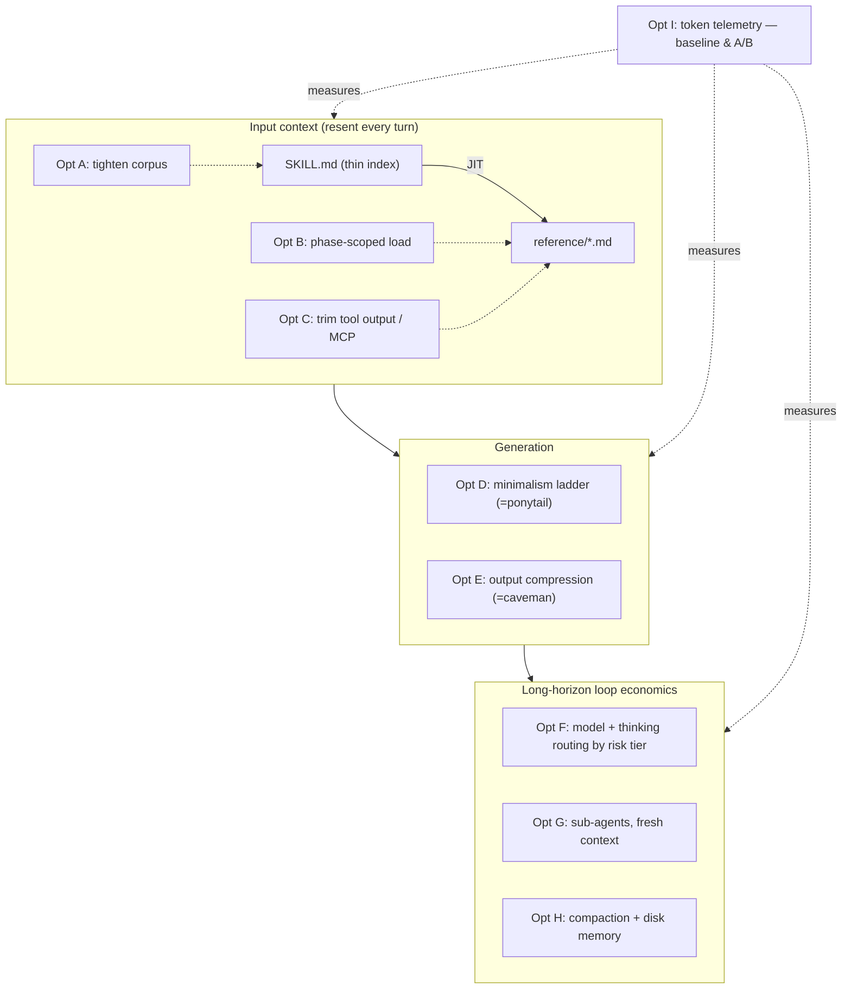

# Brainstorm: reduce the-loop's token consumption

> Root artifact for issue #37. The issue is explicitly exploratory — *"should we tighten
> the prompts? look into caveman/ponytail? research what Anthropic/OpenAI recommend? come
> up with a list of loop-engineering best practices and how we adopt them?"* — so the loop
> starts here. This brainstorm surveys the levers, maps each to the-loop's **current**
> behaviour, and proposes an adoption plan. Iterate with feedback; once locked, derive
> `requirements.md` for the subset the owner greenlights.

## Problem / opportunity

the-loop is, by construction, a **token-hungry** harness:

- **It iterates.** Each work item walks brainstorm → requirements → design → tasks →
  implement → self-review ×3 → critic-review ×3 → evidence → capability-doc fold-in →
  reviewer briefing. Every gate re-reads specs and re-emits prose.
- **It is verbose by design.** The operating model is a `SKILL.md` (~1.6k words) plus ten
  `reference/*.md` files (~8k words total), rich templates, and long checked-in artifacts
  (issue-32's `brainstorm.md` alone is ~1.8k words). Depth is a *feature* — "the essence
  is not lost" — but depth costs input tokens on every turn that pulls it in.
- **It re-spawns — but only in the default `process` runner.** Under the webhook receiver
  (issue-15) with `routing.runner: process`, each event is a **fresh subprocess**
  (`claude -p … --resume <id>`) that re-primes the harness; autonomous runs multiply turns,
  and every turn resends the growing conversation. In the **`tmux` runner (issue-32)** there
  is *no* re-spawn: the harness TUI stays resident in the tmux session and each event is
  **forwarded into the existing session as input** (bracketed-paste + `send-keys`), so the
  conversation is never re-primed from cold. That makes `runner: tmux` itself a token lever
  — persistent context beats cold re-priming — and argues for preferring it (or the
  fresh-context-per-item discipline of Option G) over long chains of `-p --resume` spawns.

The opportunity: cut tokens **without** cutting the rigor that is the-loop's reason to
exist. Reviewing agent bloat is the human cost the-loop reduces; spending fewer tokens to
do it is strictly aligned with that mission. The itch: an opinionated PDLC harness should
have an *opinion* on token economy, expressed as config-driven levers and skill guidance —
not leave it to each operator to rediscover.

## Context & constraints

What is already true in this repo (so we build on it, not past it):

- **Progressive disclosure is already the skill's shape.** `SKILL.md` is a thin index that
  says *"Read the relevant reference file before acting"* and points at `reference/*.md`.
  This is exactly Anthropic's Agent-Skills pattern — a short always-loaded description, with
  bodies pulled in **just-in-time**. We have the architecture; the question is whether the
  bodies are as tight as they can be and whether disclosure is as lazy as it can be.
- **The minimalism ladder already IS ponytail.** `reference/minimalism.md` is the
  YAGNI → stdlib → native → existing-dep → inline → new-abstraction ladder, guardrailed so
  it "never removes necessary code" (validation/error-handling/security/accessibility).
  That is ponytail's "lazy senior developer" ladder, near-verbatim. This lever is **already
  adopted**; the open question is whether to *credit/align* with ponytail or leave it as a
  native rung.
- **Filesystem-as-memory is already the persistence model.** Specs, `execution-log.md`, and
  capability docs are checked in, which is *why* the-loop can resume "exactly where it left
  off" (`workflow.md` → Resumability). That is precisely the "structured note-taking /
  agentic memory" technique Anthropic recommends for long-horizon agents — we have it, but
  we don't yet frame it as a **token** strategy (offload state to disk, keep the window
  lean).
- **Reviews already imply model diversity.** `reviews` runs self-reviews then critic reviews
  on "a *different* harness/model (e.g. Cursor + GPT-5.5 reviewing Claude Opus output)."
  Model *routing* exists in spirit; it is framed as review independence, not as cost.
- **Hard constraints that bound any solution:**
  - **Zero-runtime-dependency guarantee (decision-005).** the-loop subprocess-drives the
    official CLIs; it adds no SDK/daemon. Any token lever must be **prompt/skill/config**
    shaped, or a thin CLI computation — not a new runtime service.
  - **Two harnesses, one source.** The same `SKILL.md` powers Claude Code and Cursor
    (`rules/the-loop.mdc` mirror). A lever that only works on one harness is half a lever.
  - **Safety is non-negotiable.** The minimalism guardrail generalizes: **no token lever
    may trade away** validation, error handling, security, accessibility, test-first
    discipline, the paper trail, or review depth. Cheaper, never sloppier.
  - **Measurability gap.** We currently emit **no token telemetry**. "Reduce consumption"
    has no baseline in-repo, so any claim ("~65%", "~22%") is borrowed from vendors, not
    measured here. This is itself a finding (see Option G).

## Research digest — what the field recommends

Condensed from Anthropic's context-engineering guidance, Claude Code cost docs, the
caveman/ponytail projects named in the issue, and the emerging "loop engineering"
literature (sources at the end):

- **Progressive disclosure** — load a table-of-contents, pull chapters/appendices only when
  needed. Anthropic reports skill *descriptions* for 10 skills cost ~773 tokens vs. ~13.9k
  to eagerly load all bodies (~94% reduction) — the core lever behind Agent Skills.
- **Right-altitude prompts** — specific enough to steer, general enough not to hard-code
  brittle logic; every token in an always-loaded prompt is rent paid each turn.
- **Tool minimalism / MCP hygiene** — every connected MCP server loads its full tool
  schemas into context at session start whether used or not; trim to what a task needs.
- **Trim tool outputs** — verbose command/log/file output crowds the window; return
  summaries, not raw dumps.
- **Sub-agents with fresh context** — delegate verbose work (running tests, fetching docs,
  scanning logs) to a subagent so the 6k-token read stays in *its* window and only a
  ~400-token summary returns to the controller.
- **Compaction** — before the window fills, summarize-and-reset with instructions on what to
  preserve; long loops that only append degrade ("context rot").
- **Structured note-taking / filesystem memory** — persist durable state to disk; start each
  cycle with a lean window rehydrated from notes.
- **Model & thinking economics** — route the bulk of work to a cheaper model, reserve the
  frontier model for genuinely hard steps; cap extended-thinking effort where deep reasoning
  is not needed (thinking bills as output tokens).
- **Output compression (caveman)** — reshape the agent's *communication style*: drop filler,
  keep substance, never touch code/commands/errors. Claims ~65% fewer output tokens.
- **Generation minimalism (ponytail)** — the decision ladder above; ~22% fewer tokens / ~20%
  cheaper by not over-producing code in the first place.
- **Loop engineering** — the discipline of *do → check → decide → stop*: make the check
  real (hard gates: zero test failures, zero lint errors), keep the controller's window
  clean via sub-agents/compaction, and define crisp termination so the loop doesn't spin
  and burn tokens.

## Ideas & options

Grouped by where in the pipeline they save tokens. Each notes the-loop's **current status**
and a proposed move. `✅` = leaning to adopt, `○` = parked/optional, `✗` = rejected.

### Input side — the always-loaded and just-in-time context

- **Option A — Audit & tighten the skill/reference corpus ✅**
  Treat the `SKILL.md` + `reference/*.md` + templates as a token budget and prune. Concretely:
  push more detail *down* the disclosure tree (SKILL.md should be a leaner index; the heavy
  prose lives in `reference/` and is pulled only when its phase is active), de-duplicate
  content that appears in both `SKILL.md` and a reference file, and copy-edit for density
  (this is caveman applied to *our own* prompts, where it is unambiguously safe because we
  control the text). *Pro:* pure win, no runtime cost, both harnesses benefit. *Con:* risk
  of over-pruning and "losing the essence" the skill explicitly guards — so pair every cut
  with the guardrail that structural rules stay intact.

- **Option B — Deepen just-in-time disclosure ✅**
  Today a command may read several reference files up front. Move to **phase-scoped
  loading**: the design phase pulls `design-artifacts.md`, the review step pulls
  `reviewing.md`, and nothing loads the others. Consider splitting the largest reference
  files so a step loads only the paragraph it needs. *Pro:* compounds A. *Con:* more files
  to keep coherent; needs a clear "which step loads what" map (a good `requirements.md`
  table).

- **Option C — Tool-output & MCP hygiene guidance ○→✅**
  Add explicit skill guidance: prefer the dedicated file/search tools over shell dumps;
  return **summaries not raw logs**; keep the GitHub/MCP tool surface scoped per task.
  *Pro:* directly attacks the biggest silent cost (verbose tool results resent every turn).
  *Con:* it's guidance, not enforcement — value depends on the harness honouring it.

### Generation side — how much code/prose we emit

- **Option D — Keep & sharpen the minimalism ladder (already ponytail) ✅**
  It's adopted. Move: make the ladder's token/cost rationale explicit (it's currently
  framed as anti-bloat for *review* cost; add that it is *also* a token lever), and decide
  the **ponytail question** — align/credit the external plugin vs. keep our native rung
  (see Open questions). Do **not** fork ponytail into the repo (decision-005 / duplication).

- **Option E — Adopt caveman-style output compression, config-gated ✅**
  Add an **output-verbosity** lever to the skill + config: instruct the harness to drop
  conversational filler and prefer fragments in its *narration*, while **never** compressing
  code, commands, diffs, errors, the paper-trail comments, or the reviewer briefing (those
  are contracts). This is caveman's exact preservation rule. Ship it as **guidance +
  config** (`userInteraction.verbosity` or similar), not a vendored plugin — but **register
  caveman in `external-tools.md`** so operators who want the packaged skill can add it.
  *Pro:* largest reported output saving; low risk if preservation list is right. *Con:*
  terse narration can hurt the "educate the reviewer" mandate — so the reviewer briefing and
  ticket/PR comments are explicitly **exempt** from compression.

### Loop economics — model, thinking, sub-agents, compaction, measurement

- **Option F — Model & thinking routing as first-class config ✅**
  Generalize today's "critic = different model" into a **routing policy**: cheap model for
  mechanical steps (status reads, checkmark updates, lint fixes, verbose scans), frontier
  model for design/critic reasoning; cap extended-thinking effort on low-tier tasks. Encode
  it next to `reviews`/`autonomy` in config so it's declarative, harness-agnostic, and tied
  to the existing **risk tier** (low tier → cheap+low-effort; high tier → frontier). *Pro:*
  vendor-cited as the single biggest cost cut. *Con:* cross-harness model-id mapping is
  fiddly (Claude vs. Cursor model names) — keep it advisory where a harness can't honour it.

- **Option G — Sub-agents with fresh context for verbose work ✅**
  Make delegation a documented pattern in the loop: run tests, fetch docs, and scan
  logs/large files in a **subagent** whose window absorbs the verbosity and returns a
  summary. This dovetails with issue-32's tmux/runner seam and the existing per-session FIFO.
  *Pro:* keeps the controller window lean across a long autonomous run. *Con:* subagent
  orchestration differs per harness; start as guidance, formalize where the CLI can drive it.

- **Option H — Compaction & note-taking guidance (lean into filesystem memory) ✅**
  We already persist to disk (specs, execution-log) and resume from it — reframe that as the
  **token** strategy it is, and add explicit compaction guidance for long runs: checkpoint
  durable state to the execution log, then compact/reset the window with a "preserve the
  spec + open threads" instruction. *Pro:* near-zero new machinery; it's mostly naming what
  we do. *Con:* harness compaction ergonomics vary.

- **Option I — Measure it: token telemetry ✅ (prerequisite)**
  We can't reduce what we don't measure. The webhook/CLI already captures harness JSON
  output (which carries usage). Surface per-work-item token/cost accounting (e.g. a line in
  `execution-log.md` and/or `the-loop sessions`/`work-status`), so every later lever is
  evaluated against a **real in-repo baseline** instead of vendor claims. *Pro:* turns this
  whole issue from opinion into measurement; makes A/B of each lever possible. *Con:* usage
  fields differ across `claude`/`cursor-agent` output — needs a small adapter.

### Rejected / parked alternatives

- **Vendoring caveman or ponytail into the repo ✗** — duplicates capability we already have
  (ponytail ≈ `minimalism.md`) or can express as guidance (caveman ≈ Option E), and violates
  decision-005 (no bundled runtime) + the reference/don't-duplicate rule. **Register both in
  `.the-loop/external-tools.md`** instead, so operators can opt in.
- **Extreme/lossy compression of artifacts (caveman "ultra/wenyan" on specs) ✗** — specs,
  decisions, capability docs, and the reviewer briefing are **contracts and paper trail**;
  compressing them past readability breaks traceability and the educate-the-reviewer gate.
  Compression applies to *narration*, never to the durable record.
- **A hard token *gate* that blocks merges ✗** — mirrors minimalism's stance ("advisory,
  does not gate a merge"). Token economy informs generation; it must not fail a correct,
  safe change for being wordy. Telemetry (G) reports; it does not block.
- **One-giant-session autonomy ✗** — keeping a single long session for an entire multi-item
  run maximizes resend cost and context rot. Prefer fresh-context-per-item (aligns with the
  webhook model's per-event subprocess and Option G).

## A loop-engineering best-practices checklist → adoption map

The issue asks for "a list of best practices and how we adopt them." Here it is, as the
proposed backlog the requirements phase would formalize:

| # | Best practice (loop/context engineering) | the-loop today | Proposed adoption |
|---|------------------------------------------|----------------|-------------------|
| 1 | Progressive disclosure (thin index, JIT bodies) | Present (SKILL→reference) | **Deepen** — phase-scoped loading (Opt B) |
| 2 | Right-altitude, dense prompts | Rich but not audited for density | **Audit & tighten** corpus (Opt A) |
| 3 | Generation minimalism (YAGNI ladder) | Present (`minimalism.md` ≈ ponytail) | **Keep**, add token rationale (Opt D) |
| 4 | Output compression (drop filler, keep code) | Absent | **Add** config-gated verbosity (Opt E) |
| 5 | Tool-output trimming / MCP hygiene | Implicit | **Make explicit** guidance (Opt C) |
| 6 | Model routing (cheap vs. frontier) | Implicit in critic reviews | **First-class** routing policy (Opt F) |
| 7 | Thinking-effort control by risk tier | Absent | **Add** to autonomy/tier map (Opt F) |
| 8 | Sub-agents w/ fresh context for verbose work | Absent (guidance) | **Document** pattern (Opt G) |
| 9 | Compaction + structured note-taking | Present (disk memory) unframed | **Reframe** + compaction guidance (Opt H) |
| 10 | Hard verification gates + crisp termination | Present (ready-to-ship gate, review caps) | **Keep** — already strong |
| 11 | Measure token/cost per work item | Absent | **Add** telemetry (Opt I) — prerequisite |
| 12 | Fresh context per work item (not one mega-session) | Aligned (per-event subprocess) | **Keep**, document rationale |

Reading of the map: the-loop is **already strong** on the structural levers (progressive
disclosure, minimalism, filesystem memory, hard gates, fresh-per-event). The **gaps** are
the *economic* levers — output compression (4), model/thinking routing (6, 7), documented
sub-agent delegation (8), and above all **measurement (11)**, without which none of the
rest can be tuned or defended.

## Sketches & notes

Where each lever bites in the pipeline:

Preservation rule for Option E (what output compression must **never** touch): code,
commands, diffs, error text, ticket/PR paper-trail comments, decision/capability docs, and
the reviewer briefing. Compression is for the agent's *narration* only.

## Open questions

Resolved by the owner in the PR #41 review (2026-07-23); kept here as the paper trail.

1. **Scope of this work item.** ~~Single delivery or an epic?~~ → **Resolved: one PR**
   (owner: *"Let's implementing all suggestions in one PR"*). All the levers below land
   together in the issue-37 PR rather than being split into follow-up work items.
2. **ponytail alignment (Opt D).** → **Resolved: express natively, register the plugin.**
   Keep `minimalism.md` as the native rung (add the token rationale) and register ponytail
   in `external-tools.md` for operators who want the packaged skill — do not vendor it.
3. **caveman adoption shape (Opt E).** → **Resolved: native config-gated verbosity + register.**
   Ship an `outputVerbosity` lever with a preservation list, and register caveman in
   `external-tools.md`. The reviewer briefing and paper-trail comments are exempt from
   compression, so the "educate the reviewer" mandate is preserved.
4. **Model routing authority (Opt F).** → **Resolved: per-stage, configurable, advisory.**
   Owner: *"Can we use different models for different tasks? Can that be configurable? …
   we don't need [a frontier model] for many stages like evidence, capability doc,
   reviewer briefing."* Implemented as a harness-agnostic **tier** map
   (`economy | standard | frontier`) that operators bind to concrete per-harness model ids,
   with a default **stage → tier** assignment (frontier for design/critic reasoning;
   economy for evidence, capability-docs, reviewer-briefing, status, learnings) and an
   optional risk-tier bump. Advisory where a harness cannot honour a model switch.
5. **Telemetry surface (Opt I).** → **Resolved: execution-log line, from harness JSON.**
   `DispatchResult` parses usage (input/output/cache tokens + cost) best-effort from each
   harness's JSON output; per-work-item totals surface in `execution-log.md`. Uniform
   extraction across `claude`/`cursor-agent` via a key-alias list (same pattern as
   session-id capture).
6. **Targets & guardrails.** → **Resolved: no headline target until measured.** Telemetry
   (Opt I) ships first so later tuning has a baseline; no reduction % is promised. The hard
   floor is absolute: validation, error handling, security, accessibility, test-first
   discipline, the paper trail, and review depth are never traded for tokens.

## Leaning / working hypothesis

Treat issue #37 as an **epic-shaped** effort with a deliberately cheap, measurable first
increment:

1. **Measure first (Opt I).** Add per-work-item token/cost accounting so every later lever is
   judged against a real baseline, not vendor claims. This is the prerequisite.
2. **Tighten what we control (Opt A + B).** Audit the skill/reference/template corpus for
   density and push to phase-scoped just-in-time loading — pure, safe, both-harness wins.
3. **Name what we already do (Opt D + H + #10/#12).** Reframe minimalism, filesystem-memory,
   hard gates, and fresh-per-event as the token strategy they already are; add compaction
   guidance. Mostly documentation.
4. **Add the missing economic levers, config-gated (Opt E, F, G).** Output-verbosity control,
   risk-tier model/thinking routing, and documented sub-agent delegation — each opt-in via
   `.the-loop/config.yaml`, each with a safety preservation list, each validated against the
   telemetry from step 1.

Throughout, the **guardrail is absolute**: cheaper never means sloppier. No lever may weaken
validation, error handling, security, accessibility, test-first discipline, the paper trail,
or review depth. Token economy is advisory and measured; it never gates a correct, safe
change. External plugins (caveman, ponytail) are **registered in `external-tools.md`**, not
vendored — the-loop expresses their techniques natively and lets operators opt into the
packaged versions.

## Hand-off → requirements

Carries forward once locked: the **best-practices adoption map** as the backlog; the
**telemetry-first sequencing** (Opt I before the tunable levers); the set of **config-gated
levers** (verbosity, model/thinking routing, sub-agent delegation) with their **preservation
lists**; the corpus-tightening + phase-scoped-disclosure work (Opt A/B); the reframing of
existing structural levers (D/H/#10/#12) as token strategy; and the **absolute safety
guardrail** (advisory, never gates; rigor floor untouched). The **scope decision**
(single item vs. epic + follow-ups) and the ponytail/caveman **alignment shape** are the
gating open questions requirements must resolve first. Everything rejected here — vendoring
the plugins, lossy compression of contracts/paper-trail, a hard token merge-gate, mega-session
autonomy — stays in this brainstorm as the record of what was considered and why it was dropped.

## References

- Anthropic — *Effective context engineering for AI agents*
  (<https://www.anthropic.com/engineering/effective-context-engineering-for-ai-agents>)
- Anthropic — *Equipping agents for the real world with Agent Skills*
  (<https://www.anthropic.com/engineering/equipping-agents-for-the-real-world-with-agent-skills>)
- Claude Code docs — *Manage costs effectively* (<https://code.claude.com/docs/en/costs>)
- caveman — token/output compression skill (<https://github.com/JuliusBrussee/caveman>)
- ponytail — generation-minimalism decision ladder (<https://github.com/DietrichGebert/ponytail>)
- *Loop Engineering* field notes — Requesty
  (<https://www.requesty.ai/blog/loop-engineering-how-to-build-ai-agent-loops-that-run-themselves>)
  and MindStudio (<https://www.mindstudio.ai/blog/what-is-loop-engineering-ai-coding-agents>)
- Issue references from the ticket: the "loop engineering" threads linked on X, and the
  caveman/ponytail repositories above.
