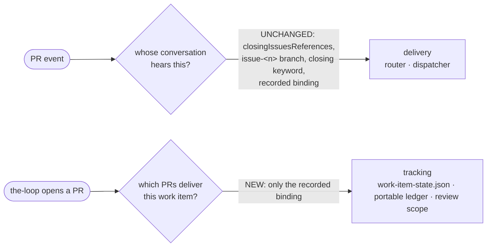
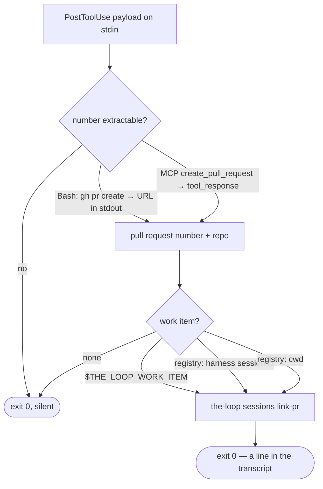

<!-- Authored per the the-loop:writing skill. -->

# Design: a pull request is tracked because the-loop recorded it, never because GitHub guessed

> Phase 2 of 4 (requirements → design → testing plan → tasks). Derives from
> `requirements.md`. MUST be reviewed and approved before moving to test planning.

## Overview

**One rule, one sentence: a pull request appears in a work item's tracking because
the-loop opened it and said so.** Everything in this change either deletes a way of
arriving at that fact by inference, or makes the saying automatic.

The separation that makes the deletion safe is the one the audit found: the-loop asks two
different questions about a pull request, and only one of them was ever supposed to be
answered by a guess.

**Delivery** is a best-effort routing decision, re-made from scratch on every event, and
wrong only until the next one. A guess there costs a misrouted comment. **Tracking** is a
durable, checked-in, reviewed fact that outlives the machine. A guess there costs a row in
a committed file that nobody can explain and nothing removes. Before this change the same
three inference sources fed both. After it, they feed delivery alone.

## From → to

| | before | after |
|---|---|---|
| poller: whose portable ledger holds a labelled PR | registry binding → portable ledger → **router linkage on the listed item** | registry binding → portable ledger → **itself** |
| `work-item-state.json` `pullRequests[]` writers | `sessions link-pr` (`session`) **and** the first routing event (`event`) | `sessions link-pr` (`session`) only |
| review `Pull requests:` pre-fill | `pr-loops/` dirs + **GitHub `linked-pulls` GraphQL** | recorded `pullRequests[]` + `pr-loops/` dirs |
| how the recording happens | the model remembers a prose rule after `gh pr create` | a `PostToolUse` hook runs it; the prose rule is the fallback |
| what a spawned session knows about itself | `THE_LOOP_INSTANCE` | `THE_LOOP_INSTANCE`, `THE_LOOP_WORK_ITEM` |
| a PR armed as its own work item (`review`/`contribute`) | absent from `pullRequests[]` | recorded there, marked `self: true` |

### A worked example

`octo/app#370` is armed. the-loop opens `octo/app#412` (the spec PR) and `octo/lib#7` (the
contributing repository). Meanwhile a drive-by contributor opens `octo/app#500` from a
branch named `bugfix/issue-370` and labels it.

*Before:* the poller lists `#500`, `provider.refs` resolves `issue-370` from the branch,
and `#500`'s poll ledger is filed under `octo/app#370` in `portable/` and listed in
`index.json`. The first comment on it routes to `#370`'s session, and
`_record_pr_binding` writes `#500` into `docs/specs/issue-370/work-item-state.json` with
`linkedBy: "event"` — a row in a committed file, for a pull request the work item's owner
never heard of. The review brief then pre-fills `Pull requests:` with whatever GitHub's
Development panel says, which may include `#500` and may omit `octo/lib#7`.

*After:* `#412` and `octo/lib#7` are in `pullRequests[]` because the hook ran `link-pr`
when each was created. `#500` gets a portable record of its own — it is a work item in its
own right, like any labelled pull request that delivers nothing the-loop opened — and
`work-item-state.json` is untouched. Comments on `#500` are still delivered to `#370`'s
session, because delivery still reads the branch convention. The review brief pre-fills
`Pull requests:` with `github:octo/app#412` and `github:octo/lib#7`, the two the-loop
actually opened.

## The changes

### C1 — the poller stops inferring an owner (R1.1, R1.2)

`_resolve_owner` loses its third question. What remains is two lookups into records
the-loop wrote, and the existing "a pull request that answers neither is a work item in
its own right" default — which is where an inferred pull request now lands.

`refs` is still computed and still passed in (it is what `_process_item` needs for
delivery and for closure reconciliation), so the parameter stays; it is simply no longer
consulted for ownership. That keeps the diff to the one decision that changes.

**Migration: none, deliberately.** A pull request already ledgered under a work item keeps
that owner — question 2 answers before anything else, and it is unchanged. So an upgrade
does not re-file anything; it only stops *new* inferred filings. The alternative (sweeping
`portable/` for `linkedBy`-less ledgers) would delete an operator's tracking on the
strength of a rule they have not yet read.

### C2 — the checked-in list has one writer (R2.1, R2.2, R2.3)

`GraphLink.on_pr_linked` loses its `linked_by` parameter and always records `"session"`;
`_record_pr_binding` stops calling it. The dispatcher still writes the **registry**
binding — that is a machine handle, the thing that routes the event, and it was never the
tracking this ticket is about.

`WorkItemState.link_pr`'s default becomes `"session"`. `PR_LINKED_BY` keeps both names
because it is the **read** vocabulary: a file written before this change carries
`linkedBy: "event"` rows and must keep them, spelled as they were. Nothing writes the
second name any more, and the constant's docstring says so.

`set_pr_state` is untouched — it mutates a row that exists and creates none, so a merge
still records itself for a pull request the-loop opened and does nothing for one it did
not.

### C3 — the-loop stops asking GitHub (R3.1, R3.2, R3.3)

`linked-pulls` leaves `OPERATIONS`, both transports and the GraphQL query constant. In its
place `_detected_pulls` reads the work item's own `work-item-state.json` — the file
issue-368 made the answer — before the `pr-loops/` directories, deduplicated in that
order.

The two sources are not redundant. `pullRequests[]` is what `link-pr` recorded, including
a pull request whose inner loop has not started and therefore has no directory;
`pr-loops/` is what actually walked a loop, including a pull request recorded on another
machine before this change. Reading both keeps the pre-fill complete without asking
anyone outside the repository.

**Known consequence, stated rather than hidden:** delivery is unchanged (R1.3), so an
event for a pull request linked only by inference still routes to the work item and can
still cause `pr-loops/pr-<n>/` to be created under its spec directory — and
`_state_pulls` will then suggest it. That is a weaker leak than the one this change
removes (a directory means *the-loop ran an inner loop for this pull request against this
work item*, which is something the-loop did; a closing keyword is something a stranger
typed), it reaches only a human-edited suggestion rather than a committed list, and
closing it fully means removing the delivery inference — the out-of-scope item above. If
the owner wants the pre-fill to read `pullRequests[]` alone, that is a one-line change to
`_detected_pulls`.

### C6 — a pull request that IS the work item (R7)

The owner's ruling on PR #372 closes the other half of the same rule. the-loop is armed
four ways — `start` and `do` on a work item, `review` and `contribute` on a pull request —
and the entity it manages is one **work item** whatever represents it: a GitHub issue, a
Jira story, a pull request. So a pull request armed by `review`/`contribute` is recorded in
`pullRequests[]` exactly as one the-loop opened for an issue is.

A pull request can therefore stand in two relations to a work item, and the list holds
both:

| relation | recorded by | `self` | `stateDir` |
|---|---|---|---|
| **delivers** the work item | `the-loop sessions link-pr` | absent | `pr-loops/[<owner>__<repo>/]pr-<n>` |
| **is** the work item | arming (`review` / `contribute`) | `true` | `""` |

`self: true` is the marker, so a reader tells them apart without comparing refs against
`workItem`. The marked row carries no `stateDir` deliberately: the work item's own
directory *is* the loop, so the derived `pr-loops/pr-<n>` would nest a copy of the work
item inside itself. A `stateDir` hand-written onto a marked row is refused outright rather
than recomputed — the same fail-closed treatment every other field in this agent-writable
file gets.

Two narrow decisions:

- **"Is this work item a pull request?" is read off the arming event**, through the
  `pr_work_item` parse the dispatcher already uses — not from the loop that was selected
  (`the-loop contribute` may join an issue) and not from GitHub (the round trip C3 just
  removed). An unreadable event answers *no*, which is the safe direction: a missing row
  costs a reader the uniformity; a wrong one puts a pull request into a committed file on a
  guess, which is the thing this whole work item exists to stop.
- **Without the marker a work item still does not deliver itself.** `link_pr` keeps its
  refusal of the self ref; `is_self=True` is the only way past it, so the call site has to
  say which relation it means.

### C4 — the recording is automatic (R4.1–R4.5)

A new plugin hook, `hooks/the-loop-link-pr.py`, in the mould of `the-loop-gate.py`:
stdlib-only, importing nothing from `the_loop`, talking to the CLI over its JSON
interface, and a no-op whenever it cannot be certain.

Four properties, each load-bearing:

- **It reads the result, not the intent.** The pull request's number comes from what the
  tool *returned* — the URL `gh pr create` prints, or the MCP tool's response — so a
  command that failed, was interrupted, or was a `gh pr create --dry-run` links nothing.
  A regex over the command string could not tell those apart.
- **It never blocks.** Every path exits 0. `PostToolUse` exit 2 would feed stderr back to
  the model and interrupt the work for a piece of bookkeeping that is best-effort by
  design — the same rule `sessions register` already follows.
- **It is idempotent**, because `link-pr` is: a pull request already recorded is a no-op,
  so a re-run, a retry or a second matching tool call costs nothing.
- **It is a suggestion, not a source of truth, about the work item.** The resolution chain
  ends in "give up and say nothing" rather than in a guess — which would reintroduce
  exactly what C1 and C2 remove.

`hooks/hooks.json` gains the `PostToolUse` entry with a matcher covering `Bash` and the
MCP pull-request tools. Cursor's hook surface has no `PostToolUse` equivalent, so
`rules/the-loop.mdc` and `reference/automation.md` keep the prose rule as the documented
fallback (R4.5).

### C5 — a spawned session knows its work item (R5.1, R5.2)

`TmuxRunner` already injects `THE_LOOP_INSTANCE` through `new-session -e`, behind a probe
for tmux ≥ 3.2. The work item's ref joins it on the same flag, behind the same probe, for
every spawn that has one. This is the variable `hooks/the-loop-gate.py` has documented
since issue-109 and that nothing has ever set: the Stop gate starts working as a
side-effect, which is a bug fixed rather than scope added.

## Alternatives considered

- **Remove the router's delivery linkage too.** The literal reading of "remove the magic".
  Rejected for this work item: it would silently stop delivering review comments on every
  pull request the-loop did not open — the contribution loop's whole subject — and it is a
  separate, larger migration. Named in `requirements.md` § Out of scope so the owner can
  call it in if that *is* what was meant.
- **Keep `linked-pulls` as a suggestion only.** It is a human-edited pre-fill, so a wrong
  suggestion is cheap. Rejected: the ticket names "actively searches" as the thing to
  stop, and with `pullRequests[]` readable the search now returns a *worse* answer than
  the local one — it cannot see a spec PR that closes nothing, which is the pull request a
  work-item review most needs in scope.
- **Sweep `portable/` on upgrade** to unfile previously-inferred ledgers. Rejected: see
  C1. Nothing distinguishes an inferred filing from a correct one after the fact, so the
  sweep would be a guess about guesses.
- **Resolve the work item in the hook by parsing the branch name.** Rejected: that is the
  inference this work item removes, reintroduced in the one place that would make the
  removal pointless.

## Risks

| risk | mitigation |
|---|---|
| A pull request the-loop opens goes unrecorded because the hook did not fire (Cursor, a bare session, a harness with hooks disabled) | the prose rule stays and is still in `/work-on` and `/execute-tasks`; `link-pr` is idempotent so both paths can run |
| An operator relied on inferred ledgers to keep one portable record per work item, and now sees more records | existing ledgers are untouched (C1); the extra records are the shape a labelled pull request had before issue-368, and each is still a real work item |
| The hook runs on every `Bash` call | it exits before doing any work unless the command names `gh pr create` **and** the response carries a pull-request URL; no subprocess is spawned otherwise |
| `THE_LOOP_WORK_ITEM` leaks a ref into a session that is not about it | it is set only from the spawn's own work item, by the same code that names the tmux target |
