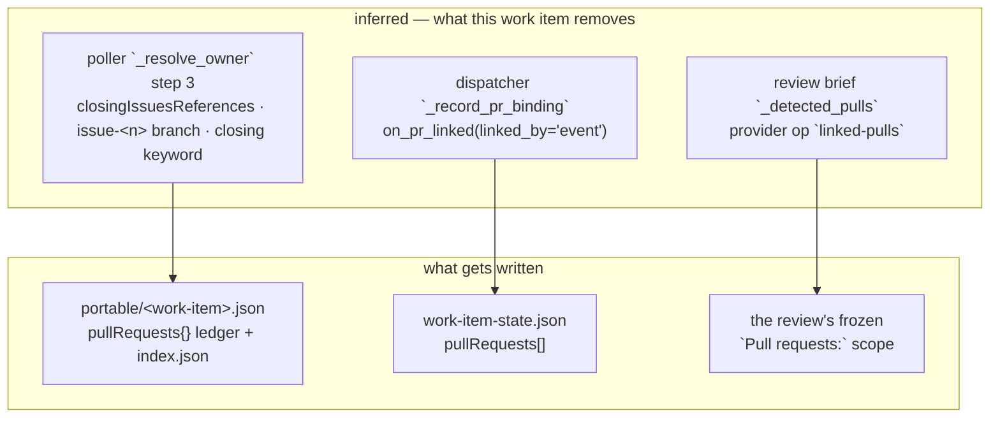

<!-- Authored per the the-loop:writing skill. -->

# Requirements: a pull request is tracked because the-loop recorded it, never because GitHub guessed

> Phase 1 of 4 (requirements → design → testing plan → tasks). Following the Kiro spec
> approach (<https://kiro.dev/docs/specs/>). This phase MUST be reviewed and approved by
> the required collaborators before moving to design.

## Introduction

[Issue-370](https://github.com/MadaraUchiha-314/the-loop/issues/370): *"the-loop
currently does some 'magic' to determine which PRs are linked to which work item (gh
issues) … this is no longer needed with our latest changes … we should remove the feature
in poller which 'actively' goes and links random PRs to work item using 'linked PR'
meta-data on gh issues etc."*

[Issue-368](https://github.com/MadaraUchiha-314/the-loop/issues/368) made a work item's
own `work-item-state.json` the place the pull requests delivering it are recorded, and
[issue-274](https://github.com/MadaraUchiha-314/the-loop/issues/274) gave the session that
opens a pull request the command that records it (`the-loop sessions link-pr`). The two
together mean the-loop no longer has to *infer* which pull requests belong to a work item
— it can be told. But the inference is still there, still writing, and still the reason a
pull request nobody stated can attach itself to a work item's tracking.

**Two halves, and the ticket asks for both.** Stop the guessing (a removal), and make the
telling reliable enough to replace it (an addition that does not depend on the model
remembering to run a command).

## Audit — where the guess still runs

Three places still answer "which pull requests belong to this work item?" from something
other than a record the-loop wrote.

1. **The poller (`cli/the_loop/poller/poller.py::_resolve_owner`).** A labelled pull
   request is asked three questions in order: this machine's session records, the portable
   ledgers, then *the router's linkage on the listed item* — GitHub's
   `closingIssuesReferences`, the `issue-<n>` head-branch convention, and closing keywords
   in the body. Step 3 is the ticket's "magic": it takes a pull request the-loop never
   opened, decides which issue it delivers from metadata anyone can author, and files that
   pull request's poll ledger under that issue's record in `portable/` — where it also
   appears in `index.json`'s `pullRequests` list. Nothing asked for it, and nothing
   un-files it.
2. **The dispatcher (`cli/the_loop/webhook/dispatcher.py::_record_pr_binding`).** The same
   inference, one layer up: the first event that routes for a pull request writes that
   pull request into the work item's **checked-in** `work-item-state.json` with
   `linkedBy: "event"`. A branch named `fix/issue-370-typo` in a fork, or a body saying
   `fixes #370`, is enough to add a row to a file that is committed, reviewed and carried
   to the next machine.
3. **The review brief (`cli/the_loop/graph/hooks/review.py::_detected_pulls`).** A
   work-item review pre-fills its `Pull requests:` scope from the-loop's own `pr-loops/`
   state **and** from a `linked-pulls` integration op that asks GitHub which pull requests
   the issue links. The second is the ticket's "actively searches", and it is now the
   weaker source: the recorded `pullRequests[]` is authoritative and was never read here.

**And the telling is not reliable.** `the-loop sessions link-pr` exists, and
`reference/automation.md`, `/work-on` and `/execute-tasks` all tell the agent to run it
after `gh pr create`. That is a prose instruction to a language model — the ticket's *"it
would be great if it can be done programmatically rather than relying on LLM to do it"*.
Removing the inference while the record depends on the model remembering a command would
trade a wrong answer for a missing one.

**One more gap, found in the audit.** `hooks/the-loop-gate.py` reads
`THE_LOOP_WORK_ITEM` to know which work item it is gating, and **nothing sets it**. The
tmux runner injects `THE_LOOP_INSTANCE` and nothing else, so every spawned session's Stop
gate is a no-op. Any hook that needs to know the work item — including the one this work
item adds — needs that variable to actually be there.

## Requirements

### R1 — a pull request's owner is a recorded fact

- **R1.1** WHEN the poller resolves which work item's portable record holds a labelled
  pull request's poll ledger THEN it SHALL consider only records the-loop wrote: this
  machine's session registry bindings, then the portable ledgers. The inferred-linkage
  fallback SHALL be removed.
- **R1.2** IF no recorded binding names an owner THEN the pull request SHALL keep a
  portable record of its own — it *is* the work item, exactly as a review or a pull
  request that closes no issue already is.
- **R1.3** The change SHALL NOT alter which events *reach* which conversation. The
  router's linkage sources stay as they are for delivery (issue-93/183/269): "whose
  conversation hears this?" is a different question from "which pull requests deliver this
  work item?", and a review comment on a contributor's pull request must still be
  delivered.

### R2 — the checked-in list is written only by the-loop's own act

- **R2.1** `work-item-state.json`'s `pullRequests[]` SHALL be written only when the-loop
  records a pull request it opened (`linkedBy: "session"`). The `"event"` writer SHALL be
  removed and `"session"` SHALL be the only value the-loop writes.
- **R2.2** A row written before this change with `linkedBy: "event"` SHALL still load and
  SHALL keep its recorded value, so a work item in flight does not lose its pull requests
  across the upgrade.
- **R2.3** A pull request's upstream state (`merged`/`closed`) SHALL continue to be
  recorded for rows that are already tracked; a state change SHALL NOT create a row.

### R3 — the-loop stops asking GitHub which pull requests relate to a work item

- **R3.1** The `linked-pulls` integration op SHALL be removed from the GitHub integration
  and from the ops the graph resolves.
- **R3.2** A work-item review's `Pull requests:` scope SHALL be pre-filled from the
  work item's own recorded `pullRequests[]` first, then its `pr-loops/` directories,
  deduplicated in that order.
- **R3.3** IF nothing is recorded THEN the template SHALL ask the reviewer to list the
  pull requests, as it already does — a pre-fill is a suggestion and never blocks the
  post.

### R4 — recording a pull request does not depend on the model

- **R4.1** the-loop SHALL ship a `PostToolUse` hook that, when a session creates a pull
  request — `gh pr create` through the shell, or a GitHub MCP tool that creates one —
  records it with `the-loop sessions link-pr` without the agent being asked to.
- **R4.2** The hook SHALL be stdlib-only Python, SHALL import nothing from `the_loop`,
  and SHALL be a no-op — never an error, never a block — when the work item is unknown,
  the CLI is absent, the command was not a pull-request creation, or it failed.
- **R4.3** The hook SHALL resolve the work item from `THE_LOOP_WORK_ITEM`, falling back
  to the session registry matched on the harness session id and then on the working
  directory.
- **R4.4** The hook SHALL be advisory to the transcript only: on a successful link it
  says so, and it SHALL NOT block a tool call under any outcome.
- **R4.5** The prose instruction SHALL remain, marked as the fallback for a harness that
  runs no hooks, so a Cursor or bare session still records what it opens.

### R5 — a spawned session knows its work item

- **R5.1** The tmux runner SHALL inject `THE_LOOP_WORK_ITEM=<ref>` into a spawned
  session's environment, beside `THE_LOOP_INSTANCE`, for every spawn that has a work item.
- **R5.2** A spawn with no work item (a standing session) SHALL pass no such variable, and
  a tmux too old for `new-session -e` SHALL degrade exactly as it already does for
  `THE_LOOP_INSTANCE` — one warning, no failed spawn.

### R6 — the documentation says the new rule

- **R6.1** The affected capability docs SHALL be updated in this PR —
  `docs/capabilities/webhook-triggers.md`, `docs/capabilities/process-graph.md`,
  `docs/capabilities/cli.md` and `docs/capabilities/distribution.md` — each with a
  history row, together with the user-facing pages that describe the changed behaviour
  (`docs/cli/state.md`, `docs/cli/commands/sessions.md`). A capability doc that describes
  none of it SHALL be recorded as unaffected, with the reason, rather than edited.
- **R6.2** `skills/the-loop/reference/automation.md` SHALL describe the hook as the
  primary path and the command as the fallback.

## Acceptance criteria

- **AC1** A labelled pull request whose only connection to an issue is
  `closingIssuesReferences`, an `issue-<n>` branch or a closing keyword gets a portable
  record of its own; the issue's record gains no `pullRequests` entry and `index.json`
  lists none for it (R1.1, R1.2).
- **AC2** The same pull request, with a session binding recorded by `link-pr`, is
  ledgered under the work item exactly as before (R1.1).
- **AC3** A comment on that pull request is still delivered to the work item's session
  (R1.3).
- **AC4** An event routing for a pull request adds no row to `work-item-state.json`;
  `link-pr` does (R2.1). A v1 file's `linkedBy: "event"` row survives a load/save round
  trip (R2.2).
- **AC5** A work-item review's brief request lists the recorded `pullRequests[]`, and the
  GitHub integration exposes no `linked-pulls` op (R3.1, R3.2).
- **AC6** With `THE_LOOP_WORK_ITEM` set and `the-loop` on the path, a `PostToolUse`
  payload for a successful `gh pr create` runs `sessions link-pr` with the new PR's
  number; every degraded input exits 0 and runs nothing (R4.1–R4.4).
- **AC7** A tmux spawn for a work item carries `-e THE_LOOP_WORK_ITEM=<ref>` (R5.1).

## Out of scope

- The router's delivery linkage (`linked_work_items`, `closingIssuesReferences`, the
  branch convention, closing keywords). It answers a different question and removing it
  would silently drop review comments on pull requests the-loop did not open (R1.3). If
  the owner wants that removed too, it is its own work item with its own migration.
- The `pr-loops/` inner-loop state layout, unchanged.
- Any change to `the-loop sessions link-pr`'s interface.
