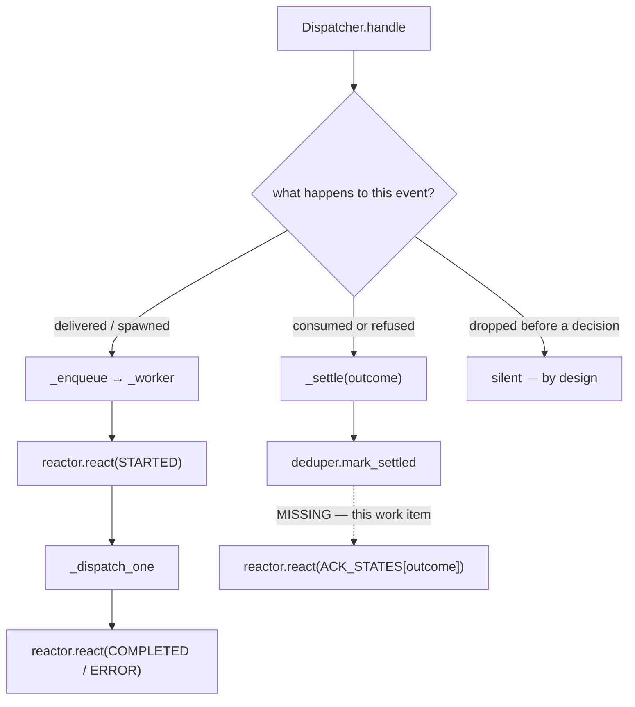

<!-- Authored per the the-loop:writing skill. -->

# Design: every comment the-loop finishes with says so on the comment

> Phase 2 of 4 (requirements → design → testing plan → tasks). Derives from
> `requirements.md`. MUST be reviewed and approved before moving to test planning.

## Overview

**One sentence: the-loop already has a seam that means "I am finished with this event" —
`_settle` — and acknowledging there turns five silent paths into one rule.**

Issue-84 wired reactions to *delivery*: `Dispatcher._worker` reacts 👀 when it dequeues an
event and 🎉/😕 from what the dispatch returned. That is the right place for the branch it
covers and the wrong place to have stopped, because the dispatcher has two branches:



The dashed arrow is the whole change. Everything else in this design is about making sure
it fires exactly where it should and nowhere else.

## Why `_settle` and not the call sites

`_settle` was introduced by issue-270 with a one-line contract: *"Record that this event is
finished with."* Every path in the audit's gap list already calls it, and — critically —
nothing else does:

| caller | outcome | in the gap list? |
|---|---|---|
| `handle` (conflicting keywords) | `control-ambiguous` | yes |
| `handle` (every matched session paused) | `session-paused` | yes |
| `_apply_collaborator` | `control-executed` | yes — **the reported bug** |
| `_apply_control` | `control-executed` | yes |
| `_reject_control` | `control-rejected` | yes |
| `_on_unmatched` (suppressed refusal) | `awaiting-start`, `collaborator-no-spawn`, `session-paused` | yes |
| `_refuse_scope` | one of `SCOPE_REFUSALS` | no — must stay silent (issue-322 R2.6) |
| `_dispatch_one` (paused at dequeue) | `session-paused` | no — the worker around it already reacts |

Two exceptions, two shapes. The scope refusal is excluded **by the table**: its outcomes
have no entry, so `ACK_STATES.get(outcome)` answers `None` and nothing is posted — the
exclusion is data, not a branch. The other two need a word, because they reach `_settle`
with an outcome that *is* in the table:

- `_reject_control` called **from** `_refuse_scope` (an authorized command on an
  out-of-scope work item) settles `control-rejected`, which maps to 😕. Issue-322 forbids
  it: a non-owner instance must leave no mark.
- `_dispatch_one`'s paused branch settles `session-paused` from **inside** a worker that
  has already posted 👀 and will post 🎉 from its return value. A third call would be a
  redundant round trip for a reaction already on the entity.

So `_settle` grows one keyword-only parameter, `acknowledge`, defaulting to `True` and
passed `False` at exactly those two sites. A default-on parameter is deliberate: a new
settle site added later is acknowledged unless its author says otherwise, which is the
direction this work item wants the code to fail in.

## The table

```python
# dispatcher.py, beside SETTLED_OUTCOMES
ACK_STATES = {
    SETTLED_CONTROL_EXECUTED: STATE_COMPLETED,
    SETTLED_CONTROL_REJECTED: STATE_ERROR,
    SETTLED_CONTROL_AMBIGUOUS: STATE_ERROR,
    **{outcome: STATE_STARTED for outcome in SETTLED_SUPPRESSED},
}
```

Built from the same constants `SETTLED_OUTCOMES` is built from, so a new settled outcome
that nobody classifies is silent rather than wrong, and a renamed constant cannot leave a
stale string behind.

**Why the suppressed family is 👀 and not 😕.** `SETTLED_SUPPRESSED`'s own comment says
these are the outcomes where *"a real event was refused on purpose and the harness re-reads
the thread instead."* The comment is pending, not failed: when the work item is started —
or the session resumed — the harness reads the thread and finds it. 😕 would say the-loop
could not act on it, which is untrue and, on a busy repository with several armed work
items nobody has started, would paint every ordinary comment as broken. 👀 is the one state
of the three that means "seen", and seen is exactly what happened.

**Why `control-executed` is 🎉 and not 👀 → 🎉.** A control command is not a dispatch: it
is applied synchronously inside `handle`, in microseconds. Posting 👀 and then 🎉 would be
two round trips to describe one instant. The delivered branch earns its 👀 because there is
real latency — a queue, a semaphore, a tmux write — between pickup and outcome.

## Ordering and failure

The call goes **after** `deduper.mark_settled`, inside the same method:

```python
def _settle(self, routed, outcome, *, acknowledge=True):
    if routed.delivery_id:
        self.deduper.mark_settled(routed.delivery_id, outcome)
    if acknowledge:
        state = ACK_STATES.get(outcome)
        if state:
            self.reactor.react(routed, state)
```

Three properties fall out, all of them required (R2.1, R2.2):

1. **The record wins.** The durable half — the settled delivery id, and the `control.*` /
   `dispatch.dropped` eventlog entry the caller already emitted — is written before the
   decoration is attempted. A reactor that hangs until its timeout cannot cost the-loop a
   settled id.
2. **The decoration cannot fail the caller.** `GitHubReactor.react` never raises: every
   failure path inside it is a logged no-op returning `False` (its class docstring is the
   contract, and issue-84's tests hold it). `_settle` relies on that contract rather than
   re-implementing a `try`, so there is one place where the guarantee lives.
3. **Nothing new is configured or emitted.** `react` reads the operator's existing
   `routing.reactions` — so `enabled: false` silences these too, a state set `""` skips
   only that state, and a missing `gh` is the same single warning — and records the same
   `reaction.added` / `reaction.failed` events (R2.5, R3.1).

The reaction lands on the entity `target_from_event` resolves, unchanged: the comment that
carried the command when there is one, otherwise the issue or pull request. Every gap in
the audit is a *comment* event, so in practice every new acknowledgement lands on the
comment the human typed — which is the whole point of the ticket.

### A known consequence: one `gh` call inside `handle`

`_settle` is reached from `Dispatcher.handle`, which the webhook receiver calls **on the
HTTP request thread** (`daemon.on_event`). So a settled event now costs that thread one
`gh api` round trip — typically well under a second, bounded by the reactor's 30-second
timeout — where before it was local I/O only.

Accepted, for three reasons:

1. **It is not a new class of behaviour in this method.** `handle` already makes a
   synchronous, best-effort, timeout-bounded `gh` call at its top: `_verify_linkage` asks
   `WorkItemVerifier` whether a branch-invented work item exists (issue-269), on a
   10-second timeout. The acknowledgement sits in the same envelope.
2. **The worst case costs nothing durable.** The record is written first, so a reaction
   slow enough to push the delivery past GitHub's own timeout loses only the *delivery*
   receipt — and the redelivery is deduped against the id `_settle` has already marked,
   so nothing executes twice.
3. **The receiver is threaded.** `ThreadingHTTPServer` handles deliveries concurrently, so
   a slow acknowledgement holds one thread, not the ingress.

The alternative — handing the acknowledgement to a background thread — was rejected as
disproportionate: it adds a lifecycle (start, drain, join on `stop`) and a source of test
non-determinism to a decoration, for a tail the existing linkage check already exposes.

## What is deliberately not touched

- **The delivered branch.** `_worker` keeps its two calls. A settle that happens inside it
  passes `acknowledge=False`, so the number of reactions a dispatched event receives is
  unchanged (R2.3).
- **`_dispatch_one`'s return value.** It still answers `True` for a paused dequeue —
  issue-270's deliberate "success having done nothing". Changing it would repaint an
  existing acknowledgement, which R2.3 forbids.
- **The ingress refusals.** Self-authored and unauthorized-actor comments are refused
  before `handle` is reached. They stay silent: a reaction there would confirm to an
  unauthorized author that a daemon is listening (audit A10), and the two people who *can*
  reach `_reject_control`'s `unauthorized-actor` — a work-item collaborator who typed a
  command, or an actor-less poll-path event — are already inside the trust boundary, so
  telling them "no" discloses nothing.
- **Slack.** `channels/inbound.py` already reacts `received` after its last refusal and
  `completed`/`error` from the outcome, on every accepted path including the kickoff, the
  kickoff answer and a button press. The audit confirms it; this work item changes none of
  it (R4.2). One consequence worth naming: a Slack `control.command` is recorded as an
  **unmarked** ledger comment on the ticket, so it arrives at the dispatcher as an ordinary
  comment — and now picks up 🎉 there too, beside the ✅ it already gets in Slack.

## Security

No new input is read, no new argv is built and no new network surface is opened. The
reaction target is resolved by `target_from_event`, whose payload-derived coordinates are
already regex-validated (`_NAME_RE`, `_NODE_ID_RE`) before they reach a `gh` argv, and the
content is a fixed palette name from the config. The only behavioural delta an untrusted
party could observe is *an additional emoji on a comment they were already authorized to
post*, on paths that were already executing their command — so the change reveals nothing
that executing the command did not. The one place where a reaction *would* have been a
disclosure (an out-of-scope instance marking another instance's work item) is the exception
the design excludes explicitly.

## Alternatives considered

| Alternative | Rejected because |
|---|---|
| A fourth reaction state (`suppressed`) with its own config key | New config surface for a distinction 👀 already carries; `routing.reactions` is schema, and a schema change raises the risk tier for no user-visible gain. |
| React at each of the six call sites | Six places to forget, and the seventh added next quarter is silent again. `_settle` is already the single "finished with it" statement. |
| Map the suppressed family to 😕 | Untrue (the harness re-reads the thread) and noisy (every comment on an armed, unstarted work item would look like a failure). |
| Have `_dispatch_one` return an acknowledgement state instead of a bool | A wider refactor of the delivered branch, which R2.3 says must not change, to avoid one keyword argument. |
