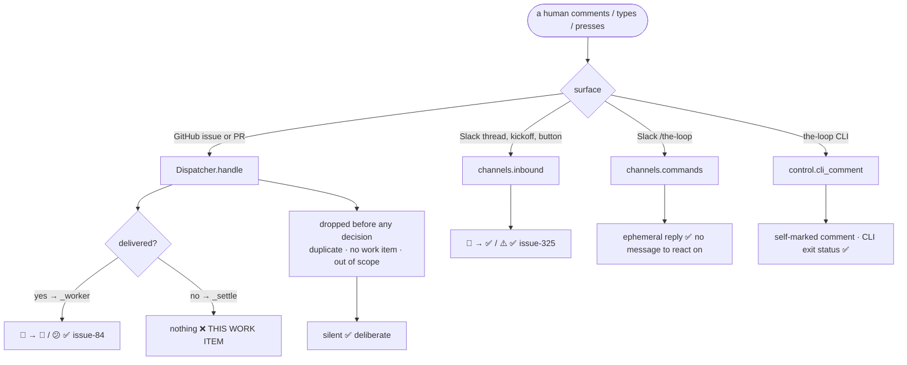

<!-- Authored per the the-loop:writing skill. -->

# Requirements: every comment the-loop finishes with says so on the comment

> Phase 1 of 4 (requirements → design → testing plan → tasks). Following the Kiro spec
> approach (<https://kiro.dev/docs/specs/>). This phase MUST be reviewed and approved by
> the required collaborators before moving to design.

## Introduction

[Issue-371](https://github.com/MadaraUchiha-314/the-loop/issues/371): *"the principle is
that all comments posted on any surface when it's processed by the-loop gets the emoji
reactions to let the user know that an action has been taken … this applies to slack,
github etc. Currently there's a bug on `add-collaborator` not getting a reaction, but do
an audit of all interactions and fix it systemically."*

[Issue-84](https://github.com/MadaraUchiha-314/the-loop/issues/84) gave the-loop that
acknowledgement on GitHub: 👀 when an event is picked up, 🎉 / 😕 from the outcome.
[Issue-325](https://github.com/MadaraUchiha-314/the-loop/issues/325) gave the Slack
channel the same courtesy on the message a reply arrived on. What neither noticed is
**where** the GitHub half is wired: `Dispatcher._worker`, the thread that delivers an
event to a session. A comment that is *never delivered* — because it **was** the
instruction, because it was refused, or because it was deliberately suppressed — never
reaches that thread, so it is never acknowledged at all.

`the-loop add-collaborator @someone` is exactly that comment. The dispatcher executes it,
writes the roster, emits `control.command`, and returns. The person who typed it sees an
unmarked comment and no reply, and cannot tell a granted collaborator from a daemon that
is not running.

**This is not one missing call.** It is a whole branch of the dispatcher — every path
that *consumes* an event instead of dispatching it — with no acknowledgement seam at all.

## Audit — every surface a human speaks to the-loop on

| # | Surface / path | Today | Verdict |
|---|----------------|-------|---------|
| A1 | GitHub event **dispatched** to a session (`_worker`) | 👀 then 🎉/😕 | correct (issue-84) |
| A2 | GitHub **control command executed** — `start`, `stop`, `pause`, `resume`, `cleanup`, `add-collaborator`, `remove-collaborator` (`_apply_control`, `_apply_collaborator`) | **nothing** | **gap — the reported bug** |
| A3 | GitHub **control command refused** (`_reject_control`: `unauthorized-actor`, `missing-collaborator`, `spawn-policy`) | **nothing** | **gap** |
| A4 | GitHub **conflicting keywords** (`control-ambiguous`) | **nothing** | **gap** |
| A5 | GitHub event **deliberately suppressed** (`awaiting-start`, `session-paused`, `collaborator-no-spawn`) | **nothing** | **gap** |
| A6 | GitHub event refused as **out of this instance's scope** | nothing | correct — issue-322 R2.6 forbids a mark from a non-owner |
| A7 | GitHub **duplicate delivery** | nothing | correct — the first delivery already reacted |
| A8 | GitHub event with **no work item** / a work item linkage invented | nothing | correct — there is no resolvable reaction target |
| A9 | GitHub event dropped by **spawn policy** (item not armed) | nothing | correct — the id is released for retry, so the-loop is not finished with it |
| A10 | GitHub event refused at **ingress** (self-authored marker, unauthorized actor) | nothing | correct — a refusal leaves no mark, and a reaction would be an oracle |
| A11 | Slack thread reply, kickoff, kickoff answer, button press | 👀 then ✅/⚠️ | correct (issue-325) |
| A12 | Slack `/the-loop …` slash command | ephemeral reply through `response_url` | correct — a slash command has no message to react on |
| A13 | the-loop CLI (`the-loop add-collaborator`, `sessions start …`) | the comment it posts is self-marked and dropped at ingress | correct — the CLI's own exit status is the acknowledgement |

Five gaps, one shape: **the-loop is finished with the event and says nothing.** The
dispatcher already has a name for that moment — `_settle`, "the dispatcher is FINISHED
with this delivery" (issue-270) — and it is the one seam every gap passes through and no
correct row does, except the two (A6, A7/A9 by construction) that must stay silent.

## Requirements

### R1 — an event the dispatcher finishes with is acknowledged on the entity it arrived on

- **R1.1** WHEN the dispatcher settles an event — it consumed it as an instruction, or it
  refused it on purpose — THEN it SHALL add the reaction that outcome deserves to the
  triggering GitHub entity, through the same best-effort reactor issue-84 already uses.
- **R1.2** The mapping from settled outcome to reaction state SHALL be a fixed table, not
  configuration, and SHALL use only the three states the operator already configures
  (`routing.reactions.started` / `.completed` / `.error`). No new config key is added.
- **R1.3** The table SHALL be:

  | settled outcome | state | reads as |
  |---|---|---|
  | `control-executed` | `completed` (🎉) | the-loop did what you asked |
  | `control-rejected` | `error` (😕) | recognised, and refused |
  | `control-ambiguous` | `error` (😕) | two commands in one comment; nothing ran |
  | `awaiting-start` | `started` (👀) | seen; nothing is running for this work item yet |
  | `session-paused` | `started` (👀) | seen; the session is paused |
  | `collaborator-no-spawn` | `started` (👀) | seen; a grant is input, never a start |
  | any out-of-scope refusal | *(none)* | another instance owns this work item |

- **R1.4** The suppressed family maps to `started` rather than `error` because it is not
  an error: the-loop's own contract for those outcomes is that *"the harness re-reads the
  thread instead"* — the comment is pending, not failed, and 👀 is the only one of the
  three states that says so.

### R2 — acknowledging never changes what the dispatcher does

- **R2.1** A reaction SHALL remain best-effort: it SHALL NOT fail, delay, reorder or drop
  a dispatch, a control execution, a settle, or an eventlog record. The
  `GitHubReactor` contract (never raises, always returns) SHALL be relied on, not
  re-implemented.
- **R2.2** The acknowledgement SHALL be added **after** the outcome has been recorded —
  the eventlog entry and the settled delivery id are the durable record; the reaction is
  a decoration on top of it.
- **R2.3** No event that is acknowledged today SHALL be acknowledged differently. The
  dispatched lifecycle (👀 → 🎉/😕) is unchanged, and `_dispatch_one`'s in-flight
  `session-paused` settle — which happens *inside* a worker that already reacted 👀 and
  will react from its own outcome — SHALL NOT add a second reaction.
- **R2.4** Out-of-scope refusals SHALL stay silent on every route into them, including
  the one that reaches `_reject_control` for an authorized command (issue-322 R2.6: *"No
  reaction, no comment, no record"*).
- **R2.5** `routing.reactions.enabled: false` SHALL silence the new acknowledgements
  exactly as it silences the existing ones, and a state configured `""` SHALL skip only
  that state.

### R3 — the acknowledgement is auditable

- **R3.1** Every acknowledgement SHALL go through the reactor's existing
  `reaction.added` / `reaction.failed` eventlog vocabulary. No new event type is added.

### R4 — the Slack and CLI surfaces are confirmed, not changed

- **R4.1** The audit's correct rows (A6–A13) SHALL be left as they are, and the reason
  each is correct SHALL be recorded in this spec rather than discovered again.
- **R4.2** No change SHALL be made to `channels/inbound.py`, `channels/commands.py` or
  `channels/slack.py`: the Slack pipeline already acknowledges at every accepted path,
  and a slash command has no message to react on.

### R5 — the documentation says the new rule

- **R5.1** `docs/config/cli/routing-options.md` SHALL describe reactions as covering both
  branches — dispatched *and* consumed — with the outcome table.
- **R5.2** The affected capability docs SHALL be updated in this PR, each with a history
  row; a capability doc that describes none of this SHALL be recorded as unaffected, with
  the reason, in `evidence/documentation.md`.

## Acceptance criteria

- **AC1** `the-loop add-collaborator @someone` in a comment from an authorized user gets
  🎉 on that comment, and the roster is written exactly as before (R1.1, R1.3, R2.1).
- **AC2** `the-loop start` on a work item that is not armed gets 😕 on the comment, and
  nothing is started (R1.3).
- **AC3** A comment carrying two different control keywords gets 😕 and executes nothing
  (R1.3).
- **AC4** A comment on an armed work item with no session and no start request gets 👀
  and is not delivered (R1.3, R1.4).
- **AC5** An event this instance refuses as out of scope gets **no** reaction, including
  when it carries an authorized control command (R2.4).
- **AC6** A duplicate delivery, an event with no work item, and a spawn-policy drop still
  get no reaction (A7–A9 unchanged).
- **AC7** A successful and a failed dispatch still react 👀 → 🎉 and 👀 → 😕, exactly
  once each; a session paused between enqueue and dequeue reacts exactly twice, as it does
  today (R2.3).
- **AC8** With `routing.reactions.enabled: false`, none of the above posts anything
  (R2.5).

## Out of scope

- Any new reaction state or config key. GitHub's palette is fixed and the three states
  already carry the three meanings this needs (R1.2).
- Changing which events the dispatcher settles, drops or releases. This work item adds a
  decoration to the existing decisions and re-litigates none of them.
- The Slack pipeline (R4.2) and the `/the-loop` slash command (A12).
- Reacting at **ingress** — on a comment the router or poller refuses before the
  dispatcher sees it. That refusal is deliberately silent (A10) and making it speak would
  tell an unauthorized author that the-loop is watching.
