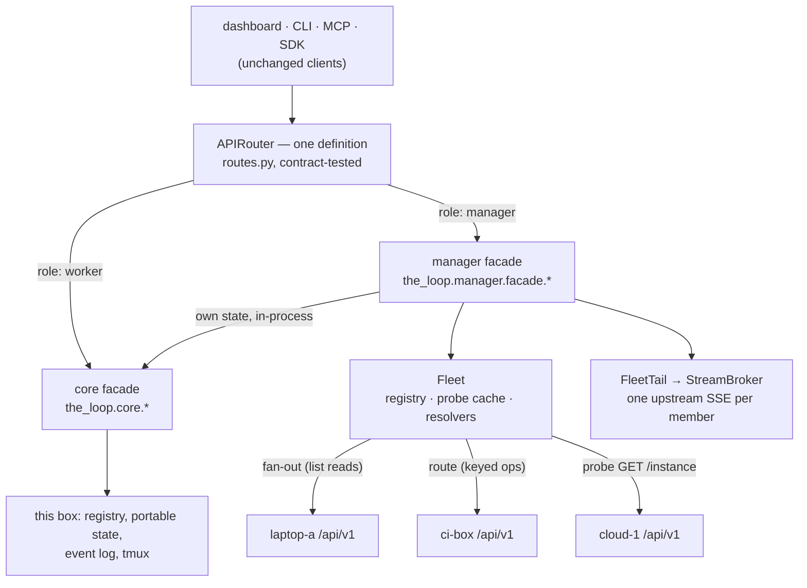
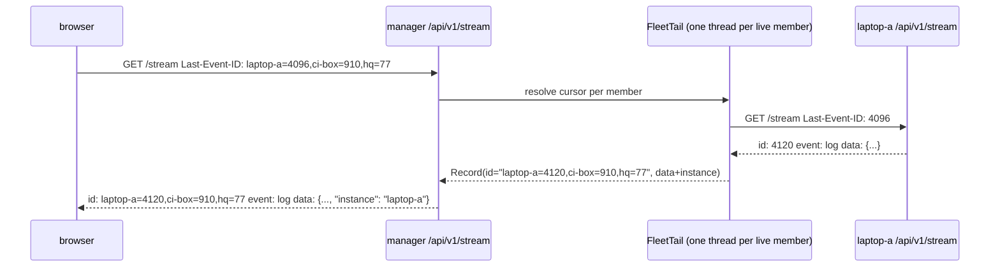

# Design: one router, two facades — the manager is a fleet-shaped core

> Phase 2 of 3. Derived from [`requirements.md`](requirements.md); reviewed together with
> [`testing-plan.md`](testing-plan.md). Tier 4. Decisions in
> [decision-138](../../decisions/decision-138.md).

## Overview

The manager is not a second API. It is the **same `APIRouter`** the worker serves, built
over a **different facade**: where the worker's routes call `the_loop.core.*`, the
manager's call `the_loop.manager.facade.*`, a module set with the same function names
and signatures that answers each call by fanning out to, or routing among, the manager's own
core and the registered members. Identity of surface is then a property of construction, and the contract parity
test proves it for both applications.

Seven moves, in the order a request meets them:

1. **The block** — `instance.py` gains `role` and `ManagerConfig` (members, timeout,
   probe interval); the schema gains the keys; an unknown role or an unnamed manager
   refuses to boot in `serve.py`.
2. **The facade seam** — `routes.build_router(holder, facade=core)` and
   `mcp.build_server(cli_config, facade=core)`: every `core_x.y(...)` call becomes
   `facade.x.y(...)`. `create_app` picks the facade from `role` at boot.
3. **The fleet** — `manager/fleet.py`: the registry read from the live config, a probe
   cache with the name check, a bounded pool, and the three resolvers (by ref, by
   standing name, by explicit `instance`).
4. **The facade** — `manager/facade.py`: one function per core operation, each a fan-out
   or a route, stamping `instance`, translating a member's errors.
5. **The stream** — `manager/stream.py`: one upstream SSE per live member, fanned into
   the existing `StreamBroker` through an injected tail, with a per-member cursor.
6. **The registry surface** — `core/instances.py`, served by both roles: `list`,
   `register`, `unregister`, the last two writing `instance.manager.instances` through
   `core.config.update_config`.
7. **The dashboard** — `instance` on rows and calls, an Instances tab, a per-instance
   management pane, a filter and a chip.



## 1. The block — `instance.py`, the schema, the boot refusal

```python
WORKER, MANAGER = "worker", "manager"
ROLES = (WORKER, MANAGER)

@dataclass(frozen=True)
class Member:
    name: str                      # NAME_RE, unique in the list
    url: str                       # http(s) origin [+ path prefix], no trailing slash

@dataclass(frozen=True)
class ManagerConfig:
    members: Tuple[Member, ...] = ()
    timeout_seconds: float = 10.0
    probe_interval_seconds: float = 15.0

@dataclass(frozen=True)
class InstanceConfig:              # existing, extended
    name: str = ""
    mode: str = OPEN
    declared: Tuple[str, ...] = ()
    role: str = WORKER
    manager: ManagerConfig = ManagerConfig()

class InstanceConfigError(ValueError): ...   # the two boot refusals (R1.5)
```

`InstanceConfig.from_mapping` reads `role` and `manager` beside the existing keys. Two
values **refuse** rather than narrow (R1.5): a `role` outside `ROLES`, and
`role: manager` with an empty `name` — both raise `InstanceConfigError` from
`from_mapping` only when called with `strict=True`, which `serve.py` does at boot before
the bind and before the run lock (the `cors_config` precedent); every other reader
(daemons, `describe_instance`, the dashboard) reads the same block with `strict=False`
and gets `worker` with a warning, so a mis-typed role never bricks a `status` call. Each
`manager.instances` entry is validated by index (R1.6): name grammar, uniqueness, URL
scheme in `{http, https}`, and not equal to this config's `base_url`; a failed entry is
warned about and skipped, and the value is not echoed. `timeoutSeconds` and
`probeIntervalSeconds` clamp upward to `1` through `_positive_number`, the
`stream_config` discipline.

Schema (`cli-config.schema.json`, authored + packaged, byte-identical), additive under
`instance`:

```json
"role": {"type": "string", "enum": ["worker", "manager"], "default": "worker"},
"manager": {
  "type": "object", "additionalProperties": false,
  "properties": {
    "instances": {
      "type": "array", "default": [],
      "items": {
        "type": "object", "additionalProperties": false, "required": ["name", "url"],
        "properties": {
          "name": {"type": "string", "pattern": "^[a-z0-9][a-z0-9-]{0,39}$"},
          "url": {"type": "string", "pattern": "^https?://"}
        }
      }
    },
    "timeoutSeconds": {"type": "number", "default": 10, "minimum": 1},
    "probeIntervalSeconds": {"type": "number", "default": 15, "minimum": 1}
  }
}
```

No version bump, no migration (`CURRENT_CONFIG_VERSION` stays `0.10.0`): the issue-322
precedent. `core.config._restart_required` adds `instance.role` to its boot-only list
(R1.4).

## 2. The facade seam — `routes.py`, `mcp.py`, `app.py`, `sdk`

`routes.py` imports twelve core modules by name. The seam is one object:

```python
class Facade(Protocol):            # the_loop/api/facade.py
    attention: Any; config: Any; daemons: Any; events: Any; graphs: Any
    instance: Any; instances: Any; lifecycle: Any; repo: Any
    sessions: Any; standing: Any; workitems: Any

CORE = SimpleNamespace(attention=core_attention, config=core_config, ...)   # the worker's

def build_router(holder, *, facade: Facade = CORE, **router_kwargs) -> APIRouter: ...
def build_server(cli_config=None, *, facade: Facade = CORE) -> MCPServer: ...
```

Every `core_sessions.control_session(...)` in a route body becomes
`facade.sessions.control_session(...)`; the route bodies, the Pydantic models, the route
class, the audit event and the error mapping are untouched. The manager facade
(`the_loop.manager.facade`) is a module exposing the same twelve names, each a module
whose functions have the core function's name and signature **plus** an optional
`instance: str = ""` keyword where R2.6 adds the parameter. The core modules gain the same
keyword, ignored when empty and `LookupError` when it names anything but this instance's
name — the worker half of R2.6, three lines in a shared helper `core.instance.assert_self`.

`create_app` resolves the facade once, at boot, from `InstanceConfig.role` (R1.4:
boot-only): `facade = manager_facade(holder) if role == MANAGER else CORE`. Nothing else
at boot changes: a manager hosts its ingresses and starts its standing sessions exactly as
a worker does (R1.3) — the manager facade wraps `CORE` for the manager's own state and adds
the fleet beside it. `TheLoop(config_path=...)`
in the SDK reads the same role and builds the same router, so an embedded manager is one
line of config away.

One new exception mapping on `CoreRoute`: `the_loop.api.errors.Conflict` → `409`
(narrowest-first, before `LookupError`). It is raised only by the manager's resolvers
(R2.4); the worker never raises it.

## 3. The fleet — `manager/fleet.py`

```python
LIVE, UNREACHABLE, MISMATCHED = "live", "unreachable", "mismatched"

@dataclass
class Probe:
    member: Member
    state: str                     # LIVE | UNREACHABLE | MISMATCHED
    at: float                      # monotonic
    document: Optional[dict]       # the member's GET /api/v1/instance, when LIVE
    version: str = ""
    detail: str = ""

class Fleet:
    def __init__(self, holder: ConfigHolder, transport: Transport = urllib_transport): ...
    @property
    def config(self) -> ManagerConfig            # re-read from holder.current each call (hot, R1.4)
    def members(self) -> Tuple[Member, ...]      # the registered ones
    local: Member                                 # the manager itself, answered by CORE
    def probe(self, member, *, fresh=False) -> Probe   # cached for probe_interval_seconds
    def live(self) -> List[Probe]                 # every member whose probe is LIVE
    def call(self, member, method, path, *, query=None, body=None) -> Any   # one request, checked
    def fan_out(self, method, path, *, query=None) -> Tuple[Dict[str, Any], List[str]]
        # {name: answer} for every live member that answered, and the names left out
    def by_ref(self, ref: str, instance: str = "") -> Member
    def by_standing_name(self, name: str, instance: str = "") -> Member
    def by_instance(self, instance: str) -> Member
```

**The registry is the live config.** `Fleet.config` reads `holder.current` on every call
and builds `ManagerConfig` through `InstanceConfig.from_mapping(strict=False)`; the route
class already refreshed the holder before the operation ran, so a registration written a
moment ago is the registry now (R1.4, R4.1). The probe cache is keyed by `(name, url)`, so
a re-registered name at a new URL is a fresh probe.

**The manager is its own first member, in-process** (R1.3). `Fleet.local` is
`Member(name=<own name>, url="")`, answered not by the transport but by `CORE` directly:
`fan_out` calls the core function for it and `call` dispatches to core when `member is
fleet.local`. Its probe is always `LIVE` — `describe_instance(config)` read locally, no name
check needed, it is this process — and it is first in every list. Registering the manager's
own address is refused (§ 1), so the same state is never counted twice.

**The probe is the trust check** (R6.1). `probe` calls `GET <url>/api/v1/instance` and
`GET <url>/api/v1/health` (for `version`), with the fleet's timeout. `LIVE` requires a
JSON object whose `name` equals `member.name` and whose `role` is `worker` (absent reads
as `worker` — a 19.14.1 member has no `role`). Anything else is `MISMATCHED` with a detail
naming both names, or `UNREACHABLE` with the transport's reason. A state change between
two probes emits `instance.unreachable` / `instance.mismatched` (error) or
`instance.recovered` (info) once (R3.4); the cache holds the last state so a second
failing probe emits nothing.

**Every request is bounded.** `Transport` is `(method, url, body, timeout) → (status,
bytes)`; the default is `urllib.request` with the fleet's timeout and a read capped at
`MAX_MEMBER_BODY = 16 MiB` — a transcript tail is a few hundred KiB, a work-item list a
few KiB; beyond the cap the response is dropped as malformed (R6.4). The body is
`json.loads`-ed and shape-checked against what the operation promises (a list for a list
read, an object otherwise); a failure is `instance.malformed` at level `error` and that
member's answer is left out. Nothing from the caller — no header, no cookie — is
forwarded: the manager builds each request from the operation's arguments alone (abuse
case 1). The transport is injected so the unit tests drive a `TestClient` per member and
only one integration test opens sockets.

**`fan_out` is concurrent and bounded.** A `ThreadPoolExecutor(max_workers=min(8,
len(live)))` runs `call` per live member; each future is waited with the fleet's timeout
so one hung member costs at most `timeoutSeconds` of the others' wall time (abuse case 4).
A member whose call raises is added to the left-out list, its probe is marked
`UNREACHABLE` (a transport error) or kept `LIVE` (a 4xx/5xx, which is that member's
answer, translated below), and the operation still answers (R2.9).

**The resolvers** (R2.3–R2.6):

| resolver | reads | one match | none | several |
|----------|-------|-----------|------|---------|
| `by_instance(name)` | `fleet.local` when `name` is the manager's own, else the registry | the member; `LookupError` if its probe is not `LIVE` → `502` via `MemberUnavailable` | `LookupError` → 404 | — (names are unique) |
| `by_ref(ref, instance)` | `instance` if given, else the local managed set plus every live probe's `document["managed"]` | the member | `LookupError` → 404 | `Conflict` → 409 naming the candidates |
| `by_standing_name(name, instance)` | `instance` if given, else `fan_out("GET", "/standing-sessions")` | the member | `LookupError` → 404 | `Conflict` → 409 |

`by_ref` reads the managed sets from the **probe documents**, so a keyed read costs no
extra round trip while the probes are fresh, and a stale probe is refreshed first (`fresh`
when older than the interval). A `sessions/register` creates the managed-set entry, so
nothing can resolve its ref beforehand: without `instance` it registers on the manager
itself (the worker behaviour), with `instance` on that member.

**A member's error is the manager's error.** `call` maps a member's `400` to `ValueError`,
`404` to `LookupError`, `409` to `Conflict`, any other non-2xx to `MemberError` → `502`
with the member's `detail` and name — so a worker's own words reach the caller unchanged,
and a transport failure on a keyed operation is `502`, never an empty `200` (R2.9).

## 4. The facade — `manager/facade.py`, operation by operation

One module per core module, each function a one-liner over the fleet. The table is the
contract of the aggregation and the design's most important artifact; the reviewer should
check every row against the requirement it cites.

| operationId | kind | manager behaviour |
|-------------|------|-------------------|
| `health` | self-or-instance | own: the worker's document (`ingresses` as today) plus `role: manager` and `instances: [{name, url, state, detail}]`; `status` `ok` iff every own enabled ingress holds its lock and every member is `LIVE`; with `instance`: proxied (R2.7, R2.9) |
| `getInstance` | self-or-instance | own: `{name, role: manager, scope: <its own>, managed: own rows ∪ live members' rows, each + instance}`; with `instance`: proxied (R2.7) |
| `listInstances` | self | § 6 (R3.1) |
| `registerInstance` / `unregisterInstance` | self | § 6 (R4) |
| `listWorkItems`, `listSessions`, `listStandingSessions`, `listAttention`, `listDaemons` | fan-out | own rows (via `CORE`) ∪ members', each row `+ instance` (overwriting any present, R6.3), sorted as the worker sorts with `instance` as tie-break; left-out members in the header (R2.2, R2.9) |
| `queryEvents` | fan-out | union merged by `ts` (stable, `instance` tie-break), each `+ instance`; `limit` applied after the merge; the manager's own log included under its own name |
| `eventTypes` | fan-out | union of maps |
| `getWorkItem`, `getSession`, `sessionTranscript`, `controlSession`, `replySession`, `linkSessionPullRequest`, `closeSession` | by ref | `by_ref(ref, instance)` then one call; the answer `+ instance` (R2.3) |
| `registerSession` | by instance | `instance` absent or own name → `CORE` (the worker behaviour, § 3); a member's name → proxied |
| `getStandingSession`, `deleteStandingSession`, `controlStandingSession`, `sayToStandingSession` | by standing name | `by_standing_name(name, instance)`; `controlStandingSession` with an empty name (every session) acts on the manager's own without `instance` |
| `createStandingSession` | by instance | `instance` absent or own name → `CORE`; a member's name → proxied |
| `graphShow`, `graphCheck`, `graphComplete`, `graphAdvance`, `graphForce`, `graphSkip`, `graphRepos`, `repoScenarios`, `repoInstructions`, `repoCritics`, `repoReviewPolicy`, `repoCriticRun`, `controlDaemon` | by instance | `instance` absent or own name → `CORE` (the worker behaviour, R2.5); a member's name → proxied |
| `getConfig`, `getConfigSchema`, `updateConfig`, `restart` | self-or-instance | own without `instance` (the manager's file, the manager's process); proxied with it (R2.7) |
| `streamEvents` | fan-in | § 5 (R2.8) |

The `instance` parameter is one `Query(...)`/body field per route in `routes.py` — the
Pydantic bodies gain `instance: str = ""`; the `GET` routes gain
`instance: str = Query("")`. Both facades receive it; the core facade's functions call
`assert_self(instance, config)`.

**The partial-read header.** The route class cannot know a list was partial, so the
facade's fan-out functions return the rows and the facade records the left-out names on a
`contextvars.ContextVar`; `CoreRoute` sets `The-Loop-Instances-Unreachable: a, b` when it
is non-empty after the operation, and clears it (R2.9). The worker never sets it.

**Ordering** follows each core function's own (`sorted(store.refs())` for work items,
registry order for sessions, `ts` for events), so a client that reads a worker and a
manager sees the same order within one instance.

## 5. The stream — `manager/stream.py`



`StreamBroker` today owns the subscriber set, the bounded queues, the capacity refusal
and the tick; it reads records from a `LogTail` it constructs. The seam is one injected
factory: `StreamBroker(path, ..., tail=None)` — `None` builds the `LogTail` as today; the
manager passes a `FleetTail`. `FleetTail.read()` yields `Record`s from a thread-safe queue
the member threads fill; `size()`/`seek_to_end()` answer in the composite cursor.

**One upstream per live member** (R2.8). `FleetTail.start()` opens `GET
<url>/api/v1/stream` for each live probe on its own thread — `urllib` with no read
timeout on the body (an SSE body never ends) and the connect timeout of the fleet — and
parses `id:` / `event:` / `data:` lines. A `log` frame's data is stamped `instance` (the
registered name, overwriting, R6.3); a `transcript` frame's is stamped the same; a
`desync` from a member is re-emitted as the manager's `desync`. The upstream `retry:` is
ignored; the manager's own `RETRY_MS` governs its subscribers. The manager's **own** event
log is the (N+1)-th source, read by a `LogTail` under the manager's name, so
`instance.unreachable` and `config.updated` on the manager stream too. The threads start
with the first subscriber and stop with the last, as the broker's tick task does; a member
that becomes `LIVE` while subscribers exist gets its thread on the next tick, and one that
drops has its thread end and its offset kept.

**The cursor is per member.** `id` is `name=offset(,name=offset)*` over every source that
has delivered, the manager's own log under the manager's name. `parse_cursor` on the
manager accepts that grammar and nothing else — a bare integer (a worker's cursor pasted
into a manager) is `desync` — and resolves it member by member: each named member is
resumed with its own `Last-Event-ID`; a member the cursor does not name starts at its
end; a name the registry no longer holds is dropped. A member that answers the resume
with `desync`, or whose offset it cannot honour, makes the manager's answer one `desync`
frame (R2.8), after which the browser refetches and continues — the existing client
behaviour.

**Reconnection is bounded.** A dropped upstream is retried with backoff `1, 2, 4, …, 30 s`
until the member's probe is not `LIVE`, then left to the probe cycle (abuse case 4). An
upstream that stops sending is detected by the member's own keep-alives (`:` comments
every `keepAliveSeconds`): three missed keep-alives closes the socket and reconnects. A
member whose stream is disabled (`service.stream.enabled: false`, `404`) is logged once
and not retried until its config changes — its `log` records still reach `queryEvents`.

`maxSubscribers` applies to the manager's own subscribers, exactly as on a worker; the
upstream count is the live-member count whatever the subscriber count.

## 6. The registry surface — `core/instances.py`, served by both roles

```python
def list_instances(config, *, fleet=None) -> Dict[str, Any]
    # worker: {"role": "worker", "name": ..., "instances": [self_row]}
    # manager: {"role": "manager", "name": ..., "instances": [row per probe]}
def register_instance(config, name, url, *, config_path=None) -> Dict[str, Any]
def unregister_instance(config, name, *, config_path=None) -> Dict[str, Any]
```

The **self row** on a worker is `{name, url: base_url(config), state: live, version,
mode, managedCount, sessionCount, probedAt: now}` — the same shape a manager reports for
a member, so the Instances tab has one renderer (R3.1). The manager's rows are its own self row first, then
`Fleet.probe` for every registered member (a stale probe refreshed on this read), with
`managedCount = len(document["managed"])` and `sessionCount` from the probe's document —
`describe_instance` gains `sessionCount` (additive) so the count is one read.

`register_instance` validates as § 1 validates (R4.3), then calls
`core.config.update_config(patch={"instance": {"manager": {"instances": current + [entry]}}},
path=config_path)` — the **one write path** (R4.2): the splice, the schema check, the
migration gate, the atomic write, the `config.updated` event, all reused; then emits
`instance.registered`. `unregister_instance` writes the list without the entry, `404` if
absent, emits `instance.unregistered`. On a worker both raise `ValueError` → `400`
naming `instance.role` (R4.4). The routes are `GET /api/v1/instances`
(`listInstances`), `POST /api/v1/instances/register` (`registerInstance`), `POST
/api/v1/instances/unregister` (`unregisterInstance`), each in the authored contract. The
MCP registry lists `list_instances` only (R4.5; `mcp.py`'s tool list is explicit, so the
two writers are simply not added). The SDK gains `loop.instances()`.

**The CLI** (R4.6): `commands/instances.py` — `the-loop instances list [--json]`,
`register <name> <url>` and `unregister <name>` — each a `client.routing.routed` call to
the route above with the core function as the test-seam local path, rendering the
`messages` / `exitCode` the core returns (`register` on a worker: exit 2 naming
`instance.role`; a validation failure: exit 2 with the reason; an unknown name on
`unregister`: exit 1). `list` prints the table `status` prints. Documented at
`docs/cli/commands/instances.md` and in the CLI capability doc.

`the-loop status` (`core.lifecycle.status_all`) adds `instances: list_instances(config)`
on a manager and renders one line per member (R3.3):

```
instances   hq [manager] — this instance + 3 registered, 2 of 3 live
  hq        (this instance)          live         19.14.1   3 managed
  laptop-a  http://10.0.0.5:4114     live         19.14.1   4 managed
  ci-box    http://ci:4114           live         19.14.1   1 managed
  cloud-1   http://10.0.0.9:4114     unreachable  —         connection refused
```

## 7. Boot — `serve.py`, `lifecycle.py`, `app.py`

- `serve.main` calls `InstanceConfig.from_mapping(block, strict=True)` before the CORS
  check; `InstanceConfigError` is printed and the process exits `2`, before the bind and
  the run lock (R1.5).
- `create_app`: `facade` and `app.state.fleet` for the stream route and tests;
  `host_ingresses` is read as on a worker (R1.3).
- `lifecycle.start_all` and `status_all` are unchanged for the manager's own services;
  `status_all` adds the `instances` document (§ 6).
- `core.config._restart_required`: `instance.role` joins the boot-only list (R1.4).

## 8. The dashboard — `ui/`

**Types** (`api/types.ts`): `instance?: string` on `WorkItemRecord`, `SessionRecord`,
`StandingSessionRecord`, `AttentionItem`, `DaemonStatus`, `EventRecord`; a new
`InstancesDocument { role; name; instances: InstanceRow[] }` with
`InstanceRow { name; url; state; version; mode; managedCount; sessionCount; probedAt; detail? }`.

**Client** (`api/client.ts`): every keyed method takes an optional `instance` and sends
it (query on `GET`, body field on `POST`) only when non-empty (R5.1); `instances()`,
`registerInstance(name, url)`, `unregisterInstance(name)`; `health(instance?)`,
`config(instance?)`, `saveConfig(patch, instance?)`, `restart(body, instance?)`,
`daemons()` unchanged (fan-out), `controlDaemon(daemon, verb, instance)`.

**Board** (`state/useControlPlane.ts`, `api/model.ts`): round one adds `api.instances()`;
`buildWorkItemViews` keys rows by a board key — `<instance>@<ref>` when the row carries an
instance, else the bare `ref` —
and `fetchGraphs` passes `session.instance` on each `graphCheck` (R5.1). `WorkItemView`
gains `instance`. The hash route `#/item/<ref>@<instance>` parses to `{name: "work",
ref, instance}`; without `@` it is today's route (R5.2). `#/instances` and
`#/instances/<name>` are the two new routes; `Surface` gains `"instances"`.

**Sidebar**: an instance chip (mono, muted, the `ref-chip` style) on each work-item, PR
and standing row when `view.instance` is set; a `<select>` beside the search box with
`All instances` and one option per `InstancesDocument` row, filtering the loaded rows
(R5.2); the footer's `serviceLabel` reads `manager · <host> · N instances` on a manager.
`healthTone` folds the fleet in: any stopped own daemon or any non-`live` member is
`degraded`; the popover keeps the own-daemons rows and lists each member with its state
beneath them (R5.5).

**Instances view** (`views/Instances.tsx`, R5.3): the fleet table (name, URL, state dot +
word, version, mode, managed, sessions, probed), a Register card (name, URL, validated
client-side against the same grammar, the server's `400` shown verbatim), and per row
`Open` (→ `#/?instance=<name>` — the Work surface with the filter preset), `Manage` (→
`#/instances/<name>`) and `Unregister` (a confirm, then the call) — the manager's own row
has no `Unregister`. On a worker: one row,
no Register card, one sentence naming `instance.role`.

**Instance pane** (`views/InstanceDetail.tsx`, R5.4): identity (name, URL, version, mode,
the managed list from `instance(name)`), daemons with `start`/`stop`
(`controlDaemon(..., instance)`), the existing `ConfigEditor` mounted with
`instance=<name>` (it already takes the API it edits through), a Restart button
(`restart({}, instance)`), health, and Unregister. Every control is disabled with the
state's `detail` when the row is not `live`.

**Demo** (`demo/client.ts`): `instances()` answers one row for the fixture's instance
(R5.6); the writers answer `400` as a worker would.

## 9. Documentation

`docs/config/cli/instance-options.md` (`### role`, `### manager.instances`,
`### manager.timeoutSeconds`, `### manager.probeIntervalSeconds`); `docs/cli/instances.md`
(a *Running a manager* section: role, registry, what it does not do, reaching members,
the name check, the `instance` parameter, the two edits that are one); `docs/cli/state.md`;
`docs/cli/commands/status.md`; `docs/cli/commands/instances.md` (new); the template and this repository's `cli-config.yaml`; the
OpenAPI contract; `docs/sdk/` (`loop.instances()`); the capability docs `instances.md`
(a *The manager* section and a history row), `cli.md` (the `instances` command) and `control-plane.md` (the facade seam, the
`instances` family, the `instance` parameter, the stream fan-in, the Instances tab);
`docs/capabilities/capabilities.md`'s row for `instances`; `ui/README.md`;
[decision-138](../../decisions/decision-138.md).

## UI/UX design

| Artifact | Type | Location / link | Covers (screen · requirement) | Status |
|----------|------|-----------------|-------------------------------|--------|
| `design/instances.html` | html-prototype | [`design/instances.html`](design/instances.html) | Instances tab · R5.3; Manage pane · R5.4; sidebar chip + filter · R5.2; degraded health · R5.5; worker view · R5.3 | draft |

- **Flows & states:** *fleet* (the table; one row `unreachable` with its detail; the
  Register card; the degraded health word) → *manage* (one instance: identity, daemons,
  config editor, restart, unregister; every control disabled when not `live`) → *open*
  (the Work board with the filter preset and chips on rows). A *worker* state shows the
  tab with one row and no Register card. Light and dark, toggled in the prototype as in
  the app.
- **Design system / tokens:** Control Plane UI 3.0 (issue-327, decision-112): the oklch
  tokens of `ui/src/styles/app.css` copied inline, surfaces and hairlines, one primary
  for the human's actions, the five state colours behind a 6 px dot, mono identifiers.
  The chip is the existing `ref-chip`; the table is the standing-sessions table's shape.
- **Accessibility & responsiveness:** state in words beside every dot; the filter is a
  native `<select>`; Unregister and Restart are buttons with a confirm step; the table
  collapses to a card list below 768 px, the sidebar closes as today.
- **Evidence:** screenshots of the locked prototype's five states, light and dark, under
  `evidence/ui/` at lock (`design.uiArtifacts.screenshotEvidence`).

## Data models

In memory: `Member`, `ManagerConfig`, `InstanceConfig.role`, `Probe` (§ 1, § 3). On the
wire, additive: `instance` on every aggregated row and keyed request; the
`The-Loop-Instances-Unreachable` header; the composite stream cursor
`name=offset(,name=offset)*`; `InstancesDocument`:

```json
{"role": "manager", "name": "hq",
 "instances": [
   {"name": "laptop-a", "url": "http://10.0.0.5:4114", "state": "live",
    "version": "19.14.1", "mode": "addressed", "managedCount": 4, "sessionCount": 2,
    "probedAt": "2026-09-29T18:00:00Z"},
   {"name": "cloud-1", "url": "http://10.0.0.9:4114", "state": "unreachable",
    "version": "", "mode": "", "managedCount": 0, "sessionCount": 0,
    "probedAt": "2026-09-29T18:00:00Z", "detail": "connection refused"}]}
```

On disk: `instance.role` and `instance.manager` in `cli-config.yaml`; the manager's
event log gains `instance.registered`, `instance.unregistered`, `instance.unreachable`,
`instance.recovered`, `instance.mismatched`, `instance.malformed`, `aggregate.partial`.
Nothing else is written: the manager keeps no copy of any member's records.

## Error handling

| Failure | Behaviour |
|---------|-----------|
| `role` unknown / manager unnamed | `the-loop start` exits 2 naming the key; other readers warn and read `worker` |
| a registry entry invalid | warned by index; skipped |
| member unreachable on a list read | left out; header + `health: degraded` + `aggregate.partial`; `instance.unreachable` once |
| member unreachable on a keyed operation | `502` with the reason |
| member answers as another name / a manager / unnamed | `mismatched`; nothing served or sent; `instance.mismatched` |
| member body oversized / not JSON / wrong shape | dropped; `instance.malformed`; the rest answer |
| member returns 400 / 404 / 409 / other | `400` / `404` / `409` / `502` with the member's `detail` |
| key resolves to none / several | `404` / `409` naming candidates |
| `instance` names an unregistered member | `404`, nothing sent |
| `instance` missing where required | `400` naming the parameter |
| cursor not in the composite grammar, or a member cannot replay | one `desync` |
| upstream stream drops | backoff `1…30 s` while the probe is `LIVE`; offset kept |
| `register` on a worker | `400` naming `instance.role` |
| `register` invalid / duplicate; `unregister` unknown | `400` / `404`; nothing written |
| the config write refused by the splice | `500` with the reason; file byte-identical (as today) |

## Security design

- **AuthN/AuthZ:** unchanged and deliberately so (decision-059): the manager's boundary
  is its bind and the deploying gateway; a member's is its own. The manager adds no
  credential and forwards none. What changes is **reach**: one URL now reaches every
  member's config, sessions and restart, and the guide says so in one sentence at the top
  of the manager section. Registration carries the config write's authority and nothing
  more (R4.2).
- **Input validation & injection surfaces:** (1) the registry — name grammar `NAME_RE`,
  URL scheme allowlist, uniqueness, not-self, validated at read and at `register`; the URL
  is joined with fixed paths only (`/api/v1/<route>`), never with caller text. (2) the
  `instance` parameter — compared with registered names, never interpolated; unknown →
  `404`. (3) member responses — bounded read, `json.loads`, shape check, `instance`
  overwritten (R6.3, R6.4). (4) the composite cursor — a fixed grammar, names checked
  against the registry, offsets non-negative integers; anything else → `desync`. (5) the
  stream's SSE parser — line-bounded (`MAX_PARTIAL_BYTES`, the existing tailer bound),
  ignores unknown fields. No shell, no path, no SQL is built from any of it.
- **Secrets handling:** none stored or moved. A member URL may carry a userinfo part in
  theory; the schema pattern does not forbid it, so `register` and the reader **refuse** a
  URL with `@` before the host, and no URL is written to the event log (only names).
- **Least privilege:** the manager's worker half runs with exactly the credentials and
  scope it had as a worker (R1.3); the manager half adds outbound HTTP to the registered
  URLs and no credential.
- **Fail-closed behaviour:** § Error handling — every unresolved state refuses or omits,
  none guesses.
- **Abuse-case coverage:**

| # | Abuse case | Mechanism | Negative test |
|---|------------|-----------|---------------|
| A1 | a non-the-loop URL registered | probe sends only `GET /instance`; not `LIVE` → nothing routed or aggregated; no caller header forwarded | `test_a_foreign_url_is_probed_only_and_never_routed_to` |
| A2 | the host answers as another name / unnamed / a manager | `Probe` name + role check → `MISMATCHED` | `test_a_mismatched_member_is_neither_served_nor_sent_to` |
| A3 | oversized / malformed / wrong-shape body | `MAX_MEMBER_BODY`, `json.loads`, shape check; `instance.malformed`; others answer | `test_a_malformed_member_answer_is_dropped_and_the_rest_served` |
| A4 | a member hangs | per-future timeout; `UNREACHABLE`; upstream backoff | `test_a_hung_member_costs_at_most_the_timeout` |
| A5 | a ref two members manage, a mutating verb | `by_ref` → `Conflict` → `409`; sent to neither | `test_an_ambiguous_ref_is_refused_not_sent_twice` |
| A6 | `instance` names an unregistered member / a foreign name on a worker | `by_instance` → `LookupError`; `assert_self` | `test_an_unknown_instance_sends_nothing`, `test_a_worker_refuses_a_foreign_instance` |
| A7 | a proxied config write / restart | `api.request` with target on the manager; the member's own events | `test_a_proxied_write_is_audited_on_both_sides` |
| A8 | `role: manager` widening what an instance takes on | the worker half is `CORE`, untouched: the scope seam, the actor guard and the ingresses never read the role | `test_a_managers_worker_half_is_unchanged` |
| A9 | a member's row or record carries its own `instance` | the stamp overwrites | `test_the_registered_name_overwrites_a_members_claim` |

## Testing strategy

Unit tests on `instance.py` (the role, the registry validation, the boot refusal),
`manager/fleet.py` (probe states and transitions, the bounded fan-out, the three
resolvers, error translation) and `manager/facade.py` (one test per row of the § 4
table) with an injected transport that answers from a `TestClient` per member;
`manager/stream.py` with a fake upstream (cursor grammar, stamping, `desync`, backoff);
`core/instances.py` (the self row, register/unregister writing through
`update_config`, the worker's refusal) and `commands/instances.py` (the three verbs'
rendering and exit codes); integration scenarios with **two worker
applications and one manager application** in one process (Gherkin docstrings:
a list read is the union, a keyed read routes, an ambiguous ref is refused, a member
going away degrades and recovers, a registration from the API equals a hand edit) and one
socket-level scenario with real uvicorn processes for the stream; the contract parity
test parameterised over both roles; the docs, schema and SDK parity tests; vitest on the
client, the route parser, the board keying and the two new views; screenshots of the
prototype's states. The executable detail is `testing-plan.md`.

## Trade-offs & decisions

[decision-138](../../decisions/decision-138.md): the role lives in `cli-config.yaml`
(decision-110 D1 continued); a manager is also a worker and its own first member; one router over two facades rather
than a second router or a reverse proxy; the registry is a config key written through the
config route, not a second store; a member is trusted by its name, checked at probe;
ambiguity refuses; the stream is a fan-in of member streams with a per-member cursor, not
a poll; the client is stdlib on threads; the `instances` family is served by every role;
an unknown role refuses to boot.

Accepted costs: a manager is one more process to run; a keyed operation costs a probe
(cached) plus a call; the `instance` parameter is an additive change to 30 operations; a
worker's `GET /instances` is a self-description a lone operator will not need; the
dashboard's row key changes from `ref` to `instance@ref`.

## Open questions

Q1 of `requirements.md` is answered — the owner, on PR #436: a manager also works — and
this design reflects it. Q2 and Q3 carry the proposed answers the design assumes:
`instance.role` / `instance.manager.instances`; `409` on ambiguity.

## Review comments

> Appended by the-loop's `record-feedback` hook when a human gate approves with
> comments (issue-109). Append-only and attributed: an approval never silently
> discards a reviewer's suggestions, and the feedback travels with the document
> it concerns rather than living in a side-channel tracker.
