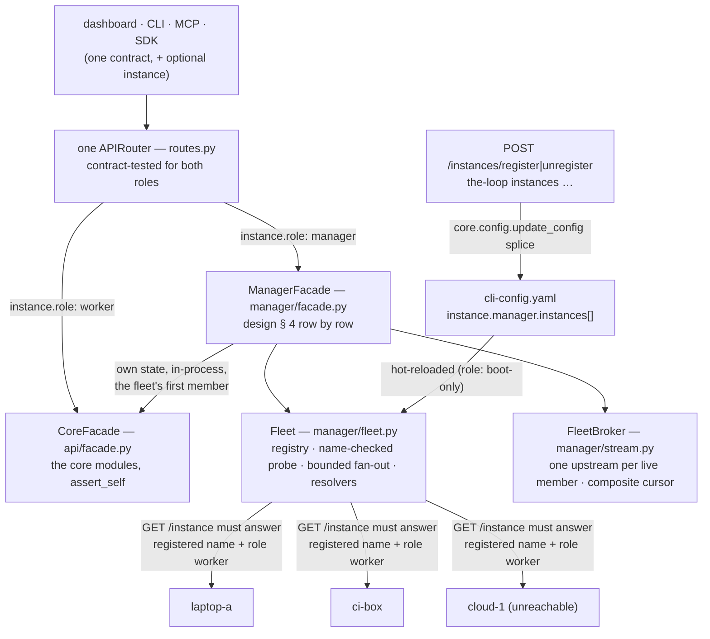

# feat(issue-374): a manager instance — one control plane over many instances of the-loop — reviewer briefing

<!-- the-loop PR briefing (R10). This is the PR description of PR #436. -->

## TL;DR

`instance.role: manager` turns one the-loop into the control plane for a registered
fleet of workers: the same `/api/v1`, MCP tool list, SDK, CLI and dashboard, now over
every instance at once — list reads are the union stamped `instance`, keyed operations
route to the one instance that manages the work item, and the dashboard gains an
Instances tab. The manager keeps every worker responsibility and is its own first member.
Closes [#374](https://github.com/MadaraUchiha-314/the-loop/issues/374).

Tier 4: a `cli-config.schema.json` block, an outbound HTTP client inside the service, a
config write and a restart proxied to another machine. **The tier-4 human security
sign-off is the one open item** (see the last section).

## Where to focus (in this order)

1. **The trust boundary with a member** — `cli/the_loop/manager/fleet.py`
   (`_probe_now`, `_request`, `urllib_transport`, `_NoRedirects`) — nothing is served
   from or sent to a registered URL until `GET /instance` there answers with the
   registered name and `role: worker`; every member body is bounded (16 MiB), parsed
   with `json.loads`, shape-checked, and its `instance` overwritten with the registered
   name; no redirect is ever followed; nothing of the caller (headers, cookies, the
   audit identity) is forwarded. Check that no path bypasses the probe.
2. **The registry writers** — `cli/the_loop/core/instances.py`
   (`register_instance`, `unregister_instance`, `_checked_registry`) — the only code
   that writes `instance.manager.instances`, through the same `update_config` splice
   `POST /config` uses; validated as the reader validates (grammar, `http(s)` without
   userinfo, not the manager's own name or URL, no duplicate name or URL, every existing
   entry re-checked by index before a write). Refused on a worker. Not an MCP tool.
3. **The routing of a keyed operation** — `cli/the_loop/manager/facade.py` (`_target`,
   `_proxy`) and `fleet.py` (`by_ref`, `by_standing_name`, `by_instance`, `_resolve`) —
   none → `404`, several → `409` naming them (never first-wins), an explicit `instance`
   wins, an operation without one on a path-keyed or self-keyed route acts on the
   manager itself. Design § 4 is the row-by-row contract; the facade follows it in
   order.
4. **The one router over two facades** — `cli/the_loop/api/routes.py`,
   `api/facade.py` (`CoreFacade`), `api/app.py` (`facade_for`) — every body and every
   `GET` gained `instance: str = ""`; a worker accepts only its own name
   (`core.instance.assert_self`). The contract parity test runs both roles against the
   authored OpenAPI and asserts one MCP tool list.
5. **The stream fan-in** — `cli/the_loop/manager/stream.py` — one upstream SSE per live
   member however many subscribers, the composite cursor `name=offset,…`, per-source
   replay, one `desync` when any part cannot be honoured, bounded reconnection
   (1…30 s), bounded frames. Skim `serve_fleet` for the cursor rules.
6. **The boot refusal** — `cli/the_loop/api/serve.py` — an unknown role or an unnamed
   manager refuses to start (strict), and reads as a worker with a warning everywhere
   else, so an old config is a worker.
7. **The dashboard** — `ui/src/views/Instances.tsx`, `InstanceDetail.tsx`, the chip and
   filter in `Sidebar.tsx`, `boardKey` in `api/model.ts` — every keyed call carries the
   row's instance; a worker shows itself as one row. Lower risk: no new trust crossing,
   the screenshots under `evidence/ui/` are the visual check.
8. **Docs and config** — schema (authored + packaged, byte-identical), the template and
   this repository's `cli-config.yaml`, the option docs, the guides, four capability
   docs, decision-138. Skim.

## What changed (map)

Commit by commit: the spec chain (`69024e9`…`36e88af`), the config block (`aaf3ebb`),
the router seam and the instances family (`bd22e42`), the dashboard (`f808911`), the
fleet (`ab9cedc`), the manager facade and the stream (`5045237`), the docs (`81f5e89`),
then the security review's fixes (`8396589`) and three self-review rounds (`f7098cc`,
`2e229ba`, `0b2cd86`), each with its regression tests.

## Key decisions & why (education)

All in [`docs/decisions/decision-138.md`](../../../decisions/decision-138.md) (accepted).

- **The role and the registry live in `cli-config.yaml`, not a new file** — the block
  the schema already owns, hot-reloaded through the existing watcher, edited through the
  existing splice; `instance.role` alone is boot-only (`restartRequired`) because the
  facade is chosen at app creation. Trade-off: a fleet edit is a config edit with a
  schema, which is what an operator already knows.
- **A manager is also a worker (D2, review round 1)** — it keeps its scope, its
  daemons, its ingresses and its sessions, and is the fleet's first member served
  in-process under its own name; an operation without `instance` acts on it, so a worker
  promoted to a manager breaks no client. The alternative (a manager that only manages)
  would have cost every user a second box.
- **One router over two facades (D3)** — the surface is identical by construction: the
  routes call a facade with one method per operation, the contract parity test runs both
  roles, the MCP tool list is one. The alternative (a second router, or middleware that
  rewrites) would drift.
- **A member is trusted by its name, not its URL (D4)** — a probe of `GET /instance`
  must answer the registered name and `role: worker`; a URL that answers otherwise is
  `mismatched`, never served, never sent to. Nesting managers (a member answering
  `role: manager`) is refused and filed as
  [#438](https://github.com/MadaraUchiha-314/the-loop/issues/438).
- **Routing by ref, `409` on ambiguity (D6)** — a work item on two instances is two rows
  (`instance@ref` on the board); a keyed operation without `instance` goes to exactly
  one instance or to none, never first-wins. The resolver reads the probe's `managed`
  set, re-probes once, then reads the work-item lists (a polled-only item is in the
  list alone — self-review C12).
- **The stamp is the origin; a subject moves to `about` (R6.3, self-review C9)** — a
  member's row can never claim to be another instance's, and a fleet event *about* an
  instance (`instance.unreachable` about `ci-box`) still names its subject.
- **Fan-out is bounded and partial by design (D5)** — a pool of 8, one timeout per
  wave, a hung member costs at most the timeout and is named in
  `The-Loop-Instances-Unreachable`; `health` is `degraded`, never `500`.
- **Registration is not an MCP tool** — an agent reads the fleet (`list_instances`,
  `get_instance`); only an operator (dashboard, CLI, API) changes it.
- **The fleet-wide Slack channel is out of scope** —
  [#437](https://github.com/MadaraUchiha-314/the-loop/issues/437).

## Evidence

All under [`docs/specs/issue-374/evidence/`](.), one record per gate:

- [`verification.md`](verification.md) — every testing-plan activity with the runner's
  own summary: 164 unit, 15 scenario (two in-process workers + a manager; three real
  `serve` processes for the stream), the contract parity test on both roles, 324
  dashboard tests, lint / format / typecheck / markdownlint / `validate_config`, and the
  CI-form full suite (see the last line of `verification.md` § T12 for the count on
  this head).
- [`manual.md`](manual.md) — the T11 walk-through: three real services on one machine,
  a third registered while down, a member's config edited and restarted through the
  manager, the events by name.
- [`ui/`](ui/) — eight screenshots (light and dark) of the built bundle against the
  live manager of the walk-through: the fleet table, the not-live pane, the Register
  card, the board with chips and filter.
- [`security-review.md`](security-review.md) — the harness's security-review skill
  over the diff (two Low, both fixed in `8396589`), the nine abuse cases mapped to a
  mechanism and a negative test, the tier-4 sign-off line.
- [`self-review.md`](self-review.md) — three code-review rounds, fourteen findings
  (C1–C14), each fixed with a regression test in the same commit; no round found a
  repeat.
- [`documentation.md`](documentation.md) — the docs touched and the parity tests that
  hold them to the code.

## Open questions for the reviewer

1. **Tier-4 security sign-off** — `security-review.md` § Sign-off has the line; the
   nine abuse cases and the two skill findings are above it. Please add your name and
   date, or name what is missing.
2. **`about` on a stamped row** (R6.3, C9) — the smallest field that keeps a fleet
   event's subject; the alternative was to leave fleet events unstamped. Confirm the
   field name.
3. Nothing else is proposed; the two design questions from the spec review (naming,
   `409`) were confirmed in the "go ahead" and are implemented as written.
