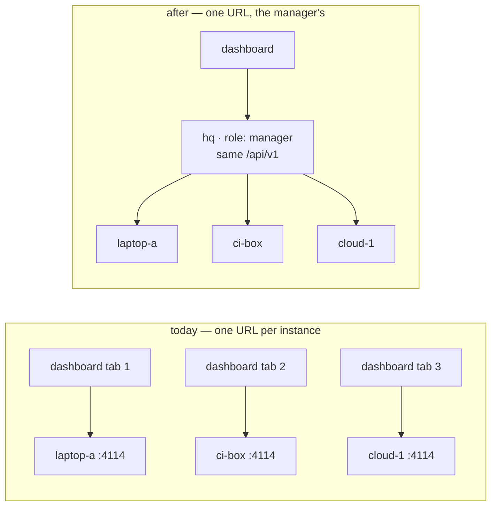

# Requirements: a manager instance — many instances of the-loop, one control plane

> Phase 1 of 3 (requirements → design → tasks). Tier 4 (`human-approves-pr`, and a named
> human security sign-off): the change makes the control-plane service an HTTP **client**
> of other instances, adds a block to `cli-config.schema.json`, and lets one URL write the
> config of, and restart, every instance registered with it. It widens no grant on any
> single instance — a caller who reaches the manager could already reach a member, given
> the member's network — but it concentrates that reach in one place, and the design must
> say so.

## Introduction

[Issue #374](https://github.com/MadaraUchiha-314/the-loop/issues/374) asks for one
control plane over **many instances** of the-loop. Since
[issue-322](https://github.com/MadaraUchiha-314/the-loop/issues/322) an operator can run
several instances — a laptop, a CI box, a cloud container each — every one a named,
scoped `cli-config.yaml` serving the same `/api/v1` at its own address. What nothing
provides is the view across them: the dashboard takes **one** base URL, so an operator
with five instances has five browser tabs, no answer to "which instance has #15?", and no
place to add or retire an instance except a shell on each box.

At 19.14.1 the pieces the manager needs already exist and were left for it (decision-110
D8): every instance serves one identical surface; `GET /api/v1/instance` names the
instance and lists the work items it manages; `control.instance` on every portable record
says which instance took a work item; the config is hot-reloaded by every long-lived
process and editable through `POST /api/v1/config`.

This work item adds a **manager**: an instance whose CLI config says `role: manager`,
which keeps every responsibility a worker has and takes on one more — serving the **same
API** as every other instance by aggregating its own state with that of the instances
registered with it. The dashboard points at the manager and
sees the fleet as if it were one instance; a new **Instances** tab shows and manages the
fleet; and registration is one config key, editable from the tab and from the file alike.

## Requirements

### Requirement 1 — the CLI config says whether this instance is a manager, and whom it manages

**User story:** As an operator, I want to declare in an instance's own CLI config that it
is the manager and which instances it manages, so that the file that already defines the
instance defines its role, and I can bring a manager up with `the-loop start` and nothing
else.

#### Acceptance criteria (EARS)

1.1 The CLI config's `instance` block SHALL accept `role` (`worker` | `manager`, default
`worker`) and, for a manager, `manager.instances` — a list of `{name, url}` entries where
`name` fits the instance-name grammar of issue-322 (`^[a-z0-9][a-z0-9-]{0,39}$`) and is
unique in the list, and `url` is an `http` or `https` origin, optionally with a path
prefix — plus `manager.timeoutSeconds` (per-request timeout, default 10) and
`manager.probeIntervalSeconds` (how long a probe of a member stays fresh, default 15).

1.2 Unset, `role` SHALL resolve to `worker`, and every instance at 19.14.1 SHALL behave
identically: no config version bump, no migration — the keys are additive.

1.3 A **manager SHALL remain a worker**: `role: manager` adds responsibilities and removes
none. Its ingresses, routing, channels, standing sessions and scope (`instance.scope`,
issue-322) SHALL behave exactly as on a worker, and its own state — work items, sessions,
daemons, events — SHALL be the fleet's **first member**, served in-process under its own
name, never through a registered URL. A manager SHALL NOT be listed in its own
`manager.instances` (1.6).

1.4 `role` SHALL be **boot-only**: `POST /api/v1/config` SHALL report a change to it under
`restartRequired`, as it reports `service.host`. `manager.instances` and the two numbers
SHALL be **hot**: an edit to the file — by hand, or through the API — SHALL be honoured
on the next request without a restart, through the config refresh the service already
runs per request.

1.5 WHEN `role` is neither `worker` nor `manager`, or a manager has an empty `name`, THEN
`the-loop start` SHALL refuse to boot naming the key and the accepted values — the
posture `service.cors` already takes for the one pair it refuses — because a mistyped
role must neither silently spawn sessions nor silently manage nothing.

1.6 A `manager.instances` entry that does not validate (a name outside the grammar, a
duplicate name, a URL that is not `http(s)`, a URL equal to the manager's own
`service` address) SHALL be warned about by index and skipped; the remaining entries
SHALL be honoured.

### Requirement 2 — the manager serves exactly the surface a worker serves

**User story:** As the operator of the dashboard, the CLI, an MCP client or an SDK host, I
want the manager to answer every `/api/v1` operation a single instance answers, so that
pointing any existing client at the manager works with no change to that client.

#### Acceptance criteria (EARS)

2.1 The manager SHALL serve every path, method and `operationId` of the authored OpenAPI
contract (`docs/api-specs/openapi/the-loop.v1.yaml`), and the contract parity test SHALL
run against **both** a worker application and a manager application and pass for each.
The manager SHALL serve `/mcp` with the same tool list a worker serves (the same
exclusions: no `restart`, no config write, no `sessions reset`, no `graph force`).

2.2 A **list read** — `work-items`, `sessions`, `standing-sessions`, `attention`,
`daemons`, `events`, `events/types` — SHALL return the union of the manager's own answer and every reachable member's
answer, each row carrying an additive `instance` field naming the instance it came from
(the manager's own name for its rows, the registered name for a member's, never a name a
member reported), ordered as the worker orders it
with the instance name as the tie-break; `events` merged by timestamp.

2.3 An operation **keyed by a work-item ref** — `work-items/one`, `sessions/one`,
`sessions/transcript`, `sessions/control`, `sessions/reply`, `sessions/register`,
`sessions/link-pr`, `sessions/close` — SHALL be routed to the one instance — the manager itself
or a member — whose managed set (the manager's from its own records; a member's from
`GET /api/v1/instance` on it: declared ∪ session ∪ control) holds the ref, and that
instance's answer returned as the manager's own. An operation **keyed by a
standing-session name** SHALL be routed to the one instance that lists it.

2.4 WHEN a keyed operation's key resolves to **no** instance THEN the manager SHALL answer
`404`, and WHEN it resolves to **two or more** instances (a work item declared on two
instances, which issue-322 allows) THEN the manager SHALL answer `409` naming the
candidates — never the first, never all — unless the request names one with the `instance`
parameter of 2.6.

2.5 An operation keyed by a **checkout path** — `graph`, `graph/check`, `graph/complete`,
`graph/advance`, `graph/force`, `graph/skip`, `graph/repos`, `repo/scenarios`,
`repo/instructions`, `repo/critics`, `repo/critics/policy`, `repo/critics/run` — and a
**daemon** verb (`daemons/control`) SHALL, on a manager, act on the **manager's own**
machine when `instance` is absent or names the manager — exactly as on a worker, because a
path names a filesystem and the only one the manager can see is its own — and SHALL be
proxied to the member `instance` names otherwise.

2.6 Every operation of 2.3 and 2.5, and `config`, `config/schema`, `restart`, `instance`
and `health`, SHALL accept an optional `instance` (query parameter on a `GET`, body field
on a `POST`), naming the member the operation is for. On a **worker**, `instance` SHALL be
accepted only when empty or equal to the worker's own name, else `404` — so the parameter
is part of the one contract and a client need not know which role it talks to.

2.7 `config`, `config/schema`, `restart`, `instance` and `health` without `instance` SHALL
be the **manager's own**; with `instance` they SHALL be proxied to that member — this is
how one instance is managed individually (Requirement 5). `GET /api/v1/instance` on a
manager without `instance` SHALL carry `role: manager`, the manager's own name and scope,
and, as `managed`, the union of its own managed set and the members' with each row's
`instance`. `GET /api/v1/health` on a manager SHALL report its own ingresses as a worker
does, with the members beside them (2.9).

2.8 `GET /api/v1/stream` on a manager SHALL push every member's `log` and `transcript`
frames plus the manager's own, each `log` frame's record stamped with `instance`; the
frame `id` SHALL be a cursor the manager can resume **per member**, and `Last-Event-ID`
SHALL be honoured member by member, resolving to one `desync` when any member's part
cannot be replayed. The manager SHALL hold **one** upstream connection per reachable
member however many subscribers it has, and `service.stream.maxSubscribers` SHALL bound
its own subscribers exactly as on a worker.

2.9 A member that is unreachable, times out, or answers as a different instance (Requirement 6)
SHALL be **left out** of a list read, which SHALL still answer `200` with the rest, and the
omission SHALL be visible: the response SHALL carry a `The-Loop-Instances-Unreachable`
header naming the members left out, `GET /api/v1/health` SHALL be `degraded` naming them,
and `GET /api/v1/instances` SHALL show each one's state. A keyed operation to such a
member SHALL answer `502` with the reason, never a silent empty answer.

### Requirement 3 — the fleet is a first-class read, on every instance

**User story:** As an operator or a dashboard, I want one call that says which instances
exist and how each is doing, so that the Instances tab and `the-loop status` have one
source and work whether they talk to a worker or a manager.

#### Acceptance criteria (EARS)

3.1 Every instance SHALL serve `GET /api/v1/instances`: `{role, name, instances: [...]}`,
one row per instance with `name`, `url`, `state` (`live` | `unreachable` |
`mismatched`), `version`, `mode`, `managedCount`, `sessionCount`, `probedAt` and a
`detail` sentence when the state is not `live`. A **worker** SHALL answer with one row,
itself (`url` its own service address, `state: live`). A **manager** SHALL answer with its own
row first, then one row per registered member from a probe no older than
`manager.probeIntervalSeconds`.

3.2 The same read SHALL be the MCP tool `list_instances` and the SDK's `loop.instances()`.

3.3 `the-loop status` on a manager SHALL print its own rows as today, then one line per member (`name`, `url`, state,
version, managed count) and carry the `instances` document in its JSON form.

3.4 A member's **transitions** SHALL land in the manager's event log: `instance.unreachable`
(level `error`, once per transition, with the reason), `instance.recovered`,
`instance.mismatched` (level `error`, the registered name and the reported one),
`instance.registered` and `instance.unregistered`. A partial list read SHALL be
`aggregate.partial` at level `debug` with the members left out.

### Requirement 4 — registering an instance from the dashboard and from the file are one path

**User story:** As an operator, I want to add or retire an instance from the Instances tab
or the CLI and get the same result as editing the manager's config file, so that there is one
registry, one reader, and nothing to reconcile.

#### Acceptance criteria (EARS)

4.1 The registry SHALL be `instance.manager.instances` in the manager's `cli-config.yaml`
and nothing else: no second file, no in-memory list that outlives a request.

4.2 `POST /api/v1/instances/register` (`{name, url}`) and
`POST /api/v1/instances/unregister` (`{name}`) SHALL write that key through the **same
sparse-patch splice** `POST /api/v1/config` uses — comments, order and quoting preserved,
the merged document validated against the schema before anything is written, the write
atomic — so a hand edit and a dashboard edit are indistinguishable in the file and reach
the service through the one refresh of 1.4.

4.3 `register` SHALL validate as 1.6 validates (grammar, uniqueness, `http(s)`, not the
manager's own address) and answer `400` on a violation, writing nothing; it SHALL NOT
require the member to be reachable — an operator may register a box before it is up —
and the row SHALL then show `unreachable` until it is. `unregister` of a name not
registered SHALL answer `404`.

4.4 On a **worker** both routes SHALL answer `400` naming `instance.role` — the routes
exist on every instance (one contract) and do nothing on an instance that manages none.

4.5 Neither route SHALL be an MCP tool: an agent must not re-point what judges it, the
same rule that keeps `updateConfig` off the tool list.

4.6 The CLI SHALL offer the same three operations as `the-loop instances list`,
`the-loop instances register <name> <url>` and `the-loop instances unregister <name>` —
thin clients of the routes above, routed through the service like every core-capability
command (decision-058), rendering the core's `messages` and `exitCode` so the CLI, the tab
and a hand edit converge on the one write of 4.2. `list` SHALL print the table 3.3 prints
and carry the document as `--json`; on a worker `register` and `unregister` SHALL exit `2`
naming `instance.role`.

### Requirement 5 — the dashboard shows the fleet and manages each instance

**User story:** As an operator with the dashboard pointed at the manager, I want the
board to read as one instance with each row saying which instance owns it, an Instances
tab to see and edit the fleet, and a way to manage one instance on its own, so that I
never need a second URL.

#### Acceptance criteria (EARS)

5.1 WHEN the dashboard's base URL is a manager THEN the Work board, the inbox, the standing
sessions, the detail column, the transcript, the composer and the session verbs SHALL work
unchanged, every keyed call carrying the `instance` of the row it acts on; WHEN it is a
worker THEN the dashboard SHALL send no `instance` and render as at 19.14.1.

5.2 A work-item row, a pull-request row, a standing-session row and the session panel
SHALL show an **instance chip** when the served rows carry `instance`; the sidebar SHALL
offer an **instance filter** (all, or one) over the loaded rows beside the search box; a
work item present on two instances SHALL be two rows, each with its chip, and the hash
route SHALL address one of them (`#/item/<ref>@<instance>`), the form without `@`
keeping its meaning on a worker.

5.3 A new **Instances** tab (`#/instances`) SHALL list `GET /api/v1/instances` — name, URL,
state in words and colour, version, mode, managed and session counts, last probe — with a
**Register** form (name, URL) and, per row, **Open** (the Work board filtered to that
instance), **Manage** and **Unregister** (confirmed) — the manager's own row carries no
**Unregister**. On a worker the tab SHALL show the
one row and no Register form, saying why.

5.4 **Manage** (`#/instances/<name>`) SHALL show that instance individually: its
`GET /api/v1/instance` document, its daemons with the start/stop verbs, its config in the
existing schema-driven editor (read and written with `instance=<name>`), a **Restart**
button, and its health — each control disabled with the reason when the instance is not
`live`.

5.5 The sidebar footer's health word SHALL fold the fleet in: `degraded` when any of the
manager's own daemons is stopped or any member is not `live`; the popover SHALL list the
manager's own daemons as today and then each member with its state.

5.6 The demo fixture SHALL answer `GET /api/v1/instances` with its one demo instance, so
the hosted page still explores without a service.

### Requirement 6 — a registered instance is trusted only when it answers to its name

**User story:** As an operator, I want the manager to aggregate and route to a URL only
when what answers there is the instance I registered, so that a wrong URL, a re-used
address or a redirected host cannot hand another box's sessions to my board or my
commands to another box.

#### Acceptance criteria (EARS)

6.1 Before a member's answer is aggregated or a request routed to it, the manager SHALL
have read the member's `GET /api/v1/instance` within `manager.probeIntervalSeconds` and
found `name` equal to the registered name and `role` equal to `worker`; otherwise the
member is `mismatched` (or `unreachable`), nothing from it is served, and nothing is sent
to it but the next probe.

6.2 An **unnamed** worker (name `""`) SHALL therefore never be a member: naming an
instance is the precondition of registering it, and the guide SHALL say so.

6.3 The `instance` stamped on a row or a frame SHALL be the **registered** name, never a
value from the member's response, and a member's own `instance` field on a row (a member
that is itself misconfigured as a manager, say) SHALL be overwritten.

6.4 A member's response SHALL be read within `manager.timeoutSeconds` and within a fixed
byte bound; a response that exceeds either, is not JSON, or is not the shape the contract
promises SHALL be dropped as that member's answer, recorded as `instance.malformed`, and
SHALL NOT fail the manager's own response or process.

### Requirement 7 — the change is documented where instances are configured and run

#### Acceptance criteria (EARS)

7.1 `docs/config/cli/instance-options.md` SHALL document `role`, `manager.instances`,
`manager.timeoutSeconds` and `manager.probeIntervalSeconds` with type, default and
grammar; the docs↔schema parity test SHALL pass.

7.2 `docs/cli/instances.md` SHALL gain a section on running a manager: the role, the
registry, what a manager does not do, how a member must be reachable (`service.exposed`
on the member, and that the network between them is the operator's boundary — a VPN or
tunnel, per decision-059), the name check, and the `instance` parameter.

7.3 The capability docs `instances.md`, `control-plane.md` and `cli.md` SHALL describe the
manager as current behaviour; `docs/cli/commands/instances.md` SHALL document the command; `docs/cli/state.md` SHALL note that a manager's state root holds
only its own event log and pidfiles; the shipped template and this repository's
`cli-config.yaml` SHALL carry `role` and a commented `manager` block; the OpenAPI
contract SHALL carry the new routes and the `instance` parameter; the SDK docs SHALL list
`loop.instances()`.

## Non-functional requirements

- **Dependencies:** none added. The member client is `urllib` (as `the_loop.client`
  already is) on a bounded thread pool; the upstream stream connections are one thread
  per live member. No async HTTP client.
- **Cost:** a list read costs one request per reachable member, made concurrently, bounded
  by the pool; a keyed read costs one probe (cached for `probeIntervalSeconds`) and one
  request. The manager keeps no copy of any member's records.
- **Latency:** a list read SHALL complete within `manager.timeoutSeconds` plus the slowest
  member's own time; one slow member SHALL NOT delay the rows of the others beyond the
  timeout.
- **Reload:** the registry is hot (1.4); the role is boot-only (1.4).
- **Observability:** every request the manager makes to a member is `api.request` on that
  member as today; on the manager, `api.request` records the operation and the target
  instance; transitions per 3.4.
- **Compatibility:** a worker is byte-identical at every existing route except the
  additive `instance` parameter (2.6) and the additive `instances` family (3.1, 4.4); the
  contract change is additive; the dashboard's storage key and settings are unchanged.
  A client that never sends `instance` and points at a manager gets the manager's own
  state for every operation 2.5 and 2.7 name and the union for every list, so a worker
  that becomes a manager breaks no client.

## Security considerations

- **Actors & trust:** the operator (trusted; owns every config and every box); whoever can
  reach the manager's port (trusted by the plane's existing posture — loopback bind or the
  deploying gateway, decision-059); the registered members (trusted to the extent the
  operator registered them — their **responses are data**, validated and bounded, never
  instructions); the network between the manager and its members (the operator's: a
  member reachable off its box is `service.exposed: true` behind the operator's VPN,
  tunnel or gateway); the dashboard (a client of the manager, as today).
- **Trust boundaries & data:** three new crossings. (1) **Config → outbound requests:**
  a registered URL is an address the manager will connect to; registration is a config
  write and carries that write's authority — a caller who can register a URL can already
  rewrite the whole config. (2) **Member response → manager response:** what a member
  returns is passed through as data after a name check, a shape check and a size bound;
  the `instance` stamp is the manager's, not the member's. (3) **Manager → member writes:**
  `config`, `restart`, `sessions/control`, `sessions/reply`, `daemons/control` and the
  graph verbs reach a member through the manager, so whoever reaches the manager reaches
  every member's config and every member's sessions. No credential is stored or forwarded:
  the manager sends the-loop requests and nothing else, and never forwards the caller's
  headers. The event log on both sides records every proxied call.
- **Abuse cases (EARS):**
  1. WHEN a caller registers a URL that is not a the-loop instance (an internal service,
     a metadata endpoint) THEN the manager SHALL send it only `GET /api/v1/instance` on
     probe, SHALL mark it `mismatched` or `unreachable`, SHALL route nothing to it and
     aggregate nothing from it, and SHALL forward no header, body or credential of any
     caller's to it.
  2. WHEN the host at a registered URL answers as a different name, an unnamed instance,
     or a manager THEN the manager SHALL treat it as `mismatched`: nothing served from it,
     nothing sent to it, an `instance.mismatched` event naming both names.
  3. WHEN a member answers with an oversized, malformed or wrongly shaped body THEN the
     manager SHALL drop that member's answer for the request, record `instance.malformed`,
     and answer the caller from the rest — never crash, never hang, never pass the body on.
  4. WHEN a member hangs THEN the manager SHALL time the request out at
     `manager.timeoutSeconds`, answer from the others, and mark the member `unreachable`
     until a probe succeeds; a hung upstream stream SHALL be reconnected with a bounded
     backoff and SHALL NOT block the other members' frames.
  5. WHEN a mutating keyed operation (`sessions/control stop`, `sessions/reply`, `close`)
     names a ref two members manage THEN the manager SHALL refuse with `409` and send it
     to neither, unless `instance` names one.
  6. WHEN `instance` names an instance that is not registered (or, on a worker, not itself)
     THEN the manager SHALL answer `404` and send nothing anywhere.
  7. WHEN a config write or a restart is proxied to a member THEN both event logs SHALL
     carry it (`api.request` with the target on the manager, the member's own
     `config.updated` / `restart.scheduled`), so a change made through the manager is as
     visible as one made on the box.
  8. WHEN an instance becomes a manager THEN its worker half SHALL gain nothing: its
     ingresses, its scope decision (issue-322) and its authorized-user checks SHALL be
     unchanged, so `role: manager` never makes an instance take on a work item, post a
     comment or spawn a session it would not have as a worker.
  9. WHEN a member's event record or row carries an `instance` value of its own THEN the
     manager SHALL overwrite it with the registered name: a member cannot claim to be
     another.
- **Fail closed:** an unknown role or an unnamed manager refuses to boot; an unvalidated
  registry entry is skipped; a member that has not answered to its name is not served or
  sent to; an ambiguous key is refused; a missing `instance` where one is required is
  `400`; an unreachable member on a keyed operation is `502`, never an empty `200`.

## Out of scope

- **Authentication between the manager and its members.** Members carry no in-app auth
  (decision-059); the manager sends none. A deployment that puts a gateway in front of
  members puts the manager inside it. Per-member headers or tokens are a later work item
  if a deployment needs them.
- **A manager of managers.** A manager is its own first member implicitly (1.3), never a
  registered one; a *registered* member whose `role` is `manager` is `mismatched` (6.1).
  The fleet is flat.
- **Discovery or self-registration.** A member does not announce itself to a manager; the
  operator registers it.
- **Moving or claiming work items between instances**, and any instance-to-instance
  protocol. Members still share nothing and never talk to each other (decision-110 D8).
- **Provisioning the boxes**, their networking, their tunnels.
- **An instance managed from a ticket** — `instance.ticket` stays reserved (decision-110
  D9).
- **A fleet-wide Slack channel.** Channels stay per instance; a manager's channel is its
  worker half's (1.3) and speaks for its own work items only. Filed as
  [issue #437](https://github.com/MadaraUchiha-314/the-loop/issues/437) at the owner's
  request, to follow this work item.

## Open questions

Raised on the ticket for the owner. Q1 is answered; Q2 and Q3 carry the proposed answer
`design.md` assumes:

- **Q1 — May a manager also work?** **Yes** — answered by the owner on
  [PR #436](https://github.com/MadaraUchiha-314/the-loop/pull/436#discussion_r4139152377):
  a manager keeps its worker responsibilities and gains the manager's (1.3).
- **Q2 — Naming.** Proposed: `instance.role: worker | manager` and
  `instance.manager.instances[] {name, url}`. Alternatives: a top-level `manager` block; a
  `members` key.
- **Q3 — Ambiguity.** Proposed: `409` when a key resolves to two members (2.4), never
  "first registered wins". The alternative is an ordered registry where order is
  precedence.

## Review comments

> Appended by the-loop's `record-feedback` hook when a human gate approves with
> comments (issue-109). Append-only and attributed: an approval never silently
> discards a reviewer's suggestions, and the feedback travels with the document
> it concerns rather than living in a side-channel tracker.
