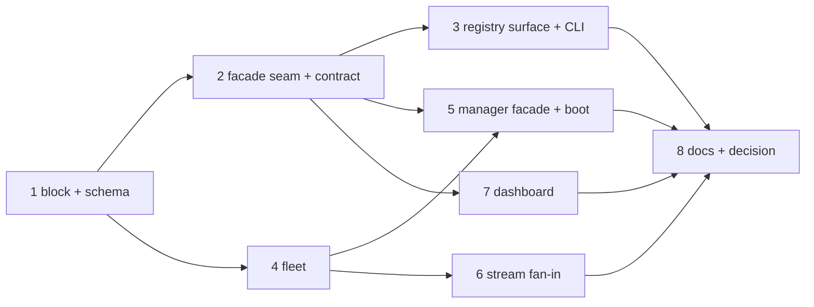

# Tasks: a manager instance over many instances of the-loop

> The last spec artifact. All eight tasks landed on PR #436 (commits `aaf3ebb`…`d4a89a2`). A DAG derived from the design and testing plan; each task names
> the testing-plan row that proves it. TDD: the test first, red, then green. The owner
> approved the spec set on PR #436 ("go ahead with implementation").

## Task list

- [x] 1. The block — `cli/the_loop/instance.py`: `role`, `Member`, `ManagerConfig`,
  `InstanceConfig.role/manager`, `InstanceConfigError` under `strict=True`, the registry
  validation by index; the schema (authored + packaged); `core.config.RESTART_REQUIRED`
  gains `instance.role`; the template and this repository's `cli-config.yaml`
  - _Depends on:_ none
  - _Requirements:_ R1.1, R1.2, R1.4, R1.5, R1.6
  - _Test:_ T1 — `test_instance.py::test_the_role_*`, `::test_the_registry_*`,
    `::test_a_manager_refuses_to_boot_*`; T10 — `test_config_schema_parity.py`,
    `test_migrations.py`, `make validate`
- [x] 2. The facade seam — `api/facade.py` (`Facade`, `CORE`), `routes.build_router(…,
  facade=)`, `mcp.build_server(…, facade=)`, the `instance` parameter on every keyed
  operation, `errors.Conflict` → 409, the `The-Loop-Instances-Unreachable` header;
  `core.instance.assert_self`; the OpenAPI contract
  - _Depends on:_ 1
  - _Requirements:_ R2.1, R2.6, R2.9
  - _Test:_ T3 — `test_api_contract_parity.py` (both roles); T1 —
    `test_instance.py::test_a_worker_refuses_a_foreign_instance`; T8 — A6
- [x] 3. The registry surface — `core/instances.py` (`list_instances`,
  `register_instance`, `unregister_instance`), the three routes, the MCP read tool,
  `loop.instances()` on the SDK, `status_all` and the `status` lines, the
  `the-loop instances` command
  - _Depends on:_ 2
  - _Requirements:_ R3.1, R3.2, R3.3, R4.1–R4.6
  - _Test:_ T1 — `test_instances_core.py`, `test_instances_cmd.py`,
    `test_lifecycle_cmd.py::test_status_prints_the_fleet`; T3 — the tool list; T10 —
    `test_sdk_docs_parity.py`
- [x] 4. The fleet — `manager/fleet.py`: `Fleet`, `Probe`, the local member, the
  transport, the probe cache and its transitions, the bounded fan-out, the resolvers,
  error translation
  - _Depends on:_ 1
  - _Requirements:_ R2.3, R2.4, R2.9, R3.4, R6.1–R6.4
  - _Test:_ T1 — `test_manager_fleet.py`; T7 — `-k "bounded or upstream_count"`; T8 —
    A1, A2, A3, A4, A5, A9
- [x] 5. The facade — `manager/facade.py`: one module per core module, the § 4 table
  row by row; `create_app` picking the facade by role; `serve.py` refusing an unknown
  role or an unnamed manager
  - _Depends on:_ 2, 4
  - _Requirements:_ R1.3, R1.5, R2.2–R2.7, R2.9
  - _Test:_ T1 — `test_manager_facade.py`; T2 — `test_manager_integration.py`; T8 —
    A7, A8
- [x] 6. The stream — `manager/stream.py`: `FleetTail`, the composite cursor, per-member
  resume, stamping, `desync`, backoff; `StreamBroker(tail=)`
  - _Depends on:_ 4
  - _Requirements:_ R2.8
  - _Test:_ T1 — `test_manager_stream.py`; T2 — `test_manager_stream_integration.py`
- [x] 7. The dashboard — types, client (`instance` on keyed calls, the `instances`
  family), board keyed by `instance@ref`, routes (`#/item/<ref>@<instance>`,
  `#/instances`, `#/instances/<name>`), the sidebar chip and filter, `healthTone`, the
  Instances view, the instance pane, the demo fixture
  - _Depends on:_ 2 (the contract)
  - _Requirements:_ R5.1–R5.6
  - _Test:_ T5 — `cd ui && bun run test`; T9; T12 — lint, typecheck, build
- [x] 8. Docs, capability docs, decision — `docs/config/cli/instance-options.md`,
  `docs/cli/instances.md`, `docs/cli/state.md`, `docs/cli/commands/status.md`,
  `docs/cli/commands/instances.md` + index + sidebar, `docs/sdk/reference.md`,
  `docs/capabilities/instances.md`, `control-plane.md`, `cli.md`, `capabilities.md`,
  `ui/README.md`, decision-138 accepted
  - _Depends on:_ 3, 5, 6, 7
  - _Requirements:_ R7.1–R7.3
  - _Test:_ T10 — `test_docs_parity.py`, `test_sdk_docs_parity.py`; T12 — `make check`

## Dependency graph (DAG)

## Checkpoints

After 1 and 2: `test_instance.py`, `test_api_contract_parity.py`, the schema parity
tests. After 3–6: the manager suites and the whole `cli/tests`. After 7: `cd ui && bun run
lint && bun run typecheck && bun run test && bun run build`. After 8: `make check` and
the docs parity tests; then the `verification` node executes `testing-plan.md`, and the
review phases run the self/critic rounds and the security review gate
(`evidence/security-review.md`, with the owner's named sign-off at tier 4).

## Review comments

> Appended by the-loop's `record-feedback` hook when a human gate approves with
> comments (issue-109). Append-only and attributed: an approval never silently
> discards a reviewer's suggestions, and the feedback travels with the document
> it concerns rather than living in a side-channel tracker.
