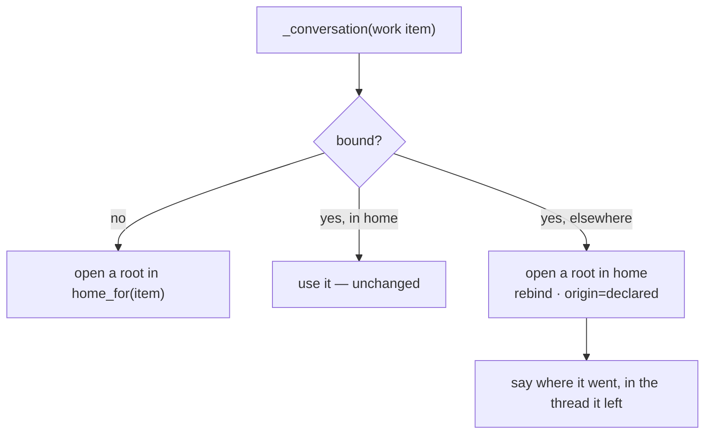
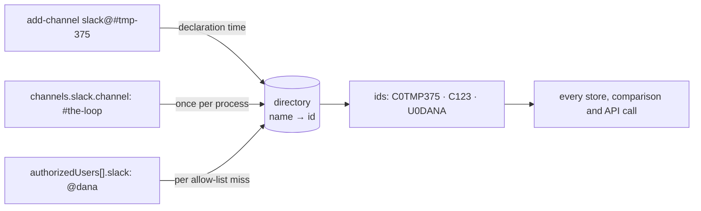

<!-- Authored per the the-loop:writing skill. -->

# Design: a work item names the room it is worked in

> Phase 2 of 4 (requirements → design → testing plan → tasks). Derives from
> `requirements.md`. MUST be reviewed and approved before moving to test planning.

## Overview

**One sentence: a work item gets a `collaborationChannels` section beside its collaborator
roster, and three places that today read `config.channel` or a thread binding ask that
section first.**

The feature is deliberately *not* a new channel, a new transport or a new permission. It is
one new fact about a work item, and three readers of it:

```mermaid
flowchart TD
  K["`the-loop add-channel slack@C…`<br/>comment or CLI"] --> S[("collaborationChannels<br/>portable record")]
  S -->|"home_for(work item)"| OUT["SlackBotChannel.post / open<br/>→ the thread root is opened THERE"]
  S -->|"declared_work_item(channel)"| IN["inbound: whose room is this?<br/>→ every message is that item's"]
  S -->|"list(work item)"| GATE["phase-selection checklist<br/>→ names it, asks for it"]
```

Everything else in this design is about the seams those three arrows land on, and the four
places where the answer had to be *narrower* than the arrow suggests.

## §1 The declaration: grammar and store

**`<type>@<target>`, with `<type>://<target>` as an accepted alias.** The issue offered
either; one canonical form is stored, printed and compared, so no reader has to normalise.
The type is the extension point the issue asked for — Jira and WhatsApp are a row in
`CHANNEL_TYPES` plus an adapter, not a new grammar.

**A type with no adapter is refused, not stored.** The alternative — record `jira@PROJ` and
ignore it — produces a work item whose ticket says its conversation is somewhere it will
never be. A declaration that does nothing is worse than a refusal that says why.

**A Slack target is the name a person knows, or its id.** `chat.postMessage` needs an
id, so one of the two has to be translated. The first draft refused names outright and
said so in the PR; the author's review overruled that — *"Not an issue, we can change the
manifest. We should be able to do with channel name."* — so the manifest now carries
`channels:read` and `groups:read`, and §8 is the resolver those scopes pay for.

What survives from the refusal is its reasoning, as an **ordering** rule rather than a
prohibition: resolving at the *first post* is the worst moment to learn a room does not
exist, so a name is resolved **when it is declared** and the **id** is what is stored.

| Option | Verdict |
|---|---|
| Refuse a name | Overruled by the author. It was never the safer design, only the cheaper one |
| Accept a name and resolve lazily at post time | Rejected. Moves a declaration-time refusal into a delivery-time failure, and makes every message depend on a lookup |
| **Accept a name, resolve at declaration, store the id** | Chosen. One lookup per declaration, none per message, and a channel that is renamed keeps working because the id did not change |

**The store** is `CollaborationChannelStore` over a new `collaborationChannels` section of
the work item's portable record — deliberately *not* the existing `channels` section, which
holds the thread the-loop opened and is rewritten wholesale by `ChannelStores.write_binding`
on every bind. The two are different facts and need to survive each other:

> a **declaration** says where the conversation *belongs*; a **binding** says where it *is*.

It mirrors `collaborators.py` line for line — same construction, same portable directory,
same clear-on-close — because it answers the same shape of question about the same work
item, and a reviewer should be able to read one having read the other.

## §2 The control keywords

`add-channel` / `remove-channel` join the vocabulary as the **second** argument-carrying
family. The existing one (`add-collaborator`) already proved the shape, so the change to
`control.py` is three lines of table and one generalisation:

```python
ARGUMENT_COMMANDS = COLLABORATOR_COMMANDS + CHANNEL_COMMANDS
parse = parse_logins if command in COLLABORATOR_COMMANDS else _parse_channels
```

Both parsers have the same signature — `str -> List[str]` — so `parse_command` keeps one
loop and one rule: *every occurrence of the keyword, a run of valid tokens after each, stop
at the first token that is not one*. `command_comment` branches on the **command** rather
than taking a new parameter, because a login is `@dana` and a channel is `slack@C…`, and a
caller-supplied "should I prefix an @?" is a way for the two to disagree.

In the dispatcher, `_apply_channel` sits beside `_apply_collaborator` and shares its three
properties: it runs *after* the named-and-allowlisted-actor check, it writes **no**
`ControlStore` record (naming a room neither arms nor disarms), and it settles the delivery
as `control-executed` so issue-371's acknowledgment lands on the comment.

**A refusal is a 😕 and an event-log line, not a comment.** That is what
`missing-collaborator` does today, and posting an explanation from the dispatcher would be
a new outbound path with its own loop-prevention story. The cost is real and named in
§Costs; the CLI form prints the full reason, which is where an operator debugging a
refused declaration will end up anyway.

## §3 Outbound: `home_for`

One resolver, used by every outbound path:

```python
def home_for(self, work_item: str) -> str:
    declared = self.stores.declared(work_item) if self.stores else ""
    return declared or self.config.channel
```

`post` and `open` both route through `_conversation`, which has exactly three cases:



The third case is R1.8's "order does not matter" made concrete: declaring a room after the
conversation started moves it. **The move is a move.** A work item has one conversation
(issue-312), so replies in the old thread are `unmapped` from then on — which is why the
pointer message is not a courtesy but the only thing between somebody still typing there
and silence. Keeping both threads mapped was considered and rejected: it would mean one
work item with two conversations, and every writer would then have to choose.

`_open_thread` gains a `channel_id` argument (defaulting to the central channel) and a
fourth `origin`, `declared`, so a reader of the binding can tell a move from a first open.

## §4 Inbound: whose room is this?

Two readers, one question — `declared_work_item(channel_id)`.

**Socket Mode.** The room is read *before* the kickoff branch, because a declared channel
never opens a work item. Then:

| The message is… | Attributed to |
|---|---|
| in a **bound thread** | that thread's work item (R3.3 — the binding is more specific) |
| top-level in a declared room | the declaring work item; the message is its own thread |
| in an unbound thread in a declared room | the declaring work item |
| anywhere else | nothing — `unmapped`, as today |

The dedup cursor needed the one genuinely subtle change in this work item.
`ChannelState.cursor(thread)` defaults to **the thread's own root ts** — right for a reply
(the root is not a reply), wrong for a message that *is* a root, which would compare as
already-seen and be dropped as a duplicate. So a message attributed by the room and equal
to its own thread uses the **room's** cursor (`channel:<id>`) — the same key the poll
transport advances, which is what keeps at-most-once across both transports.

**Poll mode.** `fetch_channel_messages` reads `conversations.history` for each declared
target, with `fetch_kickoffs`'s first-sight baselining copied deliberately: declaring a
room with a month of history must not deliver that month. Two overlaps are cut where they
arise — a message whose ts is a bound thread root belongs to `fetch_replies`, and
`poll_once` drops any `(channel, ts)` the reply read already returned.

What poll mode does **not** see is a reply inside a thread the-loop did not open:
`conversations.history` returns top-level messages. That asymmetry between the transports
already exists for kickoffs; it is documented rather than papered over.

**One room, one work item.** `declared_by` returns a single ref or `""`, and answers `""`
for a room two records claim. Enforced at write time (`ChannelTakenError`) *and* at read
time, because the write-time check cannot bind a hand-edited file.

## §5 The gate

The `phase-selection` checklist gains a section that is **prose, not a row**. Every
`- [ ] token` line the gate renders is parsed as a phase; a channel is a value, not a
choice among offered ones, so a checkbox there would be a second parser for the same
grammar and a way for a tick state to contradict a typed declaration. The section names
what is declared, or names the keyword — and says the declaration is a comment of its own,
because `parse_command` refuses a body carrying two different keywords.

`bootstrap.py` seeds `portableDir` into the hook config, the way it already seeds
`registryDir`, `sessionPerPr` and `harness`: a graph hook must not build a routing config
of its own.

## §8 Names, and the directory that resolves them

Added by the author's review of PR #376, which asked for three surfaces to accept names:
`the-loop add-channel`, `channels.slack.channel`, and `routing.authorizedUsers[].slack`.

**One module, two maps, one rule.** `channels/directory.py` keeps `name → id` for
conversations and for members, cached in a JSON file under `<state.root>/local/` that
every process on the machine shares. The rule the whole design turns on:

> resolve once, at the edge, and route on ids.



An id short-circuits before any lookup, so **every configuration that worked before this
change costs exactly nothing** — no scope, no call, no cache.

**Where each is resolved, and why there:**

| Surface | Resolved | Because |
|---|---|---|
| `add-channel` | at declaration, in the dispatcher and the CLI verb | the record stores the id, so no message ever depends on a lookup; a bad name is refused while somebody is watching |
| `channels.slack.channel` | once per `SlackBotChannel`, memoised | eighteen call sites read one id and cannot disagree about which room they mean — the read cursor's key included, which must stay stable across a spelling change |
| `authorizedUsers[].slack` | on an allow-list miss | an id compares directly; only a handle costs a lookup, and only when it did not already match |

**The two caches behave differently, on purpose.** A conversation id is stable, so a
cached one is simply right and is served at any age. A **handle can move**, so the user
lookup re-reads a stale map even on a hit and warns when the id behind a handle changes.
That is the difference between a name that identifies a room and a name that identifies
a person who may direct the loop.

**What was deliberately not widened.** A Slack **display name** resolves to nobody.
`routing.authorizedUsers` has warned against display names since issue-309 ("never a
display name — names are attacker-chosen"), and the ask was for `@<slack-user-name>` —
the handle, which Slack keeps unique. Indexing a field anyone can set to anything would
have widened an authorization surface past what was asked for.

**The caveat the author accepted.** A handle authorizes *whoever holds it*: if dana
renames or leaves and somebody else takes `@dana`, that person inherits the grant. The
warning makes it loud, not safe. The option was put to the author with this cost stated,
they chose "accept both, document the caveat", and the documentation says so in a
`::: warning` block where the key is documented rather than in a footnote.

## §6 What this costs

- **A refused declaration is terse on the ticket** (§2): a 😕 and an event-log line. An
  operator who typed `slack@#tmp-issue-375` sees the refusal but not the reason unless they
  read the log or retry from the CLI. Fixing it properly means a refusal-comment path for
  *every* control command, which is its own work item.
- **Moving a conversation orphans the old thread** (§3). Mitigated by the pointer message;
  not eliminated.
- **Poll mode sees less than Socket Mode** (§4). Operators who want every message in a
  dedicated room want `read.mode: socket`, which the docs now say.
- **A new portable section** is one more thing `reset`, `cleanup` and the poller's
  "is this tracked?" scan must know about. All three are updated here; the state-portability
  test is what will catch the next one.
- **A new OAuth scope trio** (§8): `channels:read`, `groups:read`, `users:read`. They are
  read-only, but **an existing install must be re-installed** to pick them up, and an
  install that is not will find names resolving to nothing — loudly, with the missing
  scope named in the log, but still a step every operator has to take.
- **A handle can change hands** (§8). Accepted on the author's decision, warned about,
  and documented; not closed.
- **One directory read per work item's declaration, and per allow-list miss.** Bounded by
  a cache and a TTL, and zero for a deployment that uses ids.

## §7 What to check first

1. `workchannels.py` — the grammar and the two invariants. If `parse_channel_ref` is
   right, nothing downstream sees payload text.
2. `inbound.handle_socket_event` — the cursor branch. It is the one place a wrong answer
   silently drops or double-delivers a message.
3. `slack.SlackBotChannel._conversation` — the three cases, and that case two is
   byte-identical to today for an undeclared work item.
4. `channels/directory.py::_lookup` — the `follow` flag. It is the one place the two
   maps behave differently, and the difference is an authorization decision.
5. `channels/directory.py::normalize_name` — the id checks run **before** the case fold.
   Doing it the other way round read `dana` as the conversation id `DANA`, which the
   tests caught and which is the shape of bug this layer exists to avoid.
